# **WEEK-1**

# 🖥️ **The Computer Vision Problem**

### **1️⃣ What is Computer Vision?**

Computer vision is a field of AI that enables computers to "see" and interpret the visual world. The course highlights that deep learning has been the driving force behind recent breakthroughs, enabling brand new applications that were impossible just a few years ago.

Key applications include:

  * **Self-Driving Cars:** Detecting other cars and pedestrians to navigate safely.
  * **Face Recognition:** Unlocking phones or doors using your face.
  * **Content Curation:** Recommending the most relevant or beautiful images in apps.
  * **Generative Art:** Creating new styles of artwork.

### **2️⃣ Core Computer Vision Tasks**

The course introduces several key problems that we will learn to solve.

| Task | Input | Output | Course Example |
| :--- | :--- | :--- | :--- |
| **Image Classification** | An image | A class label (e.g., 0 or 1) | Is this a cat? |
| **Object Detection** | An image | Bounding boxes around objects | Finding all the cars in an image for a self-driving car. |
| **Neural Style Transfer** | 1. A content image 2. A style image | The content image "repainted" in the style of the style image | Applying a Picasso style to a photograph. |

### **3️⃣ The Challenge: Why Not Use Standard Neural Networks?**

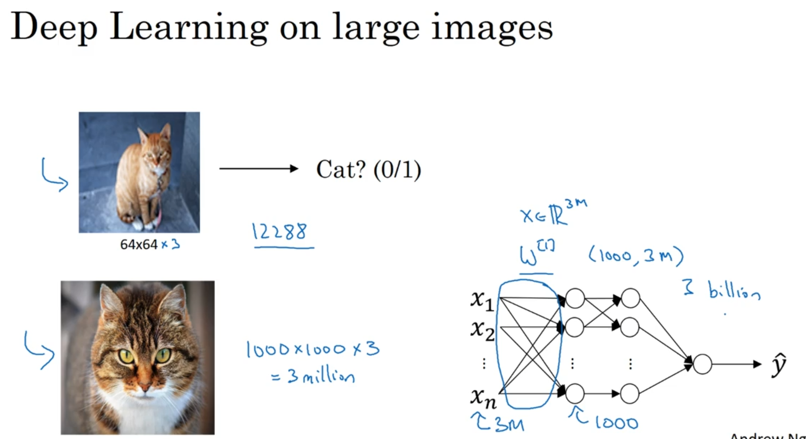

This is the central motivation for CNNs. Standard networks (like those in Course 1) work well for small inputs, but they break down with large images.

The problem is the sheer **number of parameters**.

  * A tiny **64x64x3** image (with 3 color channels: R, G, B) has $64 \\times 64 \\times 3 = $ **12,288** input features. This is manageable.
  * A more typical **1000x1000x3** image (1 megapixel) has $1000 \\times 1000 \\times 3 = $ **3,000,000** (3 million) input features.

If we built a standard, fully-connected neural network for this 3-million-feature input:

1.  Let the input $x$ be a vector of size $(3,000,000, 1)$.
2.  Let's say the first hidden layer has just **1,000** neurons.
3.  The weight matrix for this layer, $W^{[1]}$, would need to be of shape $(1000, 3000000)$.
4.  **Result:** This *single matrix* would have $1000 \\times 3,000,000 = $ **3 BILLION parameters**.

This leads to two massive problems:

  * **Overfitting:** It would be incredibly difficult to find enough training data to avoid overfitting with 3 billion parameters.
  * **Computational Cost:** The memory and computational power required to train a network this large is infeasible.

### **4️⃣ The Solution: Convolution**

To work with large images, we need a new type of layer that doesn't require connecting every input pixel to every neuron. This leads us to the fundamental building block of CNNs: the **convolution operation**.

-----
 
---

# 🔬 **The Convolution Operation (Deep Dive)**

### **1️⃣ The Core Idea: Feature Detection**

The initial layers of a CNN are designed to detect low-level features, like edges, which are then combined by deeper layers to recognize complex objects like faces. The convolution operation provides a concise mathematical way to specify and find these patterns in an image.

Think of the convolution operation as sliding a small magnifying glass (the **Filter**) over the entire image. This magnifying glass contains a specific pattern, and when it aligns perfectly with that pattern in the image, it produces a large activation value in the output.

---

### **2️⃣ Components of the Operation**

The convolution operation involves an input image and a small matrix called a filter (or kernel).

| Component              | Description                                                                                                                    | Example Dimension | Role in Edge Detection                                           |
| ---------------------- | ------------------------------------------------------------------------------------------------------------------------------ | ----------------- | ---------------------------------------------------------------- |
| **Input Image ($A$)**  | The matrix representing the image pixels. For simplicity, we often use grayscale ($n \times n \times 1$).                      | $6 \times 6$      | The raw data containing the edge to be found.                    |
| **Filter ($F$)**       | A small, square matrix containing the weights (parameters) that define the feature to be detected (e.g., a vertical line).     | $3 \times 3$      | The template of the feature (e.g., the vertical edge pattern).   |
| **Output Image ($S$)** | The resulting matrix, often called the "Feature Map" or "Activation Map," where high values indicate the feature was detected. | $4 \times 4$      | Visually represents where the edge exists in the original image. |

---

### **1️⃣ The Core Idea: A Sliding Feature Detector**

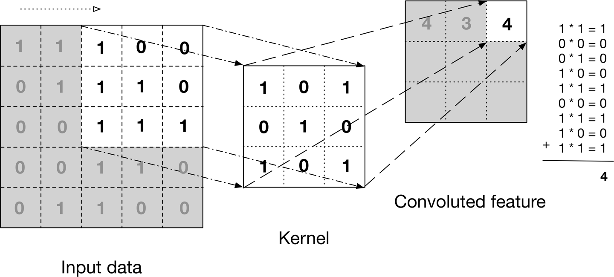

The "convolution" (which we'll clarify later is technically "cross-correlation") is the fundamental building block of a CNN.

The intuition is simple:

* We define a small matrix called a **filter** (or **kernel**) that is designed to detect a specific, localized feature (like a vertical edge).
* We then slide this filter over *every possible position* on the input image.
* At each position, we perform a calculation that results in a single number.
* The resulting output matrix, called a **feature map**, tells us *where* in the original image the feature was detected. A high value in the feature map means the feature was strongly detected at that location.

---

### **2️⃣ The Math: A Step-by-Step Calculation**

Let's walk through the exact math from the lecture.

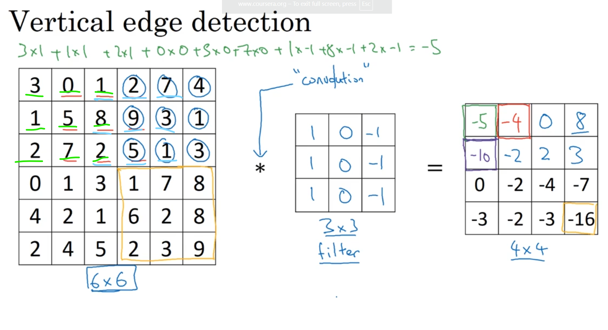
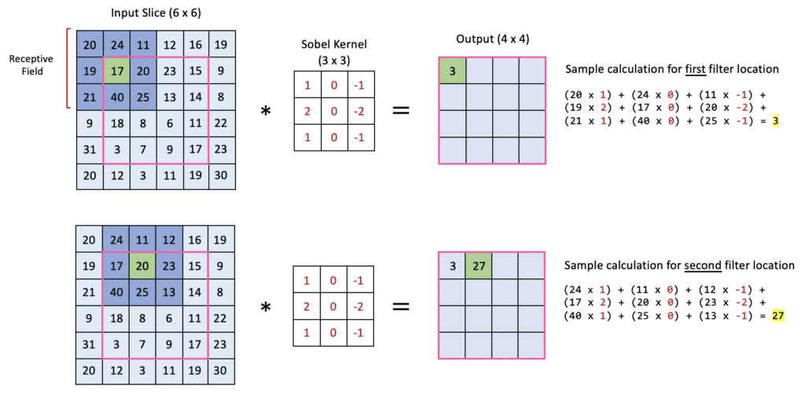

* **Input Image ($n \times n$):** A $6 \times 6$ grayscale image.

$$
\text{Input} =
\begin{bmatrix}
3 & 0 & 1 & 2 & 7 & 4 \\
1 & 5 & 8 & 9 & 3 & 1 \\
2 & 7 & 2 & 5 & 1 & 3 \\
0 & 1 & 3 & 1 & 7 & 8 \\
4 & 2 & 1 & 6 & 2 & 8 \\
2 & 4 & 5 & 2 & 3 & 9
\end{bmatrix}
$$

* **Filter ($f \times f$):** A $3 \times 3$ vertical edge detector. Notice how it has positive values on the left and negative values on the right.

$
\text{Filter} =
\begin{bmatrix}
1 & 0 & -1 \\
1 & 0 & -1 \\
1 & 0 & -1
\end{bmatrix}
$

* **The Operation ($*$):** We will convolve the $6 \times 6$ image with the $3 \times 3$ filter.

---

### **Step 1: Compute the top-left output value**

Place the filter on the top-left $3 \times 3$ patch of the image, perform element-wise multiplication, and sum the 9 results.

* **Image Patch:**
  $
  \begin{bmatrix}
  3 & 0 & 1\\
  1 & 5 & 8\\
  2 & 7 & 2
  \end{bmatrix}
  $

* **Filter:**
  $
  \begin{bmatrix}
  1 & 0 & -1\\
  1 & 0 & -1\\
  1 & 0 & -1
  \end{bmatrix}
  $

* **Calculation:**

 
 $(3 \cdot 1) + (0 \cdot 0) + (1 \cdot -1)+ (1\cdot1) + (5 \cdot 0) + (8 \cdot -1) + (2\cdot1)+ (7 \cdot 0) + (2 \cdot -1)
  = -5$
  

---

### **Step 2: Compute the next output value**

Slide the filter one pixel to the right (this is a **stride** of 1) and repeat the process.

* **Image Patch:**
  $
  \begin{bmatrix}
  0 & 1 & 2 \\
  5 & 8 & 9 \\
  7 & 2 & 5
  \end{bmatrix}
  $

* **Filter:** (same as before)

* **Calculation:**

$
(0\cdot1)+(1\cdot0)+(2\cdot -1)
+(5\cdot1)+(8\cdot0)+(9\cdot -1)
+(7\cdot1)+(2\cdot0)+(5\cdot -1)
= -4
$

---

We continue this sliding process (left-to-right, top-to-bottom) until we have computed the full output.

* **Output Feature Map ($4 \times 4$):**

$
\text{Output} =
\begin{bmatrix}
-5 & -4 & 0 & 8 \\
-10 & -2 & 2 & 3 \\
0 & -2 & -4 & -7 \\
-3 & -2 & -3 & -16
\end{bmatrix}
$

---

### **3️⃣ The Intuition: Why This Detects Edges**

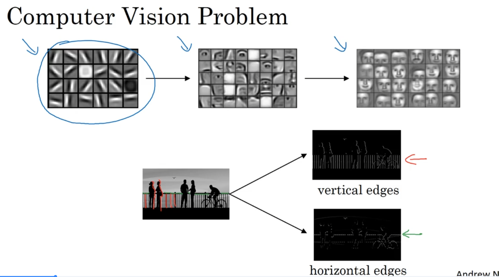

The math above shows *how*, but not *why*. The simplified example from the lecture makes the "why" crystal clear.

Let's use our same filter on an Grey Scale image with a clear vertical edge (10s on the left, 0s on the right).

---

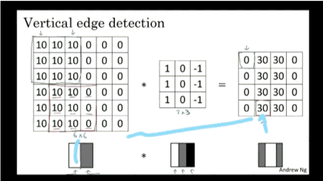

### **Case 1: Filter on a "flat" bright region**

$
\begin{bmatrix}
10 & 10 & 10 \\
10 & 10 & 10 \\
10 & 10 & 10
\end{bmatrix}
*
\begin{bmatrix}
1 & 0 & -1 \\
1 & 0 & -1 \\
1 & 0 & -1
\end{bmatrix}
$

Left column sum = 30
Right column sum = –30

**Result: (30 - 30 = 0)** → No edge.

---

### **Case 2: Filter *on* the edge**

$
\begin{bmatrix}
10 & 10 & 0 \\
10 & 10 & 0 \\
10 & 10 & 0
\end{bmatrix}
*
\begin{bmatrix}
1 & 0 & -1 \\
1 & 0 & -1 \\
1 & 0 & -1
\end{bmatrix}
$

Left column = 30
Right column = 0

**Result: (30 + 0 = 30)** → Strong edge detected!

---

### **Case 3: Filter *past* the edge**

All zeros → output = 0.

We have successfully isolated the vertical edge.

---

### **4️⃣ Output Size Formula (Recap)**

For an input of size ($n \times n$) and filter size ($f \times f$):

$
\text{Output Size} = (n - f + 1) \times (n - f + 1)
$

Example: ($n=6, f=3$)

$
(6 - 3 + 1) = 4
$

Output = ($4 \times 4$).

---
### 🧠 **Deeper Dive: Convolution vs. Cross-Correlation**
> Although the operation described is universally called **convolution** in the deep learning literature, technically, it is **cross-correlation**. The formal mathematical definition of convolution requires one extra step: before performing the element-wise product, the filter must be mirrored (flipped) both horizontally and vertically. Because the learning process (backpropagation) can simply learn the mirrored filter, this extra flipping step is omitted in ConvNets to simplify code and computation.

----

# 📐 **Edge Polarity and Learned Filters**

#### **1️⃣ Positive vs. Negative Edges**

The vertical edge detector filter introduced previously can distinguish between the direction of color transition, known as edge **polarity**.

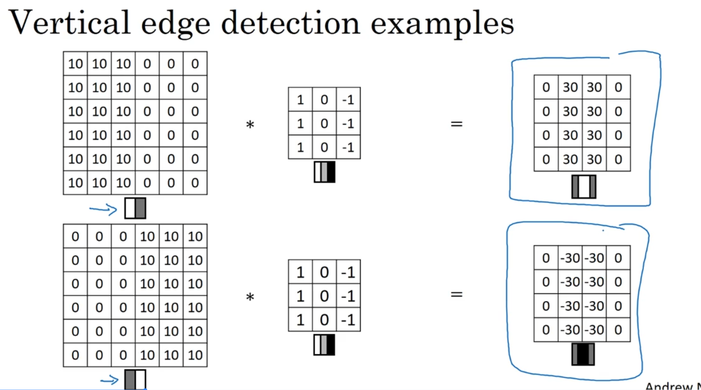

* **Positive Edge (Light to Dark):** If the input image transitions from light (high pixel values) on the left to dark (low pixel values) on the right, the convolution output will be a large **positive number** (e.g., +30).
* **Negative Edge (Dark to Light):** If the image colors are flipped—dark on the left and light on the right—the output will be a large **negative number** (e.g., -30), showing a reversed transition.
* **Absolute Values:** If you don't care about the direction of the transition, you can take the **absolute value** of the output matrix, which captures the presence of an edge regardless of polarity.
### **Example:-**
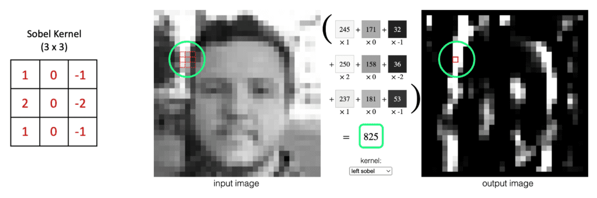

---

**2️⃣ Other Hand-Coded Filters**

While the vertical edge filter is the simplest example, the history of computer vision involves many different hand-coded filters designed for specific tasks and orientations.

| Filter Type                  | Intuition                                                     | Matrix Example                                                         |
| ---------------------------- | ------------------------------------------------------------- | ---------------------------------------------------------------------- |
| **Vertical Edge (Simple)**   | Bright on left, dark on right.                                | $$\begin{pmatrix} 1 & 0 & -1\\ 1 & 0 & -1\\ 1 & 0 & -1 \end{pmatrix}$$   |
| **Horizontal Edge (Simple)** | Bright on top, dark on bottom.                                | $$\begin{pmatrix} 1 & 1 & 1\\ 0 & 0 & 0\\ -1 & -1 & -1 \end{pmatrix}$$   |
| **Sobel (Vertical)**         | Detects vertical edges, gives more weight to center row.      | $$\begin{pmatrix} 1 & 0 & -1\\ 2 & 0 & -2\\ 1 & 0 & -1 \end{pmatrix}$$   |
| **Sobel (Horizontal)**       | Detects horizontal edges, gives more weight to center column. | $$\begin{pmatrix} 1 & 2 & 1\\ 0 & 0 & 0\\ -1 & -2 & -1 \end{pmatrix}$$   |
| **Scharr (Vertical)**        | Stronger vertical edge detector, more robust numerically.     | $$\begin{pmatrix} 3 & 0 & -3\\ 10 & 0 & -10\\ 3 & 0 & -3 \end{pmatrix}$$ |
| **Scharr (Horizontal)**      | Stronger horizontal edge detector.                            | $$\begin{pmatrix} 3 & 10 & 3\\ 0 & 0 & 0\\ -3 & -10 & -3 \end{pmatrix}$$ |

---

**3️⃣ The Power of Learned Filters**

One of the most powerful ideas in computer vision is the realization that **filters should be learned automatically** rather than hand-coded by researchers.

* **Filters as Parameters:** In a ConvNet, the values inside the filter matrix (e.g., the nine numbers in a $3 \times 3$ filter) are treated as **parameters** of the model.
* **Learning via Backpropagation:** These parameters are initialized randomly and then learned using the standard **backpropagation** and gradient descent algorithms (like those covered in Course 2).
* **Robustness and Flexibility:** By letting the algorithm learn, the network can discover:
    * Filters that are **better** at capturing the statistics of the specific data than any human-coded filter.
    * Feature detectors for edges at any angle (e.g., $45^\circ$, $70^\circ$), not just perfect vertical or horizontal edges.
    * Filters that detect complex, low-level features for which we don't even have a name in English.

**4️⃣ Summary of the Learning Process**

The convolution operation remains the underlying computation, allowing the learned filter to be applied throughout the entire image. This is a robust way to learn features, as the network automatically determines the best nine numbers (or $f \times f$ numbers) for a filter that maximizes performance on the training data.

---

# **Question:-** 
#### what difference does it make if we increase the weights in central pixel i why we device these new filters what advantage they have over normal filter with less weight on central pixels?

### **Anwser:**

The difference made by increasing the weights on the central pixel—as seen in filters like the Sobel and Scharr—is to make the edge detection slightly more **robust**.

This is a subtle difference that comes from the empirical history of computer vision, before deep learning fully took over.

---

### 1️⃣ The Role of Central Weighting

The choice of weights within a filter determines the exact mathematical properties of the feature detector.

* **Simple Vertical Filter:** Uses a uniform weight (e.g., $1$) on the columns to detect the transition.
    $$
    \begin{pmatrix} 1 & 1 & 1 \\ 0 & 0 & 0 \\ -1 & -1 & -1 \end{pmatrix}
    $$

* **Sobel Filter:** Increases the weight of the central column's pixel (e.g., to $2$).
    $$
    \begin{pmatrix} 1 & 2 & 1 \\ 0 & 0 & 0 \\ -1 & -2 & -1 \end{pmatrix}
    $$

The advantage of putting a little more weight on the central pixel, especially in the row where the value is zero (the transition point), is that it makes the edge detection output:

* **More Robust:** It slightly emphasizes the pixel directly on the edge, which can help suppress noise or minor variations further away from the central line of the transition.
* **Smoother Transition:** It can result in a more perceptually accurate detection for smooth or slightly blurred edges compared to the simple filter.

---

### 2️⃣ The Shift to Learned Filters

Historically, computer vision researchers debated extensively about the **best set of numbers** to use in these $3 \times 3$ filters. This debate led to the development of various hand-coded filters like the Sobel and Scharr.

| Filter Name | Central Column Weighting | Primary Advantage |
| :--- | :--- | :--- |
| **Simple** | $1, 0, -1$ | Simplest implementation. |
| **Sobel** | $2, 0, -2$ | Puts more weight on the central row/pixel, making it slightly **more robust** to noise. |
| **Scharr** | $10, 0, -10$ (with $3$s on sides) | Has yet other slightly different properties optimized for high-quality edge detection. |

However, the rise of deep learning changed this approach entirely.

* **The Convolutional Insight:** Rather than having researchers **handpick** these nine numbers, we now **learn them** using backpropagation.
* **Treating as Parameters:** The nine numbers in the $3 \times 3$ filter matrix are treated as **parameters** of the model to be learned from the data.
* **Superior Performance:** By letting the network learn automatically, it can discover filters that are **even better** at capturing the statistics of the training data than any of the hand-coded filters (Sobel, Scharr, etc.). These learned filters can also detect edges at any orientation (e.g., $45^\circ$ or $73^\circ$).

The advantage of using a **learned filter** far outweighs the marginal benefit of hand-picking weights for central pixels in traditional filters. The core computation is still the convolution operation, but the values inside the filter are optimized by the learning algorithm.

----

# 🖼️ **Padding in Convolutional Layers**

---

### 1️⃣ The Core Idea: Preventing Information Loss

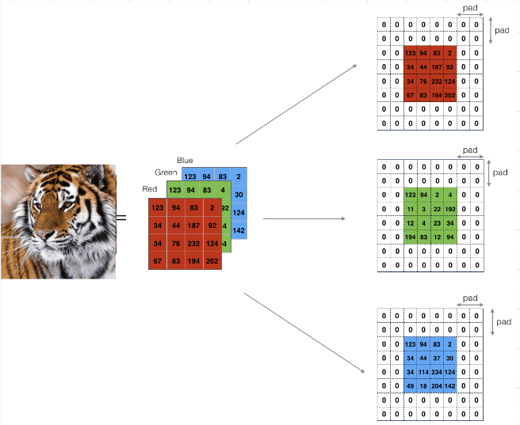

**Padding ($p$)** is the process of adding an extra border of pixels, typically zeros, around the boundary of the input image or volume before applying the convolution filter.

The goal is to solve two fundamental problems that occur when performing a basic convolution (where $p=0$):

| Problem Solved by Padding | Description |
| :--- | :--- |
| **Shrinking Output** | If the output shrinks on every convolutional layer (e.g., $6 \times 6$ to $4 \times 4$), you can only build a shallow network before the image dimension is reduced to $1 \times 1$. |
| **Information Loss at Edges** | Pixels on the corners or edges of the image are used much less in the total number of convolutions than those in the center. Padding ensures edge pixels are effectively utilized. |

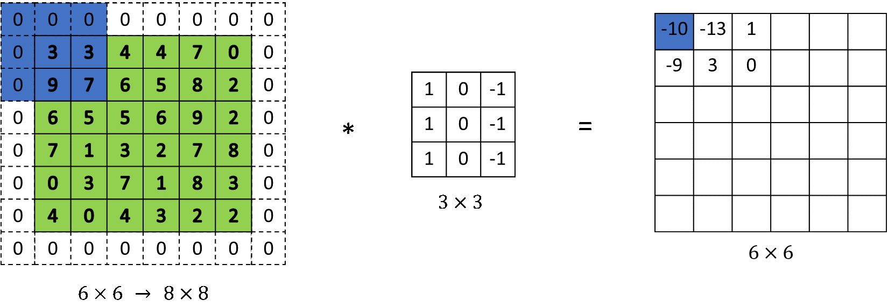

---

### 2️⃣ Output Dimension Formula

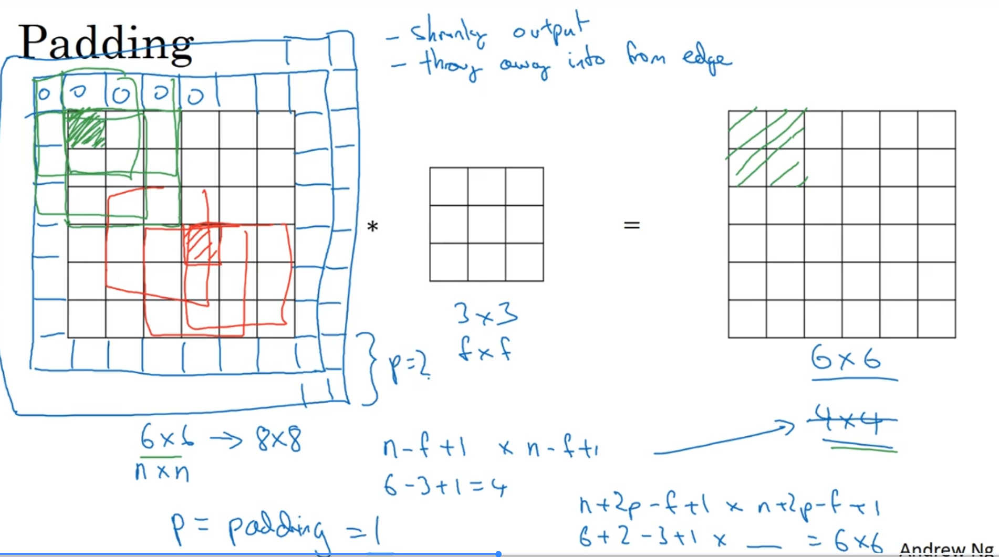

If you have an input image of size $n \times n$ and you convolve it with an $f \times f$ filter using a padding amount of $p$, the resulting output dimension $n'$ (height and width) is calculated as:

$$
n' = n + 2p - f + 1
$$

In this formula, the addition of $2p$ accounts for the padding added to both the left/right and top/bottom sides of the image.

---

### 3️⃣ Common Padding Conventions

When building a ConvNet, you don't typically pick an arbitrary number for $p$. You choose one of two primary conventions:

| Convention | Description | Padding Value ($p$) | Output Size ($n'$) |
| :--- | :--- | :--- | :--- |
| **Valid Convolution** | This convention means **no padding** is applied. It uses the simplest form of the convolution operation. | $p = 0$ | $n' = n - f + 1$ |
| **Same Convolution** | This is the most common choice. The goal is to set the padding $p$ such that the **output size is the same as the input size** ($n' = n$). | $$p = \frac{f-1}{2}$$ | $n' = n$ |

**Why Filters are Odd:**

By convention, filter sizes ($f$) in ConvNets are almost always **odd** (e.g., $3, 5, 7$). This is primarily because:

1.  **Symmetric Padding:** An odd $f$ ensures the "Same" convolution formula yields a natural, integer value for $p$, allowing the output to perfectly match the input size with symmetric padding all around.
2.  **Central Pixel:** An odd-dimension filter always has a clearly defined **central position** or pixel, which can be useful when referring to the position of the filter.

---

# 🏃 **Strided Convolutions**

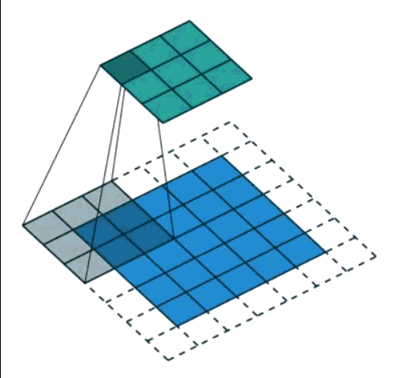

 Let's now cover the crucial concept of **strides**, which gives you another way to control the dimensions and computation speed of your ConvNet layers.

---

### 1️⃣ The Core Idea: Jumping the Filter

The **stride ($s$)** is a hyperparameter that controls how many steps the filter (or kernel) moves across the input volume between computations.

* **Normal Convolution:** When the stride $s$ is 1, the filter shifts over by only one pixel at a time.
* **Strided Convolution:** When $s > 1$ (e.g., $s=2$), the filter **jumps over** multiple positions, typically skipping pixels in the input image.

---

### 2️⃣ The Purpose and Impact of Strides

The primary purpose of using a stride $s > 1$ is to **reduce the size of the representation** efficiently.

* **Dimension Reduction:** A stride of 2 ($s=2$) will roughly cut the height and width of the output volume in half, shrinking the representation much faster than a standard convolution with $s=1$.
* **Speed:** By skipping calculations, a larger stride speeds up the overall computation of the network layer.

---

### 3️⃣ The General Output Dimension Formula

When you combine the effects of all hyperparameters—input size ($n$), filter size ($f$), padding ($p$), and stride ($s$)—the resulting output dimension $n'$ (height/width) is determined by the following formula:

$$
n' = \left\lfloor \frac{n + 2p - f}{s} \right\rfloor + 1
$$

* **The Floor Operation ($\lfloor z \rfloor$):** This is called the **floor** of $z$ and means taking the result and **rounding down** to the nearest integer.
* **Why Round Down?** The convolution operation only generates a corresponding output value if the filter is **fully contained** within the image (plus padding). If the last step of the stride causes the filter to hang off the edge, that operation is discarded, which is captured by the floor function.

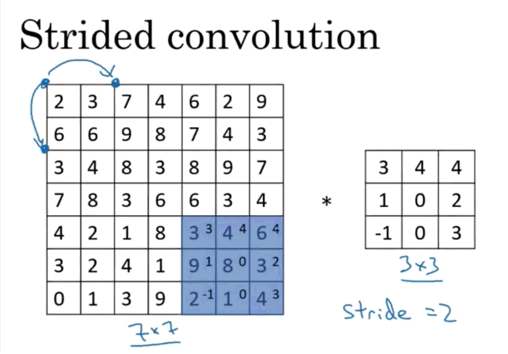

| Variable | Definition |
| :--- | :--- |
| **$n$** | Input height or width dimension |
| **$f$** | Filter height or width dimension |
| **$p$** | Padding amount |
| **$s$** | Stride amount |

**Example:** For a $7 \times 7$ image ($n=7$), convolved with a $3 \times 3$ filter ($f=3$), with no padding ($p=0$) and a stride of $s=2$:
$$
n' = \left\lfloor \frac{7 + 2(0) - 3}{2} \right\rfloor + 1 = \left\lfloor \frac{4}{2} \right\rfloor + 1 = 2 + 1 = 3
$$
The output is $3 \times 3$.

---

# 📦 **Convolutions Over Volumes (3D Inputs)**

Extending the convolution operation to handle color images (volumes) is the crucial step that allows ConvNets to process real-world data.

### 1️⃣ The Challenge: 3D Input

The input to the first layer of a ConvNet is typically an **RGB image**, which is a 3D volume, not a flat 2D matrix.

* **Input Dimensions:** The volume is defined by: $\text{Height } (n_H) \times \text{Width } (n_W) \times \text{Number of Channels } (n_C)$.
* **Example:** A $6 \times 6$ color image is represented as a $6 \times 6 \times 3$ volume, where the 3 corresponds to the Red, Green, and Blue color channels.

---

### 2️⃣ The 3D Filter Requirement

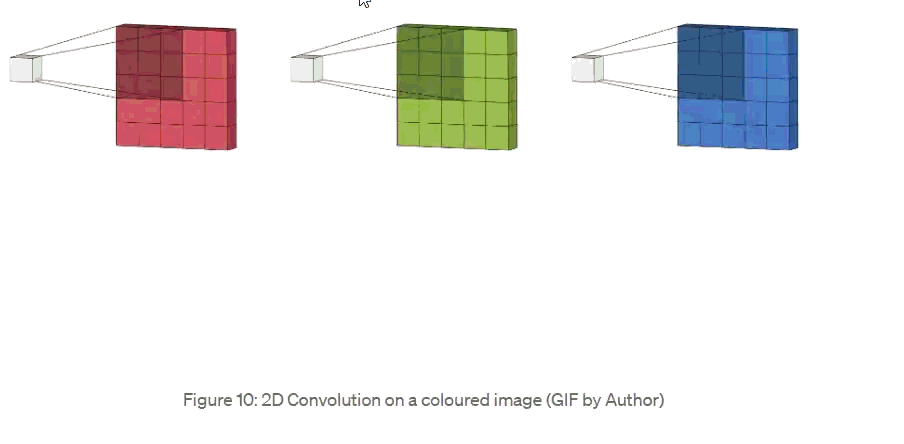

To convolve with a 3D input volume, the **filter itself must also be a 3D volume**.

* **Channel Matching is Mandatory:** The depth (number of channels) of the filter *must* match the depth of the input volume.
    * **Filter Dimensions:** For a $6 \times 6 \times 3$ input, a filter will be $f \times f \times 3$ (e.g., $3 \times 3 \times 3$).

* **Filter Parameters:** A $3 \times 3 \times 3$ filter contains 27 individual numbers (parameters).

### 3️⃣ The 3D Convolution Operation

The convolution process is an extension of the 2D case:

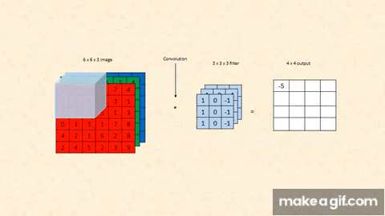

1.  **Alignment:** The 3D filter is placed over a $3 \times 3 \times 3$ region of the input volume, covering all three channels simultaneously.
2.  **Calculation:** You take all 27 numbers in the filter and multiply them element-wise with the corresponding 27 numbers in the input volume (9 from Red, 9 from Green, 9 from Blue).
3.  **Output:** All 27 products are summed together into a **single number**, which is the corresponding output pixel.
4.  **Result:** The final output of this operation is a $2D$ image (or volume with a depth of 1). The channel dimension is collapsed during the summation.

| Input Volume Dimension | Filter Dimension (must match $n_C$) | Output Dimension (Single Filter) |
| :--- | :--- | :--- |
| $n_H \times n_W \times n_C$ | $f_H \times f_W \times n_C$ | $n'_H \times n'_W \times 1$ |

**Example (using no padding and stride of 1):**

$$
6 \times 6 \times 3 \quad \text{convolved with} \quad 3 \times 3 \times 3 \quad \rightarrow \quad 4 \times 4 \times 1
$$

---

### 4️⃣ Detecting Multiple Features (Multiple Filters)

A single $4 \times 4 \times 1$ output tells you where *one* specific feature (e.g., a vertical edge) exists in the image. To build a useful layer, you need to detect many different features (like horizontal edges, $45^\circ$ edges, color spots, etc.).

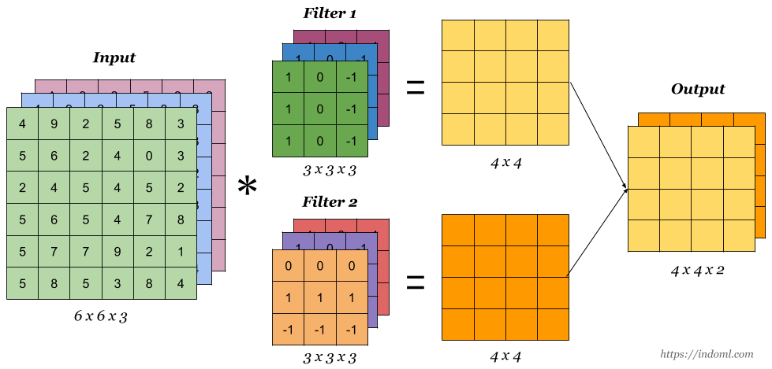

* **Using Multiple Filters:** You use $n_C^{[l]}$ different filters in layer $l$, where $n_C^{[l]}$ is the number of channels you want in your output.
* **Stacking:** Each filter generates a separate $2D$ output volume (e.g., $4 \times 4 \times 1$). These outputs are then **stacked** together along the channel dimension to form the final 3D output volume for the layer.

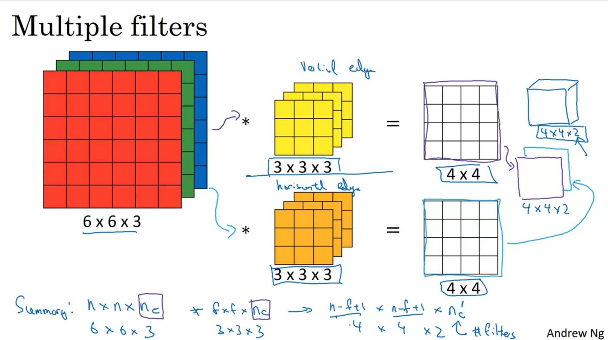

### 5️⃣ General Layer Dimension Summary

The total number of filters used directly determines the number of channels (or the **depth**) of the output volume.

| Dimension | Formula |
| :--- | :--- |
| **Input Volume** | $n_H^{[l-1]} \times n_W^{[l-1]} \times n_C^{[l-1]}$ |
| **Filter Dimension** | $f \times f \times n_C^{[l-1]}$ |
| **Number of Filters** | $n_C^{[l]}$ (This is a hyperparameter you choose) |
| **Output Volume** | $n_H^{[l]} \times n_W^{[l]} \times n_C^{[l]}$ |

**Key Takeaway:** The final number of output channels, $n_C^{[l]}$, is always equal to the total number of filters you use in that layer.

We have now seen how the convolution operation works over 3D volumes using multiple filters. This entire process is just the linear step of a single convolutional layer. The next step is to add the non-linearity (like ReLU) and bias to define a full ConvNet layer.

----
----

# ⚙️ **Building One Layer of a ConvNet**

A single layer of a Convolutional Neural Network (ConvNet) is a sophisticated building block that takes the activation volume from the previous layer, $A^{[l-1]}$, and transforms it into the activation volume for the current layer, $A^{[l]}$. This process closely mirrors the forward propagation step of a standard neural network layer, $Z = Wx + b$ and $A = g(Z)$, but leverages the efficiency of the convolution operation.

**Linear Operation $\rightarrow$ Add Bias $\rightarrow$ Apply Non-linearity**

---

### 1️⃣ The Forward Propagation Sequence

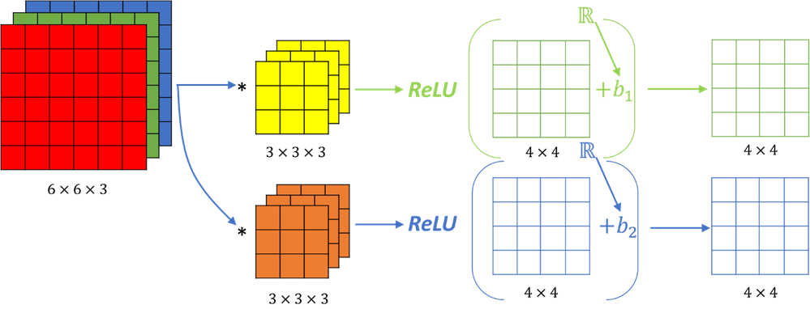

The computation within a single convolutional layer involves three distinct, sequential operations for each filter used. In a standard (non-convolutional) neural network, the forward step is calculated as: 
**$Z^{[l]} = W^{[l]} A^{[l-1]} + B^{[l]}$ and $A^{[l]} = g(Z^{[l]})$**.

The ConvNet layer applies a similar set of steps:

| Step | ConvNet Operation | Standard Network Analogy | Output Shape (Example: $6 \times 6 \times 3$ to $4 \times 4 \times 2$) |
| :--- | :--- | :--- | :--- |
| 1. **Linear Operation** | **Convolution:** The set of filters (weights) are convolved with the input volume. | Plays the role of $W^{[l]} A^{[l-1]}$. | $4 \times 4 \times 2$ (pre-bias) |
| 2. **Add Bias** | A single real number **bias ($b$)** is added to every element of the 2D output matrix generated by each filter. This is done via broadcasting. | Plays the role of $B^{[l]}$. | $Z^{[l]}$ (pre-activation) |
| 3. **Non-linearity** | A non-linear activation function, typically **ReLU**, is applied element-wise to the entire volume. | The activation $A^{[l]} = g(Z^{[l]})$. | $A^{[l]}$ (final output) |

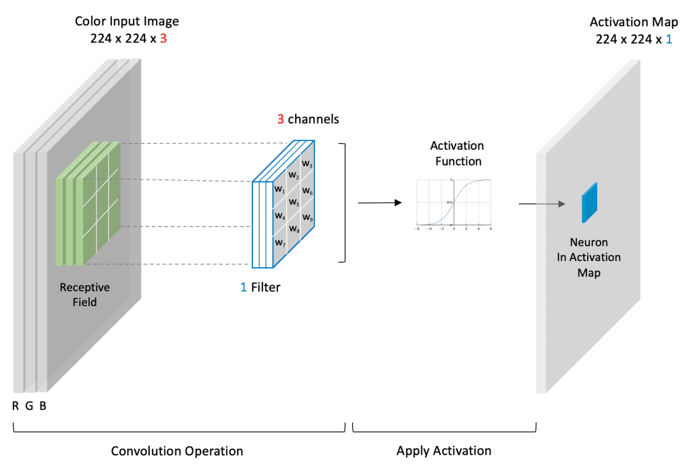

#### 1. The Linear Operation: Convolution
* **Action:** The input volume $A^{[l-1]}$ is convolved with a set of learned **filters** (which act as the weights $W^{[l]}$). This operation generates a single 2D activation map (or feature map) for each filter used.
* **Analogy:** This step, which involves the element-wise multiplication and summation of the filter values and the input values, plays the role of the matrix multiplication: $W^{[l]} A^{[l-1]}$.
* **Output:** If you use $n_C^{[l]}$ total filters, you generate $n_C^{[l]}$ separate 2D output matrices.

#### 2. Adding the Bias ($B^{[l]}$)
* **Action:** For each 2D output matrix generated by a filter, a **single real number bias** parameter ($b$) is added to *every element* of that matrix.
* **Mechanism:** This is typically implemented using **broadcasting**, where the single bias value is expanded to match the dimensions of the output matrix before addition.
* **Analogy:** The bias $b$ is the $B^{[l]}$ term, resulting in the volume $Z^{[l]}$.

#### 3. Applying the Non-linearity (Activation $A^{[l]}$)
* **Action:** A non-linear activation function, such as the **Rectified Linear Unit (ReLU)**, is applied element-wise to the entire biased volume $Z^{[l]}$.
* **Stacking:** The resulting $n_C^{[l]}$ activation maps are stacked together to form the final 3D output volume $A^{[l]}$ for the layer.
* **Final Output:** This output volume $A^{[l]}$ serves as the input $A^{[l]}$ for the subsequent layer $l+1$.

>**$$
Z^{[l]} = (\text{Input } A^{[l-1]} \ast \text{ Filters } W^{[l]}) + B^{[l]} \\
A^{[l]} = g(Z^{[l]})
$$**

---

### 2️⃣ Parameter Efficiency and Parameter Sharing

The most significant advantage of a convolutional layer over a standard fully connected layer is its dramatic reduction in the number of parameters, which helps prevent overfitting. This efficiency comes from two core mechanisms:

#### A. Parameter Sharing
* **The Idea:** The same filter (e.g., a vertical edge detector) is applied across the *entire* input image. This is based on the observation that a feature detector useful in one part of the image is likely useful in another part.
* **Result:** All output activations share the exact same set of filter weights and the same bias value.

#### B. Sparse Connections
* **The Idea:** In a ConvNet, each output activation ($a_{i,j,k}^{[l]}$) is connected to only a small, local region of the input volume (the area covered by the filter). In a fully connected network, every input unit is connected to every output unit.
* **Result:** A ConvNet uses far fewer connections. For example, a $3 \times 3$ filter means each output unit is connected to only $3 \times 3 \times n_C^{[l-1]}$ input units, whereas a fully connected network connects to *all* input units.

| Layer Type | Parameters (Example: $32 \times 32 \times 3$ Input, $1000$ Output Units) |
| :--- | :--- |
| **Fully Connected Layer** | $\sim 3,072 \times 1,000 \approx \mathbf{3 \text{ Million}}$ |
| **Convolutional Layer** (with 10 filters, $3 \times 3 \times 3$) | $10 \times (3 \times 3 \times 3 + 1) = \mathbf{280}$ |

---

### 3️⃣ Formal Notation and Dimensions

To summarize the dimensions of a single convolutional layer $l$:

| **Symbol**                 | **Definition**      | **Relationship & Constraints**                                                             | **Calculation / Formula**                                                               |
| :------------------------- | :------------------ | :----------------------------------------------------------------------------------------- | :-------------------------------------------------------------------------------------- |
| **$A^{[l-1]}$**            | Input Activation    | Input volume from the previous layer.                                                      | $n_H^{[l-1]} \times n_W^{[l-1]} \times n_C^{[l-1]}$                                     |
| **$f^{[l]}$**              | Filter Spatial Size | Filter width/height (e.g., $3$ for $3 \times 3$). By convention, $f^{[l]}$ is usually odd. | $f^{[l]} \times f^{[l]}$                                                                |
| **$p^{[l]}$**              | Padding Amount      | Number of zero pixels added to the border. $p=0$ for Valid, $p=(f-1)/2$ for Same.          | (Set by engineer as a hyperparameter)                                                   |
| **$s^{[l]}$**              | Stride Amount       | Number of steps the filter shifts.                                                         | (Set by engineer as a hyperparameter)                                                   |
| **$n_H^{[l]}, n_W^{[l]}$** | Output Height/Width | The dimensions of the output feature map.                                                  | $$\left\lfloor \frac{n_{H,W}^{[l-1]} + 2p^{[l]} - f^{[l]}}{s^{[l]}} \right\rfloor + 1$$ |
| **$n_C^{[l]}$**            | Output Channels     | The depth of the output volume $A^{[l]}$.                                                  | $$n_C^{[l]} = \text{Number of Filters used in layer } l$$                               |
| **$W^{[l]}$**              | Filter Dimensions   | The dimensions of the full set of filter parameters.                                       | $$f^{[l]} \times f^{[l]} \times n_C^{[l-1]} \times n_C^{[l]}$$                          |
| **$B^{[l]}$**             | Bias Vector         | A vector containing one bias value for each filter.                                        | $$1 \times 1 \times 1 \times n_C^{[l]}$$                                                |

---

**Output Dimension ($n_H^{[l]} \times n_W^{[l]} \times n_C^{[l]}$):**

The height and width of the output volume are computed using the general formula incorporating padding and stride:
$$
n_{H,W}^{[l]} = \left\lfloor \frac{n_{H,W}^{[l-1]} + 2p^{[l]} - f^{[l]}}{s^{[l]}} \right\rfloor + 1 \text{}
$$

We have now defined the complete convolutional layer. To build a powerful deep network, we stack these layers and intersperse them with another type of layer designed purely for dimension reduction and robustness: **the Pooling Layer**.

----
----

# 🧠 **Simple Convolutional Neural Network (ConvNet) Architecture**

This lecture provides a concrete example of a deep ConvNet for **image classification** (e.g., classifying an input image $X$ as a cat or not, $0$ or $1$). Designing a ConvNet largely involves choosing the hyperparameters for each layer, such as filter size ($f$), stride ($s$), padding ($p$), and the number of filters ($n_C^{[l]}$).

### 1️⃣ Example Architecture Walkthrough

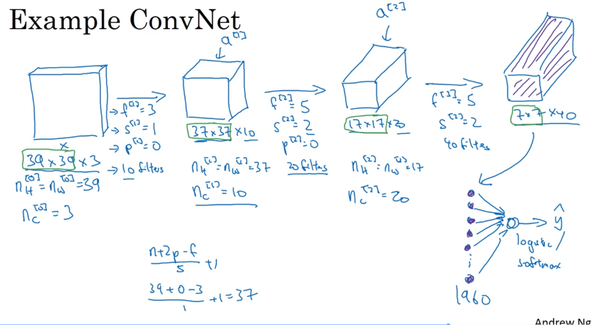

This example uses a small input image to simplify the math: $39 \times 39 \times 3$. The process moves from wide, shallow volumes at the start to narrow, deep volumes at the end, culminating in a standard classification unit.

| Layer Type | Hyperparameters | Input Dimensions ($A^{[l-1]}$) | Output Dimensions ($A^{[l]}$) | Calculation / Notes |
| :--- | :--- | :--- | :--- | :--- |
| **Input** | $n_H^{[0]}=39, n_W^{[0]}=3, n_C^{[0]}=3$ | $39 \times 39 \times 3$ | - | Initial image $X$. |
| **Conv 1** | $f^{[1]}=3, s^{[1]}=1, p^{[1]}=0$, $n_C^{[1]}=10$ | $39 \times 39 \times 3$ | $37 \times 37 \times 10$ | $n' = \left\lfloor \frac{39 + 0 - 3}{1} \right\rfloor + 1 = 37$. Valid Convolution. |
| **Conv 2** | $f^{[2]}=5, s^{[2]}=2, p^{[2]}=0$, $n_C^{[2]}=20$ | $37 \times 37 \times 10$ | $17 \times 17 \times 20$ | $n' = \left\lfloor \frac{37 + 0 - 5}{2} \right\rfloor + 1 = 17$. Stride $s=2$ drastically shrinks size. |
| **Conv 3** | $f^{[3]}=5, s^{[3]}=2, p^{[3]}=0$, $n_C^{[3]}=40$ | $17 \times 17 \times 20$ | $7 \times 7 \times 40$ | $n' = \left\lfloor \frac{17 + 0 - 5}{2} \right\rfloor + 1 = 7$.. |
| **Flatten** | - | $7 \times 7 \times 40$ | $1960 \times 1$ | Unrolls volume into a single, long vector. |
| **Output** | - | $1960 \times 1$ | $Y\hat{}$ | Fed into Logistic Regression or Softmax unit for final prediction. |

### 2️⃣ Observed Trends in ConvNet Architectures

As you go deeper into a typical ConvNet, two general trends are consistently observed:

#### A. Spatial Dimensions (Height $n_H$ and Width $n_W$) Decrease
The height and width of the activation volumes gradually decrease.
$$
39 \times 39 \rightarrow 37 \times 37 \rightarrow 17 \times 17 \rightarrow 7 \times 7
$$
This reduction is primarily achieved through:
1.  **Valid Convolutions:** (Shrinking output when $p=0$).
2.  **Strides:** Using $s > 1$ (like $s=2$ in Conv 2 and 3).

#### B. Channel Dimensions ($n_C$) Increase
The number of channels (or depth) generally increases as the network goes deeper. This reflects the increasing complexity of the features being detected: from simple edges (low channels) to complex object parts (high channels).
$$
3 \rightarrow 10 \rightarrow 20 \rightarrow 40
$$

### 3️⃣ Three Types of Layers in a ConvNet

Although the example above mostly used convolutional layers, a typical, highly effective ConvNet architecture is built using three fundamental types of layers:

| Layer Type | Abbreviation | Primary Role |
| :--- | :--- | :--- |
| **Convolutional Layer** | **Conv** | Feature extraction (detecting edges, textures, patterns) and volume transformation ($Z=WX+B$, $A=g(Z)$). |
| **Pooling Layer** | **Pool** | Spatial dimension reduction ($n_H, n_W$) to speed up computation and make features more robust. |
| **Fully Connected Layer** | **FC** | Classification at the end of the network; takes the final flattened volume and computes the output scores. |

It is common to see Conv layers followed by a Pool layer, repeated several times, before finishing with a few FC layers and a Softmax output.

---

# **Question:-**

**Does convolutional neural network does not have hidden units in convolutional layer like a normal neural network?**

### **Anwser:**

That's an insightful question that gets to the difference between architectural paradigms!

A **convolutional layer absolutely has hidden units**, but they are fundamentally different from the hidden units in a normal (fully connected or dense) neural network. The key difference is how they are **connected** and how their **parameters are shared**.

The "hidden units" in a convolutional layer are organized into a 3D volume, and their activation values are known as **feature maps** or **activation maps**.

Here's how they relate:

---

### 1️⃣ Structural Difference: Local Connectivity and 3D Organization

| Feature | Standard (Fully Connected) Layer | Convolutional (Conv) Layer |
| :--- | :--- | :--- |
| **Hidden Unit Type** | Individual scalar units (neurons) stacked into a 1D vector. | Pixels within a 3D volume, often called a **feature map**. |
| **Connectivity** | **Fully Connected**: Every unit in layer $l-1$ is connected to every unit in layer $l$. | **Sparsely Connected**: Each hidden unit (pixel) in layer $l$ is connected only to a small, local region of the input volume (the area covered by the filter). |
| **Organization** | $n^{[l]} \times 1$ vector. | $n_H^{[l]} \times n_W^{[l]} \times n_C^{[l]}$ volume (Height $\times$ Width $\times$ Channels). |

In a Conv layer, the **number of channels ($n_C^{[l]}$)** represents the number of different features detected, and thus, the number of distinct feature maps that make up the hidden units in that layer.

### 2️⃣ Parameter Difference: Sharing Weights

The crucial distinction lies in the **weight matrix** ($W^{[l]}$).

* **Fully Connected Network:** The weight matrix $W^{[l]}$ is typically enormous (e.g., $1000 \times 3$ million) because every input unit gets its own unique set of parameters connecting to every hidden unit.
* **Convolutional Network:** The hidden units are connected to the previous layer via a tiny, reused filter.
    * The filter itself is the **parameter**.
    * This filter is applied to every spatial location across the input volume, meaning that all hidden units in a single feature map **share the exact same set of weights**. This is known as **parameter sharing**.

This parameter sharing is what allows CNNs to operate with a minuscule number of parameters (e.g., 280) compared to a fully connected network (e.g., 3 billion) for large images.

----

# **Question:-**

**so does in convolutional layers each distinct filter is a different hidden unit?**

### **Anwser:**

That is a fantastic question that gets to the very core of what distinguishes a convolutional layer! You are very close, but the key is a distinction between the **parameters** (the filter) and the **activations** (the hidden units).

The answer is **No, a distinct filter is not a single hidden unit.**

A better way to think about it is this: **A distinct filter is responsible for creating an entire feature map, and that entire feature map is a group of hidden units.**

---

### 1️⃣ The Filter is the Tool (The Parameter)

The filter (or kernel) is the set of parameters that the network learns.

* **Filter Role:** It acts as a **feature detector** (e.g., a vertical line detector or a checkerboard pattern detector).
* **Dimensions:** It is a small $f \times f \times n_C^{[l-1]}$ volume (e.g., $3 \times 3 \times 3$).
* **Analogy: A Stamp.** Think of the filter as a single **stamp** or mold. This mold is designed to detect one specific thing, like a 'T' shape.

### 2️⃣ The Feature Map is the Result (The Hidden Units)

The output generated by applying that one filter across the entire input volume is called a **feature map**.

* **Feature Map Role:** It is a $2D$ matrix (or plane) that shows *where* the feature detected by the filter exists across the input image.
* **Dimensions:** It has spatial dimensions $n_H^{[l]} \times n_W^{[l]}$ and a depth of $1$.
* **The Hidden Units:** **Each individual pixel or cell** within this $2D$ feature map is an **individual hidden unit's activation**.

### 3️⃣ Parameter Sharing: The Key Difference

In a Conv layer, all the hidden units in a single feature map are related by using the same parameters (the single filter) to compute their activation.

| Feature | Filter ($\mathbf{W}$) | Hidden Unit ($\mathbf{a}$) |
| :--- | :--- | :--- |
| **Identity** | Set of weights/parameters that defines *one* feature. | Single activation value (pixel) in the output volume. |
| **Count** | If you use **10 filters** ($n_C^{[l]}=10$), you have **10 sets of parameters**. | If the output is $7 \times 7 \times 10$, you have $\mathbf{490}$ hidden units ($7 \times 7 \times 10$). |
| **Connection** | The filter is applied repeatedly across the entire image. | All units in the same feature map **share the same filter parameters**. |

Therefore, a convolutional layer **does have many hidden units**—it has $n_H^{[l]} \times n_W^{[l]} \times n_C^{[l]}$ total hidden units—but they are highly interconnected and share parameters in a structured way defined by the filters. This parameter sharing is why the total number of parameters remains small, which helps prevent overfitting.

----
----

# ⬇️ **Pooling Layers (Pool)**

The purpose of pooling layers is to **reduce the size of the representation** (i.e., the activation volume), which helps to speed up computation, and also makes the features detected a bit more **robust**.

---

### 1️⃣ Max Pooling: The Common Choice

The most common type of pooling is **Max Pooling**.

#### A. The Operation
Max pooling takes a rectangular region (defined by the filter size, $f$) of the input volume and outputs the **maximum** number found within that region.

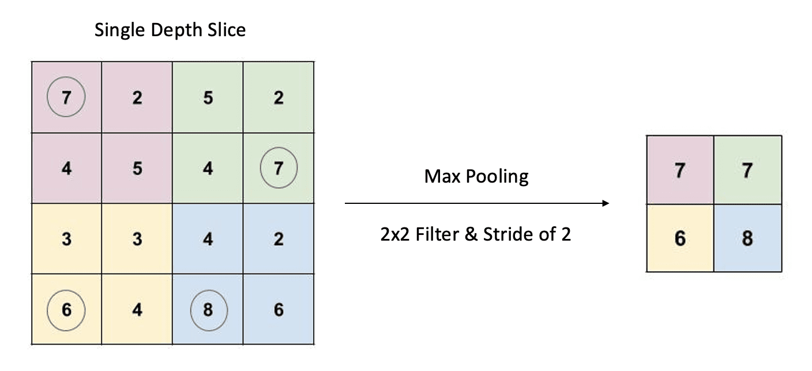

* **Example:** For a $4 \times 4$ input, with a $2 \times 2$ filter ($f=2$) and a stride of $s=2$, the layer breaks the input into four $2 \times 2$ regions. The maximum value from each region becomes the corresponding output pixel.
    * Region 1: Max is 7.
    * Region 2: Max is 7.
    * Region 3: Max is 6.
    * Region 4: Max is 8.

#### B. Intuition (Robustness)
The max operation ensures that if a feature (e.g., a vertical edge) is detected *anywhere* within that filter region, a high number remains preserved in the output. This means the network becomes more robust to slight translations or distortions in the image, as the exact position of the feature doesn't matter as much, only its presence.

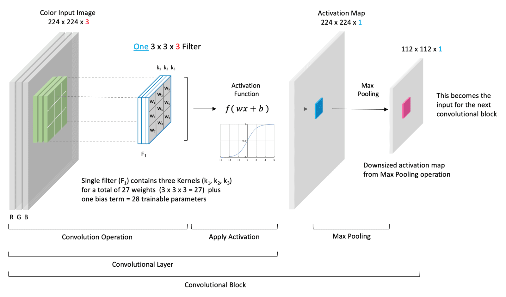
---

### 2️⃣ Max Pooling on 3D Volumes

When pooling is applied to a 3D volume (e.g., $5 \times 5 \times 2$), the operation is performed on **each channel independently**.

* The pooling layer **does not change the number of channels** ($n_C$). It only reduces the height ($n_H$) and width ($n_W$).
* Example: A $5 \times 5 \times 2$ volume pool operation results in a $3 \times 3 \times 2$ output volume (assuming $f=3, s=1$).

---

### 3️⃣ Average Pooling (A Secondary Choice)

Another type of pooling is **Average Pooling**, which calculates the **average** of the numbers within the filter region instead of the maximum.

* **Usage:** Max pooling is used much more often than average pooling.
* **Exception:** Average pooling is sometimes used very deep in a network to collapse a volume (e.g., $7 \times 7 \times 1000$) down to a $1 \times 1 \times 1000$ vector, which is useful right before the final fully connected layers.

| Pooling Type | Operation | Typical Usage |
| :--- | :--- | :--- |
| **Max Pooling** | Takes the maximum value in the filter region. | Primary choice; maintains strong feature presence; increases robustness. |
| **Average Pooling** | Takes the average value in the filter region. | Rarely used; sometimes used as a final collapse layer (Global Average Pooling). |

---

### 4️⃣ Hyperparameters and Key Properties

#### A. Hyperparameters (No Parameters to Learn)
A pooling layer has hyperparameters, but **no parameters to learn**.

* There is nothing for gradient descent or backpropagation to adapt. Once the settings are fixed, the computation is static.
* Common Choices:
    * Filter size, $f$: Typically $f=2$ or $f=3$.
    * Stride, $s$: Typically $s=2$. This effectively shrinks $n_H$ and $n_W$ by a factor of about two.
    * Padding, $p$: **Very rarely used**; $p$ is almost always 0.

#### B. Dimensionality Formula
The output dimension $n'$ of a pooling layer uses the **exact same formula** as a convolutional layer, since it is governed by $n, f, p$, and $s$:
$$
n' = \left\lfloor \frac{n + 2p - f}{s} \right\rfloor + 1
$$
Because $p=0$ is typical, the formula simplifies. If $n=4, f=2, s=2$: $n' = \lfloor \frac{4+0-2}{2} \rfloor + 1 = 2$.

---

# 🧠 **A Complete ConvNet Architecture (LeNet-5 Inspired)**

 Moving on to a more complete ConvNet example, we'll see how the three types of layers—Convolutional, Pooling, and the new **Fully Connected Layer**—are combined to form a powerful deep network, similar to the classic **LeNet-5** architecture.

A typical deep ConvNet is structured to perform two main tasks: feature extraction (handled by Conv and Pool layers) and classification (handled by FC layers and Softmax).

---

### 1️⃣ The Three Core Layer Types

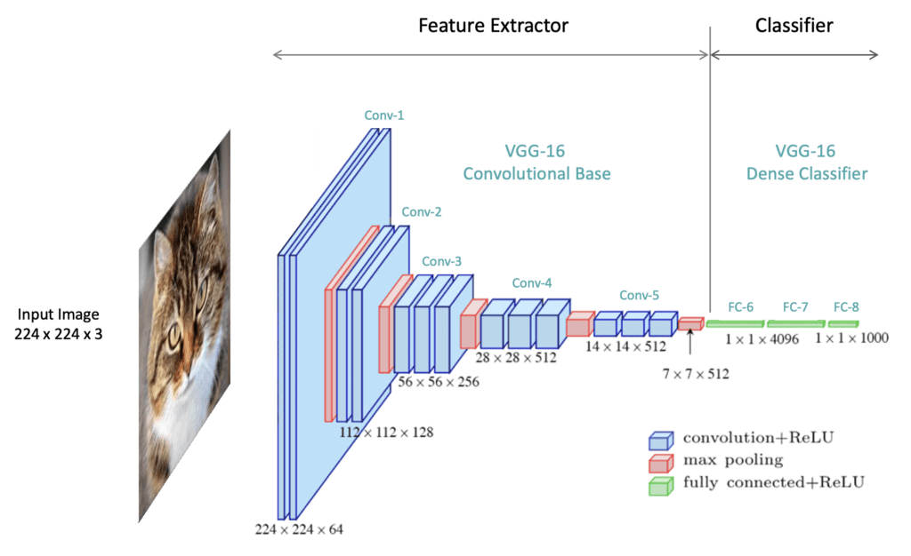

In a complete ConvNet, there are three types of layers, often stacked in sequences:

| Layer Type | Abbreviation | Primary Role | Parameters? |
| :--- | :--- | :--- | :--- |
| **Convolutional Layer** | **Conv** | Feature detection, volume transformation (learning weights). | **Yes** (Filters & Biases) |
| **Pooling Layer** | **Pool** | Spatial dimension reduction ($n_H, n_W$) for efficiency and robustness. | **No** (Hyperparameters only) |
| **Fully Connected Layer** | **FC** | Classification based on extracted features (standard neural network layers). | **Yes** (Weight Matrix $W$ & Bias $b$) |

**Layer Naming Convention:** When counting layers, the convention is often to count only those layers that have **trainable parameters** (Conv and FC layers). A Conv layer followed by a Pool layer is often grouped and counted as a single layer (e.g., Conv1 and Pool1 are Layer 1).

---

### 2️⃣ Architecture Walkthrough: Digit Recognition

This example processes a $32 \times 32 \times 3$ RGB image to recognize one of ten handwritten digits (0-9).

| Layer Group | Layer Type | Hyperparameters | Input Size | Output Size | Notes |
| :--- | :--- | :--- | :--- | :--- | :--- |
| **Layer 1** | **Conv 1** | $f=5, s=1, p=0$ (6 filters) | $32 \times 32 \times 3$ | $28 \times 28 \times 6$ | Feature Extraction |
| | **Pool 1** | Max Pool: $f=2, s=2$ | $28 \times 28 \times 6$ | $14 \times 14 \times 6$ | Spatial reduction by $\sim 2 \times$ |
| **Layer 2** | **Conv 2** | $f=5, s=1, p=0$ (16 filters) | $14 \times 14 \times 6$ | $10 \times 10 \times 16$ | Deeper feature extraction |
| | **Pool 2** | Max Pool: $f=2, s=2$ | $10 \times 10 \times 16$ | $5 \times 5 \times 16$ | Spatial reduction by $\sim 2 \times$ |
| **Flatten** | - | - | $5 \times 5 \times 16$ | $400 \times 1$ | **Transition:** Unroll into a vector. |
| **Layer 3** | **FC 3** | 120 units | $400 \times 1$ | $120 \times 1$ | Fully connected standard layer. |
| **Layer 4** | **FC 4** | 84 units | $120 \times 1$ | $84 \times 1$ | Fully connected standard layer. |
| **Output** | **Softmax** | 10 outputs | $84 \times 1$ | $10 \times 1$ | Final classification scores. |

---

### 3️⃣ The Role of the Fully Connected (FC) Layer

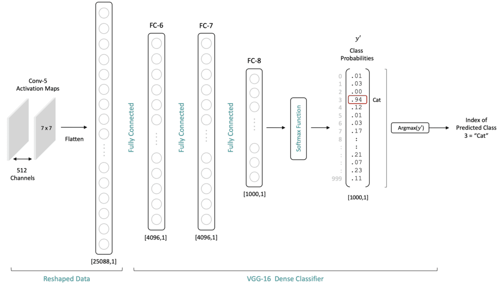

The FC layers perform the final high-level **reasoning** and **classification**.

#### A. The Flatten Step (Transition)
Before the first FC layer, the final 3D volume (e.g., $5 \times 5 \times 16$) must be **unrolled** or **flattened** into a single column vector (e.g., $400 \times 1$). This vector contains all the extracted features from the Conv and Pool stages.

#### B. FC Layer Definition
The FC layer is exactly the same as a single layer in a standard (non-convolutional) neural network from Course 1 and 2:
$$
Z^{[l]} = W^{[l]} A^{[l-1]} + B^{[l]}
$$

* **Connectivity:** It is **fully connected**, meaning every hidden unit in the previous layer is connected to every hidden unit in the current layer.
* **Parameters:** It uses a massive, standard weight matrix ($W$) and a bias vector ($B$). In the example above, $W^{[3]}$ would be $120 \times 400$.

#### C. Parameter Shift

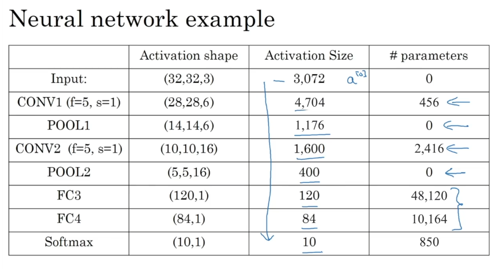

Notice that while **Conv layers** have very few parameters (as little as 280), the bulk of the network's total parameters are usually contained within the **Fully Connected Layers** at the end.

---

### 4️⃣ General ConvNet Pattern

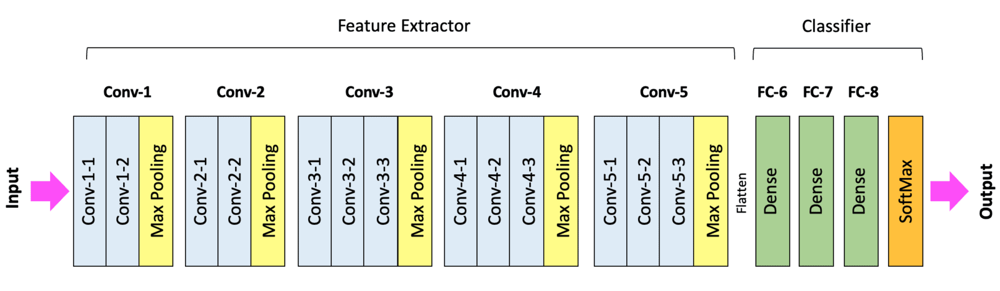

The most common architectural pattern observed in deep ConvNets is:

$$\text{Input} \rightarrow [\underbrace{\text{Conv} \rightarrow \text{Pool}}_{\text{Feature Extraction}} \rightarrow \dots] \rightarrow \underbrace{\text{Flatten} \rightarrow \text{FC} \rightarrow \text{Softmax}}_{\text{Classification}}$$

* **Spatial Decrease / Channel Increase:** As you go deeper, the height and width ($n_H, n_W$) decrease, while the number of channels ($n_C$) increases.
* **Best Practice:** When designing a ConvNet, it's often best to use an architecture (hyperparameter settings) that has already been published and proven effective by others.

----
----

# ⭐ **Benefits and Training of Convolutional Neural Networks**

The advantages of using convolutional layers over traditional fully connected layers come down to two primary concepts that drastically reduce the number of parameters required.

### 1️⃣ Parameter Sharing

The most significant advantage is **parameter sharing**, which is motivated by the observation that a feature detector (like an edge detector) that is useful in one part of the image is likely useful in another part of the image.

* **Mechanism:** A single filter, which represents one set of parameters, is applied to all spatial positions across the entire input volume.
* **Intuition:** If you learn a $3 \times 3 \times 3$ filter to detect a specific feature (e.g., a cat's whisker) in the upper-left corner, you can reuse those exact same 27 parameters to detect that feature in the lower-right corner, and everywhere in between.
* **Result:** This dramatically reduces the total number of trainable parameters. For example, replacing a fully connected layer with 14 million parameters with a Conv layer that performs the same function reduces the parameter count to only 156 parameters.

### 2️⃣ Sparsity of Connections

The second key advantage is **sparsity of connections**, meaning that each output activation depends on only a small, local set of inputs, not the entire image.

* **Mechanism:** When you use an $f \times f$ filter (e.g., $3 \times 3$), any specific output hidden unit (pixel in the feature map) is connected to, and computed from, only $f \times f$ input units in the previous layer.
* **Intuition:** An output pixel that detects a feature in the upper-left quadrant of the image is completely unaffected by changes to pixels in the lower-right quadrant.
* **Result:** Unlike fully connected networks where every neuron is connected to every other neuron, the convolutional layer structure means that many of the weights are effectively zero, leading to a "sparse" connection pattern and lower computational cost.

| Feature | Fully Connected Layer | Convolutional Layer |
| :--- | :--- | :--- |
| **Parameter Count** | Very Large (e.g., 3 Billion for $1000 \times 1000$ image) | Very Small (e.g., 280, fixed regardless of image size) |
| **Connections** | Dense (Every input connected to every output) | Sparse (Output connected only to a local region) |
| **Weight Usage** | Weights are unique for every connection. | Weights are **shared** spatially across the entire image (Parameter Sharing). |
| **Overfitting Risk** | High, requires massive datasets. | Low, due to limited, shared parameters. |

### 3️⃣ Translation Invariance

The combination of parameter sharing and sparsity helps the ConvNet encode the desirable property of **translation invariance**.

* **Definition:** Translation invariance is the observation that if a feature is slightly shifted (or *translated*) by a few pixels in the input image, the network should still recognize it and assign the same output label.
* **Benefit:** Because the same filter is applied everywhere, the network automatically learns to be robust to where the feature appears in the image.

---

### 4️⃣ Training a ConvNet

Training a Convolutional Neural Network uses the same process as training a standard deep neural network (Course 2):

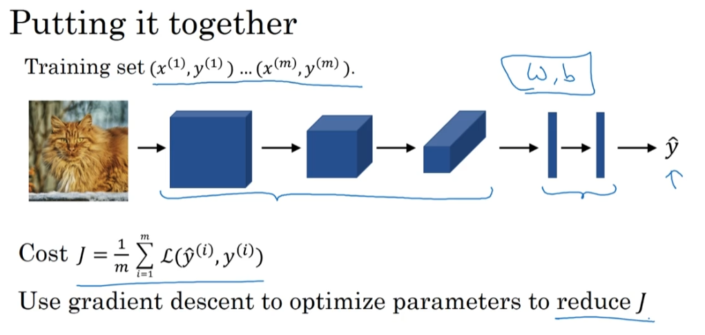

1.  **Initialize Parameters:** The filter weights $W$ and biases $B$ (both in the Conv and FC layers) are initialized randomly.
2.  **Define Cost Function:** The performance is measured using a cost function $J$, which is the average of the loss functions over the entire training set (e.g., log loss for classification).
3.  **Optimization:** The parameters are optimized (updated) using **gradient descent** or a more advanced optimization algorithm (e.g., Momentum, RMSProp, or Adam).
4.  **Backpropagation:** The core of the training involves calculating the gradients of the cost function with respect to all parameters using **backpropagation**. This process adapts the values of the filters to detect the most useful features for the task.

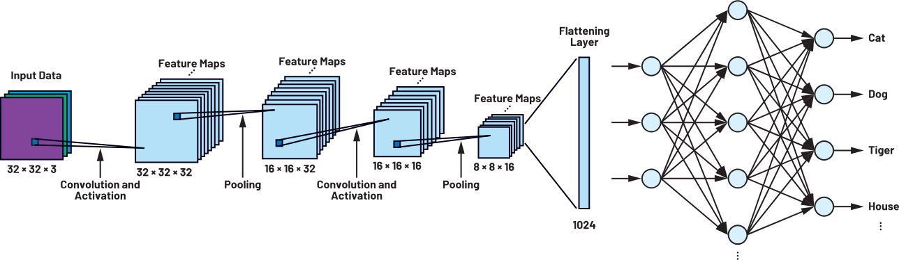
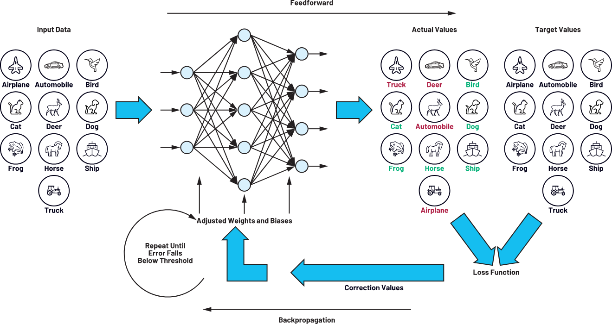
----