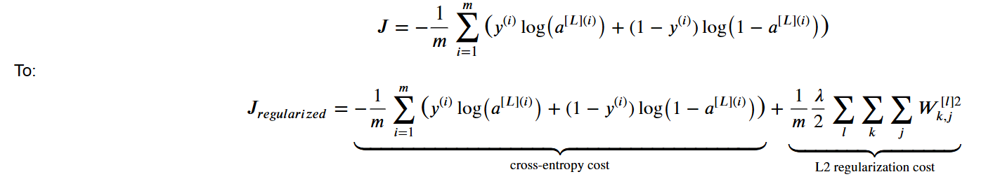

# Imprving-Neural-Networks

# **WEEK-1**
---
## 🛠️ **Setting up Your Machine Learning Application**

#### 1️⃣ The Core Idea: An Iterative Process

Building a high-performing machine learning model is rarely a straight line. It's an iterative loop. You start with an **Idea**, write **Code** to implement it, and run an **Experiment** to see how it performs. Based on the results, you refine your idea and start the loop again.


To measure the performance of your experiments, you need to split your data properly.

---
#### 2️⃣ Train / Dev / Test Sets

The most important first step is to split your data into (at least) two, and preferably three, distinct sets.


* **Training Set:** This is the largest set. Your model **learns** from this data, adjusting its parameters (`W` and `b`) to minimize the cost.
  
* **Development (Dev) Set:** This is also called the **hold-out cross-validation set**. You use this set to **tune your hyperparameters**. After training on the training set, you see which of your ideas (e.g., which learning rate, which network architecture) performs best on the dev set.
  
* **Test Set:** This set is "locked away" until the very end. You only use it once your model is complete to get a final, **unbiased estimate** of its real-world performance. You *must not* use it to make any decisions about your model.
  


> **Analogy: Studying for an Exam**
>
> * **Training Set:** Like doing your **homework problems**. You learn the material from these.
> * **Dev Set:** Like taking a **practice exam**. You use the results to see what you're weak on and decide what to study next (i.e., tune your "hyperparameters").
> * **Test Set:** Like the **final exam**. You only take it once, and it gives you your final grade (your model's performance).

---
#### 3️⃣ Splitting the Data (Ratios)

How you split your data depends on how much data you have.

* **Small Data Era (<100,000 examples):** A 60/20/20 (Train/Dev/Test) or 70/30 (Train/Test) split was common.
* **Big Data Era (1,000,000+ examples):** The goals of the Dev and Test sets are just to be *large enough* to give a statistically significant result. They don't need to be a large *percentage* of the total.
    * For 1 million examples, a **98/1/1** split (980k train, 10k dev, 10k test) is very reasonable. 10,000 examples is more than enough for a reliable practice exam.
    * For 100 million examples, a **99.5/0.25/0.25** split might be fine.


---
#### 4️⃣ A Crucial Rule: Match Your Distributions

A common mistake is to have a Dev set and Test set that come from different distributions. For example, your dev set is high-quality, professional images, but your test set is blurry, user-uploaded phone images. This is bad!

**Rule:** Your **Dev set and Test set must come from the same data distribution**. This ensures that the "target" you are aiming for with your practice exam (the dev set) is the same as the target on your final exam (the test set).

---
Of course. After setting up your Train/Dev/Test sets, the next step is to analyze your model's errors to understand *why* it's not performing perfectly. This diagnosis is done using the concepts of **Bias** and **Variance**.

---
## 🎯 **Bias and Variance: Diagnosing Error**


**Bias** and **Variance** are two fundamental sources of error that prevent your model from generalizing perfectly to new data.


---
### 1️⃣ What is Bias? (Underfitting)

* **Definition:** Bias is the error from your model being too simple to capture the underlying patterns in the data. It's a measure of how far off your model's predictions are from the true values, even on the data it was trained on.
* **Symptom:** **High Training Set Error**. Your model doesn't even perform well on the data it has seen.
* **Analogy (The Under-prepared Student):** This is like a student who didn't study for the exam. They don't understand the material (the data) and therefore get a bad grade, even on the *exact homework problems* (the training set) they were given.
* **In a Graph:** A model with high bias (underfitting) draws a decision boundary that is too simple, like using a straight line to separate a complex, curvy pattern.


---
### 2️⃣ What is Variance? (Overfitting)

* **Definition:** Variance is the error from your model being *too sensitive* to the specific data it was trained on. It learns the noise and random fluctuations in the training data, not just the underlying signal.
* **Symptom:** **Low Training Set Error** but **High Dev Set Error**. The model "memorizes" the training set but fails to generalize to new, unseen data.
* **Analogy (The Rote-Memorization Student):** This is like a student who memorizes the homework solutions perfectly. When given the homework problems again (the training set), they get 100%. But when the final exam (the dev set) asks slightly different questions on the *same topics*, the student fails because they didn't learn the actual concepts.
* **In a Graph:** A model with high variance (overfitting) draws an extremely complex decision boundary that wiggles around individual data points, fitting the noise.


---
### 3️⃣ Diagnosing with Train vs. Dev Error


To figure out if you have a bias or variance problem, you look at two key numbers and compare them to a "baseline" or "optimal" error (e.g., human-level performance, which we can approximate as 0%):


1.  **High Bias?** Look at your **Training Set Error**. If this error is high (e.g., 15% when human error is 1%), your model is **underfitting**. It's not even learning the data it has.
2.  **High Variance?** Look at the **gap between your Dev Set Error and your Training Set Error**. If this gap is large (e.g., Train error is 1%, but Dev error is 15%), your model is **overfitting**. It learned the training data well but failed to generalize.

Here is a summary of the four main cases:


| Case | Train Error | Dev Error | Diagnosis |
| :--- | :--- | :--- | :--- |
| **1. Good Fit** | Low (e.g., 1%) | Low (e.g., 1.5%) | **Low Bias, Low Variance.** This is the goal! |
| **2. Underfitting** | High (e.g., 15%) | High (e.g., 16%) | **High Bias, Low Variance.** The model is too simple. |
| **3. Overfitting** | Low (e.g., 1%) | High (e.g., 15%) | **Low Bias, High Variance.** The model memorized the train set. |
| **4. Worst Case** | High (e.g., 15%) | High (e.g., 30%) | **High Bias, High Variance.** The model is too simple *and* it's overfitting. |


---
### **🍳 How to Solve Bias/Variance Problem** 

This is the iterative process you should follow. Start at step 1 and only move to the next step once you've solved the problem at the current step.

---
#### **Basic "Recipe" for Machine Learning**
#### **Step 1: Check for High Bias**

First, look at your **Training set performance**.
* **Question:** Is your model fitting the training data well?
* **Diagnosis:** If your training error is high, you have a **High Bias** problem (underfitting). Your model is too simple.

**How to Fix High Bias (Underfitting):**
If you have high bias, try these things *first*. Don't bother with the variance solutions yet.
* **Get a Bigger Network:** Add more hidden layers or more hidden units per layer. This gives the model more capacity to learn complex patterns.
* **Train Longer:** Run gradient descent for more iterations.
* **Try a Different Model Architecture:** Perhaps a different network structure is better suited for the problem.

---
#### **Step 2: Check for High Variance**

Once your training error is low (meaning bias is low), look at your **Dev set performance**.
* **Question:** Is your model generalizing well to new data?
* **Diagnosis:** If your dev set error is much higher than your training set error, you have a **High Variance** problem (overfitting). Your model memorized the training set but didn't learn the general rules.

**How to Fix High Variance (Overfitting):**
If you have high variance, try these things:
* **Get More Data:** This is often the best and most reliable solution. Giving the model more examples helps it see more variations and learn the true underlying patterns instead of the noise.
* **Add Regularization:** This is the next topic we'll cover. It's a technique (like L2 or Dropout) that "penalizes" the model for being too complex, forcing it to be "simpler" and smoother, which helps it generalize.
* **Try a Different Model Architecture:** Sometimes a different, perhaps simpler, architecture will naturally be less prone to overfitting.

---
#### **Summary: The Bias-Variance Trade-off**

In the past, there was a "trade-off" where fixing bias (making the model bigger) would often make variance worse, and vice versa.

In the modern deep learning era, this is less of a problem:
1.  **To fix bias:** Get a bigger network.
2.  **To fix variance:** Get more data.

As long as you can make your network bigger and get more data (and you use regularization), you can often reduce *both* bias and variance, which is one of the most powerful aspects of deep learning.

---
##  **⚖️Regularization**

The core idea is simple: **we're going to make it "more expensive" for the model to have large weights.** Overfitting often happens when a network learns very large weights for specific features, essentially memorizing them. By penalizing large weights, we encourage the model to find a simpler, "smaller" set of weights that still fits the data well but doesn't overfit.

---

### **L2 Regularization**

#### 1️⃣ The Core Idea: Penalizing Large Weights
If you have a high variance problem, your model is overfitting. One of the first things to try is L2 Regularization.

The idea is to add a "penalty term" to the cost function $J$. This new term makes the total cost higher if the weight parameters ($W$) are large. The optimization algorithm (gradient descent) will now have two goals:
1.  Fit the training data (minimize the original loss).
2.  Keep the weights small (minimize the new penalty term).

---

#### 2️⃣ L2 Regularization for Logistic Regression
First, let's look at the simpler case of logistic regression.

* **Original Cost Function:**
    $$
    J(w, b) = \frac{1}{m} \sum_{i=1}^{m} \mathcal{L}(\hat{y}^{(i)}, y^{(i)})
    $$

* **New Cost Function with L2 Regularization:**
    $$
    J(w, b) = \frac{1}{m} \sum_{i=1}^{m} \mathcal{L}(\hat{y}^{(i)}, y^{(i)}) + \frac{\lambda}{2m} ||w||_2^2
    $$


Let's break down the new term:
* **$||w||_2^2$**: This is the **L2 norm** (or squared Euclidean norm) of the weight vector $w$. It's just the sum of the squares of all the elements in $w$: $||w||_2^2 = \sum_{j=1}^{n_x} w_j^2 = w^T w$.
* **$\lambda$ (lambda)**: This is the **regularization hyperparameter**. It's a new hyperparameter that you have to tune. It controls how much you penalize the weights.
    * If $\lambda$ is 0, it's the same as no regularization.
    * If $\lambda$ is very large, the model will be heavily penalized for large weights, forcing them to be very close to zero.
* **Why not regularize $b$?** In practice, we only regularize $W$. $W$ is a high-dimensional parameter vector with many parameters, while $b$ (the bias) is just a single number. Regularizing $b$ would make almost no difference.

---

#### 3️⃣ L2 Regularization for Neural Networks
We apply the same idea to a full neural network. The new cost function $J$ is the original loss plus a penalty term for *all* the weight matrices in the network.

* **New Cost Function:**
    $$
    J(W^{[1]}, b^{[1]}, ..., W^{[L]}, b^{[L]}) = \underbrace{\frac{1}{m} \sum_{i=1}^{m} \mathcal{L}(\hat{y}^{(i)}, y^{(i)})}_{\text{Original Cost } J(W,b)} + \underbrace{\frac{\lambda}{2m} \sum_{l=1}^{L} ||W^{[l]}||_F^2}_{\text{L2 Regularization Term}}
    $$



* **$||W^{[l]}||_F^2$**: This is the **Frobenius norm** (squared) of the weight matrix $W^{[l]}$. It's simply the sum of the squares of all the individual elements in the matrix $W^{[l]}$.
    $$
    ||W^{[l]}||_F^2 = \sum_{i=1}^{n^{[l-1]}} \sum_{j=1}^{n^{[l]}} (W_{ij}^{[l]})^2
    $$

---

#### 4️⃣ How It Works: "Weight Decay"
Because we added a new term to the cost function, the calculation for the derivative (used in backpropagation) also changes.

* **Original update for $dW^{[l]}$:**
    `dW_from_backprop` (the derivative of the original loss)

* **New update for $dW^{[l]}$:**
    `dW_from_backprop` + $\frac{\lambda}{m} W^{[l]}$

This new derivative term now goes into the gradient descent update rule:
$$
W^{[l]} := W^{[l]} - \alpha \left[ (dW_{from\_backprop}) + \frac{\lambda}{m} W^{[l]} \right]
$$

We can rearrange this to see what's really happening:
$$
W^{[l]} := \left( 1 - \alpha \frac{\lambda}{m} \right) W^{[l]} - \alpha (dW_{from\_backprop})
$$

This term $\left( 1 - \alpha \frac{\lambda}{m} \right)$ is a number slightly less than 1. This means that on every single iteration, the model is *shrinking* or *decaying* the weight matrix $W^{[l]}$ by a small amount, *before* applying the usual update from backpropagation.

This is why **L2 regularization is also called "weight decay"**. It's a very intuitive name for what's happening in the implementation.


Think of the weight update as a "tug-of-war" between two different forces on *every single step*:

1.  **The "Fit the Data" Force (Normal Gradient):** This is the `α * (from backprop)` part. Its only job is to minimize the error. If making a weight larger reduces the error, this force will pull the weight to be *larger*.
2.  **The "Keep it Simple" Force (Regularization):** This is the `(α * λ / m) * W` part. Its only job is to pull the weights smaller, regardless of the data. It's a constant "tax" or "drag" that punishes large weights.

Your scenario is exactly correct:
* The **normal gradient** might say, "Increase this weight! We need to fit this data point!"
* The **regularization term** *simultaneously* says, "I don't care. I am shrinking this weight because it's getting big."

The final change to the weight is the result of these two forces combined. The regularization term always provides a "damping" effect, ensuring that even if the normal gradient wants to make a weight large, it has to "prove" that the increase is *really* worth it to overcome the constant penalty.

This is precisely how it prevents the weights from growing too large and overfitting. 

---
### 🤔What is Norm
A **norm** is a mathematical function that measures the "size" or "magnitude" of a vector or a matrix. Think of it as a way to calculate a single number that represents the total "length" of that object.

In the context of this course, we're interested in two specific types:

---

#### 1️⃣ The L2 Norm (for vectors, like $w$)
This is the most common one, also known as the **Euclidean norm**. It's what you probably think of as "distance" in the real world.

* **Analogy:** Imagine your vector $w$ is an arrow pointing from the center (origin) to a point in space. The L2 norm is the straight-line length of that arrow.
* **Formula:** $||w||_2 = \sqrt{w_1^2 + w_2^2 + \dots + w_{n_x}^2}$
* **In Regularization:** For L2 regularization, we actually use the **squared L2 norm**, $||w||_2^2 = w^T w = \sum_{j=1}^{n_x} w_j^2$. We use the squared version mainly because it's mathematically easier to take its derivative (it avoids the square root). This sum of squares is what we add to the cost function to penalize large weights.

---

#### 2️⃣ The Frobenius Norm (for matrices, like $W^{[l]}$)
This is simply the L2 norm extended to a matrix.

* **Analogy:** You can't just measure the "length" of a 2D grid of numbers. So, the Frobenius norm "flattens" the matrix into one giant, long vector and then just takes the L2 norm of that.
* **Formula:** $||W^{[l]}||_F = \sqrt{\sum_{i} \sum_{j} (W_{ij}^{[l]})^2}$
* **In Regularization:** Just like with the L2 norm, we use the **squared Frobenius norm**, $||W^{[l]}||_F^2 = \sum_{i} \sum_{j} (W_{ij}^{[l]})^2$. This is just the sum of the squares of *every single element* in the weight matrix. This is the term we add to the neural network's cost function for each layer.

---

🧠 **Deeper Dive: L1 Norm**
> You'll also sometimes hear about the **L1 norm**, which the course briefly mentioned.
> * **Formula:** $||w||_1 = \sum_{j=1}^{n_x} |w_j|$
> * **Analogy:** This is the "Manhattan distance" or "taxicab norm." Instead of a straight line, it's the distance you'd travel if you could only move along the grid (like city blocks).
> * **Effect:** Using this for regularization (called L1 regularization) has the unique property of pushing weights to be *exactly* zero, which results in a "sparse" model. L2 regularization, in contrast, just makes weights *small* but not necessarily zero.

So, in short: a **norm** measures the "size" of your weights. We add this "size" to the cost function so that gradient descent tries to find a balance between fitting the data and keeping the weights small, which prevents overfitting.

---
---

## 🤔 **Why L2 Regularization Works**

### 1️⃣ Intuition 1: It Simplifies the Network
This intuition is that L2 regularization effectively "zeros out" the impact of many hidden units, turning your large, complex network into a much simpler, smaller one that is less likely to overfit.

* **The Cost Function:** Remember, the cost function $J$ is the original loss *plus* the L2 penalty:
    $$
    J(...) = \frac{1}{m} \sum \mathcal{L}(\hat{y}^{(i)}, y^{(i)}) + \frac{\lambda}{2m} \sum_{l=1}^{L} ||W^{[l]}||_F^2
    $$
* **The Effect of $\lambda$:** If you set the regularization hyperparameter $\lambda$ to be very large, the optimization algorithm's main goal becomes minimizing the penalty term.
* **Shrinking Weights:** To minimize this penalty, it will force the weight matrices $W^{[l]}$ to be very close to zero.
* **The "Simpler" Network:** If the weights $W^{[l]}$ connecting to a hidden unit are all near-zero, that unit becomes "diminished" or "zeroed out"—it has almost no impact on the rest of the network.
* **Result:** This effectively turns your large, deep network into a much smaller, simpler network (almost like logistic regression), which is less prone to overfitting and has high bias.
  
The goal isn't to set $\lambda$ *that* high, but to find a "just right" value that simplifies the network enough to reduce variance, moving it from an overfitting state back towards the "just right" model.

---

### 2️⃣ Intuition 2: It Creates Linear-like Activations
This intuition is that L2 regularization forces the activations to stay in their *linear* range, preventing the network from learning complex, non-linear boundaries.

* **Activation Functions:** Let's think about an activation function like $\tanh(z)$.
* **Linear Region:** The $\tanh$ function is S-shaped, but it's *almost perfectly linear* for small values of $z$ (i.e., $z$ close to 0). It only becomes non-linear when $z$ gets large (positive or negative).

* **How L2 Helps:**
    1.  L2 regularization (large $\lambda$) forces the weights $W^{[l]}$ to be small.
    2.  The input to the activation function is $z^{[l]} = W^{[l]}a^{[l-1]} + b^{[l]}$.
    3.  If $W^{[l]}$ is small, $z^{[l]}$ will also be small, forcing it to stay in that linear region of the $\tanh$ function.
* **Result:** If every layer's activation function is just behaving linearly, the entire network (no matter how deep) is just computing a simple linear function. A linear classifier can't create the complex, wiggly decision boundaries needed to overfit the data.

---

### 💡 Implementation Tip
A quick but important note from the lectures: When you're debugging gradient descent, you should plot the cost function $J$ to make sure it's decreasing on every iteration.

If you're using regularization, make sure to plot the **new** definition of $J$ (the one that *includes* the regularization term). If you plot the old cost function, it might not decrease monotonically, which can be confusing.

---
-----

## 👻 **Dropout Regularization**

Dropout is another powerful regularization technique that's very different from L2 regularization. It's highly effective, especially in computer vision where you often don't have enough data.

### 1️⃣ The Core Idea: Randomly "Diminish" the Network

The main idea of dropout is, for *every* training example, to randomly "shut down" (or "drop out") a fraction of the neurons in your network.


  * You go through each hidden layer and, for each neuron, you "toss a coin." Based on a probability (called `keep_prob`), you decide whether to keep that neuron or temporarily eliminate it.
  * This means that on every single training step, your model is training a *different*, smaller, "diminished" network.
  * This has a regularizing effect because the network cannot rely on any one specific neuron or feature, as it might be dropped out at random.


-----

### 2️⃣ How to Implement It: "Inverted Dropout"

The most common and recommended way to implement dropout is called **Inverted Dropout**. Here's the process for a single layer, say layer 3:


1.  **Define `keep_prob`:** This is a hyperparameter, for example, `keep_prob = 0.8`. This means we want to *keep* 80% of the neurons and *drop* 20% of them.

2.  **Create the Dropout Vector:** You create a random vector `d3` that has the same shape as the activation `a3`.

    ```python
    # d3 will be a matrix of 1s (True) and 0s (False)
    d3 = np.random.rand(a3.shape[0], a3.shape[1]) < keep_prob #
    ```

3.  **Apply the Mask:** You perform element-wise multiplication to "zero out" the dropped neurons from the activation `a3`.

    ```python
    a3 = np.multiply(a3, d3)  # or a3 *= d3
    ```

4.  **Scale the Activations (The "Inverted" Part):** This is the most important step. You scale up the *remaining* activations by dividing by `keep_prob`.

    ```python
    a3 /= keep_prob #
    ```

**Why do we scale?**
Let's say `a3` has 50 neurons and `keep_prob=0.8`. We've just "zeroed out" 20% of them (10 neurons). This means the expected value of `a3` is now 20% smaller. This would in turn reduce the expected value of $z^{[4]}$ in the next layer.

By dividing by `keep_prob` (0.8), we "bump back up" the values of the remaining neurons to compensate. This ensures that the expected value of `a3` remains the same, which makes test time much simpler.

-----

### 3️⃣ Making Predictions at Test Time

When it's time to make a prediction (at test time), you **do not use dropout**.

  * You just run the full, un-diminished network.
  * You don't want your predictions to be random or noisy.
  * Because we used "inverted dropout" (the scaling step) during training, we don't need to do *any* scaling or make any changes at test time. The network just works as is.

-----

### 4️⃣ Why Does Dropout Work?

There are two key intuitions for *why* this prevents overfitting:

1.  **It's like L2 Regularization:** A neuron can't rely on any single input feature, because any of its inputs could be randomly dropped out. This forces the neuron to spread its weights out over all of its inputs, rather than putting a large weight on just one or two. This "spreading of weights" has an effect very similar to L2 regularization (shrinking the squared norm of the weights) and helps prevent overfitting.

2.  **It's like Training Smaller Networks:** As mentioned before, you're essentially training a different, smaller neural network on every example. Smaller networks are less prone to overfitting, so this has a regularizing effect.

-----

### 5️⃣ Implementation Notes

  * **Different `keep_prob`:** You can set different `keep_prob` values for different layers. For layers with many parameters (where you're more worried about overfitting), you might set a lower `keep_prob` (e.g., 0.5) for stronger regularization. For layers you're not worried about (or the input layer), you can set `keep_prob = 1.0` (which just turns dropout off for that layer).
  * **When to Use It:** Dropout is a regularization technique. If your model isn't overfitting, you don't need to use it.
  * **A Big Downside:** Because you're randomly dropping nodes, the **cost function $J$ is no longer well-defined** or guaranteed to decrease on every iteration. This makes it much harder to debug and check that gradient descent is working.
  * **Recommended Workflow:** First, **turn off dropout** (set all `keep_prob = 1.0`) and run your network. Make sure your cost $J$ is monotonically decreasing. Once you're confident your model is correct, *then* turn on dropout to regularize it.

---
---

## 📦 **Other Regularization Methods**

### 1️⃣ Data Augmentation

This is a powerful regularization technique used heavily in computer vision and other domains.


**Analogy:** Imagine you are trying to teach a model to recognize cats, but you only have 10 pictures. The model will quickly "memorize" those 10 pictures (overfitting).

Data augmentation is like taking those 10 pictures and creating "new" ones for free. You can flip a cat picture horizontally—it's still a cat. You can randomly zoom in and crop it—it's still a cat. You can rotate it slightly.


**Formal Definition:** **Data Augmentation** is a technique to artificially enlarge a training dataset by creating new, modified versions of existing training samples. This helps prevent overfitting by teaching the model to be **invariant** to transformations that do not change the core meaning of the data (e.g., a flipped cat is still a cat).

Common examples include:
* **Computer Vision:**
    * Horizontal flipping
    * Random cropping and zooming
    * Slight rotation or distortion
* **Optical Character Recognition (OCR):**
    * Taking a digit (like a '4') and adding minor rotations or distortions to it.

While this is "cheaper" than collecting new, independent data, it's not as good. However, it's an excellent way to expand your dataset and reduce variance.

### 2️⃣ Early Stopping

This is another simple and effective regularization method.


**Analogy:** Think of training as a student studying for an exam.
* The student studies and their knowledge of the *practice questions* improves (training error goes down).
* They take *practice exams* (validation/dev set) to check their real understanding.
* At first, their practice exam scores improve (dev error goes down).
* But if they study for *too long*, they just start *memorizing* the exact practice questions. Their training score is perfect, but their practice exam score gets *worse* because they failed to generalize.

**Early Stopping** is telling the student to stop studying *right at the moment* their practice exam score was at its best, before they started overfitting.

**Formal Definition:** **Early Stopping** is a regularization method that halts the gradient descent process when the model's performance on the development (validation) set stops improving and begins to degrade, even if the training set error is still decreasing.

Here is the process:
1.  During training, plot the training error (or cost $J$). It should consistently decrease.
2.  Simultaneously, plot the error on your validation (dev) set.
3.  You will typically see the dev set error decrease, hit a minimum, and then start to increase as the model begins to overfit.
4.  You "stop" training and save the model parameters from the iteration that had the **lowest dev set error**.


**Why it works (Intuition):**
* At the start of training (0 iterations), the weights $W$ are initialized to small random values.
* As training progresses, the weights $W$ grow larger and larger.
* By stopping early, you select a model with a "mid-size" $W$.
* This is very similar to L2 Regularization: a model with a smaller Frobenius norm for its weights $W$ is a "simpler" model and less likely to overfit.

### 3️⃣ Pros and Cons of Early Stopping

The course introduces an important concept called **Orthogonalization**. This means you should have separate tools for separate jobs:
* **Job 1:** Optimize the cost function $J$ (e.g., using Gradient Descent, Adam).
* **Job 2:** Prevent overfitting / Reduce variance (e.g., using L2 regularization).

The main downside of Early Stopping is that it **mixes these two jobs**. You are stopping Job 1 early as your method for doing Job 2.

Here is a comparison:

| Method | Pro (Advantage) | Con (Disadvantage) |
| :--- | :--- | :--- |
| **L2 Regularization** | Good **Orthogonalization**. You can train as long as you want to optimize $J$. | Computationally expensive. You must try many different values for the hyperparameter $\lambda$. |
| **Early Stopping** | **Computationally cheap**. You run gradient descent once and can find a model with small, medium, or large weights $W$. | **Poor Orthogonalization**. It mixes the two tasks of optimizing $J$ and reducing variance. |
---
## 🔧 **Orthogonalization**

### 1️⃣ The Core Idea: One Knob, One Job

**Analogy:** Imagine you're in a car with a standard steering wheel and an accelerator. This is an "orthogonal" system:
* **Steering Wheel (Knob 1):** Changes your *direction* (and only direction).
* **Accelerator (Knob 2):** Changes your *speed* (and only speed).

This system is easy to control because the knobs are independent. If you want to go faster, you press the accelerator; you don't have to worry about it *also* making you turn left.

Now, imagine a "non-orthogonal" car where one joystick controls *both* speed and direction (e.g., pushing forward-left makes you go faster *and* turn left). This would be incredibly difficult to tune to drive in a straight line at a precise speed.


**Formal Definition:** **Orthogonalization** is a principle of system design where you have separate, independent controls (tools, hyperparameters) for separate, independent tasks. The goal is to ensure that a "knob" you turn to fix one problem *does not* create or worsen another problem.

### 2️⃣ Orthogonalization in Machine Learning

In the "Basic Recipe for Machine Learning" from **Course 2**, we have a chain of distinct problems to solve. An orthogonal approach means we have separate tools for each step.

* **Task 1: Optimize the Cost Function $J$ (Fix High Bias)**
    * You want your model to at least fit the training data well.
    * **Orthogonal Knobs:** Use a better optimization algorithm (Momentum, Adam), train longer, or build a bigger network.

* **Task 2: Prevent Overfitting (Fix High Variance)**
    * You want your model to generalize well to the dev/test set.
    * **Orthogonal Knobs:** Get more data, use L2 regularization, or use dropout.

### 3️⃣ Why Early Stopping is "Non-Orthogonal"

**Early Stopping** breaks this principle because it uses *one tool* to try and do *two jobs at once*.

* By stopping gradient descent early, you are interrupting **Task 1** (you're not fully optimizing $J$).
* You are doing this as your method for achieving **Task 2** (preventing overfitting).

This is "non-orthogonal." The act of *optimizing* and the act of *regularizing* are no longer separate. You can't just focus on minimizing the cost $J$ anymore, because you have to worry that minimizing it *too much* will cause overfitting.

### 4️⃣ Orthogonal vs. Non-Orthogonal Regularization

This table summarizes the trade-off you were asking about:

| Method | Orthogonal? | How It Works |
| :--- | :--- | :--- |
| **L2 Regularization** | **Yes (Orthogonal)** | Provides a separate "knob" ($\lambda$) just for regularization. You can let your optimizer (Adam, etc.) run as long as it needs to solve Task 1, and you can *independently* tune $\lambda$ to solve Task 2. |
| **Early Stopping** | **No (Non-Orthogonal)** | Mixes two tasks. It stops the optimizer (Task 1) early as a way to regularize (Task 2). This makes it harder to tune because you've coupled the two problems. |

---

In short, orthogonalization is the idea of having one knob for one job. L2 regularization is an *orthogonal* tool, while Early Stopping is *non-orthogonal* because it mixes the job of optimization with the job of regularization.

---
---

## ⚖️ **Normalizing Inputs**

### 1️⃣ The Core Idea

Normalizing inputs is a data pre-processing step that scales all your input features ($x$) to have a similar range (specifically, zero mean and unit variance).


**Analogy:** Imagine your cost function $J$ is a "bowl" you're trying to find the bottom of.
* **Unnormalized Inputs:** If your features are on very different scales (e.g., $x_1$ is $1 \dots 1000$, but $x_2$ is $0 \dots 1$), this "bowl" becomes very elongated and squished. Trying to find the minimum is like rolling a ball down a narrow, steep ravine—it will oscillate back and forth a lot and take a long time to settle at the bottom.


* **Normalized Inputs:** Normalizing your inputs makes the "bowl" more symmetrical and "round". Now, the ball can roll much more directly to the bottom.


This process ensures that gradient descent can take larger, more confident steps to find the minimum, which means your algorithm trains much faster.

### 2️⃣ The Two-Step Process

Normalization is done in two steps, using the *training set*:


**Step 1: Subtract the Mean (Zero-Centering)**
First, you calculate the mean ($\mu$) for each feature across all training examples and subtract it. This shifts your data's center to the origin (0,0).

$$
\mu = \frac{1}{m} \sum_{i=1}^{m} x^{(i)}
$$
$$
x := x - \mu
$$

**Step 2: Normalize the Variance**
Second, you calculate the variance ($\sigma^2$) for each feature and divide by its standard deviation ($\sigma$). This scales the data so that each feature has a variance of 1.

$$
\sigma^2 = \frac{1}{m} \sum_{i=1}^{m} (x^{(i)})^2 \quad \text{(element-wise square)}
$$
$$
x := x / \sqrt{\sigma^2} \quad \text{(element-wise division)}
$$


### 3️⃣ The Most Important Rule: Use $\mu$ and $\sigma$ from Training

This is a critical point:

* You calculate $\mu$ and $\sigma^2$ **only from your training set**.
* You must then use these **same** $\mu$ and $\sigma^2$ values to normalize your **dev set** and your **test set**.

You do *not* recalculate the mean and variance for the test set. You want your test data to go through the exact same transformation as your training data.

---
---

## 📈 **Vanishing & Exploding Gradients**

### 1️⃣ The Core Problem: Unstable Training

This is a major problem that arises when training **very deep** neural networks (networks with many layers).

**Analogy-1:** Think of your signal (or its gradient) as a number that gets passed through 150 layers.
* **Exploding:** What happens if you take the number 1.5 and multiply it by itself 150 times ($1.5^{150}$)? You get an *astronomically large* number. Your calculations will overflow and result in `NaN` (Not a Number), and your training will fail completely.
* **Vanishing:** What happens if you take the number 0.5 and multiply it by itself 150 times ($0.5^{150}$)? You get an *infinitesimally small* number, essentially zero. If your gradients become this small, your weights will not update at all, and your model simply **stops learning**.

**Analogy-1:** The "Whisper Game" Analogy (Vanishing)

Imagine you're playing the "whisper game" (or "telephone") with 100 people in a line.
* The first person whispers a message to the second.
* The second whispers it to the third, and so on.

Now, imagine each person only whispers **80%** (or 0.8) of the message they heard.
* Person 2 gets 80% of the message.
* Person 3 gets 80% of 80% (which is 64%).
* Person 4 gets 80% of 64% (which is ~51%).
* By the time you get to person 100, the message is **gone**. It has "vanished" to zero.

This is **Vanishing Gradients**. In backpropagation, the "message" is the gradient (the error signal, or "correction"). As this signal travels *backward* from the output layer to the input layer, it gets multiplied by the weights at each step. If those weights are, on average, less than 1 (like our 0.8), the signal gets weaker and weaker until it's effectively zero by the time it reaches the first few layers.

**Result:** The first few layers of your network get *no correction signal*, so they **stop learning**.

### The "Feedback Squeal" Analogy (Exploding)

Now, imagine a microphone and a speaker.
* You speak into the microphone.
* The speaker amplifies your voice (say, it makes it **1.5x** louder).
* If the microphone is too close, it picks up the amplified sound from the speaker.
* It then re-amplifies *that* sound by 1.5x.
* ...which gets picked up *again* and amplified by 1.5x...

In a split second, you get that horrible, deafening "feedback squeal" that **explodes** in volume.

This is **Exploding Gradients**. In forward (or backward) propagation, if your weights are, on average, greater than 1 (like our 1.5x), the signal gets multiplied and grows exponentially at each layer.

**Result:** The numbers become so astronomically large that the computer can't store them. They become `NaN` (Not a Number), your calculations fail, and your entire training process **breaks**.

---


### 2️⃣ The Cause: Chained Multiplication

This problem happens because of the chain of multiplications in both forward and backward propagation.

Let's use the simplified example from the course, where we have a deep network with linear activations ($g(z)=z$) and no bias ($b=0$).

The output $\hat{y}$ will be a long chain of matrix multiplications:
$$
\hat{y} = W^{[L]} W^{[L-1]} \dots W^{[2]} W^{[1]} X
$$


The derivatives in backpropagation face a similar chain of multiplications.

* If the weight matrices $W^{[l]}$ are, on average, slightly **larger than 1**, the signal grows exponentially as it passes through the layers, leading to **exploding gradients**.
* If the weight matrices $W^{[l]}$ are, on average, slightly **smaller than 1**, the signal shrinks exponentially, leading to **vanishing gradients**.


### 3️⃣ The Consequences for Training

Vanishing and exploding gradients are problems because they stop your network from learning correctly. They cause two different, but equally destructive, failures during the training process.

#### 💥 The Effects of Unstable Gradients

The core of the problem is the gradient descent update rule for any weight $W$:
$$
W := W - \alpha \cdot dW
$$
Here, $dW$ is the gradient. The entire goal of training is to use this $dW$ to take a smart step. Unstable gradients make this step impossible.

Here is a summary of what happens:

| Problem | What Happens to the Gradient ($dW$) | The Effect on Training | Consequence for Your Model |
| :--- | :--- | :--- | :--- |
| **Vanishing Gradients** | The gradient becomes **infinitesimally small** (e.g., $10^{-20}$). | The update step is **tiny**. $W$ barely changes at all ($W \approx W - \alpha \cdot 0$). | The model **stops learning**. This is especially bad for the early layers, which get no update signal and fail to learn. Training becomes **impossibly slow**. |
| **Exploding Gradients** | The gradient becomes **astronomically large** (e.g., $10^{20}$). | The update step is **massive**. The weights take a giant leap, completely overshooting the optimal solution. | The model **breaks**. The large numbers become `NaN` (Not a Number) due to numerical overflow. The cost function diverges, and training **fails completely**. |

---

In short:
* **Vanishing** $\rightarrow$ Your model **doesn't learn** (training is slow or stuck).
* **Exploding** $\rightarrow$ Your model **breaks** (training fails).

Both problems prevent the network from converging to a good solution, which is why they were such a major barrier to training deep networks.

---

🧠 **Deeper Dive: Why Sigmoid and Tanh were problematic**

> Before ReLU, Sigmoid and Tanh were common. Their derivatives (slopes) are *at most* 1.0 (for Tanh) or 0.25 (for Sigmoid), and are often *much smaller* in the saturated (flat) regions of the function. When you multiply these small derivatives together in backpropagation (e.g., $0.25 \times 0.25 \times \dots$), the gradient is *guaranteed* to vanish very quickly. This is one of the main reasons ReLU became the default choice, as its derivative is a constant 1 for all positive inputs.
---

## 💡 **Weight Initialization**

### **1️⃣ The Core Idea**

The problem, as we saw, is that if weights are consistently *a little too big* or *a little too small*, the signal **explodes** or **vanishes** as it propagates through layers.

The solution is to **initialize the weights "just right."**

This means we don't just pick random numbers — we draw them from a Gaussian (normal) distribution and **scale** them so that the *variance* of the signal remains roughly the same as it passes through each layer.

This keeps both the signal and its gradient stable.

---

### **2️⃣ The Intuition (A Single Neuron)**


Let’s consider a single neuron:

This neuron computes the pre-activation value $z$:

$$
z = w_1 x_1 + w_2 x_2 + \dots + w_n x_n
$$

(We’ll ignore the bias term $b$ for this intuition.)

Now, think about the **number of inputs, $n$**:

* If $n$ is **small** (e.g., 2 inputs), each $w_i$ can be relatively large.
* If $n$ is **large** (e.g., 1000 inputs), you are summing up 1000 terms.
  To prevent $z$ from exploding, each individual weight $w_i$ must be **smaller**.

✅ **Key insight:** The larger the number of inputs ($n_{in}$), the smaller the initial weights should be.

---

### **3️⃣ The Formal Solution: Setting the Variance**

Formally, we want the **variance of the output ($z$)** to match the **variance of the input ($x$)**.

Assuming inputs $x_i$ are normalized (mean 0, variance 1), we get:

$$
Var(w_i) = \frac{1}{n_{in}}
$$

where $n_{in}$ is the number of input units to the neuron (i.e., $n^{[l-1]}$, the number of neurons in the previous layer).

---

### **4️⃣ The Right Formula for the Right Activation Function**

This rule is slightly adjusted based on the activation function used:

* **For ReLU (He Initialization):**
  Since $g(z) = \max(0, z)$ cuts off all negative values (reducing variance by half), we compensate by **doubling** the variance.
  This is known as **He Initialization**.

  

* **For Tanh (Xavier Initialization):**
  Tanh doesn’t discard half the signal, so the original formula works fine.
  This is known as **Xavier Initialization**.

---

### **Summary Table**

| Activation Function | Initialization Method     | Variance Formula ($Var(W)$)     |
| ------------------- | ------------------------- | ------------------------------- |
| **ReLU**            | **He Initialization**     | $Var(W) = \dfrac{2}{n^{[l-1]}}$ |
| **Tanh**            | **Xavier Initialization** | $Var(W) = \dfrac{1}{n^{[l-1]}}$ |

---

### **5️⃣ The Code Implementation**

In practice, you don’t manually compute the variance — you just sample from a standard normal distribution and multiply by the scaling factor (the square root of the variance).

For **He Initialization (ReLU)**:

```python
# He Initialization for Layer l
# n_in = n[l-1]  (neurons in previous layer)
# n_out = n[l]   (neurons in current layer)

W_l = np.random.randn(n_out, n_in) * np.sqrt(2.0 / n_in)
b_l = np.zeros((n_out, 1))
```

This simple initialization strategy is one of the **most important tricks** that make deep neural networks train successfully.

---
---

## 📋 **Gradient Checking**

### 1️⃣ The Core Idea: Don't Trust, Verify!

**Analogy:** Think of backpropagation as you solving a very complex calculus problem (finding $dW$ and $db$). You *think* you've derived all the formulas correctly, but it's easy to make a small mistake.

Gradient Checking is like numerically "plugging in the numbers" to check your work. It's a way to get a *numerical approximation* of the gradient (the "slow-but-simple" way) and compare it to the gradient your complex backprop algorithm *calculated* (the "fast-but-complex" way).

If the answers match, your backprop is correct. If they don't, you have a bug.

### 2️⃣ The Two Vectors We Are Comparing

To do this, we need to compare two different vectors:

* **$d\theta$ (The "Calculated" Vector):** This is the vector of all your derivatives ($dW^{[1]}, db^{[1]}, dW^{[2]}, \dots$) calculated by **backpropagation**.
* **$d\theta_{approx}$ (The "Approximate" Vector):** This is the vector of derivatives calculated by **numerical approximation** (which we'll cover in a moment).

To make this comparison, you must "unroll" all of your $W$ and $b$ matrices/vectors into one single, giant vector called $\theta$. You do the same for your $dW$ and $db$ derivatives to create the giant vector $d\theta$.

### 3️⃣ The Numerical Approximation (Two-Sided Difference)


So, how do we get the "ground truth" $d\theta_{approx}$?

We use a numerical trick called the **two-sided difference**. For any parameter $\theta_i$, its derivative is the slope of the cost function $J$ at that point. We can *approximate* this slope by "nudging" $\theta_i$ by a tiny amount $\epsilon$ (e.g., $\epsilon = 10^{-7}$) in both directions.


We calculate:
$$
d\theta_{approx}[i] = \frac{J(\theta_1, \dots, \theta_i + \epsilon, \dots) - J(\theta_1, \dots, \theta_i - \epsilon, \dots)}{2\epsilon}
$$


We loop over every single parameter in our network, calculate this value, and build the full $d\theta_{approx}$ vector.


🧠 **Deeper Dive: Why Use the Two-Sided Difference?**
> You might be tempted to use the "one-sided" difference: $\frac{J(\theta + \epsilon) - J(\theta)}{\epsilon}$.
>
> **Don't do it.** The course explains this is much less accurate.
>
> * **One-Sided Error:** $O(\epsilon)$
> * **Two-Sided Error:** $O(\epsilon^2)$
>
> Since $\epsilon$ is a tiny number (like $10^{-7}$), $\epsilon^2$ (which is $10^{-14}$) is *much, much smaller*. The two-sided formula is dramatically more accurate.

### 4️⃣ The Final Check: Comparing the Vectors

Now you have the $d\theta$ vector from backprop and the $d\theta_{approx}$ vector from your numerical loops. You compare them using the following formula, which measures the relative difference (a Euclidean distance ratio):

$$
Check = \frac{||d\theta_{approx} - d\theta||_2}{||d\theta_{approx}||_2 + ||d\theta||_2}
$$


This gives you a single number, which you can interpret as follows:

| Check Value | Interpretation |
| :--- | :--- |
| **$\le 10^{-7}$** | **Great!** Your backprop implementation is very likely correct. |
| **$\approx 10^{-5}$** | **Take a look.** This is a bit high. It might be okay, but you should check. |
| **$\ge 10^{-3}$** | **Bug!** There is almost certainly a bug in your backprop code. |

### 5️⃣ Critical Implementation Notes

Gradient checking is powerful, but you must follow these rules:

1.  **Only for Debugging:** Grad check is **extremely slow**. Run it once to verify your code, then **turn it off** for training.
2.  **It Doesn't Work with Dropout:** Dropout's randomness means the cost function $J$ is not well-defined. **Turn off dropout** (set `keep_prob = 1.0`) *before* running grad check.
3.  **Remember Regularization:** Your cost function $J$ *must* include the regularization term (if you're using it). If you forget, the check will fail.
4.  **Check Components:** If the check fails, look at the individual components of the difference vector. You might find the bug is only in your `db` calculation, but `dW` is correct.

---

The symbol **`||v||2`** (the double bars with a subscript 2) represents the **L2-norm** of a vector $v$.

It's a standard way to measure the **length** or **magnitude** of a vector, also known as the **Euclidean norm**.

Here's what it means:
1.  **`||...||`**: These double bars are the general symbol for a **norm**, which is a function that gives a positive length to a vector.
2.  **`..._2`**: The subscript 2 specifies *which* norm to use. The L2-norm is the most common one you'll see.

---

### How to Calculate It

To calculate the L2-norm of a vector $v$:
1.  Take **every element** in the vector and **square** it.
2.  **Sum** up all those squared values.
3.  Take the **square root** of the total sum.

Formally, if you have a vector $v = (v_1, v_2, \dots, v_n)$, the L2-norm is:

$$
||v||_2 = \sqrt{v_1^2 + v_2^2 + \dots + v_n^2} = \sqrt{\sum_{i=1}^{n} v_i^2}
$$

**In short:** In that formula,
$$
\| d\theta_{\text{approx}} - d\theta \|_2
$$
 is just calculating the standard Euclidean distance between the two vectors to see how "far apart" they are.

----
# **WEEK-2**
----


---

# 🏃 **Mini-batch Gradient Descent**

**1️⃣ The Core Problem: Big Data**

When training a neural network, the standard "Batch" Gradient Descent algorithm requires you to process your *entire* training set just to take one single step.

This is a major problem when you have "big data." If your training set has 5 million examples, you must compute forward and backward propagation on all 5 million examples before you can make one tiny update to your parameters ($W$ and $b$). This is incredibly slow.

**2️⃣ The Core Idea: Taking Smaller Steps**

Instead of waiting to process all 5 million examples, mini-batch gradient descent lets you start making progress much sooner.

The idea is to break your large training set into smaller "mini-batches". For example, you could split your 5 million examples into 5,000 mini-batches of 1,000 examples each.

You then run one step of gradient descent on *each* mini-batch. This way, you make 5,000 updates in the time it would have taken to make just one update using batch gradient descent.


**3️⃣ Key Terminology**

* **Mini-batch ($X^{\{t\}}, Y^{\{t\}}$):** The $t$-th mini-batch of your data. The curly braces $\{t\}$ are used to index different mini-batches.
* **Epoch:** One complete pass through the *entire* training set. In our example, one epoch consists of processing all 5,000 mini-batches.

**4️⃣ The Mini-batch Algorithm**

The process for one epoch of training is as follows:

**Repeat for $t = 1, ..., 5000$:**
1.  **Forward Propagation:** Perform forward prop on the current mini-batch, $X^{\{t\}}$, to get predictions $A^{[L]}$. This is a vectorized step on 1,000 examples, not 5 million.
    $$
    Z^{[1]} = W^{[1]}X^{\{t\}} + b^{[1]}
    $$
    $$
    A^{[1]} = g^{[1]}(Z^{[1]})
    $$
    $$
    ... \text{etc} ...
    $$
2.  **Compute Cost $J^{\{t\}}$:** Calculate the cost $J$ using only the examples in the current mini-batch ($X^{\{t\}}, Y^{\{t\}}$).
    $$
    J^{\{t\}} = \frac{1}{1000} \sum_{i=1}^{1000} L(\hat{y}^{(i)}, y^{(i)}) + \frac{\lambda}{2 \cdot 1000} \sum_{l} ||W^{[l]}||_F^2
    $$
3.  **Backward Propagation:** Compute the gradients ($dW^{[l]}, db^{[l]}$) using *only* $X^{\{t\}}$ and $Y^{\{t\}}$.
4.  **Update Parameters:** Update the weights and biases.
    $$
    W^{[l]} = W^{[l]} - \alpha dW^{[l]}
    $$
    $$
    b^{[l]} = b^{[l]} - \alpha db^{[l]}
    $$

By looping through all 5,000 mini-batches, you've completed one epoch and have taken 5,000 gradient descent steps.

**5️⃣ Comparison: Batch vs. Mini-batch**

| Feature | (Batch) Gradient Descent | Mini-batch Gradient Descent |
| :--- | :--- | :--- |
| **Data in one step** | Entire training set ($X, Y$) | One mini-batch ($X^{\{t\}}, Y^{\{t\}}$) |
| **Gradient steps per epoch** | 1 | Number of mini-batches (e.g., 5,000) |
| **Speed** | Very slow for large datasets | Much faster |
| **Vectorization** | Fully vectorized across $m$ examples | Vectorized across mini-batch size (e.g., 1000) |
-----

## 📊 **Understanding Mini-batch Gradient Descent**

**1️⃣ How Mini-batch Changes the Cost Plot**

A key difference you'll see is in the cost function plot, $J$.


  * **Batch Gradient Descent:** When you plot the cost $J$ against the number of iterations, it should *decrease on every single iteration*. If it ever goes up, something is wrong (like your learning rate $\alpha$ is too high).
  * **Mini-batch Gradient Descent:** The plot is much "noisier". The cost $J^{\{t\}}$ (the cost for mini-batch $t$) might not decrease on every step. This is completely normal.

**Why the noise?** You are calculating the cost on a different "baby" training set (the mini-batch) at each step. Some mini-batches might just be "easier" than others, while some might be "harder" (perhaps containing mislabeled examples), causing the cost to temporarily jump up.

The important thing is that the *overall trend* should be downwards.

**2️⃣ The Spectrum of Mini-batch Sizes**

Your mini-batch size is a hyperparameter, and it has two extremes:

  * **Mini-batch size = $m$ (the full training set):** This is just **Batch Gradient Descent**. You have only one mini-batch ($X^{\{1\}}, Y^{\{1\}}$) which is your entire dataset ($X, Y$).
  * **Mini-batch size = 1:** This is called **Stochastic Gradient Descent (SGD)**. Each example is its own mini-batch. You take a gradient descent step after seeing just *one* example at a time.

**3️⃣ Comparison: Batch vs. SGD vs. Mini-batch**

Each approach has significant pros and cons. The goal of mini-batch is to find the "sweet spot" in between.

| Method | Mini-batch size | Pro | Con |
| :--- | :--- | :--- | :--- |
| **Batch GD** | `size = m` | - Converges smoothly. <br> - Can take large, stable steps. | - **Too long per iteration**. Must process all $m$ examples for one step. |
| **Stochastic GD** | `size = 1` | - Starts making progress immediately. | - **Loses all speed-up from vectorization** (processing one example at a time is very inefficient). <br> - Extremely noisy path. <br> - Never truly "converges"; it just oscillates around the minimum. |
| **Mini-batch GD** | `1 < size < m` | - **Fastest learning** in practice. <br> - **Gains from vectorization** by processing, say, 1000 examples at once. <br> - Makes progress much faster than Batch GD (e.g., 5000 steps per epoch vs. 1). | - Doesn't converge as smoothly as Batch GD. <br> - Adds a new hyperparameter (the size) to tune. |

**4️⃣ How to Choose Your Mini-batch Size**

Here are the practical guidelines from the course:

1.  **Small Training Set ($m \le 2000$):** Just use **Batch Gradient Descent**. There's no need for mini-batches if your dataset is small enough to process quickly.
2.  **Large Training Set:**
      * **Typical Sizes:** Powers of 2 are common: **64, 128, 256, 512**.
      * **Why powers of 2?** Your code may run faster because of how computer memory (CPU/GPU) is laid out and accessed.
      * The size 1024 is also used, but less common.
3.  **Critical Rule:** Make sure your mini-batch ($X^{\{t\}}, Y^{\{t\}}$) **fits in your CPU/GPU memory**. If it doesn't, your performance will suddenly become much worse.

-----
### Key Definitions:
* **$m$**: Total number of training examples (e.g., 5,000,000).
* **$n_x$**: The number of features for each input example.
* **Mini-batch size**: The number of examples in one mini-batch (the lecture uses 1,000 as an example).

### Dimension Comparison: Full Batch vs. Mini-batch

| Matrix | Full Batch Dataset (X, Y) | Single Mini-batch ($X^{\{t\}}, Y^{\{t\}}$) |
| :--- | :--- | :--- |
| **Input Matrix** | $X$: `(n_x, m)` | $X^{\{t\}}$: `(n_x, 1000)` |
| **Output Matrix** | $Y$: `(1, m)` | $Y^{\{t\}}$: `(1, 1000)` |


### Which is better Batch or Mini-Batch Gradient?

You are **correct** in your intuition: a single update from **mini-batch gradient descent is "noisier" and technically "less accurate"** than a single update from batch gradient descent.

Here’s the breakdown:

* **Batch Gradient Descent** calculates the gradient using the *entire* training set. The resulting gradient is the "true" direction of steepest descent for the overall cost function. Think of it as a perfect, carefully calculated step.
* **Mini-batch Gradient Descent** calculates the gradient using only a small subset of the data (e.g., 1,000 examples). This gradient is a "noisier estimate" of the true gradient. It points in the *general* direction of the minimum, but it's not the perfect direction.

### The Trade-off: Speed vs. Precision

The key insight is that **we trade the "perfection" of one step for the ability to take *thousands* of steps in the same amount of time**.

1.  **Massive Speed-up:** While a batch GD step is "perfect," it's incredibly slow. In the time it takes to compute that one perfect step (processing 5 million examples), mini-batch GD has already taken *5,000* "good enough" steps. This allows mini-batch to make much faster progress in the same amount of real-world time.

2.  **Noisy but Effective Path:** The path of mini-batch GD to the minimum is "noisier" and oscillates. However, these oscillations are acceptable because the overall trend moves rapidly toward the minimum.


As seen in the lectures, the cost function plot for batch GD is smooth, while the plot for mini-batch GD is noisy. But that noisy path gets you near the minimum far more quickly.


So, while you're right that one step is less accurate, the *overall algorithm* is much more efficient and is the standard practice for training large neural networks.

---
---
## **Moving Average**


A moving average in mathematics is a statistical method that creates a series of averages from subsets of a larger dataset to smooth out fluctuations and reveal underlying trends. It is calculated by taking a series of data points over a specific time period, adding them, and dividing by the number of periods, then "moving" the calculation forward one period at a time to get a new average. For example, a 10-day moving average would average the closing prices of the first 10 days, then drop the first day's price and add the 11th day's price to calculate the next average. [1, 2, 3, 4, 5, 6]  
How it works 

• Calculate a series of averages: For a fixed number of data points (e.g., 3-day or 10-day), you calculate the average for the first set of points. 

• "Move" the window: You then drop the first data point from the set and add the next one in the series to create a new, overlapping subset. 

• Recalculate the average: You recalculate the average for this new set of points. 

• Repeat: This process is repeated for the entire dataset, creating a new series of averages that are less volatile than the original data. [2, 3, 6, 7, 8]  

Example 
To calculate a 3-day moving average for the values : 

• First average:  
• Second average:  
• Third average:  

---
---
## **Weighted Moving Average**


A **weighted moving average** is a more sophisticated version of a moving average. Instead of giving *equal* importance to all the data points in the window (like the last 10 days), it assigns *different* weights to each data point.

The most common intuition is that **more recent data is more important**.

For example, to calculate today's temperature trend:
* We might give **50%** of the weight to yesterday's temperature.
* **30%** to the day before.
* **20%** to the day before that.

This is different from a *simple* moving average, which would just add all three temperatures and divide by 3 (giving each a 33.3% weight).

### **How it works** 

1. Assign weights: Assign a weight to each data point. The most recent data point receives the highest weight, and older data points receive progressively smaller weights. 

2. Calculate the weighted sum: Multiply each data point by its assigned weight. 

3. Sum the weighted values: Add up all the results from the previous step. 

4. Sum the weights: Add up all the weights you used. 

5. Divide: Divide the sum of the weighted values by the sum of the weights to get the final WMA. [1, 2, 4, 5, 6]  

Example 
• For a 5-period WMA, you would use the following formula: 


• Where  is the current price,  is the price from one period ago, and so on. 

### ***Common uses*** 

• Financial analysis: Used to smooth out data and identify trends or potential reversals in financial markets. 
• Forecasting: Used as a time series technique to predict future values based on recent data. [1, 3, 7]  


---
---

# **📈 Exponentially Weighted Averages**

This concept is a **key building block** for advanced optimization algorithms like **Momentum** and **Adam**.

The core idea is to compute a *“moving average”* of your parameters (like gradients) efficiently — giving more importance to **recent** values while still remembering the **past**.


$ \beta  = 0.9--> Red \\
  \beta  = 0.98--> Green \\
  \beta  = 0.5--> Yellow
$
---

## 1️⃣ The Core Idea: Averaging Temperatures

Let’s use the **London temperature example** from the course.

You have daily temperatures, $( \theta_t ) (e.g., ( \theta_1 = 40 ), ( \theta_2 = 49 ), ...).$
We want to compute a smoothed trend (a moving average), $( v_t )$.

We initialize $( v_0 = 0 )$, and for each day:

$$
v_t = \beta \cdot v_{t-1} + (1 - \beta) \cdot \theta_t
$$

Where:

* $( v_{t-1} )$: average from the previous day
* $( \theta_t )$: today’s actual temperature
* $( \beta )$: hyperparameter controlling how much “memory” the average has

**Example (with ( \beta = 0.9 )):**
$$
\begin{aligned}
v_1 &= 0.9 \cdot v_0 + 0.1 \cdot \theta_1 = 0.1 \cdot \theta_1 \\
v_2 &= 0.9 \cdot v_1 + 0.1 \cdot \theta_2 \\
v_3 &= 0.9 \cdot v_2 + 0.1 \cdot \theta_3
\end{aligned}
$$

...and so on.

---

## 2️⃣ The Hyperparameter $( \beta )$: Controlling the Window

The value of ( \beta ) determines how many days of data you’re effectively averaging over.
This is roughly approximated by:

$$
\text{Effective Average Days} \approx \frac{1}{1 - \beta}
$$

| $( \beta )$ | Approx. Days $( \left(\frac{1}{1 - \beta}\right) )$ | Behavior                                            |
| :-------- | :------------------------------------------------ | :-------------------------------------------------- |
| **0.9**   | 10 days                                           | 🟥 *Balanced trend* — adapts fairly quickly         |
| **0.98**  | 50 days                                           | 🟩 *Very smooth* — slower to react (“more inertia”) |
| **0.5**   | 2 days                                            | 🟨 *Noisy* — reacts instantly to new data           |

---

## 3️⃣ Implementation (Efficient & Low-Memory)

The beauty of this method is that it’s **efficient** — you don’t need to store all previous data points.
You just keep a single number $( v )$ and update it each time.

```python
# Initialize
v_theta = 0

# Loop through each day (or iteration)
for t in range(1, num_days + 1):
    # Get current temperature
    theta_t = get_temperature(t)
    
    # Update the exponentially weighted average
    v_theta = (beta * v_theta) + ((1 - beta) * theta_t)
```
---


---
## 🧭 Why It Matters

This **exponentially weighted average** technique smooths out noisy data — whether it’s temperatures, losses, or gradients.

It forms the foundation of **Momentum** and **Adam Optimizer**, where we apply the same logic to gradients to achieve **faster, more stable convergence**.

---

### 🧠 **Understanding EWMA: The Intuition**

The core formula is:
$$v_t = \beta \cdot v_{t-1} + (1 - \beta) \cdot \theta_t$$

The lecture answers two key questions about this formula:
1.  How is this an "average"? It doesn't look like adding things up and dividing.
2.  Where does the "averaging over 10 days" rule come from?

### 1. How This Formula Becomes an "Average"


The lecture shows that if you "unroll" this formula, it's actually just a clever way of summing up all past values, where the **most recent values have the highest "weight" (importance)**.

Let's use the lecture's example: $\beta = 0.9$. The formula becomes:
$v_t = 0.9 \cdot v_{t-1} + 0.1 \cdot \theta_t$

Now, let's see what $v_{100}$ (the average at day 100) is *really* made of:

* $v_{100} = \mathbf{0.1} \cdot \theta_{100} + 0.9 \cdot v_{99}$
* ...but $v_{99} = \mathbf{0.1} \cdot \theta_{99} + 0.9 \cdot v_{98}$
* ...and $v_{98} = \mathbf{0.1} \cdot \theta_{98} + 0.9 \cdot v_{97}$

If you substitute $v_{99}$ into the first equation, and then $v_{98}$ into that, and so on, you get this expansion:

$v_{100} = (\mathbf{0.1} \cdot \theta_{100}) + (\mathbf{0.1} \cdot 0.9 \cdot \theta_{99}) + (\mathbf{0.1} \cdot 0.9^2 \cdot \theta_{98}) + (\mathbf{0.1} \cdot 0.9^3 \cdot \theta_{97}) + ...$

This formula looks complicated, but look at the weights it assigns to each day's temperature:

* **Today (Day 100):** Weight is $0.1$
* **Yesterday (Day 99):** Weight is $0.09$
* **(Day 98):** Weight is $0.081$
* **(Day 97):** Weight is $0.073$
* ...and so on.

This is an **"average"** because it's a weighted sum of all past temperatures. It's called **"exponentially decaying"** because the weight given to each day *decreases exponentially* the further back in time you go.


### 2. Where the "10-day" Rule of Thumb Comes From

So, why do we say $\beta = 0.9$ is "like averaging over 10 days"?

This is an approximation. We're asking: **"How long does it take for the weight to become insignificant?"**

The lecture defines "insignificant" as decaying to about **1/3** (or, more precisely, $1/e \approx 37\%$) of the current day's weight.

* If $\beta = 0.9$, we're looking at the term $(0.9)^t$.
* It turns out that $(0.9)^{10} \approx 0.35$.
* So, after **10 days**, the weight given to that day's temperature has dropped to about 1/3 of the starting weight. This is where the 10-day "memory" idea comes from.

This gives us the general rule of thumb:

**Approx. Days to Average Over $\approx \frac{1}{1-\beta}$**

* **If $\beta = 0.9$:** $1 / (1 - 0.9) = 1 / 0.1 = \mathbf{10}$ days
* **If $\beta = 0.98$:** $1 / (1 - 0.98) = 1 / 0.02 = \mathbf{50}$ days

### Summary: 

1.  **It's an Average:** The formula $v_t = \beta v_{t-1} + (1 - \beta)\theta_t$ is a weighted average that gives the most importance to the most recent data.
2.  **It's Exponentially Decaying:** The importance (weight) of old data fades away exponentially.
3.  **It's a Rule of Thumb:** The $\frac{1}{1-\beta}$ formula is a just good approximation for the "memory" of the average.
4.  **It's Efficient:** The main reason we use this is that it's *extremely* easy and cheap to compute. You only need to store *one* number in memory (the latest average, $v$) and update it, rather than storing the last 10 days of data.

---
## **Bias Correction**

**1️⃣ The Problem: A Bad Start**


The exponentially weighted average formula starts with an initialization of $v_0 = 0$. Because of this, the first few estimates are "biased" and are much lower than they should be.

Let's use the lecture's example where $\beta = 0.98$. The formula is $v_t = 0.98 \cdot v_{t-1} + 0.02 \cdot \theta_t$.

* **On Day 1:** $v_1 = 0.98 \cdot v_0 + 0.02 \cdot \theta_1 = 0.02 \cdot \theta_1$.
  If the first day's temperature $\theta_1$ is 40°F, $v_1$ is only $0.8$. This is a terrible estimate.
* **On Day 2:** $v_2 = 0.98 \cdot v_1 + 0.02 \cdot \theta_2 = 0.98 \cdot (0.02 \cdot \theta_1) + 0.02 \cdot \theta_2 = 0.0196 \cdot \theta_1 + 0.02 \cdot \theta_2$.
  Again, this value will be very low, nowhere near the actual temperatures.

In the lecture's graph, this problem is shown as the **purple line**, which starts at 0 and takes a long time to "warm up" and catch the real average (the green line).


**2️⃣ The Solution: Correcting the Bias**


We can fix this "warm-up" bias by scaling our estimate, $v_t$. The fix is to use this formula:

$$
v_t^{\text{corrected}} = \frac{v_t}{1 - \beta^t}
$$

Where $t$ is the current iteration or day number.

**3️⃣ How It Works (Example)**

Let's see how this fixes the estimate for Day 2 ($t=2$):

* $v_2^{\text{corrected}} = \frac{v_2}{1 - (0.98)^2}$
* We know $v_2 = 0.0196 \cdot \theta_1 + 0.02 \cdot \theta_2$
* And $1 - (0.98)^2 = 0.0396$
* So, $v_2^{\text{corrected}} = \frac{0.0196 \cdot \theta_1 + 0.02 \cdot \theta_2}{0.0396}$

This new value is a proper weighted average of $\theta_1$ and $\theta_2$, and it's a much more accurate estimate of the temperature for the first two days.

**4️⃣ When to Use It**

This correction is most important during the initial "warm-up" phase of the algorithm.

As $t$ gets larger (e.g., after 50 iterations), the $\beta^t$ term in the denominator becomes extremely small and approaches 0. When that happens, $1 - \beta^t$ just becomes 1, and the correction automatically "fades away".

In practice, for most machine learning applications, many people don't bother with this correction because they are willing to wait for the average to "warm up". However, in the **Adam optimization algorithm**, which we'll see soon, bias correction *is* an important part of the standard implementation.

---
---

# 💨 **Gradient Descent with Momentum**

**1️⃣ The Problem: Oscillations in a "Canyon"**

When using standard mini-batch gradient descent, the path to the minimum can be very "noisy."

The course uses the analogy of a "canyon" or "bowl". Your algorithm is trying to find the bottom of the canyon (the minimum).
* **Horizontal direction ($W$):** This is the direction you *want* to go (towards the red dot). Progress here is slow but steady.
* **Vertical direction ($b$):** This direction is like the steep walls of the canyon. The gradient is high, causing your algorithm to "oscillate" or bounce back and forth between the walls.


These oscillations are a big problem. They slow you down and force you to use a small learning rate ($\alpha$). If $\alpha$ is too big, the oscillations will get worse and your algorithm will "explode" or diverge.

**2️⃣ The Core Idea: Averaging the Steps**


Momentum solves this problem by **smoothing out the gradients**. Instead of using the raw gradient from the current mini-batch, you compute an **exponentially weighted average** of the last few gradients.

* **Vertical Oscillations:** The gradients in the vertical direction are positive, then negative, then positive... When you average them, they **cancel each other out**, approaching zero.
* **Horizontal Progress:** The gradients in the horizontal direction are *all* pointing towards the minimum. When you average them, they remain strong and positive.

This "smoothed" gradient allows the algorithm to damp out the oscillations and move more confidently and quickly toward the minimum.


**The "Bowling Ball" Analogy**
The lecture provides a great analogy:
* Think of your gradients ($dW, db$) as "acceleration".
* Think of the moving average ($v_{dW}, v_{db}$) as "velocity".
* Standard GD is like a ball that stops and re-calculates its acceleration at every step.
* Momentum is like a **heavy bowling ball** rolling down the hill. It builds up velocity (momentum) and plows past the small vertical bumps, accelerating faster and faster towards the bottom.

**3️⃣ The Algorithm**


On each iteration $t$ (for the current mini-batch):

1.  Compute the current gradients: $dW, db$.
2.  Compute the "velocity" using the moving average:
    $$
    v_{dW} = \beta \cdot v_{dW} + (1 - \beta) \cdot dW
    $$
    $$
    v_{db} = \beta \cdot v_{db} + (1 - \beta) \cdot db
    $$
   
3.  Update the parameters using the **velocity**, not the gradient:
    $$
    W = W - \alpha \cdot v_{dW}
    $$
    $$
    b = b - \alpha \cdot v_{db}
    $$
   

**4️⃣ Implementation Details & Hyperparameters**

This algorithm introduces one new hyperparameter, $\beta$.

| Hyperparameter | What it is | Typical Value |
| :--- | :--- | :--- |
| **$\alpha$** | The learning rate. | Still needs to be tuned. |
| **$\beta$** | The momentum parameter (controls the average). | **0.9** is the most common and robust value. This means you are averaging over the last 10 gradients. |

* **Initialization:** You must initialize the velocity terms to zero: $v_{dW} = 0$, $v_{db} = 0$.
* **Bias Correction:** In practice, people **do not** typically use bias correction for Momentum. The average "warms up" and is no longer biased after just ~10 iterations, so it's not considered a problem.

* The dimensions of `vdW` and `vdB` must be **exactly the same** as the dimensions of your gradients `dW` and `db` (which in turn are the same dimensions as your parameters `W` and `b`).

  This is because the update calculation is an element-wise operation.

For a specific layer $l$:
* If $W^{[l]}$ and $dW^{[l]}$ have the dimension `(n_[l], n_[l-1])`, then $v_{dW}^{[l]}$ must also have the dimension `(n_[l], n_[l-1])`.
* If $b^{[l]}$ and $db^{[l]}$ have the dimension `(n_[l], 1)`, then $v_{db}^{[l]}$ must also have the dimension `(n_[l], 1)`.


---

We've covered how Momentum *accelerates* in the correct direction. The next algorithm, **RMSprop**, takes a different approach to solving the oscillation problem: it tries to *slow down* learning in the directions that are oscillating.

Would you like to cover RMSprop next?
---

🧠 **Deeper Dive: The "Other" Momentum Formula**
> You will often see a different version of Momentum in papers and online, which omits the $(1-\beta)$ term:
> $$v_{dW} = \beta \cdot v_{dW} + dW$$
> This version also works, but it's less intuitive. It scales $v_{dW}$ by a factor of $\frac{1}{1-\beta}$, which means your learning rate $\alpha$ will need to be tuned to a different value to compensate. The version taught in the course is cleaner because $\alpha$ and $\beta$ are more independent.

---
## ❓**Question-**  so what is the core intuituin of this why we need this is this specifically die to use of mini-batches we dont have this oscillations porblem in batch gradient descent right? and if we have to solve this oscillations problem using a extra step(calculating wights moving average of wights to smooth the the updation curve or descent curve) is'nt just the batch gradient descent will be better and faster ? 

That is a *fantastic* set of questions, and you've hit on the absolute core of the trade-offs.

Let's break down your points one by one.

### 1. "we dont have this oscillations problem in batch gradient descent right?"

**You still do!** This is the key insight. The "canyon" (or "bowl") shape that causes oscillations is a property of your **cost function's landscape**, not just the algorithm.

If your parameters have different scales (e.g., $w_1$ has a huge effect and $w_2$ has a tiny one), your cost function will look like a long, narrow valley, regardless of which algorithm you use.


Batch Gradient Descent will *also* oscillate in this canyon, as its "perfect" gradient step still points more towards the steep walls than towards the actual minimum.

### 2. "is this specifically due to use of mini-batches"

**Mini-batches make this oscillation problem *worse***. You are 100% correct about this. Mini-batch gradient descent has **two** sources of oscillation:
1.  **The "Canyon" Landscape:** The problem Batch GD also has.
2.  **The "Mini-batch Noise":** The problem you identified. Each mini-batch gives a *different, noisy* estimate of the gradient, causing it to bounce around even more.

### 3. "is'nt just the batch gradient descent will be better and faster ?"

This is the most important question. The answer is **no, it is dramatically slower.**

* **The Problem:** Batch GD is **unusable on large datasets**. You are confusing the "complexity" of an algorithm with its "real-world speed."
* **The "Extra Step" is Tiny:** The "extra step" of calculating the moving average (Momentum) is just one line of code. It adds almost zero computational time.
* **The Real Cost:**
    * **Batch GD** must process all **5 million examples** just to take *one* step.
    * **Mini-batch GD** processes **1,000 examples** to take *one* step. It is **5,000 times faster** at making progress.

The *true* benefit of Momentum is that it **allows you to use a much larger learning rate ($\alpha$)**.


* In standard Mini-batch GD, you're forced to use a *small* $\alpha$ to prevent the oscillations from exploding.
* In Momentum, the oscillations are averaged out and damped. Since the path is now smooth, you can safely **increase $\alpha$** and take much bigger steps toward the minimum.


Here is the comparison that matters:

| Algorithm | Speed per Step | Path to Minimum | Key Benefit / Drawback |
| :--- | :--- | :--- | :--- |
| **Batch GD** | **Extremely Slow** (Processes all *m* examples) | Smooth (but still oscillates in a "canyon") | **Drawback:** Unusably slow for big data. |
| **Mini-Batch GD** | **Fast** (Processes e.g. 1000 examples) | **Very Noisy** (Canyon + mini-batch noise) | **Drawback:** Noise forces you to use a *small $\alpha$* to avoid diverging. |
| **Mini-Batch + Momentum** | **Fast** (Same as Mini-Batch) | **Smooth** (Averages out the noise) | **Benefit:** Lets you use a *larger $\alpha$* and converge in **far fewer epochs**. |

**Conclusion:** Momentum is not an "extra step" that slows things down. It is an **"accelerator"** that makes the existing fast steps *smarter*, allowing you to take bigger leaps and converge much, much faster.

---
# 📉 **RMSprop (Root Mean Square Prop)**

This algorithm is another clever solution to the "canyon" oscillation problem. While Momentum's strategy is to *accelerate* in the correct direction, RMSprop's strategy is to *dampen* the oscillations in the incorrect direction.


---

**1️⃣ The Core Idea: Adaptive Damping**

Let's return to the "canyon" analogy.
* **Vertical direction ($b$):** The gradient $db$ is *large*, causing big oscillations. We want to **slow down** learning in this direction.
* **Horizontal direction ($W$):** The gradient $dW$ is *small*, causing slow progress. We want to **speed up** (or at least not slow down) learning in this direction.

RMSprop accomplishes this by dividing the learning rate by an average of the *magnitude* of the recent gradients.

**2️⃣ The Intuition: How it Works**

1.  To get the magnitude (and ignore the sign), the algorithm **squares** the gradients. $dW^2$ will be a *small* number, and $db^2$ will be a *large* number.
2.  It then keeps an **exponentially weighted average** of these squared values (this is the "mean square" part). Let's call these averages $S_{dW}$ and $S_{db}$.
    * $S_{dW}$ (horizontal) will be an average of small numbers, so it will be **small**.
    * $S_{db}$ (vertical) will be an average of large numbers, so it will be **large**.
3.  In the update step, it divides the gradient by the **square root** of this average (this is the "root" part).

    * **Horizontal Update (W):**
        $W = W - \alpha \frac{dW}{\sqrt{S_{dW}}}$
        You are dividing by a *small* number ($\sqrt{S_{dW}}$), which makes the overall step **larger**.

    * **Vertical Update (b):**
        $b = b - \alpha \frac{db}{\sqrt{S_{db}}}$
        You are dividing by a *large* number ($\sqrt{S_{db}}$), which makes the overall step **smaller**.

This has the exact effect we want! It damps the oscillations (vertical) and accelerates progress (horizontal), allowing you to use a larger learning rate $\alpha$.


**3️⃣ The Algorithm**

On each iteration $t$ (for the current mini-batch):

1.  Compute the current gradients: $dW, db$.
2.  Compute the moving average of the *squares* of the gradients (using a new hyperparameter, $\beta_2$):
    $$
    S_{dW} = \beta_2 S_{dW} + (1 - \beta_2) (dW)^2 \quad \text{(element-wise square)}
    $$
    $$
    S_{db} = \beta_2 S_{db} + (1 - \beta_2) (db)^2 \quad \text{(element-wise square)}
    $$
3.  Update the parameters, dividing by the root of $S$ and adding a small $\epsilon$ for numerical stability:
    $$
    W = W - \alpha \frac{dW}{\sqrt{S_{dW} + \epsilon}}
    $$
    $$
    b = b - \alpha \frac{db}{\sqrt{S_{db} + \epsilon}}
    $$
   

**4️⃣ Hyperparameters**

| Hyperparameter | What it is | Typical Value |
| :--- | :--- | :--- |
| **$\alpha$** | The learning rate. | Still needs to be tuned. |
| **$\beta_2$** | The averaging parameter for the squares. | Common values are 0.9 or 0.999. |
| **$\epsilon$** | A tiny number to prevent division by zero. | **$10^{-8}$**. You don't need to tune this. |

---

🧠 **Deeper Dive: Fun Fact**
> RMSprop is a widely used algorithm, but it wasn't first published in a research paper. It was actually proposed by **Geoff Hinton** in a Coursera course lecture, long before this one!

---

So far, we have two powerful algorithms:
1.  **Momentum:** Cares about the *direction* of the gradient (builds velocity).
2.  **RMSprop:** Cares about the *magnitude* of the gradient (damps oscillations).

---

### ❓**Questions-**  but momentum also dampens the vertical direction oscillations right? and and by using the moving average for updatation rather the the actual gradient it prevents gradients from moving too much up or down but how does it provides acceleration? and if rmsprop also dampens to oscillations how it is different from momemtum?

**Answer:**
 You are asking the *perfect* questions. This is the most important distinction to understand, and you are absolutely right that Momentum also dampens oscillations.

The key is that they dampen *for different reasons* and have different side effects.

Let's clarify this.

### How Momentum Provides Acceleration

You are correct that Momentum dampens the up-and-down (vertical) oscillations. It does this because the vertical gradients are `+100`, then `-100`, then `+100`, and the **moving average of these opposing directions cancels out** towards zero.

The **acceleration** comes from the *horizontal* direction (the one you *want* to move in). In this direction, the gradients are *all* pointing the same way, for example: `+10`, `+12`, `+8`.

  * When you take a moving average of `+10`, `+12`, `+8`, they **do not** cancel out.
  * Instead, they **accumulate**, building up a large, positive "velocity" ($v_{dW}$) that gets bigger and bigger.

This is the "bowling ball" analogy from the lecture: the ball builds up speed (momentum/velocity) as it's consistently pushed in the same direction, letting it roll "faster" along the bottom of the canyon.

### How RMSprop is Different from Momentum

This is the key. They solve the same oscillation problem but with *completely different strategies*.

| Feature | 💨 **Momentum** | 📉 **RMSprop** |
| :--- | :--- | :--- |
| **Core Idea** | Builds "velocity" ($v_{dW}$). | Creates an "adaptive brake" ($S_{dW}$). |
| **How it Dampens** | **Averages Directions.**<br> It sees `+100` then `-100`. It averages them, and they **cancel out** to 0. | **Divides by Magnitude.**<br> It sees `(+100)^2` then `(-100)^2`. It averages them to `10000` (a *huge* number) and **divides the step by $\sqrt{10000}$** (making it tiny). |
| **How it Accelerates** | **Averages Directions.**<br> It sees `+10`, `+12`, `+8`. They **accumulate** into a large average velocity. | **Divides by Magnitude.**<br> It sees `(+10)^2`, `(+12)^2`, `(+8)^2`. It averages them to `~100` (a *small* number) and **divides the step by $\sqrt{100}$** (making it relatively larger). |
| **Looks at...** | The **sign** (direction) of the gradient. | The **square** (magnitude) of the gradient. |

**Analogy: Driving a Car in a Canyon**

Think of your algorithm as a car. The "canyon" has steep walls (vertical) and a long, gentle slope (horizontal).

  * **Momentum** is like driving a **very heavy car (like a train)**.

      * **Damping:** When it hits the canyon wall and bounces to the other wall, its own heavy inertia (velocity) resists the quick, jerky up-and-down motion. The oscillations are *smoothed out*.
      * **Acceleration:** Once it's pointed down the *long, straight* part of the canyon, it builds up more and more speed and is hard to stop.

  * **RMSprop** is like driving a **high-tech car with adaptive brakes**.

      * **Damping:** The car's sensors *detect* a very steep gradient (the canyon wall). It **slams on the brakes** for that direction (divides by a *large* $S_{db}$) to prevent a hard jolt.
      * **Acceleration:** The car's sensors *detect* a very gentle, flat road (the bottom of the canyon). It **releases the brakes** for that direction (divides by a *small* $S_{dW}$) to let the car move more freely.

**Summary:**

  * **Momentum** averages gradients to build *velocity* (damping is a side effect of averaging opposing directions).
  * **RMSprop** averages *squared* gradients to build an *adaptive brake* (damping is the primary goal).

This is why the next algorithm, **Adam**, is so powerful. It **combines** the "heavy car" (Momentum) with the "smart brakes" (RMSprop) to create the best of both worlds.

### ❓ **Question-** in rmsprop optimization algo how it decides which parameter to damp and which to boost? i mean if we take the course intuition we want to damp the vertical oscillations that is db and boost the horizontal oscillations that is dW but how it decides which to dam p and which to boost what if it damps the dW and boost the db?

**Anwser:**
 This is the most critical question about RMSprop, and it's a brilliant one.

The algorithm doesn't "decide" or "know" which parameter is $W$ and which is $b$. It's not a human, it's an automatic formula.

It "decides" based purely on one thing: **the historical magnitude of the gradient for that *specific* parameter.**

Here is the mechanism:

1.  **The Situation:** In the "canyon" example, your cost function is very steep in the vertical direction ($b$) and very flat in the horizontal direction ($W$).
2.  **Observation:** Because of this shape, the gradients you compute will *always* have large values for $b$ and small values for $W$.
    * `db` (vertical) will be a *large number* (e.g., +100, -90, +110).
    * `dW` (horizontal) will be a *small number* (e.g., +1, +2, +1.5).
3.  **The RMSprop Step:** The algorithm squares these values and keeps a moving average.
    * $S_{db} = \beta S_{db} + (1-\beta)(db)^2$. This will be an average of *large numbers* (e.g., 10000, 8100, 12100). So, $S_{db}$ becomes a **large number**.
    * $S_{dW} = \beta S_{dW} + (1-\beta)(dW)^2$. This will be an average of *small numbers* (e.g., 1, 4, 2.25). So, $S_{dW}$ becomes a **small number**.
4.  **The "Decision" (The Update):**
    * **For b:** $b = b - \alpha \frac{db}{\sqrt{S_{db}}}$. Since $S_{db}$ is **large**, you are dividing by a large number, which makes the update step **small**. This *damps* the oscillation.
    * **For W:** $W = W - \alpha \frac{dW}{\sqrt{S_{dW}}}$. Since $S_{dW}$ is **small**, you are dividing by a small number, which makes the update step **large**. This *boosts* the progress.

### "What if it damps the dW and boosts the db?"

**It can't.** It's mathematically impossible in this scenario.

The algorithm will *always* damp the parameter with the larger gradients ($db$) and *always* boost the parameter with the smaller gradients ($dW$). The damping is a *direct, automatic consequence* of the gradient's magnitude.


The algorithm is automatic. It will *always* damp directions with large gradients (steep slopes) and *always* boost directions with small gradients (flat slopes). This is precisely why it works.

Here is a table of the logic:

| Scenario | Gradient Value ($dW$) | Slope in Canyon | $S_{dW}$ (The Average) | Update Step $\frac{dW}{\sqrt{S_{dW}}}$ | Action Taken |
| :--- | :--- | :--- | :--- | :--- | :--- |
| **Oscillation** | Large | Steep (Bad) | Becomes Large | $\frac{\text{Large}}{\text{Large}}$ = Small | **Damped** (Good) |
| **Slow Progress** | Small | Flat (Good) | Becomes Small | $\frac{\text{Small}}{\text{Small}}$ = Large | **Boosted** (Good) |


### The Real Magic: It's Element-Wise

The $W$ and $b$ example is just an intuition-builder. In a real neural network, $W$ is a *massive matrix*, not one number.

The *true power* of RMSprop is that it does this calculation **element-wise** for every single parameter in your network.

* It might find that the weight $W^{[l]}_{5, 10}$ (row 5, col 10 of the matrix) is oscillating. Because its personal gradient $dW^{[l]}_{5, 10}$ is large, its personal $S_{dW[5,10]}$ will become large, and *it* will be damped.
* Meanwhile, it might find that $W^{[l]}_{20, 3}$ is learning very slowly. Because its gradient $dW^{[l]}_{20, 3}$ is small, its $S_{dW[20,3]}$ will be small, and *it* will be boosted.

It's not "damping $W$" and "boosting $b$". It's an adaptive "brake" that is applied *independently* to *every single weight* in your network, based on its own personal gradient history.

---
# 🏆 **Adam (Adaptive Moment Estimation) Algorithm**

**Adam** is arguably the most effective and widely used optimization algorithm in deep learning today. The reason it's so successful is that it **combines the best of both Momentum and RMSprop**.

---


**1️⃣ The Core Idea: Momentum + RMSprop**

Adam takes the two strategies we just discussed and does both of them at the same time:
1.  **Momentum:** It keeps an exponentially weighted average of the gradients (the "first moment," or **mean**) to build up velocity in the correct direction. We'll call this $v_{dW}$.
2.  **RMSprop:** It keeps an exponentially weighted average of the *squares* of the gradients (the "second moment") to create an adaptive brake that damps oscillations. We'll call this $S_{dW}$.

It then uses *both* $v_{dW}$ (the velocity) and $S_{dW}$ (the brake) in its update rule to get the best of both worlds.

**2️⃣ The Algorithm**

On each iteration $t$ (for the current mini-batch):

1.  **Initialize:** $v_{dW}=0, v_{db}=0, S_{dW}=0, S_{db}=0$.
2.  **Get Gradients:** Compute $dW, db$ on the current mini-batch.
3.  **Momentum "Velocity" Update (First Moment):**
    $$
    v_{dW} = \beta_1 v_{dW} + (1 - \beta_1) dW
    $$
    $$
    v_{db} = \beta_1 v_{db} + (1 - \beta_1) db
    $$
   
4.  **RMSprop "Brake" Update (Second Moment):**
    $$
    S_{dW} = \beta_2 S_{dW} + (1 - \beta_2) (dW)^2
    $$
    $$
    S_{db} = \beta_2 S_{db} + (1 - \beta_2) (db)^2
    $$
   
5.  **Apply Bias Correction (Crucial for Adam):**
    $$
    v_{dW}^{\text{corrected}} = \frac{v_{dW}}{1 - \beta_1^t}
    $$
    $$
    v_{db}^{\text{corrected}} = \frac{v_{db}}{1 - \beta_1^t}
    $$
    $$
    S_{dW}^{\text{corrected}} = \frac{S_{dW}}{1 - \beta_2^t}
    $$
    $$
    S_{db}^{\text{corrected}} = \frac{S_{db}}{1 - \beta_2^t}
    $$
   
6.  **Final Parameter Update:**
    This step looks just like RMSprop, but it uses the *velocity* $v^{\text{corrected}}$ in the numerator instead of the raw gradient $dW$.
    $$
    W = W - \alpha \frac{v_{dW}^{\text{corrected}}}{\sqrt{S_{dW}^{\text{corrected}} + \epsilon}}
    $$
    $$
    b = b - \alpha \frac{v_{db}^{\text{corrected}}}{\sqrt{S_{db}^{\text{corrected}} + \epsilon}}
    $$
   

**3️⃣ Hyperparameter Choices**

This algorithm has several hyperparameters, but the authors of the Adam paper provided strong "default" values that work well for most problems.

| Hyperparameter | What it is | Recommended Value |
| :--- | :--- | :--- |
| **$\alpha$** | The learning rate. | **Needs to be tuned**. |
| **$\beta_1$** | The Momentum parameter (for $v$). | **0.9** |
| **$\beta_2$** | The RMSprop parameter (for $S$). | **0.999** |
| **$\epsilon$** | For numerical stability. | **$10^{-8}$** (not tuned) |

In practice, you almost always just use the default values for $\beta_1$, $\beta_2$, and $\epsilon$, and only experiment with tuning the learning rate $\alpha$.

---
---
# 📉 **Learning Rate Decay**

This is a technique used to help your model converge more precisely at the end of training.

**1️⃣ The Problem: Oscillating Around the Minimum**


When you use mini-batch gradient descent with a fixed learning rate $\alpha$, your algorithm takes "noisy" steps.

As you get close to the minimum, these noisy steps will cause the algorithm to "wander" or **oscillate in a region *around* the minimum**, but it will never perfectly converge. This is because your step size (alpha) is fixed and is now too large to "settle" into the precise bottom of the bowl.


**2️⃣ The Core Idea: Taking Smaller Steps Over Time**

Learning rate decay solves this problem by **slowly reducing the learning rate $\alpha$ over time**.


In the above fig. Green is slowly decaying and converging in tighter region while the blue one without decay wanders around and not able to converge correctly.
The intuition is:
* **At the beginning:** You can afford to take large steps (a large $\alpha$) to make fast progress toward the minimum.
* **At the end:** As you get closer to the minimum, you need to take smaller and smaller steps to find the precise bottom. By "decaying" $\alpha$, your algorithm can settle into a much tighter region around the minimum.

**3️⃣ How to Implement Learning Rate Decay**

You typically decay the learning rate once per **epoch** (one full pass through the training data). Here are several common formulas:

| Decay Method | Formula | Description |
| :--- | :--- | :--- |
| **Standard Decay** | $\alpha = \frac{1}{1 + \text{decay\_rate} \cdot \text{epoch\_num}} \cdot \alpha_0$ | This is the most common formula, where `decay_rate` is a new hyperparameter to tune. |
| **Exponential Decay** | $\alpha = (0.95)^{\text{epoch\_num}} \cdot \alpha_0$ | The learning rate decays exponentially. |
| **Square Root Decay** | $\alpha = \frac{k}{\sqrt{\text{epoch\_num}}} \cdot \alpha_0$ | The learning rate decays proportional to the square root of the epoch number. |
| **Discrete Staircase** | (Manual) | You keep $\alpha$ constant for a while, then manually drop it by half, then another half, etc., after a certain number of epochs. |
| **Manual Decay** | (Manual) | If you are only training a few models, you can literally watch the training and manually reduce $\alpha$ when you see learning slow down. |

* $\alpha_0$ is your initial learning rate (a hyperparameter).
* `decay_rate` and $k$ are new hyperparameters.

**4️⃣ Practical Advice**

The lecture advises that **learning rate decay is usually a lower-priority hyperparameter to tune**. It's more important to first find a good, fixed value for $\alpha$. While decay can help, it's considered "icing on the cake" and is one of the last things you would typically try.

---
---

# 🏔️ **The Problem of Local Optima**

**1️⃣ The Old Fear: Local Optima**


In the early days of deep learning, people's intuition was guided by simple 2D or 3D plots. On these plots, it's easy to draw a cost function that looks like a landscape with many "valleys" (local optima) and one "deepest valley" (the global optimum).


The fear was that your algorithm (like gradient descent) would get "stuck" in one of these "bad" local optima and never find the "good" global optimum.

**2️⃣ The New Insight: High Dimensions**

It turns out this intuition is wrong when you move to the high-dimensional spaces that neural networks operate in.

A large neural network might have 20,000 parameters (or 20 million). This means your cost function $J$ is defined over a 20,000-dimensional space, which we can't visualize.

In this high-dimensional space, it turns out that most points where the gradient is zero are **not** local optima. They are **Saddle Points**.

* **Local Optimum:** A point where the function "bends up" in *all* 20,000 directions. This is statistically impossible (the chance is tiny, like $2^{-20000}$).
* **Saddle Point:** A point where the function bends up in some directions (concave) and bends down in other directions (convex). This is *much* more likely.

**3️⃣ The Saddle Point Analogy**


The lecture gives the perfect analogy: a **saddle you put on a horse**.
* If you move forward or backward (along the horse's spine), you go "up."
* If you move side-to-side (along the rider's legs), you go "down."

A saddle point is a point of zero gradient, but it's not a minimum *or* a maximum.


**4️⃣ The Real Problem: Plateaus**

The main takeaway from the lecture is that you are **unlikely to get stuck in a bad local optimum** in a large, high-dimensional neural network.

The *real* problem that slows down training is a **plateau**.

A plateau is a region of the cost function that is **very flat**, meaning the gradients are close to zero for a long time. Your algorithm doesn't get "stuck," but it moves *very, very slowly* as it takes tiny steps across this flat region. It can take a long time to "find its way off" the plateau and continue descending.

**5️⃣ Why Advanced Optimizers Help**

This is exactly why algorithms like **Momentum, RMSprop, and Adam** are so important.
* An algorithm like Momentum builds up "velocity" and can "roll" across the flat plateau much faster.
* An algorithm like Adam can adapt its learning rate and help the algorithm "get off" the plateau.

---
-----
# **WEEK-3**
-----

# ⚙️ **Hyperparameter Tuning Process**


Training a neural network involves setting a lot of different "knobs" called hyperparameters. Think of it like trying to tune an old-fashioned radio: you have knobs for the learning rate ($\alpha$), momentum ($\beta$), the number of hidden units, the mini-batch size, and so on. Your goal is to find the one combination of settings that makes the music (your model's performance) come in clear.

This process of finding the best settings is called hyperparameter tuning. Here are the study notes for the first lecture.

---


### 1️⃣ Prioritizing Hyperparameters

The most important takeaway from the course is that **not all hyperparameters are created equal**. Some have a much bigger impact on your model's performance than others.

You should focus your energy on tuning the most important ones first.

| Priority | Hyperparameter | Notes |
| :--- | :--- | :--- |
| **1 (Most Important)** | $\alpha$ (Learning Rate) | This is almost always the most important parameter to get right. |
| **2 (High Priority)** | `mini-batch size` | Must be tuned to make sure your optimization runs efficiently. |
| | $\beta$ (Momentum) | A good default is 0.9, but it's worth tuning. |
| | `# of hidden units` | Controls the model's capacity and is often tuned. |
| **3 (Lower Priority)** | `# of layers` | Can make a huge difference, but it's usually tuned after the above. |
| | `learning rate decay` | Tuned less frequently. |
| **(Least Priority)** | Adam parameters ($\beta_1, \beta_2, \epsilon$) | The course recommends to almost never tune these. Stick with the defaults (0.9, 0.999, $10^{-8}$). |

### 2️⃣ How to Search: Grid vs. Random


Let's say you're tuning two parameters: the learning rate ($\alpha$) and the Adam parameter $\epsilon$.

* **Grid Search (The Old Way):** In traditional ML, you might try 5 values for $\alpha$ and 5 values for $\epsilon$. You'd create a 5x5 grid and systematically test all 25 combinations.
* **The Problem:** What if $\epsilon$ is an unimportant parameter (which it is!)? You would train 25 models, but you would have only *really* tested 5 different values for $\alpha$. You've wasted 80% of your computation re-testing the same $\alpha$ values with different, useless $\epsilon$ values.

* **Random Search (The Deep Learning Way):** The course strongly recommends you **sample your points at random**.
* **The Benefit:** If you pick 25 points *randomly*, you will have tested **25 unique and different values for $\alpha$** and 25 unique values for $\epsilon$. This is much more efficient because it explores the space of the *important* parameters more thoroughly.


### 3️⃣ Coarse-to-Fine Search


This is a common practice to refine your search:

1.  **Coarse:** First, sample points randomly across the entire, wide range of possible values.
2.  **Fine:** After your first batch of trials, identify the region where the best-performing models were. Then, "zoom in" to that smaller region and sample more densely, again at random.

---
# 📏 **Using the Appropriate Scale for Sampling**
 
 This is a subtle but critical part of the tuning process. Sampling "at random" doesn't mean sampling *uniformly* across the range. You have to pick the appropriate scale.

-----


### 1️⃣ The Core Idea

The way you pick your random values matters. For some hyperparameters, a uniform random sample is fine. For others, it's incredibly inefficient. You must sample on a scale that respects the parameter's sensitivity.

### 2️⃣ Case 1: The Linear Scale (The "Normal" Case)

This is the most intuitive case and works well for parameters where changes are linear.

  * **Examples:**
      * **Number of Layers ($L$):** If you think you need 2 to 4 layers, picking 2, 3, or 4 uniformly at random is perfectly reasonable.
      * **Number of Hidden Units ($n^{[l]}$):** If you're searching between 50 and 100 units, any number in that range is a good candidate.
  * **Implementation:** You can sample uniformly.
    ```python
    # Sample a random integer between 50 and 100
    hidden_units = np.random.randint(50, 101)
    ```

### 3️⃣ Case 2: The Logarithmic Scale (e.g., Learning Rate $\alpha$)

This is the most common and important case for tuning.

  * **The Problem:** Imagine you're searching for $\alpha$ between 0.0001 and 1.

      * If you sample uniformly (linearly), about 90% of your samples will be between 0.1 and 1.
      * You'll only use 10% of your resources to explore the entire critical range from 0.0001 to 0.1. This is very wasteful.

  * **The Solution:** We must sample on a **logarithmic scale**. This gives equal resources to exploring each *order of magnitude* (e.g., 0.0001 to 0.001, 0.001 to 0.01, etc.).

  * **How to Implement:**
    To sample a value $\alpha$ between $10^a$ and $10^b$:

    1.  Find your range $[a, b]$. For 0.0001 to 1, this is $[10^{-4}, 10^{0}]$, so $a=-4$ and $b=0$.
    2.  Pick a random number $r$ uniformly from $[a, b]$.
    3.  Set your hyperparameter to $\alpha = 10^r$.

  * **Example Code (for $\alpha$ between $10^{-4}$ and $10^{0}$):**

    ```python
    # 1. Sample r uniformly from -4 to 0
    # (np.random.rand() gives a value in [0, 1])
    r = -4 * np.random.rand() 

    # 2. Compute alpha
    alpha = 10**r
    ```

### 4️⃣ Case 3: The "Tricky" Log Scale (e.g., $\beta$ for Momentum)

This case applies to parameters for exponentially weighted averages (like $\beta$ in Momentum or Adam) that are very close to 1.

  * **The Problem:** Let's say you're searching for $\beta$ between 0.9 and 0.999.

      * The sensitivity of $\beta$ is not linear. A change from 0.9 to 0.9005 (both averaging over \~10 values) is *far less* impactful than a change from 0.999 to 0.9995 (which changes the averaging from \~1000 values to \~2000 values).

  * **The Solution:** We are interested in the values of $1-\beta$. Don't sample $\beta$. Instead, sample $1-\beta$ on a log scale.

  * **How to Implement:**
    To sample $\beta$ between 0.9 and 0.999:

    1.  This means $1-\beta$ is in the range $[0.001, 0.1]$.
    2.  On a log scale, this range is $[10^{-3}, 10^{-1}]$. So, $a=-3$ and $b=-1$.
    3.  Pick a random number $r$ uniformly from $[-3, -1]$.
    4.  Set $1-\beta = 10^r$.
    5.  Your final parameter is $\beta = 1 - 10^r$.

  * **Example Code:**

    ```python
    # 1. Sample r uniformly from -3 to -1
    # r = -1 + (-3 - (-1)) * np.random.rand()
    r = -1 - 2 * np.random.rand()

    # 2. Compute beta
    one_minus_beta = 10**r
    beta = 1 - one_minus_beta
    ```
-----

## 💡 **A Deeper Dive: Why We Need Scaling (An Analogy)**

Imagine you have **10 "search parties"** (like 10 computers or 10 trials) to find a hidden "treasure" (the best hyperparameter setting). You have a giant, 100-kilometer-long island to search.

-----

### 1️⃣ The Linear Scale: "The Easy Island"

First, let's talk about the **linear scale**.

  * **The Island:** This island is a simple beach. The treasure is just as likely to be at Kilometer 1 as it is at Kilometer 99. The "value" of each kilometer is the same.
  * **The Parameter:** This is like the **number of hidden units**, say, from 50 to 100.
  * **The Intuition:** The difference in performance (the "impact") between 50 units and 51 units is *roughly the same* as the impact between 99 and 100 units. The impact is *linear*.
  * **Your Strategy (Linear Sampling):** You tell your 10 search parties to land at random, uniformly-spaced coordinates between km 0 and km 100.
  * **The Result:** This is a **good strategy\!** You've spread your 10 parties out evenly across an evenly-valued island. You'll get some parties in the 0-10km range, some in the 40-50km range, and some in the 90-100km range.
  * **What Linear Means:** "Sampling linearly" just means "sampling uniformly." Every *number* has an equal chance of being picked.
    ```python
    # This is linear sampling. 
    # 55 has the same chance as 95.
    units = np.random.uniform(50, 100) 
    ```

-----

### 2️⃣ The Logarithmic Scale: "The Tricky Island"

Now, let's talk about the **logarithmic scale**.

  * **The Island:** This island is *different*. It's 100km long, but it's 90km of useless desert, and 10km of dense jungle where the treasure is *almost certainly* hidden.

  * **The Parameter:** This is the **learning rate $\alpha$**, say, from 0.0001 to 1.0.

  * **The Intuition:**

      * The *impact* of changing $\alpha$ from 0.5 to 0.8 is **tiny**. (Both are too high and your model "explodes"). This is the "useless desert."
      * The *impact* of changing $\alpha$ from 0.001 to 0.01 is **massive**. (This could be the difference between a model that trains perfectly and one that's 10x too slow). This is the "dense jungle."

  * **Your Strategy (Linear Sampling):** You *don't* know this. You again tell your 10 parties to land at random, uniform coordinates between 0.0001 and 1.0.

  * **The Result:** This is a **TERRIBLE strategy\!**

      * The "useless desert" [0.1 to 1.0] makes up 90% of the island's *length*.
      * The "dense jungle" [0.0001 to 0.1] makes up only 10% of the *length*.
      * This means **9 of your 10 search parties** will land in the useless desert (e.g., 0.3, 0.5, 0.8...)\! You'll only have **1 search party** left to explore the *entire* dense jungle. You've completely wasted your search budget.

  * **The Solution (Logarithmic Sampling):** A wise guide tells you, "Don't search by *kilometer*, search by *order of magnitude* (by powers of 10)."
    You divide the island into "zones" and send an equal number of parties to each:

      * **Zone 1:** [0.1 to 1.0] $\implies$ Send 2-3 parties here.
      * **Zone 2:** [0.01 to 0.1] $\implies$ Send 2-3 parties here.
      * **Zone 3:** [0.001 to 0.01] $\implies$ Send 2-3 parties here.
      * **Zone 4:** [0.0001 to 0.001] $\implies$ Send 2-3 parties here.

    This is what "sampling on a log scale" *means*. It's a strategy to distribute your search parties *equally across zones of equal impact*. The code `r = -4 * np.random.rand(); alpha = 10**r` is just the clever math to make this "search by zones" happen automatically.

-----

### 3️⃣ The "Tricky" Log Scale (Momentum $\beta$)

This is just a special case of the "Tricky Island."

  * **The Parameter:** $\beta$, say from 0.9 to 0.999.

  * **The Intuition:** The *impact* of $\beta$ isn't about the number `0.9` or `0.99`. The impact is on the *number of steps you average over*, which is roughly $1 / (1-\beta)$.

  * Let's check the *real* impact:

      * **"Desert" Zone (low $\beta$):**
          * $\beta = 0.900 \implies$ Averages over \~10 steps.
          * $\beta = 0.905 \implies$ Averages over \~10.5 steps.
          * The *impact* of this change is tiny.
      * **"Jungle" Zone (high $\beta$):**
          * $\beta = 0.999 \implies$ Averages over \~1000 steps.
          * $\beta = 0.9995 \implies$ Averages over \~2000 steps.
          * The *impact* of this tiny change to $\beta$ is **MASSIVE\!**

  * **The Problem:** The "Jungle" (high-impact zone) is all crammed into the tiny numerical range [0.99, 0.999]. The "Desert" (low-impact zone) is the much larger range [0.9, 0.99].

  * **The Solution:** We must sample *this* on a log scale. But since the "jungle" is near 1, it's easier to think about $1-\beta$ (which ranges from 0.001 to 0.1).

  * We just apply the *exact same logic* as we did for $\alpha$. We want to search the "zones" for $1-\beta$ equally:

      * **Zone 1:** [0.01 to 0.1] (This corresponds to $\beta$ = 0.9 to 0.99)
      * **Zone 2:** [0.001 to 0.01] (This corresponds to $\beta$ = 0.99 to 0.999)

  * By sampling $1-\beta$ on a log scale, we ensure we send 5 search parties to Zone 1 and 5 search parties to Zone 2. This is *much* smarter than a linear search, which would send 9 parties to Zone 1 and only 1 to Zone 2.

**In short: "Scaling" is just a strategy to spend your limited search budget in the high-impact zones, not in the low-impact zones.**

---
---

# 🐼 **Hyperparameter Search Strategies: Panda vs. Caviar**

This part of the course is about how to manage your overall search process, which depends on how much computational power (CPUs, GPUs) you have.

### 1️⃣ The Two Schools of Thought


There are two major approaches to this:

| Strategy | Analogy | Core Idea | Best For... |
| :--- | :--- | :--- | :--- |
| **Babysitting One Model** | 🐼 **Panda Approach** | Pandas have very few children and invest a lot of time to ensure that one child survives. | **Low computational resources.** You can only afford to train one (or very few) models at a time. |
| **Training Many in Parallel** | 🐟 **Caviar Approach** | Fish lay millions of eggs and hope that a few of them survive on their own, without individual attention. | **High computational resources.** You have enough power to train many models simultaneously. |


### 2️⃣ How the "Panda" Approach Works

In this approach, you are actively "babysitting" a single model as it trains over many days or weeks.

* **Day 0:** Initialize the model and start training.
* **Day 1:** Watch the learning curve. If it's learning well, you might decide to "nudge" the learning rate up or down a tiny bit.
* **Day 2:** See how your change affected the model. Maybe you'll try tuning the momentum term.
* **Day 3:** You might see the learning rate was too high, so you revert to the model from Day 2 and try a smaller change.

You are patiently guiding one model to a good result. This is common in application areas with massive datasets where a single training run is extremely expensive (e.g., computer vision, online advertising).

### 3️⃣ How the "Caviar" Approach Works

This is what we've mostly been discussing with random search.

* You define your hyperparameter ranges (e.g., $\alpha$ on a log scale, hidden units on a linear scale).
* You launch 10, 20, or even 100 different models *in parallel*, each with its own random set of hyperparameters.
* You let them all run to completion (or for a fixed time, like one day).
* At the end, you just look at all the learning curves and pick the model that performed the best.

### 4️⃣ A Final Warning: Hyperparameters Get "Stale"

The course gives one last important piece of practical advice: **your best hyperparameter settings won't be the best forever.**

Your intuitions can get "stale". Your best settings might change because:
* Your data gradually changes over time.
* You upgrade your servers or data center hardware.

**Recommendation:** Even if you have a good model in production, you should plan to re-evaluate or re-run your hyperparameter search at least once every several months to make sure you still have the best settings.

---
 # **Batch Normalization (Batch Norm)**

Batch Normalization (or Batch Norm) is one of the most important and impactful ideas in deep learning. According to the course, it makes your networks much more robust, makes the hyperparameter search problem *much* easier, and allows you to train very deep networks much more effectively.

---


### 1️⃣ The Core Idea: Normalizing Inside the Network


We already know from Course 1 that normalizing your *input features* $X$ (to have zero mean and unit variance) can speed up training significantly. It turns the "cost function bowl" from a long, narrow shape into a rounder one, making it easier for gradient descent to find the minimum.

**The Question:** If normalizing the *inputs* ($A^{[0]}$) helps, why not normalize the activations *inside* the network, like $A^{[1]}$, $A^{[2]}$, and so on?

This is the core idea of Batch Norm. It applies a similar normalization process to the values in the hidden layers, which helps to speed up the training of the later layers' parameters (e.g., $W^{[3]}$ and $b^{[3]}$ become easier to train if $A^{[2]}$ is normalized).

### 2️⃣ How Batch Norm Works (The Algorithm)

In practice, the course notes that we don't normalize the activations $A^{[l]}$ (after the activation function). Instead, we normalize the pre-activation values $Z^{[l]}$ (before the activation function).


Here is the process, applied to a mini-batch of $m$ examples for a given hidden layer $l$:

Let $z^{(1)}, z^{(2)}, ..., z^{(m)}$ be the $z$ values for that layer in your mini-batch.

1.  **Calculate Mini-Batch Mean ($\mu$):**
    $$\mu = \frac{1}{m} \sum_{i=1}^{m} z^{(i)}$$

2.  **Calculate Mini-Batch Variance ($\sigma^2$):**
    $$\sigma^2 = \frac{1}{m} \sum_{i=1}^{m} (z^{(i)} - \mu)^2$$

3.  **Normalize $z$:**
    Now, take each $z^{(i)}$ and normalize it to have a mean of 0 and a variance of 1.
    $$z_{norm}^{(i)} = \frac{z^{(i)} - \mu}{\sqrt{\sigma^2 + \epsilon}}$$
    * $\epsilon$ is a very small number (e.g., $10^{-8}$) added for numerical stability, just in case the variance $\sigma^2$ is zero.

At this point, we have values ($z_{norm}$) that are forced to have a mean of 0 and a variance of 1. But we don't necessarily *want* this.

### 3️⃣ The "Learnable" Mean and Variance ( $\gamma$ and $\beta$ )

**The Problem:** We don't want to force our hidden units to *always* have a mean of 0 and a variance of 1.
* **Analogy:** Think about a sigmoid activation function. If all your inputs ($z_{norm}$) are clustered around 0, you're only using the *linear* part of the function. You're missing the non-linearity!
* **Solution:** We need to give the network the flexibility to decide what the mean and variance *should* be.

4.  **Rescale with $\gamma$ and $\beta$:**
    We introduce two new, *learnable* parameters for each layer, $\gamma$ (gamma) and $\beta$ (beta).
    $$\tilde{z}^{(i)} = \gamma z_{norm}^{(i)} + \beta$$

* $\gamma$ and $\beta$ are **not** hyperparameters. They are parameters, just like $W$ and $b$, that are learned and updated by gradient descent (or Adam, etc.).
* $\gamma$ allows the network to set the **variance** of $\tilde{z}$.
* $\beta$ allows the network to set the **mean** of $\tilde{z}$.
* This way, the network can learn the optimal mean and variance for its $z$ values to best take advantage of the activation function's non-linearity.
* In fact, if the network *wants* to "undo" Batch Norm, it can simply learn to set $\gamma = \sqrt{\sigma^2 + \epsilon}$ and $\beta = \mu$, which makes $\tilde{z}^{(i)}$ equal to the original $z^{(i)}$.

This final value, $\tilde{z}$, is what is fed into the activation function $g^{[l]}$ to get $A^{[l]}$.

---

### ⛓️ **Fitting Batch Norm into a Deep Network**

#### 1️⃣ The New Forward Pass

In a standard network, the calculation for one layer is:
1.  Compute $Z^{[l]} = W^{[l]}A^{[l-1]} + b^{[l]}$
2.  Compute $A^{[l]} = g^{[l]}(Z^{[l]})$

With Batch Norm, we insert a step in the middle. The **BN** (Batch Norm) step happens right after calculating $Z^{[l]}$ and *before* the activation function $g^{[l]}$.

The new calculation for one layer is:
1.  Compute $Z^{[l]} = W^{[l]}A^{[l-1]} + b^{[l]}$
2.  Apply Batch Norm: $\tilde{Z}^{[l]} = \text{BN}(Z^{[l]})$ (This step uses $\gamma^{[l]}$ and $\beta^{[l]}$)
3.  Compute $A^{[l]} = g^{[l]}(\tilde{Z}^{[l]})$


#### 2️⃣ Your New Network Parameters

Without Batch Norm, your parameters are $W^{[l]}$ and $b^{[l]}$ for each layer $l$.

With Batch Norm, you now have **four** parameters for each layer:
* $W^{[l]}$ (the weights)
* $b^{[l]}$ (the bias)
* $\gamma^{[l]}$ (the learnable variance scale)
* $\beta^{[l]}$ (the learnable mean shift)

All four of these are updated during gradient descent (or Adam, RMSprop, etc.).

🧠 **Deeper Dive: $\beta$ (Batch Norm) vs. $\beta$ (Momentum)**
> A very common point of confusion:
> * The $\beta$ from **Momentum** or **Adam** (e.g., $\beta_1, \beta_2$) is a **hyperparameter**. You set it *before* training (e.g., to 0.9).
> * The $\beta^{[l]}$ from **Batch Norm** is a **parameter**. It is learned *during* training, just like $W^{[l]}$.
>
> They are completely different things that just unfortunately share the same Greek letter.

#### 3️⃣ A Key Optimization: Getting Rid of $b^{[l]}$

There's a clever optimization we can make. Let's look at the math:
1.  $Z^{[l]} = W^{[l]}A^{[l-1]} + b^{[l]}$
2.  Batch Norm computes the mean $\mu$ of the mini-batch's $Z^{[l]}$ values.
3.  Batch Norm subtracts this mean: $Z_{norm}^{(i)} = (Z^{(i)} - \mu) / \dots$

Notice that $b^{[l]}$ is a constant added to every single $Z^{(i)}$ in the mini-batch. When you compute the mean $\mu$, that constant $b^{[l]}$ is part of the mean. When you then *subtract* the mean, the $b^{[l]}$ term is **perfectly and completely cancelled out**.

This means the parameter $b^{[l]}$ **has absolutely no effect** on the network.

* **The Action:** You can **eliminate $b^{[l]}$ from your network**.
* The *job* that $b^{[l]}$ used to do (shifting the mean of the activations) is now being done by the new, learnable $\beta^{[l]}$ parameter.

So, your *final, efficient* layer calculation is:
1.  Compute $Z^{[l]} = W^{[l]}A^{[l-1]}$ **(No more $b^{[l]}$!)**
2.  Apply Batch Norm: $\tilde{Z}^{[l]} = \text{BN}(Z^{[l]})$ (using $\gamma^{[l]}$ and $\beta^{[l]}$)
3.  Compute $A^{[l]} = g^{[l]}(\tilde{Z}^{[l]})$

#### 4️⃣ How it Works with Mini-Batch Gradient Descent

The "Batch" in Batch Norm refers to the mini-batch. The mean ($\mu$) and variance ($\sigma^2$) are calculated *on each mini-batch*.

Here is one step of gradient descent:
1.  **Forward Prop:**
    * Take your next mini-batch, $X^{\{t\}}$.
    * For each hidden layer $l$:
        * Compute $Z^{[l]} = W^{[l]}A^{[l-1]}$.
        * Compute $\mu$ and $\sigma^2$ **using only the examples in $X^{\{t\}}$**.
        * Compute $\tilde{Z}^{[l]} = \gamma^{[l]} Z_{norm}^{[l]} + \beta^{[l]}$.
        * Compute $A^{[l]} = g^{[l]}(\tilde{Z}^{[l]})$.
2.  **Backprop:**
    * Run backpropagation to compute the gradients: $dW^{[l]}$, $d\gamma^{[l]}$, and $d\beta^{[l]}$. (Note: $db^{[l]}$ is gone).
3.  **Parameter Update:**
    * Update your parameters (using Gradient Descent, Adam, etc.):
        * $W^{[l]} = W^{[l]} - \alpha dW^{[l]}$
        * $\gamma^{[l]} = \gamma^{[l]} - \alpha d\gamma^{[l]}$
        * $\beta^{[l]} = \beta^{[l]} - \alpha d\beta^{[l]}$
4.  Repeat for the next mini-batch.

---
---

## 🤔 **Why Does Batch Norm Work?**

### 1️⃣ Reason 1: Normalizing Hidden Layer Inputs

This is the most direct intuition. We already know that normalizing the *input layer* $X$ to have a mean of 0 and variance of 1 speeds up learning.

Batch Norm simply applies this same idea to the inputs of *every* hidden layer. It normalizes the values $Z^{[l]}$ (or $A^{[l-1]}$) that are being fed into the next layer $l$. This makes the "learning problem" for layer $l$ much easier, just as normalizing $X$ made the problem for layer 1 easier. This allows the whole network to learn faster.

### 2️⃣ Reason 2: Reducing "Internal Covariate Shift"

This is the more formal and powerful reason given in the original Batch Norm paper.


* **Analogy (The Cat Problem):** Imagine you're training a cat detector. Your training set *only* has pictures of black cats. Your model learns to associate "black pixels" with "cat." If you then try to use this model on colored cats, it will fail badly. The distribution of your data ($X$) has changed. This problem is called **covariate shift**. When this happens, you have to retrain your model.


* **Internal Covariate Shift:** This same problem happens *inside* a deep network.
    * Think about Layer 3. Its "input data" is the activations $A^{[2]}$ from Layer 2.
    * As the network trains, the parameters $W^{[1]}, W^{[2]}$ are constantly changing.
    * This means the activations $A^{[2]}$ are *also* constantly changing their mean and variance.
    * From Layer 3's perspective, its "input data" is constantly shifting around! This is **Internal Covariate Shift**. It's like trying to learn a function while the floor is moving under your feet.

* **How Batch Norm Solves This:**
 
    

    * Batch Norm ensures that no matter how $Z^{[2]}$ (and thus $A^{[2]}$) changes, its **mean and variance are always fixed** (to the values $\beta^{[2]}$ and $\gamma^{[2]}$ that the network learns).
    * This makes the distribution of Layer 3's input data *much* more stable. Layer 3 no longer has to constantly re-adapt to a shifting input distribution.
    * It "weakens the coupling" between the earlier layers and the later layers, allowing each layer to learn a bit more independently. This stabilizes the whole learning process and speeds up training.


### 3️⃣ A Minor Side Effect: A Slight Regularization

Batch Norm also has a small, (and often unintended) regularization effect.

* **How it works:** The mean ($\mu$) and variance ($\sigma^2$) are calculated on a *mini-batch* (e.g., 64 examples), not the full dataset.
* Because the mini-batch is small, these $\mu$ and $\sigma^2$ values are a bit "noisy".
* This adds a small amount of noise to the activations in each layer, similar to (but much weaker than) Dropout.
* This noise forces the network to be slightly more robust and not rely too much on any one activation.

**Important:** This is just a side effect. You should **not** rely on Batch Norm as your primary regularizer. Use it *with* Dropout if you need strong regularization.

---

### 🧠 The "Student-Teacher Chain" Analogy

Imagine you have a deep network with 5 layers. Think of it as a line of 5 students, where **Student 5** (the last layer) has to learn a final, complex task (e.g., recognize a cat).

* **Student 1 (Layer 1)** learns from the textbook ($X$).
* **Student 2 (Layer 2)** learns *only* from what Student 1 tells them.
* **Student 3 (Layer 3)** learns *only* from what Student 2 tells them.
* ...and so on, until Student 5 learns from Student 4.

#### The Problem (Without Batch Norm)

1.  At the start of training, Student 1 is a terrible student. Their notes (activations $A^{[1]}$) are messy and all over the place.
2.  Student 2 tries to learn from Student 1's messy notes. Student 2's own notes ($A^{[2]}$) become even messier.
3.  By the time the "knowledge" gets to Student 4, their notes ($A^{[4]}$) are complete gibberish (e.g., the values have a huge mean and massive variance).
4.  **Here is the critical problem:** Student 5 is trying to learn "cat recognition" from Student 4. But Student 4's "gibberish" notes are *also constantly changing* every single mini-batch, because Student 1, 2, and 3 are also updating their knowledge.

Student 5's job is impossible. They are trying to learn a stable task from an input that is unstable and shifting all the time. **This is "Internal Covariate Shift."** The "covariate" (the input $A^{[4]}$) is "shifting".

#### The Solution (With Batch Norm)

Now, let's put **Batch Norm (a "Universal Translator")** between each student.

1.  Student 3 finishes their messy, gibberish notes ($Z^{[3]}$).
2.  The "Universal Translator" (Batch Norm) takes these notes. It says, "Whoa, this is a mess. I'm going to clean this up."
3.  It **normalizes** the notes: it subtracts the mean ($\mu$) and divides by the standard deviation ($\sigma^2$) of that "batch" of notes. Now the notes have a stable mean of 0 and variance of 1.
4.  Then, it **scales** them (using the learned $\gamma$ and $\beta$) to be in the *most helpful* format possible for the next student.
5.  Student 4 receives these perfectly clean, stable, and easy-to-read notes ($\tilde{Z}^{[3]}$).

**Why this is so effective:**

* **It gives Layer 4 "firm ground to stand on."** Layer 4 can now focus *all* its effort on learning its task, instead of wasting effort just trying to adapt to Layer 3's constantly shifting, messy inputs.
* It "weakens the coupling" between layers. Layer 4 doesn't have to worry so much about what Layer 3 is doing. It can learn "a little bit more independently".
* When all layers can learn more independently and from a stable input, the **entire network learns much, much faster.**


**In summary:** Batch Norm makes the learning job for each layer *easier* by ensuring the inputs it receives are always stable, clean, and predictable, rather than chaotic, messy, and constantly shifting.

---
## **The key idea is stability.**

### The Job of a Single Layer (e.g., Layer 3)

* Forget the rest of the network. Just think about **Layer 3**.
* Its job is to learn a function that takes the activations from Layer 2 ($A^{[2]}$) and produces its own activations, $A^{[3]}$.
* It's trying to learn the best parameters $W^{[3]}$ and $b^{[3]}$ to do this job.

### The Problem: A Constantly Shifting Input

* As the network trains, the parameters in Layer 1 ($W^{[1]}$) and Layer 2 ($W^{[2]}$) are also changing.
* When $W^{[1]}$ and $W^{[2]}$ change, the *output* of Layer 2 ($A^{[2]}$) also completely changes.
* One mini-batch, $A^{[2]}$ might have a mean of 5 and a variance of 10.
* The *next* mini-batch, after $W^{[1]}$ and $W^{[2]}$ update, $A^{[2]}$ might have a mean of -3 and a variance of 0.5.

**This is a nightmare for Layer 3.**

It's trying to learn a stable, consistent function, but its input data is like a "live wire" — its fundamental properties (mean, variance) are flickering and changing wildly with every single training step.

This problem is called **Internal Covariate Shift**: "Internal" (inside the network) "Covariate" (the input features, $A^{[2]}$) "Shift" (are shifting around).


### The Solution: How Batch Norm Fixes It

Batch Norm acts like a **"shock absorber"** or a **"voltage stabilizer"** between Layer 2 and Layer 3.

* It takes the messy, unstable output from Layer 2 ($Z^{[2]}$).
* It **forces** it to have a stable, consistent mean and variance.
* Specifically, it forces the mean to be $\beta^{[2]}$ and the variance to be (related to) $\gamma^{[2]}$—two parameters that Layer 3 itself gets to learn and control.

**Now, Layer 3's job is *much* easier:**

* **Without Batch Norm:** Layer 3 is trying to learn, but its input $A^{[2]}$ is "shifting" all over the place. It's trying to hit a moving target.
* **With Batch Norm:** Layer 3 gets a perfectly stable, predictable input every single time. It knows its input will always have the mean and variance it expects.

This "stabilization" is the main reason Batch Norm is so effective. It lets each layer focus on its own learning task without having to constantly re-adapt to the chaotic changes from the layers before it.

---
## ❓ **Question-** here the mean and standard daviation or variance that we are calculating in each layer is of the entire z[l] produced by each hidden unit or is it specific mean and variance for specific hidden unit i as we pass our activation from previous layer which are predictions for each datapoint in our dataset by each hidden unit so the mean and variance for normalization is calculated differently for each hidden unit ir it is calculated entirely of all the predictions made by each hidden unit for each datapoint? 

**Anwser:**
That is an **excellent** and very precise question. This is a critical detail.

Your second intuition is exactly correct: **the mean and variance are calculated differently for each hidden unit.**

You do *not* calculate one single mean for the entire $Z^{[l]}$ matrix.

Here’s a step-by-step breakdown.

### 1️⃣ The "Per-Unit" Calculation

Think of your $Z^{[l]}$ matrix for a single mini-batch. It has a specific shape:
* **Rows ($n^{[l]}$):** The number of hidden units in layer $l$.
* **Columns ($m$):** The number of examples in your mini-batch.

Let's say you have **4 hidden units** ($n^{[l]} = 4$) and a mini-batch of **64 examples** ($m = 64$). Your $Z^{[l]}$ matrix is **(4, 64)**.


Here is how Batch Norm is calculated:

1.  **For Hidden Unit 1 (Row 1):**
    * Take the first row of $Z^{[l]}$. This is a vector of 64 numbers.
    * Calculate the mean $\mu_1$ and variance $\sigma^2_1$ *only* for this row.
    * Normalize all 64 numbers in this row using $\mu_1$ and $\sigma^2_1$.
    * Scale the result using $\gamma_1$ and $\beta_1$.

2.  **For Hidden Unit 2 (Row 2):**
    * Take the second row of $Z^{[l]}$. This is another vector of 64 numbers.
    * Calculate *its own* mean $\mu_2$ and variance $\sigma^2_2$.
    * Normalize all 64 numbers in this row using $\mu_2$ and $\sigma^2_2$.
    * Scale the result using $\gamma_2$ and $\beta_2$.

3.  **For Hidden Units 3 & 4:**
    * You do the same, finding $\mu_3, \sigma^2_3$ and $\mu_4, \sigma^2_4$.

### 2️⃣ Why This Makes Sense (The Intuition)

You have to do it this way because **each hidden unit is learning to detect a different feature**.

* Maybe Hidden Unit 1 (Row 1) is learning to detect "vertical edges."
* Maybe Hidden Unit 2 (Row 2) is learning to detect "horizontal edges."
* Maybe Hidden Unit 3 (Row 3) is learning to detect "fur texture."

The "average" activation for the "fur texture" feature will be totally different from the "average" activation for the "vertical edge" feature. It would make no sense to lump them together and normalize them with the same mean and variance.

Each feature (each hidden unit) needs its own, independent normalization.

### 3️⃣ The Dimensions of the Parameters

This is why the course states that the dimensions for the learnable parameters $\gamma$ and $\beta$ are $(n^{[l]}, 1)$.

In our example, $\gamma$ and $\beta$ would both be **(4, 1)** vectors:

$$
\gamma = \begin{bmatrix} \gamma_1 \\ \gamma_2 \\ \gamma_3 \\ \gamma_4 \end{bmatrix}
\quad
\beta = \begin{bmatrix} \beta_1 \\ \beta_2 \\ \beta_3 \\ \beta_4 \end{bmatrix}
$$

* $\gamma_1$ and $\beta_1$ are the scale/shift for the **first hidden unit**.
* $\gamma_2$ and $\beta_2$ are the scale/shift for the **second hidden unit**.
* ...and so on.

## 🧪 **Batch Norm at Test Time**

The entire process of Batch Norm relies on having a "batch" (a mini-batch) to calculate a mean ($\mu$) and variance ($\sigma^2$). But at test time, you might be making a prediction on just *one* example. How can you calculate the mean and variance of a single example?

You can't. So, we need a different approach.

---


### 1️⃣ The Problem: No Mini-Batch

* **During Training:** We calculate $\mu$ and $\sigma^2$ *for each mini-batch*.
    $$\mu = \frac{1}{m} \sum_{i=1}^{m} z^{(i)}$$
    $$\sigma^2 = \frac{1}{m} \sum_{i=1}^{m} (z^{(i)} - \mu)^2$$
* **During Testing:** We get one example, $z^{(test)}$. We can't use these formulas, as $m=1$.

### 2️⃣ The Solution: Estimate $\mu$ and $\sigma^2$ During Training

The solution is to *estimate* the "true" $\mu$ and $\sigma^2$ for your whole dataset *during* the training process and then *save* these values.

The most common way to do this is with an **exponentially weighted average (or "running average")**.

* **Here's the process:** For each layer $l$, and for every mini-batch ($X^{\{1\}}$, $X^{\{2\}}$, etc.) you train on:
    1.  You compute the $\mu^{\{t\}}$ and $\sigma^{2\{t\}}$ for that mini-batch.
    2.  You update your "running average" estimates (let's call them $\mu_{\text{final}}$ and $\sigma^2_{\text{final}}$) using the new values.
    (e.g., $\mu_{\text{final}} = 0.9 \cdot \mu_{\text{final}} + 0.1 \cdot \mu^{\{t\}}$)

* You keep doing this for every mini-batch, for thousands of steps. By the end of training, $\mu_{\text{final}}$ and $\sigma^2_{\text{final}}$ are very stable, accurate estimates of the "true" mean and variance for that layer.

### 3️⃣ Using the Estimates at Test Time

When it's time to make a prediction (at test time) on a single example $z^{(test)}$:

1.  You **do not** calculate a new $\mu$ or $\sigma^2$.
2.  You simply "load" your saved, final estimates: $\mu_{\text{final}}$ and $\sigma^2_{\text{final}}$.
3.  You use *these* saved values in the Batch Norm equation to normalize your test example:

    $$z_{norm}^{(test)} = \frac{z^{(test)} - \mu_{\text{final}}}{\sqrt{\sigma^2_{\text{final}} + \epsilon}}$$

4.  Then, you apply the *same learned parameters* $\gamma$ and $\beta$ that your network found during training:

    $$\tilde{z}^{(test)} = \gamma z_{norm}^{(test)} + \beta$$

This gives you your final, normalized $\tilde{z}$ value, which you can then pass to the activation function.


---

That's it for Batch Norm! It's a powerful technique that speeds up training, stabilizes learning, and makes your hyperparameter search easier.

---
# 🗂️ **Softmax Regression (Multi-Class Classification)**

 This is the technique that lets us generalize logistic regression (which is binary, 0/1) to handle **multi-class classification**, where you have C > 2 possible outcomes.

---


### 1️⃣ The Core Idea: Beyond Binary

* **Logistic Regression:** So far, we've focused on binary classification. Is this a cat ($y=1$) or not a cat ($y=0$)? This uses a single output unit with a sigmoid activation.
* **Multi-Class Classification:** What if we want to classify an image as a **cat ($y=1$)**, a **dog ($y=2$)**, a **baby chick ($y=3$)**, or **"other" ($y=0$)?**
* **The Problem:** We can't use a single sigmoid unit. We need an output layer that can give us a probability for *each* of our $C$ classes, and we need those probabilities to sum to 1.

### 2️⃣ The Softmax Output Layer

To solve this, we use a new type of activation function in the *final* layer, called **Softmax**.

1.  **Output Units:** Your output layer, $L$, will now have $C$ units, one for each class. In our example, $C=4$.
2.  **Compute $Z^{[L]}$:** You first compute $Z^{[L]}$ just as you always have:
    $$Z^{[L]} = W^{[L]}A^{[L-1]} + b^{[L]}$$
    In our example, this would be a $(4, 1)$ vector.


### 3️⃣ The Softmax Activation Function

This is the special part. Instead of applying sigmoid to $Z^{[L]}$, we apply the Softmax function, which has two steps:


1.  **Exponentiate (Get $t$):** First, we create a temporary variable $t$ by taking $e$ to the power of each element in $Z^{[L]}$. This makes all the numbers positive.
    $$t = e^{Z^{[L]}}$$
    (This is an element-wise operation).

2.  **Normalize (Get $\hat{y}$):** Second, we normalize all the values in $t$ by dividing by their sum. This forces the final output probabilities to sum to 1.
    $$A^{[L]} = \hat{y} = \frac{t}{\sum_{j=1}^{C} t_j}$$

The final vector $A^{[L]}$ contains the probabilities for each of the $C$ classes, and they are all guaranteed to sum to 1.

### 4️⃣ An Example Calculation

Let's say we have $C=4$ classes and our network computes the following $Z^{[L]}$:
$$Z^{[L]} = \begin{bmatrix} 5 \\ 2 \\ -1 \\ 3 \end{bmatrix}$$

1.  **Exponentiate:**
    $$t = \begin{bmatrix} e^5 \\ e^2 \\ e^{-1} \\ e^3 \end{bmatrix} \approx \begin{bmatrix} 148.4 \\ 7.4 \\ 0.4 \\ 20.1 \end{bmatrix}$$
   

2.  **Normalize:** First, we find the sum of all elements in $t$:
    $\text{Sum}(t) \approx 148.4 + 7.4 + 0.4 + 20.1 = 176.3$

    Now, we divide each element in $t$ by this sum:
    $$A^{[L]} = \hat{y} = \begin{bmatrix} 148.4 / 176.3 \\ 7.4 / 176.3 \\ 0.4 / 176.3 \\ 20.1 / 176.3 \end{bmatrix} = \begin{bmatrix} 0.842 \\ 0.042 \\ 0.002 \\ 0.114 \end{bmatrix}$$
    (Note: Transcript has a typo, 0.002 is the correct calculation from its own premises).

This $\hat{y}$ vector is our prediction. The network is 84.2% sure this is class 0 ("other"), 4.2% sure it's class 1 ("cat"), 0.2% sure it's class 2 ("dog"), and 11.4% sure it's class 3 ("chick").

### 5️⃣ "Softmax" vs. "Hardmax"

The name "Softmax" comes in contrast to "Hardmax."
* **Hardmax:** A "hard max" would just look at $Z^{[L]}$ and put a $1$ in the largest value in a particular column in $Z^{[L]}$ (like 5 in our above example) and $0$s everywhere else: $\begin{bmatrix} 1 \\ 0 \\ 0 \\ 0 \end{bmatrix}$ the the class having 1 will be the final output
  
* **Softmax:** Softmax is a "softer," more gentle mapping that gives us probabilities for all classes instead of just picking one winner.


### 6️⃣ The Loss Function for Softmax

We can't use the old logistic loss. For Softmax, we use the **"Log Loss"** (or Negative Log-Likelihood).

For a **single training example**, the loss is:
$$L(\hat{y}, y) = -\sum_{j=1}^{C} y_j \log(\hat{y}_j)$$

where C is no. of classes and sumation is of $$y_j \log(\hat{y}_j)$$
for each class in the predicted and true lables. Each example will have prediction and true lables for each class probabilty.

* **Intuition:** Let's use our example. The *true label* $y$ for a cat picture would be:
    $$y = \begin{bmatrix} 0 \\ 1 \\ 0 \\ 0 \end{bmatrix}$$
   

    Our network's *prediction* $\hat{y}$ was:
    $$\hat{y} = \begin{bmatrix} 0.842 \\ 0.042 \\ 0.002 \\ 0.114 \end{bmatrix}$$

    If we plug these into the Loss formula, all the terms where $y_j = 0$ get multiplied to zero. We are left with only the $j=2$ term:
    $$L(\hat{y}, y) = -y_2 \log(\hat{y}_2) = -1 \cdot \log(0.042)$$
   

    Gradient descent's job is to **minimize this loss**. To make $-\log(0.042)$ small, it has to make $\log(0.042)$ *big*. The only way to do that is to make the network's prediction, $\hat{y}_2$, as big as possible (i.e., get it closer to $1$). This is exactly what we want!.So more generally, what this loss function does is it looks at whatever is the ground true class in your training set, and it tries to make the corresponding prediction probability of that class as high as possible.

### 7️⃣ The Cost Function (Entire Batch)

The cost function $J$ for the whole training set is just the average of the losses for each example.
$$J = 1/m\sum_{i=1}^{m} L(\hat{y}^{(i)}, y^{(i)})$$
m - No. of examples in training batch(mini or gradient)
### 8️⃣ The Backward Pass (Backpropagation)

The key to backprop with Softmax is the very first step. The derivative of the Loss with respect to $Z^{[L]}$ turns out to be a very simple and elegant expression:

$$dZ^{[L]} = \hat{y} - y$$


From this starting point, you can then backpropagate $dZ^{[L]}$ to find $dW^{[L]}$, $db^{[L]}$, $dA^{[L-1]}$, and so on, just as you did in Course 1.

---

## **Questions:** so if we have multiple class what will the the dimensions of examples and how are these different probabilities are getting calculated for each class is each hidden unit in the output layer is dedicated to calculating probality of each class 

**Anwser:**
That's an excellent set of questions, and your last point is exactly correct.

Here is a breakdown of how it all fits together.

### 1️⃣ One Unit Per Class (Your Final Question)

You are **exactly right**. Each unit in the *final output layer* (layer $L$) is dedicated to calculating the "score" for one specific class.

* If you have $C=4$ classes (e.g., other, cat, dog, chick), your final layer $L$ *must* have $n^{[L]} = 4$ units.
* **Unit 1** is responsible for the "other" class.
* **Unit 2** is responsible for the "cat" class.
* **Unit 3** is responsible for the "dog" class.
* **Unit 4** is responsible for the "chick" class.


### 2️⃣ How Probabilities are Calculated (Your Second Question)

This is a two-step process, which is the key to understanding Softmax:

1.  **Step 1: Each unit calculates a "score" (a logit).**
    Each unit $j$ in the output layer just does a normal linear calculation: $z_j = w_j \cdot a^{[L-1]} + b_j$. This gives you the vector $Z^{[L]}$. These $z$ values are *not* probabilities; they are just raw numbers (they can be negative or large, like `[5, 2, -1, 3]`).

2.  **Step 2: The Softmax function "converts" scores to probabilities.**
    This is the crucial part. The Softmax activation function $g^{[L]}$ takes the *entire vector* of scores $Z^{[L]}$ and turns it into the vector of probabilities $\hat{y}$ (or $A^{[L]}$). It does this by:
    * Exponentiating all the scores (to make them positive).
    * Dividing each score by the *sum of all scores* (to make them all add up to 1).

So, no single unit *alone* calculates its final probability. Each unit provides a "score," and the Softmax function *as a whole* looks at all the scores and normalizes them into the final probabilities.

### 3️⃣ The Dimensions of the Examples (Your First Question)

Because our *prediction* $\hat{y}$ is a vector of $C$ probabilities, our *true label* $y$ must also be a vector of the same shape.

We can't just use the number $y=2$ to mean "dog." We use a **"one-hot vector."**

A one-hot vector is a $C$-dimensional vector that is all 0s, *except* for a single 1 at the index corresponding to the correct class.

Here's how our examples look:

| Class | Label (as a number) | Label (as a one-hot vector $y$) |
| :--- | :--- | :--- |
| "other" | 0 | $\begin{bmatrix} 1 \\ 0 \\ 0 \\ 0 \end{bmatrix}$ |
| "cat" | 1 | $\begin{bmatrix} 0 \\ 1 \\ 0 \\ 0 \end{bmatrix}$ |
| "dog" | 2 | $\begin{bmatrix} 0 \\ 0 \\ 1 \\ 0 \end{bmatrix}$ |
| "chick" | 3 | $\begin{bmatrix} 0 \\ 0 \\ 0 \\ 1 \end{bmatrix}$ |

This one-hot $y$ vector has the exact same shape as our prediction $\hat{y}$, which is $(C, 1)$, or $(4, 1)$ in this case.

This is *why* the loss function $L = -\sum y_j \log(\hat{y}_j)$ works so well. The one-hot $y$ vector (which is all 0s and one 1) acts like a "selector," making all terms in the sum zero *except* for the one correct class.

---

## **Question-** i still dont understand did WL becomes 3 dimensional metrix [n[l],m,C]? i dont understand how this works and how each hiddent unit calculates probability for a specific class? and what is the output dimensions [C,m] if yes then how?

**Anwser:**
This is the most confusing part of the Softmax layer, and you are asking exactly the right questions.

Let's clear this up with a step-by-step "assembly line" example.

Your confusion is on two key points:
1.  **The dimension of $W^{[L]}$:** You are guessing 3D. It is **2D**.
2.  **How probability is calculated:** You are thinking *one unit* calculates *one probability*. This is not quite right. A unit calculates a **"score"**; the **Softmax *function*** then looks at *all* the scores to calculate the final probabilities.

Here is the entire process.

---

### The Setup (Our "Assembly Line" Parts)

Let's use a concrete example:
* **Previous Layer ($L-1$):** Has $n^{[L-1]} = 64$ units.
* **Batch Size ($m$):** We are processing $m = 128$ examples at once.
* **Output Layer ($L$):** We have $C = 4$ classes (cat, dog, chick, other).
* **Key:** Our output layer $L$ *must* have $n^{[L]} = C = 4$ units.

---

### Step 1: The Input to Layer $L$

The input is the activation from the previous layer.
* **Variable:** $A^{[L-1]}$
* **Shape:** $(n^{[L-1]}, m)$ $\implies$ **(64, 128)**
* **What it is:** A matrix with 64 rows of features, for 128 different examples.

---

### Step 2: The Linear Calculation (Calculating "Scores")

This is where the "dedication" happens and where we get our `(C, m)` shape.

* **Calculation:** $Z^{[L]} = W^{[L]} A^{[L-1]} + b^{[L]}$
* **$W^{[L]}$ (The Weights):** This is a **2D matrix**. It is **NOT** 3D.
    * Its job is to transform the 64 features into 4 "scores."
    * Shape of $W^{[L]}$: $(n^{[L]}, n^{[L-1]})$ $\implies$ **(4, 64)**
* **$b^{[L]}$ (The Biases):**
    * Shape of $b^{[L]}$: $(n^{[L]}, 1)$ $\implies$ **(4, 1)**

**How the math works (This is the most important part!):**

$$
\underbrace{Z^{[L]}}_{(C, m)} = \underbrace{W^{[L]}}_{(C, n^{[L-1]})} @ \underbrace{A^{[L-1]}}_{(n^{[L-1]}, m)} + \underbrace{b^{[L]}}_{(C, 1)}
$$

$$
\underbrace{Z^{[L]}}_{(\textbf{4}, \textbf{128})} = \underbrace{W^{[L]}}_{(\textbf{4}, 64)} @ \underbrace{A^{[L-1]}}_{(64, \textbf{128})} + \underbrace{b^{[L]}}_{(4, 1)}
$$

The matrix multiplication $W^{[L]} @ A^{[L-1]}$ produces a **(4, 128)** matrix. The `(4, 1)` bias $b^{[L]}$ is then *broadcast* (added) to every one of the 128 columns.

**This $Z^{[L]}$ matrix (shape (4, 128)) IS your output of "scores."**

* **Row 1:** The "cat scores" for all 128 examples.
* **Row 2:** The "dog scores" for all 128 examples.
* **Row 3:** The "chick scores" for all 128 examples.
* **Row 4:** The "other scores" for all 128 examples.

The "dedication" comes from the *rows* of $W^{[L]}$. The 1st row of $W^{[L]}$ is "dedicated" to calculating the "cat scores." The 2nd row is "dedicated" to the "dog scores," and so on.

---

### Step 3: The Softmax Activation (Calculating Probabilities)

Now, we finally answer your question about **how the probability is calculated.**

**A single unit does NOT calculate a probability.**

The Softmax *function* takes the entire **(4, 128)** score matrix $Z^{[L]}$ as input. It then processes it **one column at a time**.

Let's look at **Example 1** (the first column of $Z^{[L]}$):
$$
z^{(1)} = \begin{bmatrix}
  5 \text{ (cat score)} \\
  2 \text{ (dog score)} \\
  -1 \text{ (chick score)} \\
  3 \text{ (other score)}
\end{bmatrix}
$$
The Softmax function:
1.  **Exponentiates** this column: $\begin{bmatrix} e^5 \\ e^2 \\ e^{-1} \\ e^3 \end{bmatrix} \approx \begin{bmatrix} 148.4 \\ 7.4 \\ 0.4 \\ 20.1 \end{bmatrix}$
2.  **Sums** this column: $148.4 + 7.4 + 0.4 + 20.1 = 176.3$
3.  **Divides** the column by the sum: $\begin{bmatrix} 0.842 \text{ (prob cat)} \\ 0.042 \text{ (prob dog)} \\ 0.002 \text{ (prob chick)} \\ 0.114 \text{ (prob other)} \end{bmatrix}$

This new column is $A^{(1)}$ (or $\hat{y}^{(1)}$), the final probabilities for Example 1.

The Softmax function **repeats this process** for all 128 columns. Since it replaces each of the 128 score-columns with a probability-column, the final output matrix $A^{[L]}$ has the *exact same shape* as $Z^{[L]}$.

**Final Output:**
* **Variable:** $A^{[L]}$ (or $\hat{y}$)
* **Shape:** $(C, m)$ $\implies$ **(4, 128)**
* **What it is:** The final probabilities. Each of the 128 columns is a vector of 4 probabilities that sums to 1.

---
-----

# 🚀 **Deep Learning Frameworks**

### 1️⃣ The Core Idea: Don't Re-Invent the Wheel

In the first course, you built your models "from scratch" using Python and NumPy. This is critical for understanding *how* backpropagation and optimization work.

However, as models get more complex (like Convolutional Nets or Sequence Models), or the scale of data gets very large, building everything from scratch is **"increasingly not practical"**.

  * **Analogy:** You *could* write your own function to multiply two matrices. But in practice, you just call a numerical library (like `np.dot`) that does it for you, because it's highly optimized and bug-free.
  * **Deep Learning Frameworks** (like TensorFlow, PyTorch, or Keras) are the same idea. They provide a "higher level of abstraction" and give you pre-built, optimized components for building networks.


### 2️⃣ How to Choose a Framework

The course doesn't endorse one single framework, as they all evolve very quickly. Instead, it gives **three key criteria** for making a good choice:

| Criteria | Description |
| :--- | :--- |
| **1. Ease of Programming** | How easy is it to develop your neural network, iterate on it, and deploy it for real users (production)? |
| **2. Running Speed** | How fast can the framework train your models, especially on very large datasets? |
| **3. "Truly Open"** | Is the framework just open-source, or does it have good governance that ensures it will *stay* open? |

🧠 **Deeper Dive: The "Truly Open" Warning**

> The course gives an important warning about open-source projects. Some companies "have a history of open sourcing software but maintaining single corporation control". They might later decide to close off parts of the software or move key features into their own proprietary cloud services. This is a factor to consider when choosing a framework for a long-term project.

-----

🤖 **Introduction to TensorFlow**

TensorFlow is the framework you'll use in the course assignments. Its main power is that you **only have to implement forward propagation**, and it will *automatically* figure out the backward pass (the derivatives) for you.

### 1️⃣ The "Hello World" of TensorFlow: Minimizing $J(w)$

Let's use the simple example from the course:
Find the value of $w$ that minimizes the cost function $J(w) = w^2 - 10w + 25$.

We know from algebra that this is just $(w-5)^2$, so the minimum is obviously at $w=5$. Let's see how TensorFlow figures this out.

### 2️⃣ The 4 Key Steps in TensorFlow

Here is the basic workflow to train a model in TensorFlow.

**Step 1. Define Parameters as `tf.Variable`**
You must explicitly tell TensorFlow which numbers are *parameters* that it should learn. You do this by wrapping them in `tf.Variable`.

```python
# 1. Define the parameter (w) we want to optimize
# Initialize w to 0.0
w = tf.Variable(0.0, dtype=tf.float32) 
```

**Step 2. Define the Cost Function**
You just write the simple math for your cost function, $J$.

```python
# 2. Define the cost function (J)
# This is J = w^2 - 10w + 25
cost = w**2 - 10*w + 25 
```

**Step 3. Compute Gradients with `tf.GradientTape`**
This is the magic part. You tell TensorFlow to "record" the calculations for `cost` using a `tf.GradientTape`. Then, you just ask the tape to give you the gradient (the derivative) of the `cost` with respect to your parameter `w`.

```python
# 3. Compute the gradients
with tf.GradientTape() as tape:
    cost = w**2 - 10*w + 25

# Ask the tape for the gradient of cost with respect to w
grads = tape.gradient(cost, [w]) # This is [dw]
```

**Step 4. Apply Optimizer**
Finally, you pick an optimizer (like Adam) and tell it to `apply_gradients`. This is the step that actually updates $w$.

```python
# 4. Define optimizer and apply gradients
optimizer = tf.keras.optimizers.Adam(learning_rate=0.1)
optimizer.apply_gradients(zip(grads, [w])) # This updates w
```

If you run these 4 steps in a loop 1,000 times, the value of $w$ will be almost exactly 5.0. The key is that **we never had to calculate the derivative $\frac{dJ}{dw} = 2w - 10$ ourselves\!**

### 3️⃣ The Core Concept: The Computation Graph

How does TensorFlow do this? When you define your cost, TensorFlow builds a **computation graph** (a flowchart) of all your calculations.

It builds a graph that looks like: $w \rightarrow \text{square} \rightarrow ... \rightarrow J$.

Because it has this exact, step-by-step map of the forward pass, it can automatically trace the path backward using the chain rule to compute all the necessary derivatives for backpropagation.

-----


