# Imprving-Neural-Networks
---
## 🛠️ **Setting up Your Machine Learning Application**

#### 1️⃣ The Core Idea: An Iterative Process

Building a high-performing machine learning model is rarely a straight line. It's an iterative loop. You start with an **Idea**, write **Code** to implement it, and run an **Experiment** to see how it performs. Based on the results, you refine your idea and start the loop again.


To measure the performance of your experiments, you need to split your data properly.

---
#### 2️⃣ Train / Dev / Test Sets

The most important first step is to split your data into (at least) two, and preferably three, distinct sets.

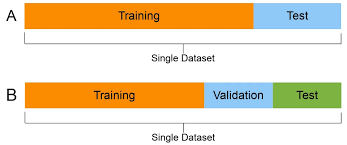

* **Training Set:** This is the largest set. Your model **learns** from this data, adjusting its parameters (`W` and `b`) to minimize the cost.
  
* **Development (Dev) Set:** This is also called the **hold-out cross-validation set**. You use this set to **tune your hyperparameters**. After training on the training set, you see which of your ideas (e.g., which learning rate, which network architecture) performs best on the dev set.
  
* **Test Set:** This set is "locked away" until the very end. You only use it once your model is complete to get a final, **unbiased estimate** of its real-world performance. You *must not* use it to make any decisions about your model.
  
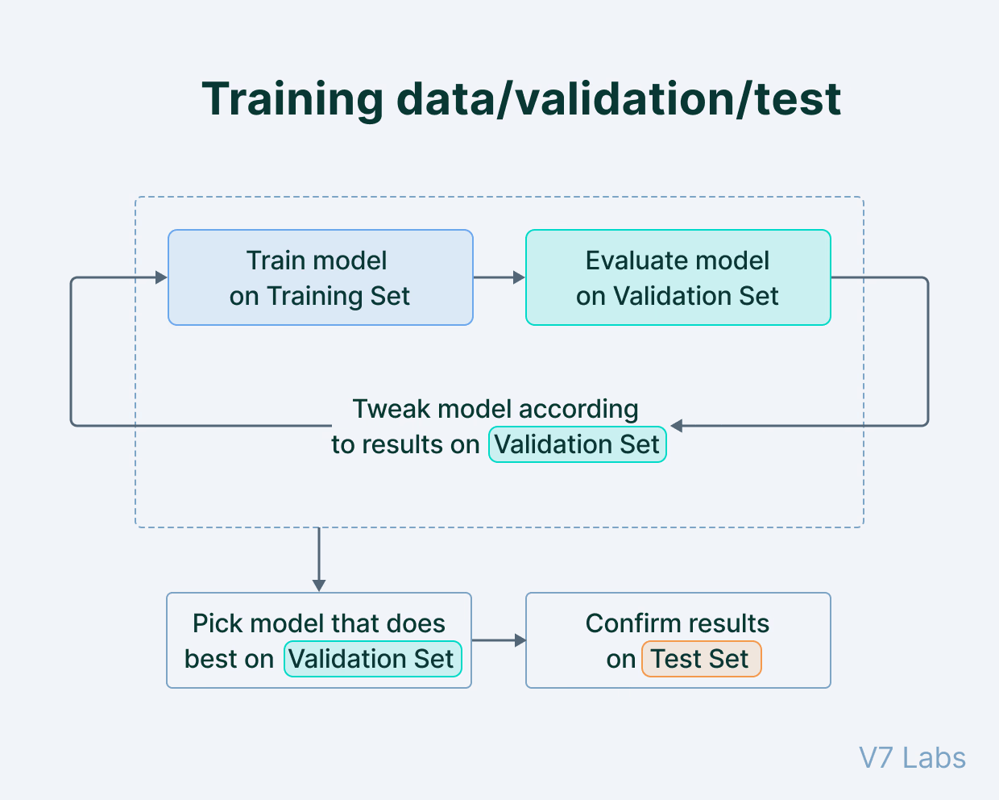

> **Analogy: Studying for an Exam**
>
> * **Training Set:** Like doing your **homework problems**. You learn the material from these.
> * **Dev Set:** Like taking a **practice exam**. You use the results to see what you're weak on and decide what to study next (i.e., tune your "hyperparameters").
> * **Test Set:** Like the **final exam**. You only take it once, and it gives you your final grade (your model's performance).

---
#### 3️⃣ Splitting the Data (Ratios)

How you split your data depends on how much data you have.

* **Small Data Era (<100,000 examples):** A 60/20/20 (Train/Dev/Test) or 70/30 (Train/Test) split was common.
* **Big Data Era (1,000,000+ examples):** The goals of the Dev and Test sets are just to be *large enough* to give a statistically significant result. They don't need to be a large *percentage* of the total.
    * For 1 million examples, a **98/1/1** split (980k train, 10k dev, 10k test) is very reasonable. 10,000 examples is more than enough for a reliable practice exam.
    * For 100 million examples, a **99.5/0.25/0.25** split might be fine.


---
#### 4️⃣ A Crucial Rule: Match Your Distributions

A common mistake is to have a Dev set and Test set that come from different distributions. For example, your dev set is high-quality, professional images, but your test set is blurry, user-uploaded phone images. This is bad!

**Rule:** Your **Dev set and Test set must come from the same data distribution**. This ensures that the "target" you are aiming for with your practice exam (the dev set) is the same as the target on your final exam (the test set).

---
Of course. After setting up your Train/Dev/Test sets, the next step is to analyze your model's errors to understand *why* it's not performing perfectly. This diagnosis is done using the concepts of **Bias** and **Variance**.

---
## 🎯 **Bias and Variance: Diagnosing Error**

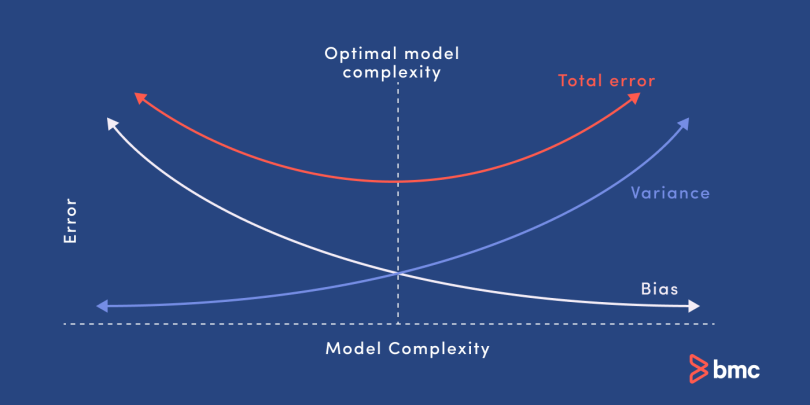

**Bias** and **Variance** are two fundamental sources of error that prevent your model from generalizing perfectly to new data.


---
### 1️⃣ What is Bias? (Underfitting)

* **Definition:** Bias is the error from your model being too simple to capture the underlying patterns in the data. It's a measure of how far off your model's predictions are from the true values, even on the data it was trained on.
* **Symptom:** **High Training Set Error**. Your model doesn't even perform well on the data it has seen.
* **Analogy (The Under-prepared Student):** This is like a student who didn't study for the exam. They don't understand the material (the data) and therefore get a bad grade, even on the *exact homework problems* (the training set) they were given.
* **In a Graph:** A model with high bias (underfitting) draws a decision boundary that is too simple, like using a straight line to separate a complex, curvy pattern.


---
### 2️⃣ What is Variance? (Overfitting)

* **Definition:** Variance is the error from your model being *too sensitive* to the specific data it was trained on. It learns the noise and random fluctuations in the training data, not just the underlying signal.
* **Symptom:** **Low Training Set Error** but **High Dev Set Error**. The model "memorizes" the training set but fails to generalize to new, unseen data.
* **Analogy (The Rote-Memorization Student):** This is like a student who memorizes the homework solutions perfectly. When given the homework problems again (the training set), they get 100%. But when the final exam (the dev set) asks slightly different questions on the *same topics*, the student fails because they didn't learn the actual concepts.
* **In a Graph:** A model with high variance (overfitting) draws an extremely complex decision boundary that wiggles around individual data points, fitting the noise.


---
### 3️⃣ Diagnosing with Train vs. Dev Error


To figure out if you have a bias or variance problem, you look at two key numbers and compare them to a "baseline" or "optimal" error (e.g., human-level performance, which we can approximate as 0%):

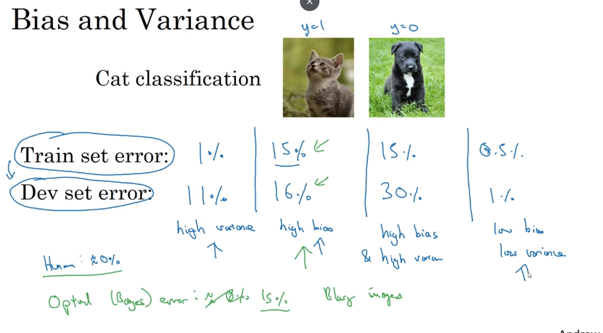

1.  **High Bias?** Look at your **Training Set Error**. If this error is high (e.g., 15% when human error is 1%), your model is **underfitting**. It's not even learning the data it has.
2.  **High Variance?** Look at the **gap between your Dev Set Error and your Training Set Error**. If this gap is large (e.g., Train error is 1%, but Dev error is 15%), your model is **overfitting**. It learned the training data well but failed to generalize.

Here is a summary of the four main cases:


| Case | Train Error | Dev Error | Diagnosis |
| :--- | :--- | :--- | :--- |
| **1. Good Fit** | Low (e.g., 1%) | Low (e.g., 1.5%) | **Low Bias, Low Variance.** This is the goal! |
| **2. Underfitting** | High (e.g., 15%) | High (e.g., 16%) | **High Bias, Low Variance.** The model is too simple. |
| **3. Overfitting** | Low (e.g., 1%) | High (e.g., 15%) | **Low Bias, High Variance.** The model memorized the train set. |
| **4. Worst Case** | High (e.g., 15%) | High (e.g., 30%) | **High Bias, High Variance.** The model is too simple *and* it's overfitting. |


---
### **🍳 How to Solve Bias/Variance Problem** 

This is the iterative process you should follow. Start at step 1 and only move to the next step once you've solved the problem at the current step.

---
#### **Basic "Recipe" for Machine Learning**
#### **Step 1: Check for High Bias**

First, look at your **Training set performance**.
* **Question:** Is your model fitting the training data well?
* **Diagnosis:** If your training error is high, you have a **High Bias** problem (underfitting). Your model is too simple.

**How to Fix High Bias (Underfitting):**
If you have high bias, try these things *first*. Don't bother with the variance solutions yet.
* **Get a Bigger Network:** Add more hidden layers or more hidden units per layer. This gives the model more capacity to learn complex patterns.
* **Train Longer:** Run gradient descent for more iterations.
* **Try a Different Model Architecture:** Perhaps a different network structure is better suited for the problem.

---
#### **Step 2: Check for High Variance**

Once your training error is low (meaning bias is low), look at your **Dev set performance**.
* **Question:** Is your model generalizing well to new data?
* **Diagnosis:** If your dev set error is much higher than your training set error, you have a **High Variance** problem (overfitting). Your model memorized the training set but didn't learn the general rules.

**How to Fix High Variance (Overfitting):**
If you have high variance, try these things:
* **Get More Data:** This is often the best and most reliable solution. Giving the model more examples helps it see more variations and learn the true underlying patterns instead of the noise.
* **Add Regularization:** This is the next topic we'll cover. It's a technique (like L2 or Dropout) that "penalizes" the model for being too complex, forcing it to be "simpler" and smoother, which helps it generalize.
* **Try a Different Model Architecture:** Sometimes a different, perhaps simpler, architecture will naturally be less prone to overfitting.

---
#### **Summary: The Bias-Variance Trade-off**

In the past, there was a "trade-off" where fixing bias (making the model bigger) would often make variance worse, and vice versa.

In the modern deep learning era, this is less of a problem:
1.  **To fix bias:** Get a bigger network.
2.  **To fix variance:** Get more data.

As long as you can make your network bigger and get more data (and you use regularization), you can often reduce *both* bias and variance, which is one of the most powerful aspects of deep learning.

---
##  **⚖️Regularization**

The core idea is simple: **we're going to make it "more expensive" for the model to have large weights.** Overfitting often happens when a network learns very large weights for specific features, essentially memorizing them. By penalizing large weights, we encourage the model to find a simpler, "smaller" set of weights that still fits the data well but doesn't overfit.

---

### **L2 Regularization**

#### 1️⃣ The Core Idea: Penalizing Large Weights
If you have a high variance problem, your model is overfitting. One of the first things to try is L2 Regularization.

The idea is to add a "penalty term" to the cost function $J$. This new term makes the total cost higher if the weight parameters ($W$) are large. The optimization algorithm (gradient descent) will now have two goals:
1.  Fit the training data (minimize the original loss).
2.  Keep the weights small (minimize the new penalty term).

---

#### 2️⃣ L2 Regularization for Logistic Regression
First, let's look at the simpler case of logistic regression.

* **Original Cost Function:**
    $$
    J(w, b) = \frac{1}{m} \sum_{i=1}^{m} \mathcal{L}(\hat{y}^{(i)}, y^{(i)})
    $$

* **New Cost Function with L2 Regularization:**
    $$
    J(w, b) = \frac{1}{m} \sum_{i=1}^{m} \mathcal{L}(\hat{y}^{(i)}, y^{(i)}) + \frac{\lambda}{2m} ||w||_2^2
    $$

Let's break down the new term:
* **$||w||_2^2$**: This is the **L2 norm** (or squared Euclidean norm) of the weight vector $w$. It's just the sum of the squares of all the elements in $w$: $||w||_2^2 = \sum_{j=1}^{n_x} w_j^2 = w^T w$.
* **$\lambda$ (lambda)**: This is the **regularization hyperparameter**. It's a new hyperparameter that you have to tune. It controls how much you penalize the weights.
    * If $\lambda$ is 0, it's the same as no regularization.
    * If $\lambda$ is very large, the model will be heavily penalized for large weights, forcing them to be very close to zero.
* **Why not regularize $b$?** In practice, we only regularize $W$. $W$ is a high-dimensional parameter vector with many parameters, while $b$ (the bias) is just a single number. Regularizing $b$ would make almost no difference.

---

#### 3️⃣ L2 Regularization for Neural Networks
We apply the same idea to a full neural network. The new cost function $J$ is the original loss plus a penalty term for *all* the weight matrices in the network.

* **New Cost Function:**
    $$
    J(W^{[1]}, b^{[1]}, ..., W^{[L]}, b^{[L]}) = \underbrace{\frac{1}{m} \sum_{i=1}^{m} \mathcal{L}(\hat{y}^{(i)}, y^{(i)})}_{\text{Original Cost } J(W,b)} + \underbrace{\frac{\lambda}{2m} \sum_{l=1}^{L} ||W^{[l]}||_F^2}_{\text{L2 Regularization Term}}
    $$      
* **$||W^{[l]}||_F^2$**: This is the **Frobenius norm** (squared) of the weight matrix $W^{[l]}$. It's simply the sum of the squares of all the individual elements in the matrix $W^{[l]}$.
    $$
    ||W^{[l]}||_F^2 = \sum_{i=1}^{n^{[l-1]}} \sum_{j=1}^{n^{[l]}} (W_{ij}^{[l]})^2
    $$

---

#### 4️⃣ How It Works: "Weight Decay"
Because we added a new term to the cost function, the calculation for the derivative (used in backpropagation) also changes.

* **Original update for $dW^{[l]}$:**
    `dW_from_backprop` (the derivative of the original loss)

* **New update for $dW^{[l]}$:**
    `dW_from_backprop` + $\frac{\lambda}{m} W^{[l]}$

This new derivative term now goes into the gradient descent update rule:
$$
W^{[l]} := W^{[l]} - \alpha \left[ (dW_{from\_backprop}) + \frac{\lambda}{m} W^{[l]} \right]
$$

We can rearrange this to see what's really happening:
$$
W^{[l]} := \left( 1 - \alpha \frac{\lambda}{m} \right) W^{[l]} - \alpha (dW_{from\_backprop})
$$

This term $\left( 1 - \alpha \frac{\lambda}{m} \right)$ is a number slightly less than 1. This means that on every single iteration, the model is *shrinking* or *decaying* the weight matrix $W^{[l]}$ by a small amount, *before* applying the usual update from backpropagation.

This is why **L2 regularization is also called "weight decay"**. It's a very intuitive name for what's happening in the implementation.

---
### 🤔What is Norm
A **norm** is a mathematical function that measures the "size" or "magnitude" of a vector or a matrix. Think of it as a way to calculate a single number that represents the total "length" of that object.

In the context of this course, we're interested in two specific types:

---

#### 1️⃣ The L2 Norm (for vectors, like $w$)
This is the most common one, also known as the **Euclidean norm**. It's what you probably think of as "distance" in the real world.

* **Analogy:** Imagine your vector $w$ is an arrow pointing from the center (origin) to a point in space. The L2 norm is the straight-line length of that arrow.
* **Formula:** $||w||_2 = \sqrt{w_1^2 + w_2^2 + \dots + w_{n_x}^2}$
* **In Regularization:** For L2 regularization, we actually use the **squared L2 norm**, $||w||_2^2 = w^T w = \sum_{j=1}^{n_x} w_j^2$. We use the squared version mainly because it's mathematically easier to take its derivative (it avoids the square root). This sum of squares is what we add to the cost function to penalize large weights.

---

#### 2️⃣ The Frobenius Norm (for matrices, like $W^{[l]}$)
This is simply the L2 norm extended to a matrix.

* **Analogy:** You can't just measure the "length" of a 2D grid of numbers. So, the Frobenius norm "flattens" the matrix into one giant, long vector and then just takes the L2 norm of that.
* **Formula:** $||W^{[l]}||_F = \sqrt{\sum_{i} \sum_{j} (W_{ij}^{[l]})^2}$
* **In Regularization:** Just like with the L2 norm, we use the **squared Frobenius norm**, $||W^{[l]}||_F^2 = \sum_{i} \sum_{j} (W_{ij}^{[l]})^2$. This is just the sum of the squares of *every single element* in the weight matrix. This is the term we add to the neural network's cost function for each layer.

---

🧠 **Deeper Dive: L1 Norm**
> You'll also sometimes hear about the **L1 norm**, which the course briefly mentioned.
> * **Formula:** $||w||_1 = \sum_{j=1}^{n_x} |w_j|$
> * **Analogy:** This is the "Manhattan distance" or "taxicab norm." Instead of a straight line, it's the distance you'd travel if you could only move along the grid (like city blocks).
> * **Effect:** Using this for regularization (called L1 regularization) has the unique property of pushing weights to be *exactly* zero, which results in a "sparse" model. L2 regularization, in contrast, just makes weights *small* but not necessarily zero.

So, in short: a **norm** measures the "size" of your weights. We add this "size" to the cost function so that gradient descent tries to find a balance between fitting the data and keeping the weights small, which prevents overfitting.

---
---

## 🤔 **Why L2 Regularization Works**

### 1️⃣ Intuition 1: It Simplifies the Network
This intuition is that L2 regularization effectively "zeros out" the impact of many hidden units, turning your large, complex network into a much simpler, smaller one that is less likely to overfit.

* **The Cost Function:** Remember, the cost function $J$ is the original loss *plus* the L2 penalty:
    $$
    J(...) = \frac{1}{m} \sum \mathcal{L}(\hat{y}^{(i)}, y^{(i)}) + \frac{\lambda}{2m} \sum_{l=1}^{L} ||W^{[l]}||_F^2
    $$
* **The Effect of $\lambda$:** If you set the regularization hyperparameter $\lambda$ to be very large, the optimization algorithm's main goal becomes minimizing the penalty term.
* **Shrinking Weights:** To minimize this penalty, it will force the weight matrices $W^{[l]}$ to be very close to zero.
* **The "Simpler" Network:** If the weights $W^{[l]}$ connecting to a hidden unit are all near-zero, that unit becomes "diminished" or "zeroed out"—it has almost no impact on the rest of the network.
* **Result:** This effectively turns your large, deep network into a much smaller, simpler network (almost like logistic regression), which is less prone to overfitting and has high bias.
  
The goal isn't to set $\lambda$ *that* high, but to find a "just right" value that simplifies the network enough to reduce variance, moving it from an overfitting state back towards the "just right" model.

---

### 2️⃣ Intuition 2: It Creates Linear-like Activations
This intuition is that L2 regularization forces the activations to stay in their *linear* range, preventing the network from learning complex, non-linear boundaries.

* **Activation Functions:** Let's think about an activation function like $\tanh(z)$.
* **Linear Region:** The $\tanh$ function is S-shaped, but it's *almost perfectly linear* for small values of $z$ (i.e., $z$ close to 0). It only becomes non-linear when $z$ gets large (positive or negative).

* **How L2 Helps:**
    1.  L2 regularization (large $\lambda$) forces the weights $W^{[l]}$ to be small.
    2.  The input to the activation function is $z^{[l]} = W^{[l]}a^{[l-1]} + b^{[l]}$.
    3.  If $W^{[l]}$ is small, $z^{[l]}$ will also be small, forcing it to stay in that linear region of the $\tanh$ function.
* **Result:** If every layer's activation function is just behaving linearly, the entire network (no matter how deep) is just computing a simple linear function. A linear classifier can't create the complex, wiggly decision boundaries needed to overfit the data.

---

### 💡 Implementation Tip
A quick but important note from the lectures: When you're debugging gradient descent, you should plot the cost function $J$ to make sure it's decreasing on every iteration.

If you're using regularization, make sure to plot the **new** definition of $J$ (the one that *includes* the regularization term). If you plot the old cost function, it might not decrease monotonically, which can be confusing.

---
-----

## 👻 **Dropout Regularization**

Dropout is another powerful regularization technique that's very different from L2 regularization. It's highly effective, especially in computer vision where you often don't have enough data.

### 1️⃣ The Core Idea: Randomly "Diminish" the Network

The main idea of dropout is, for *every* training example, to randomly "shut down" (or "drop out") a fraction of the neurons in your network.

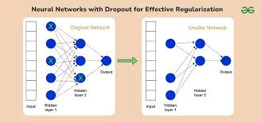

  * You go through each hidden layer and, for each neuron, you "toss a coin." Based on a probability (called `keep_prob`), you decide whether to keep that neuron or temporarily eliminate it.
  * This means that on every single training step, your model is training a *different*, smaller, "diminished" network.
  * This has a regularizing effect because the network cannot rely on any one specific neuron or feature, as it might be dropped out at random.

-----

### 2️⃣ How to Implement It: "Inverted Dropout"

The most common and recommended way to implement dropout is called **Inverted Dropout**. Here's the process for a single layer, say layer 3:

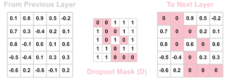

1.  **Define `keep_prob`:** This is a hyperparameter, for example, `keep_prob = 0.8`. This means we want to *keep* 80% of the neurons and *drop* 20% of them.

2.  **Create the Dropout Vector:** You create a random vector `d3` that has the same shape as the activation `a3`.

    ```python
    # d3 will be a matrix of 1s (True) and 0s (False)
    d3 = np.random.rand(a3.shape[0], a3.shape[1]) < keep_prob #
    ```

3.  **Apply the Mask:** You perform element-wise multiplication to "zero out" the dropped neurons from the activation `a3`.

    ```python
    a3 = np.multiply(a3, d3)  # or a3 *= d3
    ```

4.  **Scale the Activations (The "Inverted" Part):** This is the most important step. You scale up the *remaining* activations by dividing by `keep_prob`.

    ```python
    a3 /= keep_prob #
    ```

**Why do we scale?**
Let's say `a3` has 50 neurons and `keep_prob=0.8`. We've just "zeroed out" 20% of them (10 neurons). This means the expected value of `a3` is now 20% smaller. This would in turn reduce the expected value of $z^{[4]}$ in the next layer.

By dividing by `keep_prob` (0.8), we "bump back up" the values of the remaining neurons to compensate. This ensures that the expected value of `a3` remains the same, which makes test time much simpler.

-----

### 3️⃣ Making Predictions at Test Time

When it's time to make a prediction (at test time), you **do not use dropout**.

  * You just run the full, un-diminished network.
  * You don't want your predictions to be random or noisy.
  * Because we used "inverted dropout" (the scaling step) during training, we don't need to do *any* scaling or make any changes at test time. The network just works as is.

-----

### 4️⃣ Why Does Dropout Work?

There are two key intuitions for *why* this prevents overfitting:

1.  **It's like L2 Regularization:** A neuron can't rely on any single input feature, because any of its inputs could be randomly dropped out. This forces the neuron to spread its weights out over all of its inputs, rather than putting a large weight on just one or two. This "spreading of weights" has an effect very similar to L2 regularization (shrinking the squared norm of the weights) and helps prevent overfitting.

2.  **It's like Training Smaller Networks:** As mentioned before, you're essentially training a different, smaller neural network on every example. Smaller networks are less prone to overfitting, so this has a regularizing effect.

-----

### 5️⃣ Implementation Notes

  * **Different `keep_prob`:** You can set different `keep_prob` values for different layers. For layers with many parameters (where you're more worried about overfitting), you might set a lower `keep_prob` (e.g., 0.5) for stronger regularization. For layers you're not worried about (or the input layer), you can set `keep_prob = 1.0` (which just turns dropout off for that layer).
  * **When to Use It:** Dropout is a regularization technique. If your model isn't overfitting, you don't need to use it.
  * **A Big Downside:** Because you're randomly dropping nodes, the **cost function $J$ is no longer well-defined** or guaranteed to decrease on every iteration. This makes it much harder to debug and check that gradient descent is working.
  * **Recommended Workflow:** First, **turn off dropout** (set all `keep_prob = 1.0`) and run your network. Make sure your cost $J$ is monotonically decreasing. Once you're confident your model is correct, *then* turn on dropout to regularize it.

---
---

## 📦 **Other Regularization Methods**

### 1️⃣ Data Augmentation

This is a powerful regularization technique used heavily in computer vision and other domains.


**Analogy:** Imagine you are trying to teach a model to recognize cats, but you only have 10 pictures. The model will quickly "memorize" those 10 pictures (overfitting).

Data augmentation is like taking those 10 pictures and creating "new" ones for free. You can flip a cat picture horizontally—it's still a cat. You can randomly zoom in and crop it—it's still a cat. You can rotate it slightly.


**Formal Definition:** **Data Augmentation** is a technique to artificially enlarge a training dataset by creating new, modified versions of existing training samples. This helps prevent overfitting by teaching the model to be **invariant** to transformations that do not change the core meaning of the data (e.g., a flipped cat is still a cat).

Common examples include:
* **Computer Vision:**
    * Horizontal flipping
    * Random cropping and zooming
    * Slight rotation or distortion
* **Optical Character Recognition (OCR):**
    * Taking a digit (like a '4') and adding minor rotations or distortions to it.

While this is "cheaper" than collecting new, independent data, it's not as good. However, it's an excellent way to expand your dataset and reduce variance.

### 2️⃣ Early Stopping

This is another simple and effective regularization method.

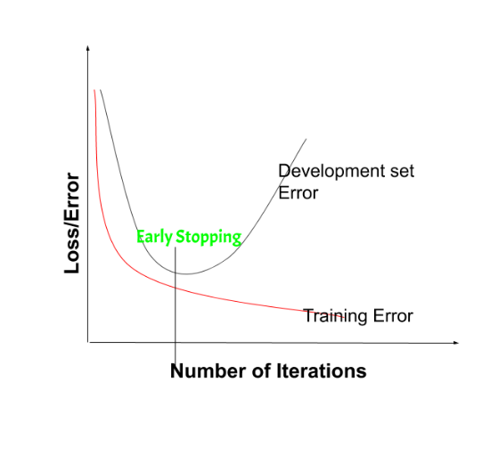

**Analogy:** Think of training as a student studying for an exam.
* The student studies and their knowledge of the *practice questions* improves (training error goes down).
* They take *practice exams* (validation/dev set) to check their real understanding.
* At first, their practice exam scores improve (dev error goes down).
* But if they study for *too long*, they just start *memorizing* the exact practice questions. Their training score is perfect, but their practice exam score gets *worse* because they failed to generalize.

**Early Stopping** is telling the student to stop studying *right at the moment* their practice exam score was at its best, before they started overfitting.

**Formal Definition:** **Early Stopping** is a regularization method that halts the gradient descent process when the model's performance on the development (validation) set stops improving and begins to degrade, even if the training set error is still decreasing.

Here is the process:
1.  During training, plot the training error (or cost $J$). It should consistently decrease.
2.  Simultaneously, plot the error on your validation (dev) set.
3.  You will typically see the dev set error decrease, hit a minimum, and then start to increase as the model begins to overfit.
4.  You "stop" training and save the model parameters from the iteration that had the **lowest dev set error**.


**Why it works (Intuition):**
* At the start of training (0 iterations), the weights $W$ are initialized to small random values.
* As training progresses, the weights $W$ grow larger and larger.
* By stopping early, you select a model with a "mid-size" $W$.
* This is very similar to L2 Regularization: a model with a smaller Frobenius norm for its weights $W$ is a "simpler" model and less likely to overfit.

### 3️⃣ Pros and Cons of Early Stopping

The course introduces an important concept called **Orthogonalization**. This means you should have separate tools for separate jobs:
* **Job 1:** Optimize the cost function $J$ (e.g., using Gradient Descent, Adam).
* **Job 2:** Prevent overfitting / Reduce variance (e.g., using L2 regularization).

The main downside of Early Stopping is that it **mixes these two jobs**. You are stopping Job 1 early as your method for doing Job 2.

Here is a comparison:

| Method | Pro (Advantage) | Con (Disadvantage) |
| :--- | :--- | :--- |
| **L2 Regularization** | Good **Orthogonalization**. You can train as long as you want to optimize $J$. | Computationally expensive. You must try many different values for the hyperparameter $\lambda$. |
| **Early Stopping** | **Computationally cheap**. You run gradient descent once and can find a model with small, medium, or large weights $W$. | **Poor Orthogonalization**. It mixes the two tasks of optimizing $J$ and reducing variance. |
---
## 🔧 **Orthogonalization**

### 1️⃣ The Core Idea: One Knob, One Job

**Analogy:** Imagine you're in a car with a standard steering wheel and an accelerator. This is an "orthogonal" system:
* **Steering Wheel (Knob 1):** Changes your *direction* (and only direction).
* **Accelerator (Knob 2):** Changes your *speed* (and only speed).

This system is easy to control because the knobs are independent. If you want to go faster, you press the accelerator; you don't have to worry about it *also* making you turn left.

Now, imagine a "non-orthogonal" car where one joystick controls *both* speed and direction (e.g., pushing forward-left makes you go faster *and* turn left). This would be incredibly difficult to tune to drive in a straight line at a precise speed.


**Formal Definition:** **Orthogonalization** is a principle of system design where you have separate, independent controls (tools, hyperparameters) for separate, independent tasks. The goal is to ensure that a "knob" you turn to fix one problem *does not* create or worsen another problem.

### 2️⃣ Orthogonalization in Machine Learning

In the "Basic Recipe for Machine Learning" from **Course 2**, we have a chain of distinct problems to solve. An orthogonal approach means we have separate tools for each step.

* **Task 1: Optimize the Cost Function $J$ (Fix High Bias)**
    * You want your model to at least fit the training data well.
    * **Orthogonal Knobs:** Use a better optimization algorithm (Momentum, Adam), train longer, or build a bigger network.

* **Task 2: Prevent Overfitting (Fix High Variance)**
    * You want your model to generalize well to the dev/test set.
    * **Orthogonal Knobs:** Get more data, use L2 regularization, or use dropout.

### 3️⃣ Why Early Stopping is "Non-Orthogonal"

**Early Stopping** breaks this principle because it uses *one tool* to try and do *two jobs at once*.

* By stopping gradient descent early, you are interrupting **Task 1** (you're not fully optimizing $J$).
* You are doing this as your method for achieving **Task 2** (preventing overfitting).

This is "non-orthogonal." The act of *optimizing* and the act of *regularizing* are no longer separate. You can't just focus on minimizing the cost $J$ anymore, because you have to worry that minimizing it *too much* will cause overfitting.

### 4️⃣ Orthogonal vs. Non-Orthogonal Regularization

This table summarizes the trade-off you were asking about:

| Method | Orthogonal? | How It Works |
| :--- | :--- | :--- |
| **L2 Regularization** | **Yes (Orthogonal)** | Provides a separate "knob" ($\lambda$) just for regularization. You can let your optimizer (Adam, etc.) run as long as it needs to solve Task 1, and you can *independently* tune $\lambda$ to solve Task 2. |
| **Early Stopping** | **No (Non-Orthogonal)** | Mixes two tasks. It stops the optimizer (Task 1) early as a way to regularize (Task 2). This makes it harder to tune because you've coupled the two problems. |

---

In short, orthogonalization is the idea of having one knob for one job. L2 regularization is an *orthogonal* tool, while Early Stopping is *non-orthogonal* because it mixes the job of optimization with the job of regularization.

---
---

## ⚖️ **Normalizing Inputs**

### 1️⃣ The Core Idea

Normalizing inputs is a data pre-processing step that scales all your input features ($x$) to have a similar range (specifically, zero mean and unit variance).

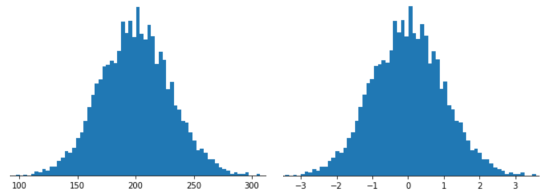

**Analogy:** Imagine your cost function $J$ is a "bowl" you're trying to find the bottom of.
* **Unnormalized Inputs:** If your features are on very different scales (e.g., $x_1$ is $1 \dots 1000$, but $x_2$ is $0 \dots 1$), this "bowl" becomes very elongated and squished. Trying to find the minimum is like rolling a ball down a narrow, steep ravine—it will oscillate back and forth a lot and take a long time to settle at the bottom.


* **Normalized Inputs:** Normalizing your inputs makes the "bowl" more symmetrical and "round". Now, the ball can roll much more directly to the bottom.

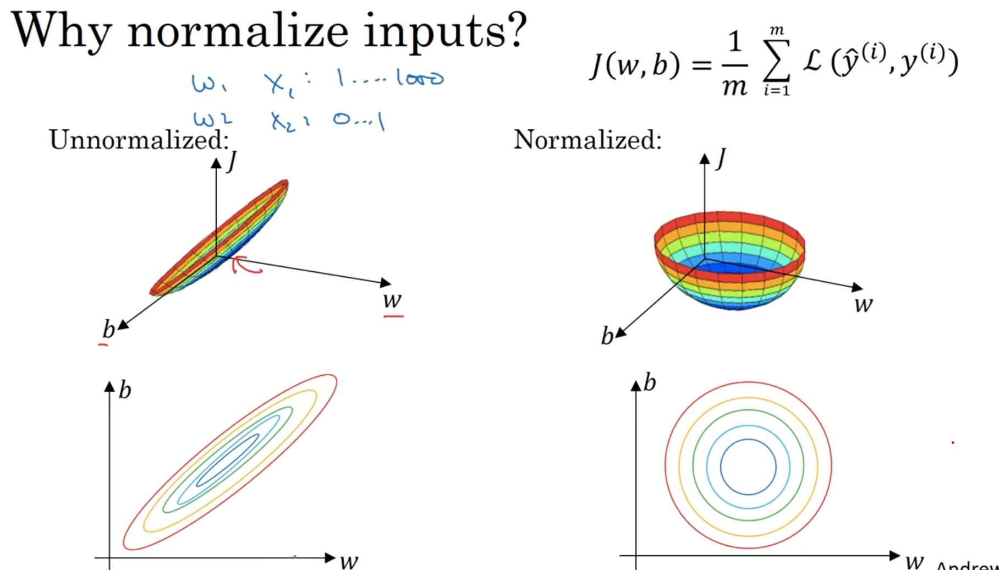

This process ensures that gradient descent can take larger, more confident steps to find the minimum, which means your algorithm trains much faster.

### 2️⃣ The Two-Step Process

Normalization is done in two steps, using the *training set*:

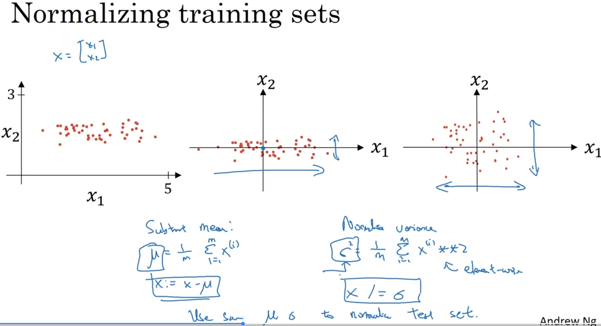

**Step 1: Subtract the Mean (Zero-Centering)**
First, you calculate the mean ($\mu$) for each feature across all training examples and subtract it. This shifts your data's center to the origin (0,0).

$$
\mu = \frac{1}{m} \sum_{i=1}^{m} x^{(i)}
$$
$$
x := x - \mu
$$

**Step 2: Normalize the Variance**
Second, you calculate the variance ($\sigma^2$) for each feature and divide by its standard deviation ($\sigma$). This scales the data so that each feature has a variance of 1.

$$
\sigma^2 = \frac{1}{m} \sum_{i=1}^{m} (x^{(i)})^2 \quad \text{(element-wise square)}
$$
$$
x := x / \sqrt{\sigma^2} \quad \text{(element-wise division)}
$$


### 3️⃣ The Most Important Rule: Use $\mu$ and $\sigma$ from Training

This is a critical point:

* You calculate $\mu$ and $\sigma^2$ **only from your training set**.
* You must then use these **same** $\mu$ and $\sigma^2$ values to normalize your **dev set** and your **test set**.

You do *not* recalculate the mean and variance for the test set. You want your test data to go through the exact same transformation as your training data.

---
---

## 📈 **Vanishing & Exploding Gradients**

### 1️⃣ The Core Problem: Unstable Training

This is a major problem that arises when training **very deep** neural networks (networks with many layers).

**Analogy-1:** Think of your signal (or its gradient) as a number that gets passed through 150 layers.
* **Exploding:** What happens if you take the number 1.5 and multiply it by itself 150 times ($1.5^{150}$)? You get an *astronomically large* number. Your calculations will overflow and result in `NaN` (Not a Number), and your training will fail completely.
* **Vanishing:** What happens if you take the number 0.5 and multiply it by itself 150 times ($0.5^{150}$)? You get an *infinitesimally small* number, essentially zero. If your gradients become this small, your weights will not update at all, and your model simply **stops learning**.

**Analogy-1:** The "Whisper Game" Analogy (Vanishing)

Imagine you're playing the "whisper game" (or "telephone") with 100 people in a line.
* The first person whispers a message to the second.
* The second whispers it to the third, and so on.

Now, imagine each person only whispers **80%** (or 0.8) of the message they heard.
* Person 2 gets 80% of the message.
* Person 3 gets 80% of 80% (which is 64%).
* Person 4 gets 80% of 64% (which is ~51%).
* By the time you get to person 100, the message is **gone**. It has "vanished" to zero.

This is **Vanishing Gradients**. In backpropagation, the "message" is the gradient (the error signal, or "correction"). As this signal travels *backward* from the output layer to the input layer, it gets multiplied by the weights at each step. If those weights are, on average, less than 1 (like our 0.8), the signal gets weaker and weaker until it's effectively zero by the time it reaches the first few layers.

**Result:** The first few layers of your network get *no correction signal*, so they **stop learning**.

### The "Feedback Squeal" Analogy (Exploding)

Now, imagine a microphone and a speaker.
* You speak into the microphone.
* The speaker amplifies your voice (say, it makes it **1.5x** louder).
* If the microphone is too close, it picks up the amplified sound from the speaker.
* It then re-amplifies *that* sound by 1.5x.
* ...which gets picked up *again* and amplified by 1.5x...

In a split second, you get that horrible, deafening "feedback squeal" that **explodes** in volume.

This is **Exploding Gradients**. In forward (or backward) propagation, if your weights are, on average, greater than 1 (like our 1.5x), the signal gets multiplied and grows exponentially at each layer.

**Result:** The numbers become so astronomically large that the computer can't store them. They become `NaN` (Not a Number), your calculations fail, and your entire training process **breaks**.

---


### 2️⃣ The Cause: Chained Multiplication

This problem happens because of the chain of multiplications in both forward and backward propagation.

Let's use the simplified example from the course, where we have a deep network with linear activations ($g(z)=z$) and no bias ($b=0$).

The output $\hat{y}$ will be a long chain of matrix multiplications:
$$
\hat{y} = W^{[L]} W^{[L-1]} \dots W^{[2]} W^{[1]} X
$$


The derivatives in backpropagation face a similar chain of multiplications.

* If the weight matrices $W^{[l]}$ are, on average, slightly **larger than 1**, the signal grows exponentially as it passes through the layers, leading to **exploding gradients**.
* If the weight matrices $W^{[l]}$ are, on average, slightly **smaller than 1**, the signal shrinks exponentially, leading to **vanishing gradients**.


### 3️⃣ The Consequences for Training

Vanishing and exploding gradients are problems because they stop your network from learning correctly. They cause two different, but equally destructive, failures during the training process.

#### 💥 The Effects of Unstable Gradients

The core of the problem is the gradient descent update rule for any weight $W$:
$$
W := W - \alpha \cdot dW
$$
Here, $dW$ is the gradient. The entire goal of training is to use this $dW$ to take a smart step. Unstable gradients make this step impossible.

Here is a summary of what happens:

| Problem | What Happens to the Gradient ($dW$) | The Effect on Training | Consequence for Your Model |
| :--- | :--- | :--- | :--- |
| **Vanishing Gradients** | The gradient becomes **infinitesimally small** (e.g., $10^{-20}$). | The update step is **tiny**. $W$ barely changes at all ($W \approx W - \alpha \cdot 0$). | The model **stops learning**. This is especially bad for the early layers, which get no update signal and fail to learn. Training becomes **impossibly slow**. |
| **Exploding Gradients** | The gradient becomes **astronomically large** (e.g., $10^{20}$). | The update step is **massive**. The weights take a giant leap, completely overshooting the optimal solution. | The model **breaks**. The large numbers become `NaN` (Not a Number) due to numerical overflow. The cost function diverges, and training **fails completely**. |

---

In short:
* **Vanishing** $\rightarrow$ Your model **doesn't learn** (training is slow or stuck).
* **Exploding** $\rightarrow$ Your model **breaks** (training fails).

Both problems prevent the network from converging to a good solution, which is why they were such a major barrier to training deep networks.

---

🧠 **Deeper Dive: Why Sigmoid and Tanh were problematic**

> Before ReLU, Sigmoid and Tanh were common. Their derivatives (slopes) are *at most* 1.0 (for Tanh) or 0.25 (for Sigmoid), and are often *much smaller* in the saturated (flat) regions of the function. When you multiply these small derivatives together in backpropagation (e.g., $0.25 \times 0.25 \times \dots$), the gradient is *guaranteed* to vanish very quickly. This is one of the main reasons ReLU became the default choice, as its derivative is a constant 1 for all positive inputs.
---

## 💡 **Weight Initialization**

### **1️⃣ The Core Idea**

The problem, as we saw, is that if weights are consistently *a little too big* or *a little too small*, the signal **explodes** or **vanishes** as it propagates through layers.

The solution is to **initialize the weights "just right."**

This means we don't just pick random numbers — we draw them from a Gaussian (normal) distribution and **scale** them so that the *variance* of the signal remains roughly the same as it passes through each layer.

This keeps both the signal and its gradient stable.

---

### **2️⃣ The Intuition (A Single Neuron)**

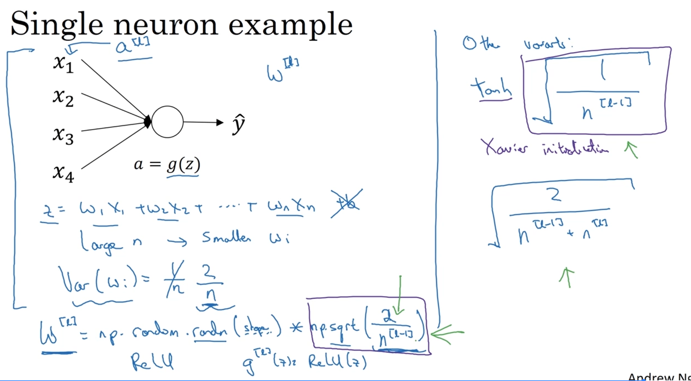

Let’s consider a single neuron:

This neuron computes the pre-activation value $z$:

$$
z = w_1 x_1 + w_2 x_2 + \dots + w_n x_n
$$

(We’ll ignore the bias term $b$ for this intuition.)

Now, think about the **number of inputs, $n$**:

* If $n$ is **small** (e.g., 2 inputs), each $w_i$ can be relatively large.
* If $n$ is **large** (e.g., 1000 inputs), you are summing up 1000 terms.
  To prevent $z$ from exploding, each individual weight $w_i$ must be **smaller**.

✅ **Key insight:** The larger the number of inputs ($n_{in}$), the smaller the initial weights should be.

---

### **3️⃣ The Formal Solution: Setting the Variance**

Formally, we want the **variance of the output ($z$)** to match the **variance of the input ($x$)**.

Assuming inputs $x_i$ are normalized (mean 0, variance 1), we get:

$$
Var(w_i) = \frac{1}{n_{in}}
$$

where $n_{in}$ is the number of input units to the neuron (i.e., $n^{[l-1]}$, the number of neurons in the previous layer).

---

### **4️⃣ The Right Formula for the Right Activation Function**

This rule is slightly adjusted based on the activation function used:

* **For ReLU (He Initialization):**
  Since $g(z) = \max(0, z)$ cuts off all negative values (reducing variance by half), we compensate by **doubling** the variance.
  This is known as **He Initialization**.

  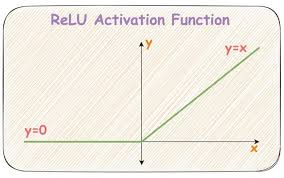

* **For Tanh (Xavier Initialization):**
  Tanh doesn’t discard half the signal, so the original formula works fine.
  This is known as **Xavier Initialization**.

---

### **Summary Table**

| Activation Function | Initialization Method     | Variance Formula ($Var(W)$)     |
| ------------------- | ------------------------- | ------------------------------- |
| **ReLU**            | **He Initialization**     | $Var(W) = \dfrac{2}{n^{[l-1]}}$ |
| **Tanh**            | **Xavier Initialization** | $Var(W) = \dfrac{1}{n^{[l-1]}}$ |

---

### **5️⃣ The Code Implementation**

In practice, you don’t manually compute the variance — you just sample from a standard normal distribution and multiply by the scaling factor (the square root of the variance).

For **He Initialization (ReLU)**:

```python
# He Initialization for Layer l
# n_in = n[l-1]  (neurons in previous layer)
# n_out = n[l]   (neurons in current layer)

W_l = np.random.randn(n_out, n_in) * np.sqrt(2.0 / n_in)
b_l = np.zeros((n_out, 1))
```

This simple initialization strategy is one of the **most important tricks** that make deep neural networks train successfully.

---
---

## 📋 **Gradient Checking**

### 1️⃣ The Core Idea: Don't Trust, Verify!

**Analogy:** Think of backpropagation as you solving a very complex calculus problem (finding $dW$ and $db$). You *think* you've derived all the formulas correctly, but it's easy to make a small mistake.

Gradient Checking is like numerically "plugging in the numbers" to check your work. It's a way to get a *numerical approximation* of the gradient (the "slow-but-simple" way) and compare it to the gradient your complex backprop algorithm *calculated* (the "fast-but-complex" way).

If the answers match, your backprop is correct. If they don't, you have a bug.

### 2️⃣ The Two Vectors We Are Comparing

To do this, we need to compare two different vectors:

* **$d\theta$ (The "Calculated" Vector):** This is the vector of all your derivatives ($dW^{[1]}, db^{[1]}, dW^{[2]}, \dots$) calculated by **backpropagation**.
* **$d\theta_{approx}$ (The "Approximate" Vector):** This is the vector of derivatives calculated by **numerical approximation** (which we'll cover in a moment).

To make this comparison, you must "unroll" all of your $W$ and $b$ matrices/vectors into one single, giant vector called $\theta$. You do the same for your $dW$ and $db$ derivatives to create the giant vector $d\theta$.

### 3️⃣ The Numerical Approximation (Two-Sided Difference)

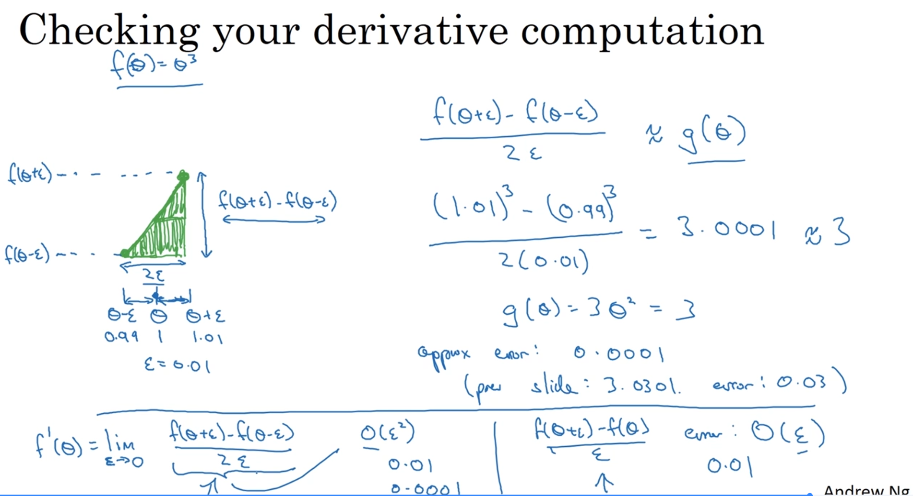

So, how do we get the "ground truth" $d\theta_{approx}$?

We use a numerical trick called the **two-sided difference**. For any parameter $\theta_i$, its derivative is the slope of the cost function $J$ at that point. We can *approximate* this slope by "nudging" $\theta_i$ by a tiny amount $\epsilon$ (e.g., $\epsilon = 10^{-7}$) in both directions.


We calculate:
$$
d\theta_{approx}[i] = \frac{J(\theta_1, \dots, \theta_i + \epsilon, \dots) - J(\theta_1, \dots, \theta_i - \epsilon, \dots)}{2\epsilon}
$$


We loop over every single parameter in our network, calculate this value, and build the full $d\theta_{approx}$ vector.

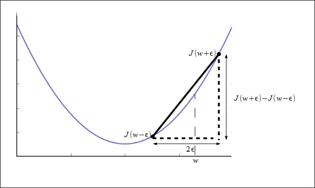

🧠 **Deeper Dive: Why Use the Two-Sided Difference?**
> You might be tempted to use the "one-sided" difference: $\frac{J(\theta + \epsilon) - J(\theta)}{\epsilon}$.
>
> **Don't do it.** The course explains this is much less accurate.
>
> * **One-Sided Error:** $O(\epsilon)$
> * **Two-Sided Error:** $O(\epsilon^2)$
>
> Since $\epsilon$ is a tiny number (like $10^{-7}$), $\epsilon^2$ (which is $10^{-14}$) is *much, much smaller*. The two-sided formula is dramatically more accurate.

### 4️⃣ The Final Check: Comparing the Vectors

Now you have the $d\theta$ vector from backprop and the $d\theta_{approx}$ vector from your numerical loops. You compare them using the following formula, which measures the relative difference (a Euclidean distance ratio):

$$
Check = \frac{||d\theta_{approx} - d\theta||_2}{||d\theta_{approx}||_2 + ||d\theta||_2}
$$


This gives you a single number, which you can interpret as follows:

| Check Value | Interpretation |
| :--- | :--- |
| **$\le 10^{-7}$** | **Great!** Your backprop implementation is very likely correct. |
| **$\approx 10^{-5}$** | **Take a look.** This is a bit high. It might be okay, but you should check. |
| **$\ge 10^{-3}$** | **Bug!** There is almost certainly a bug in your backprop code. |

### 5️⃣ Critical Implementation Notes

Gradient checking is powerful, but you must follow these rules:

1.  **Only for Debugging:** Grad check is **extremely slow**. Run it once to verify your code, then **turn it off** for training.
2.  **It Doesn't Work with Dropout:** Dropout's randomness means the cost function $J$ is not well-defined. **Turn off dropout** (set `keep_prob = 1.0`) *before* running grad check.
3.  **Remember Regularization:** Your cost function $J$ *must* include the regularization term (if you're using it). If you forget, the check will fail.
4.  **Check Components:** If the check fails, look at the individual components of the difference vector. You might find the bug is only in your `db` calculation, but `dW` is correct.

---

The symbol **`||v||2`** (the double bars with a subscript 2) represents the **L2-norm** of a vector $v$.

It's a standard way to measure the **length** or **magnitude** of a vector, also known as the **Euclidean norm**.

Here's what it means:
1.  **`||...||`**: These double bars are the general symbol for a **norm**, which is a function that gives a positive length to a vector.
2.  **`..._2`**: The subscript 2 specifies *which* norm to use. The L2-norm is the most common one you'll see.

---

### How to Calculate It

To calculate the L2-norm of a vector $v$:
1.  Take **every element** in the vector and **square** it.
2.  **Sum** up all those squared values.
3.  Take the **square root** of the total sum.

Formally, if you have a vector $v = (v_1, v_2, \dots, v_n)$, the L2-norm is:

$$
||v||_2 = \sqrt{v_1^2 + v_2^2 + \dots + v_n^2} = \sqrt{\sum_{i=1}^{n} v_i^2}
$$

**In short:** In that formula,
$$
\| d\theta_{\text{approx}} - d\theta \|_2
$$
 is just calculating the standard Euclidean distance between the two vectors to see how "far apart" they are.
