---

# 🏃 **Mini-batch Gradient Descent**

**1️⃣ The Core Problem: Big Data**

When training a neural network, the standard "Batch" Gradient Descent algorithm requires you to process your *entire* training set just to take one single step.

This is a major problem when you have "big data." If your training set has 5 million examples, you must compute forward and backward propagation on all 5 million examples before you can make one tiny update to your parameters ($W$ and $b$). This is incredibly slow.

**2️⃣ The Core Idea: Taking Smaller Steps**

Instead of waiting to process all 5 million examples, mini-batch gradient descent lets you start making progress much sooner.

The idea is to break your large training set into smaller "mini-batches". For example, you could split your 5 million examples into 5,000 mini-batches of 1,000 examples each.

You then run one step of gradient descent on *each* mini-batch. This way, you make 5,000 updates in the time it would have taken to make just one update using batch gradient descent.


**3️⃣ Key Terminology**

* **Mini-batch ($X^{\{t\}}, Y^{\{t\}}$):** The $t$-th mini-batch of your data. The curly braces $\{t\}$ are used to index different mini-batches.
* **Epoch:** One complete pass through the *entire* training set. In our example, one epoch consists of processing all 5,000 mini-batches.

**4️⃣ The Mini-batch Algorithm**

The process for one epoch of training is as follows:

**Repeat for $t = 1, ..., 5000$:**
1.  **Forward Propagation:** Perform forward prop on the current mini-batch, $X^{\{t\}}$, to get predictions $A^{[L]}$. This is a vectorized step on 1,000 examples, not 5 million.
    $$
    Z^{[1]} = W^{[1]}X^{\{t\}} + b^{[1]}
    $$
    $$
    A^{[1]} = g^{[1]}(Z^{[1]})
    $$
    $$
    ... \text{etc} ...
    $$
2.  **Compute Cost $J^{\{t\}}$:** Calculate the cost $J$ using only the examples in the current mini-batch ($X^{\{t\}}, Y^{\{t\}}$).
    $$
    J^{\{t\}} = \frac{1}{1000} \sum_{i=1}^{1000} L(\hat{y}^{(i)}, y^{(i)}) + \frac{\lambda}{2 \cdot 1000} \sum_{l} ||W^{[l]}||_F^2
    $$
3.  **Backward Propagation:** Compute the gradients ($dW^{[l]}, db^{[l]}$) using *only* $X^{\{t\}}$ and $Y^{\{t\}}$.
4.  **Update Parameters:** Update the weights and biases.
    $$
    W^{[l]} = W^{[l]} - \alpha dW^{[l]}
    $$
    $$
    b^{[l]} = b^{[l]} - \alpha db^{[l]}
    $$

By looping through all 5,000 mini-batches, you've completed one epoch and have taken 5,000 gradient descent steps.

**5️⃣ Comparison: Batch vs. Mini-batch**

| Feature | (Batch) Gradient Descent | Mini-batch Gradient Descent |
| :--- | :--- | :--- |
| **Data in one step** | Entire training set ($X, Y$) | One mini-batch ($X^{\{t\}}, Y^{\{t\}}$) |
| **Gradient steps per epoch** | 1 | Number of mini-batches (e.g., 5,000) |
| **Speed** | Very slow for large datasets | Much faster |
| **Vectorization** | Fully vectorized across $m$ examples | Vectorized across mini-batch size (e.g., 1000) |
-----

## 📊 **Understanding Mini-batch Gradient Descent**

**1️⃣ How Mini-batch Changes the Cost Plot**

A key difference you'll see is in the cost function plot, $J$.

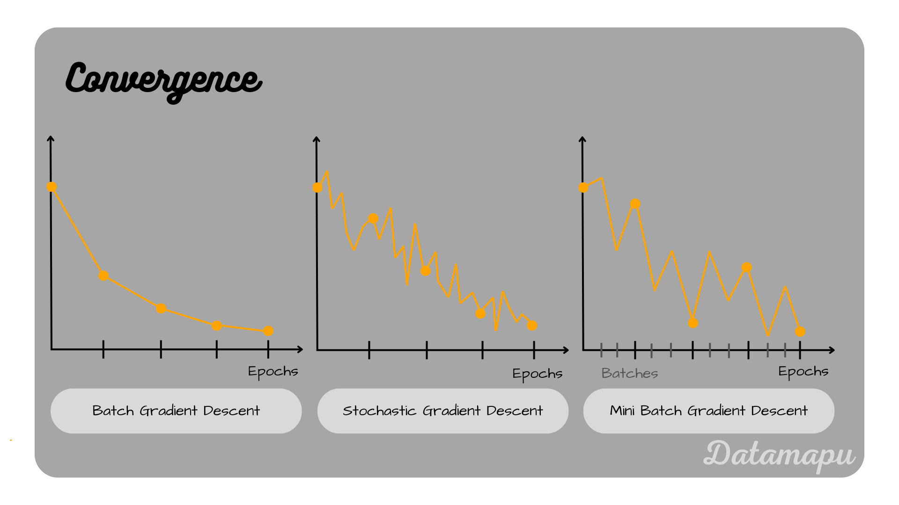

  * **Batch Gradient Descent:** When you plot the cost $J$ against the number of iterations, it should *decrease on every single iteration*. If it ever goes up, something is wrong (like your learning rate $\alpha$ is too high).
  * **Mini-batch Gradient Descent:** The plot is much "noisier". The cost $J^{\{t\}}$ (the cost for mini-batch $t$) might not decrease on every step. This is completely normal.

**Why the noise?** You are calculating the cost on a different "baby" training set (the mini-batch) at each step. Some mini-batches might just be "easier" than others, while some might be "harder" (perhaps containing mislabeled examples), causing the cost to temporarily jump up.

The important thing is that the *overall trend* should be downwards.

**2️⃣ The Spectrum of Mini-batch Sizes**

Your mini-batch size is a hyperparameter, and it has two extremes:

  * **Mini-batch size = $m$ (the full training set):** This is just **Batch Gradient Descent**. You have only one mini-batch ($X^{\{1\}}, Y^{\{1\}}$) which is your entire dataset ($X, Y$).
  * **Mini-batch size = 1:** This is called **Stochastic Gradient Descent (SGD)**. Each example is its own mini-batch. You take a gradient descent step after seeing just *one* example at a time.

**3️⃣ Comparison: Batch vs. SGD vs. Mini-batch**

Each approach has significant pros and cons. The goal of mini-batch is to find the "sweet spot" in between.

| Method | Mini-batch size | Pro | Con |
| :--- | :--- | :--- | :--- |
| **Batch GD** | `size = m` | - Converges smoothly. <br> - Can take large, stable steps. | - **Too long per iteration**. Must process all $m$ examples for one step. |
| **Stochastic GD** | `size = 1` | - Starts making progress immediately. | - **Loses all speed-up from vectorization** (processing one example at a time is very inefficient). <br> - Extremely noisy path. <br> - Never truly "converges"; it just oscillates around the minimum. |
| **Mini-batch GD** | `1 < size < m` | - **Fastest learning** in practice. <br> - **Gains from vectorization** by processing, say, 1000 examples at once. <br> - Makes progress much faster than Batch GD (e.g., 5000 steps per epoch vs. 1). | - Doesn't converge as smoothly as Batch GD. <br> - Adds a new hyperparameter (the size) to tune. |

**4️⃣ How to Choose Your Mini-batch Size**

Here are the practical guidelines from the course:

1.  **Small Training Set ($m \le 2000$):** Just use **Batch Gradient Descent**. There's no need for mini-batches if your dataset is small enough to process quickly.
2.  **Large Training Set:**
      * **Typical Sizes:** Powers of 2 are common: **64, 128, 256, 512**.
      * **Why powers of 2?** Your code may run faster because of how computer memory (CPU/GPU) is laid out and accessed.
      * The size 1024 is also used, but less common.
3.  **Critical Rule:** Make sure your mini-batch ($X^{\{t\}}, Y^{\{t\}}$) **fits in your CPU/GPU memory**. If it doesn't, your performance will suddenly become much worse.

-----
### Key Definitions:
* **$m$**: Total number of training examples (e.g., 5,000,000).
* **$n_x$**: The number of features for each input example.
* **Mini-batch size**: The number of examples in one mini-batch (the lecture uses 1,000 as an example).

### Dimension Comparison: Full Batch vs. Mini-batch

| Matrix | Full Batch Dataset (X, Y) | Single Mini-batch ($X^{\{t\}}, Y^{\{t\}}$) |
| :--- | :--- | :--- |
| **Input Matrix** | $X$: `(n_x, m)` | $X^{\{t\}}$: `(n_x, 1000)` |
| **Output Matrix** | $Y$: `(1, m)` | $Y^{\{t\}}$: `(1, 1000)` |


### Which is better Batch or Mini-Batch Gradient?

You are **correct** in your intuition: a single update from **mini-batch gradient descent is "noisier" and technically "less accurate"** than a single update from batch gradient descent.

Here’s the breakdown:

* **Batch Gradient Descent** calculates the gradient using the *entire* training set. The resulting gradient is the "true" direction of steepest descent for the overall cost function. Think of it as a perfect, carefully calculated step.
* **Mini-batch Gradient Descent** calculates the gradient using only a small subset of the data (e.g., 1,000 examples). This gradient is a "noisier estimate" of the true gradient. It points in the *general* direction of the minimum, but it's not the perfect direction.

### The Trade-off: Speed vs. Precision

The key insight is that **we trade the "perfection" of one step for the ability to take *thousands* of steps in the same amount of time**.

1.  **Massive Speed-up:** While a batch GD step is "perfect," it's incredibly slow. In the time it takes to compute that one perfect step (processing 5 million examples), mini-batch GD has already taken *5,000* "good enough" steps. This allows mini-batch to make much faster progress in the same amount of real-world time.

2.  **Noisy but Effective Path:** The path of mini-batch GD to the minimum is "noisier" and oscillates. However, these oscillations are acceptable because the overall trend moves rapidly toward the minimum.


As seen in the lectures, the cost function plot for batch GD is smooth, while the plot for mini-batch GD is noisy. But that noisy path gets you near the minimum far more quickly.


So, while you're right that one step is less accurate, the *overall algorithm* is much more efficient and is the standard practice for training large neural networks.

---
---
## **Moving Average**

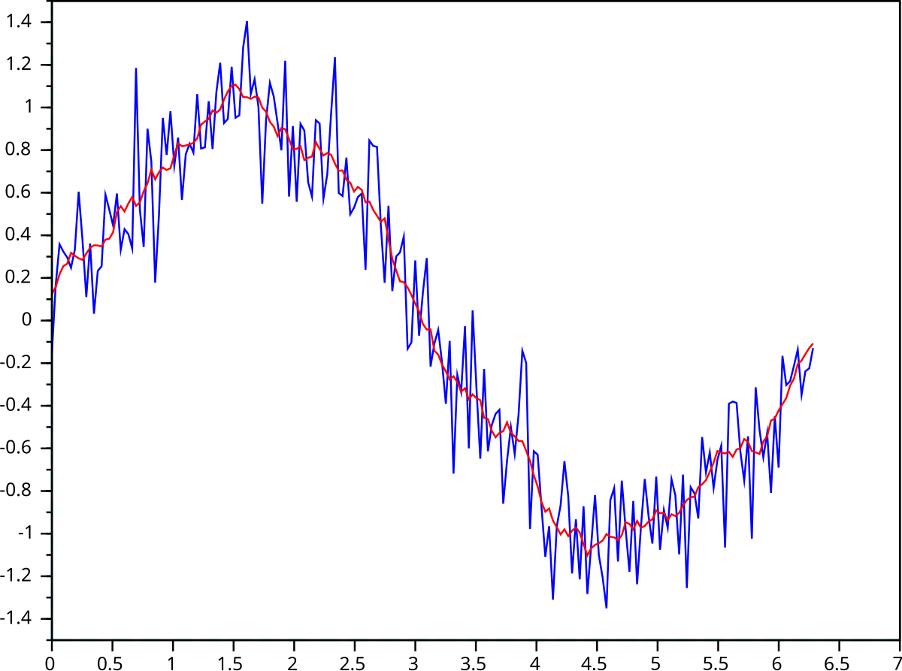

A moving average in mathematics is a statistical method that creates a series of averages from subsets of a larger dataset to smooth out fluctuations and reveal underlying trends. It is calculated by taking a series of data points over a specific time period, adding them, and dividing by the number of periods, then "moving" the calculation forward one period at a time to get a new average. For example, a 10-day moving average would average the closing prices of the first 10 days, then drop the first day's price and add the 11th day's price to calculate the next average. [1, 2, 3, 4, 5, 6]  
How it works 

• Calculate a series of averages: For a fixed number of data points (e.g., 3-day or 10-day), you calculate the average for the first set of points. 

• "Move" the window: You then drop the first data point from the set and add the next one in the series to create a new, overlapping subset. 

• Recalculate the average: You recalculate the average for this new set of points. 

• Repeat: This process is repeated for the entire dataset, creating a new series of averages that are less volatile than the original data. [2, 3, 6, 7, 8]  

Example 
To calculate a 3-day moving average for the values : 

• First average:  
• Second average:  
• Third average:  

---
---
## **Weighted Moving Average**


A **weighted moving average** is a more sophisticated version of a moving average. Instead of giving *equal* importance to all the data points in the window (like the last 10 days), it assigns *different* weights to each data point.

The most common intuition is that **more recent data is more important**.

For example, to calculate today's temperature trend:
* We might give **50%** of the weight to yesterday's temperature.
* **30%** to the day before.
* **20%** to the day before that.

This is different from a *simple* moving average, which would just add all three temperatures and divide by 3 (giving each a 33.3% weight).

### **How it works** 

1. Assign weights: Assign a weight to each data point. The most recent data point receives the highest weight, and older data points receive progressively smaller weights. 

2. Calculate the weighted sum: Multiply each data point by its assigned weight. 

3. Sum the weighted values: Add up all the results from the previous step. 

4. Sum the weights: Add up all the weights you used. 

5. Divide: Divide the sum of the weighted values by the sum of the weights to get the final WMA. [1, 2, 4, 5, 6]  

Example 
• For a 5-period WMA, you would use the following formula: 

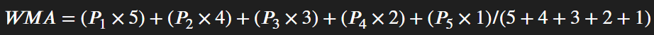

• Where  is the current price,  is the price from one period ago, and so on. 

### ***Common uses*** 

• Financial analysis: Used to smooth out data and identify trends or potential reversals in financial markets. 
• Forecasting: Used as a time series technique to predict future values based on recent data. [1, 3, 7]  


---
---

# **📈 Exponentially Weighted Averages**

This concept is a **key building block** for advanced optimization algorithms like **Momentum** and **Adam**.

The core idea is to compute a *“moving average”* of your parameters (like gradients) efficiently — giving more importance to **recent** values while still remembering the **past**.

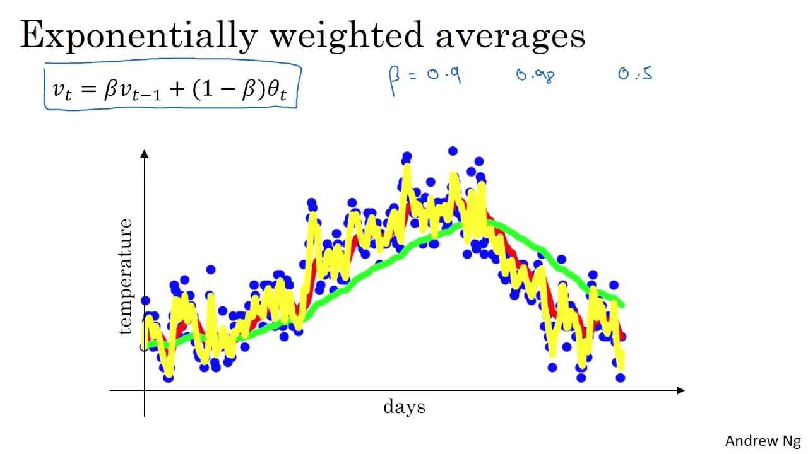

$ \beta  = 0.9--> Red \\
  \beta  = 0.98--> Green \\
  \beta  = 0.5--> Yellow
$
---

## 1️⃣ The Core Idea: Averaging Temperatures

Let’s use the **London temperature example** from the course.

You have daily temperatures, $( \theta_t ) (e.g., ( \theta_1 = 40 ), ( \theta_2 = 49 ), ...).$
We want to compute a smoothed trend (a moving average), $( v_t )$.

We initialize $( v_0 = 0 )$, and for each day:

$$
v_t = \beta \cdot v_{t-1} + (1 - \beta) \cdot \theta_t
$$

Where:

* $( v_{t-1} )$: average from the previous day
* $( \theta_t )$: today’s actual temperature
* $( \beta )$: hyperparameter controlling how much “memory” the average has

**Example (with ( \beta = 0.9 )):**
$$
\begin{aligned}
v_1 &= 0.9 \cdot v_0 + 0.1 \cdot \theta_1 = 0.1 \cdot \theta_1 \\
v_2 &= 0.9 \cdot v_1 + 0.1 \cdot \theta_2 \\
v_3 &= 0.9 \cdot v_2 + 0.1 \cdot \theta_3
\end{aligned}
$$

...and so on.

---

## 2️⃣ The Hyperparameter $( \beta )$: Controlling the Window

The value of ( \beta ) determines how many days of data you’re effectively averaging over.
This is roughly approximated by:

$$
\text{Effective Average Days} \approx \frac{1}{1 - \beta}
$$

| $( \beta )$ | Approx. Days $( \left(\frac{1}{1 - \beta}\right) )$ | Behavior                                            |
| :-------- | :------------------------------------------------ | :-------------------------------------------------- |
| **0.9**   | 10 days                                           | 🟥 *Balanced trend* — adapts fairly quickly         |
| **0.98**  | 50 days                                           | 🟩 *Very smooth* — slower to react (“more inertia”) |
| **0.5**   | 2 days                                            | 🟨 *Noisy* — reacts instantly to new data           |

---

## 3️⃣ Implementation (Efficient & Low-Memory)

The beauty of this method is that it’s **efficient** — you don’t need to store all previous data points.
You just keep a single number $( v )$ and update it each time.

```python
# Initialize
v_theta = 0

# Loop through each day (or iteration)
for t in range(1, num_days + 1):
    # Get current temperature
    theta_t = get_temperature(t)
    
    # Update the exponentially weighted average
    v_theta = (beta * v_theta) + ((1 - beta) * theta_t)
```
---


---
## 🧭 Why It Matters

This **exponentially weighted average** technique smooths out noisy data — whether it’s temperatures, losses, or gradients.

It forms the foundation of **Momentum** and **Adam Optimizer**, where we apply the same logic to gradients to achieve **faster, more stable convergence**.

---

### 🧠 **Understanding EWMA: The Intuition**

The core formula is:
$$v_t = \beta \cdot v_{t-1} + (1 - \beta) \cdot \theta_t$$

The lecture answers two key questions about this formula:
1.  How is this an "average"? It doesn't look like adding things up and dividing.
2.  Where does the "averaging over 10 days" rule come from?

### 1. How This Formula Becomes an "Average"


The lecture shows that if you "unroll" this formula, it's actually just a clever way of summing up all past values, where the **most recent values have the highest "weight" (importance)**.

Let's use the lecture's example: $\beta = 0.9$. The formula becomes:
$v_t = 0.9 \cdot v_{t-1} + 0.1 \cdot \theta_t$

Now, let's see what $v_{100}$ (the average at day 100) is *really* made of:

* $v_{100} = \mathbf{0.1} \cdot \theta_{100} + 0.9 \cdot v_{99}$
* ...but $v_{99} = \mathbf{0.1} \cdot \theta_{99} + 0.9 \cdot v_{98}$
* ...and $v_{98} = \mathbf{0.1} \cdot \theta_{98} + 0.9 \cdot v_{97}$

If you substitute $v_{99}$ into the first equation, and then $v_{98}$ into that, and so on, you get this expansion:

$v_{100} = (\mathbf{0.1} \cdot \theta_{100}) + (\mathbf{0.1} \cdot 0.9 \cdot \theta_{99}) + (\mathbf{0.1} \cdot 0.9^2 \cdot \theta_{98}) + (\mathbf{0.1} \cdot 0.9^3 \cdot \theta_{97}) + ...$

This formula looks complicated, but look at the weights it assigns to each day's temperature:

* **Today (Day 100):** Weight is $0.1$
* **Yesterday (Day 99):** Weight is $0.09$
* **(Day 98):** Weight is $0.081$
* **(Day 97):** Weight is $0.073$
* ...and so on.

This is an **"average"** because it's a weighted sum of all past temperatures. It's called **"exponentially decaying"** because the weight given to each day *decreases exponentially* the further back in time you go.


### 2. Where the "10-day" Rule of Thumb Comes From

So, why do we say $\beta = 0.9$ is "like averaging over 10 days"?

This is an approximation. We're asking: **"How long does it take for the weight to become insignificant?"**

The lecture defines "insignificant" as decaying to about **1/3** (or, more precisely, $1/e \approx 37\%$) of the current day's weight.

* If $\beta = 0.9$, we're looking at the term $(0.9)^t$.
* It turns out that $(0.9)^{10} \approx 0.35$.
* So, after **10 days**, the weight given to that day's temperature has dropped to about 1/3 of the starting weight. This is where the 10-day "memory" idea comes from.

This gives us the general rule of thumb:

**Approx. Days to Average Over $\approx \frac{1}{1-\beta}$**

* **If $\beta = 0.9$:** $1 / (1 - 0.9) = 1 / 0.1 = \mathbf{10}$ days
* **If $\beta = 0.98$:** $1 / (1 - 0.98) = 1 / 0.02 = \mathbf{50}$ days

### Summary: 

1.  **It's an Average:** The formula $v_t = \beta v_{t-1} + (1 - \beta)\theta_t$ is a weighted average that gives the most importance to the most recent data.
2.  **It's Exponentially Decaying:** The importance (weight) of old data fades away exponentially.
3.  **It's a Rule of Thumb:** The $\frac{1}{1-\beta}$ formula is a just good approximation for the "memory" of the average.
4.  **It's Efficient:** The main reason we use this is that it's *extremely* easy and cheap to compute. You only need to store *one* number in memory (the latest average, $v$) and update it, rather than storing the last 10 days of data.

---
## **Bias Correction**

**1️⃣ The Problem: A Bad Start**

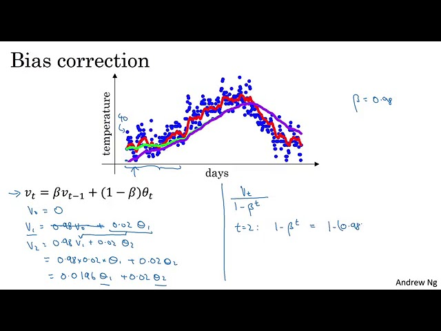

The exponentially weighted average formula starts with an initialization of $v_0 = 0$. Because of this, the first few estimates are "biased" and are much lower than they should be.

Let's use the lecture's example where $\beta = 0.98$. The formula is $v_t = 0.98 \cdot v_{t-1} + 0.02 \cdot \theta_t$.

* **On Day 1:** $v_1 = 0.98 \cdot v_0 + 0.02 \cdot \theta_1 = 0.02 \cdot \theta_1$.
  If the first day's temperature $\theta_1$ is 40°F, $v_1$ is only $0.8$. This is a terrible estimate.
* **On Day 2:** $v_2 = 0.98 \cdot v_1 + 0.02 \cdot \theta_2 = 0.98 \cdot (0.02 \cdot \theta_1) + 0.02 \cdot \theta_2 = 0.0196 \cdot \theta_1 + 0.02 \cdot \theta_2$.
  Again, this value will be very low, nowhere near the actual temperatures.

In the lecture's graph, this problem is shown as the **purple line**, which starts at 0 and takes a long time to "warm up" and catch the real average (the green line).


**2️⃣ The Solution: Correcting the Bias**

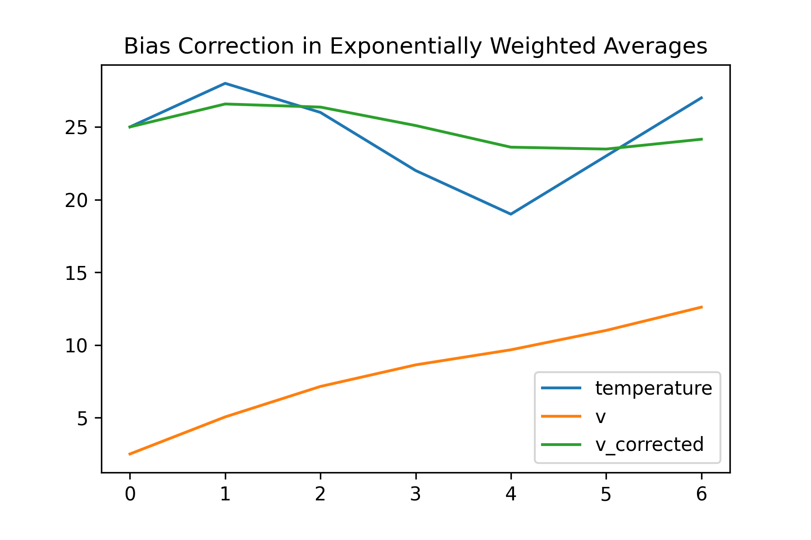

We can fix this "warm-up" bias by scaling our estimate, $v_t$. The fix is to use this formula:

$$
v_t^{\text{corrected}} = \frac{v_t}{1 - \beta^t}
$$

Where $t$ is the current iteration or day number.

**3️⃣ How It Works (Example)**

Let's see how this fixes the estimate for Day 2 ($t=2$):

* $v_2^{\text{corrected}} = \frac{v_2}{1 - (0.98)^2}$
* We know $v_2 = 0.0196 \cdot \theta_1 + 0.02 \cdot \theta_2$
* And $1 - (0.98)^2 = 0.0396$
* So, $v_2^{\text{corrected}} = \frac{0.0196 \cdot \theta_1 + 0.02 \cdot \theta_2}{0.0396}$

This new value is a proper weighted average of $\theta_1$ and $\theta_2$, and it's a much more accurate estimate of the temperature for the first two days.

**4️⃣ When to Use It**

This correction is most important during the initial "warm-up" phase of the algorithm.

As $t$ gets larger (e.g., after 50 iterations), the $\beta^t$ term in the denominator becomes extremely small and approaches 0. When that happens, $1 - \beta^t$ just becomes 1, and the correction automatically "fades away".

In practice, for most machine learning applications, many people don't bother with this correction because they are willing to wait for the average to "warm up". However, in the **Adam optimization algorithm**, which we'll see soon, bias correction *is* an important part of the standard implementation.

---
---

# 💨 **Gradient Descent with Momentum**

**1️⃣ The Problem: Oscillations in a "Canyon"**

When using standard mini-batch gradient descent, the path to the minimum can be very "noisy."

The course uses the analogy of a "canyon" or "bowl". Your algorithm is trying to find the bottom of the canyon (the minimum).
* **Horizontal direction ($W$):** This is the direction you *want* to go (towards the red dot). Progress here is slow but steady.
* **Vertical direction ($b$):** This direction is like the steep walls of the canyon. The gradient is high, causing your algorithm to "oscillate" or bounce back and forth between the walls.


These oscillations are a big problem. They slow you down and force you to use a small learning rate ($\alpha$). If $\alpha$ is too big, the oscillations will get worse and your algorithm will "explode" or diverge.

**2️⃣ The Core Idea: Averaging the Steps**

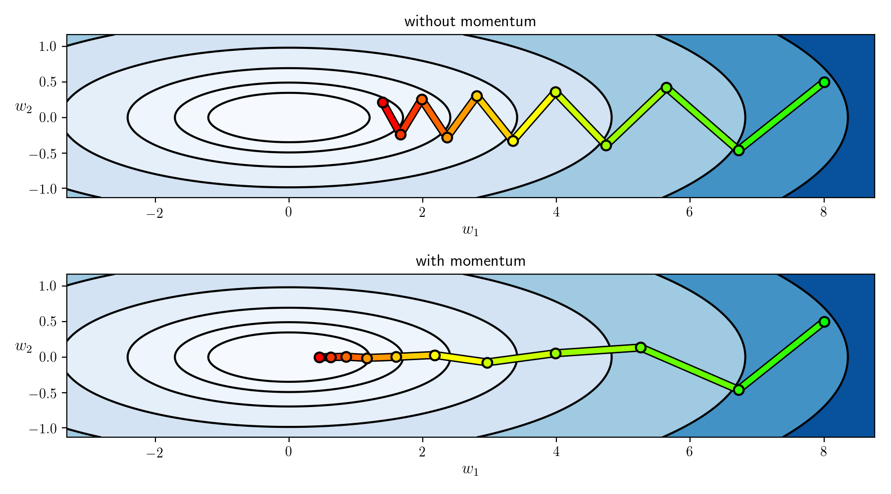

Momentum solves this problem by **smoothing out the gradients**. Instead of using the raw gradient from the current mini-batch, you compute an **exponentially weighted average** of the last few gradients.

* **Vertical Oscillations:** The gradients in the vertical direction are positive, then negative, then positive... When you average them, they **cancel each other out**, approaching zero.
* **Horizontal Progress:** The gradients in the horizontal direction are *all* pointing towards the minimum. When you average them, they remain strong and positive.

This "smoothed" gradient allows the algorithm to damp out the oscillations and move more confidently and quickly toward the minimum.


**The "Bowling Ball" Analogy**
The lecture provides a great analogy:
* Think of your gradients ($dW, db$) as "acceleration".
* Think of the moving average ($v_{dW}, v_{db}$) as "velocity".
* Standard GD is like a ball that stops and re-calculates its acceleration at every step.
* Momentum is like a **heavy bowling ball** rolling down the hill. It builds up velocity (momentum) and plows past the small vertical bumps, accelerating faster and faster towards the bottom.

**3️⃣ The Algorithm**

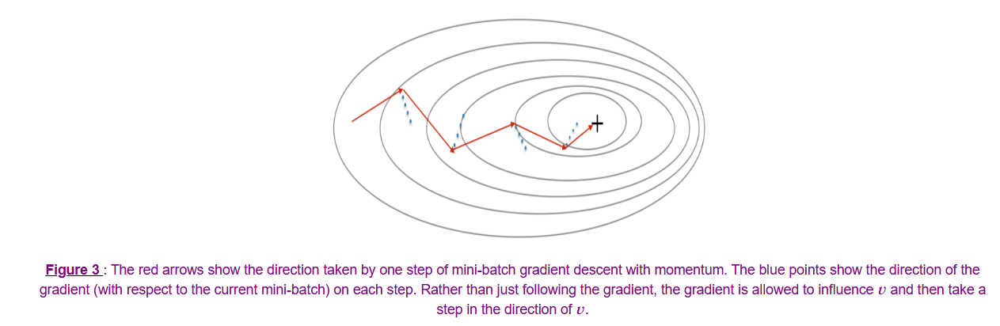

On each iteration $t$ (for the current mini-batch):

1.  Compute the current gradients: $dW, db$.
2.  Compute the "velocity" using the moving average:
    $$
    v_{dW} = \beta \cdot v_{dW} + (1 - \beta) \cdot dW
    $$
    $$
    v_{db} = \beta \cdot v_{db} + (1 - \beta) \cdot db
    $$
   
3.  Update the parameters using the **velocity**, not the gradient:
    $$
    W = W - \alpha \cdot v_{dW}
    $$
    $$
    b = b - \alpha \cdot v_{db}
    $$
   

**4️⃣ Implementation Details & Hyperparameters**

This algorithm introduces one new hyperparameter, $\beta$.

| Hyperparameter | What it is | Typical Value |
| :--- | :--- | :--- |
| **$\alpha$** | The learning rate. | Still needs to be tuned. |
| **$\beta$** | The momentum parameter (controls the average). | **0.9** is the most common and robust value. This means you are averaging over the last 10 gradients. |

* **Initialization:** You must initialize the velocity terms to zero: $v_{dW} = 0$, $v_{db} = 0$.
* **Bias Correction:** In practice, people **do not** typically use bias correction for Momentum. The average "warms up" and is no longer biased after just ~10 iterations, so it's not considered a problem.

* The dimensions of `vdW` and `vdB` must be **exactly the same** as the dimensions of your gradients `dW` and `db` (which in turn are the same dimensions as your parameters `W` and `b`).

  This is because the update calculation is an element-wise operation.

For a specific layer $l$:
* If $W^{[l]}$ and $dW^{[l]}$ have the dimension `(n_[l], n_[l-1])`, then $v_{dW}^{[l]}$ must also have the dimension `(n_[l], n_[l-1])`.
* If $b^{[l]}$ and $db^{[l]}$ have the dimension `(n_[l], 1)`, then $v_{db}^{[l]}$ must also have the dimension `(n_[l], 1)`.


---

We've covered how Momentum *accelerates* in the correct direction. The next algorithm, **RMSprop**, takes a different approach to solving the oscillation problem: it tries to *slow down* learning in the directions that are oscillating.

Would you like to cover RMSprop next?
---

🧠 **Deeper Dive: The "Other" Momentum Formula**
> You will often see a different version of Momentum in papers and online, which omits the $(1-\beta)$ term:
> $$v_{dW} = \beta \cdot v_{dW} + dW$$
> This version also works, but it's less intuitive. It scales $v_{dW}$ by a factor of $\frac{1}{1-\beta}$, which means your learning rate $\alpha$ will need to be tuned to a different value to compensate. The version taught in the course is cleaner because $\alpha$ and $\beta$ are more independent.

---
## ❓**Question-**  so what is the core intuituin of this why we need this is this specifically die to use of mini-batches we dont have this oscillations porblem in batch gradient descent right? and if we have to solve this oscillations problem using a extra step(calculating wights moving average of wights to smooth the the updation curve or descent curve) is'nt just the batch gradient descent will be better and faster ? 

That is a *fantastic* set of questions, and you've hit on the absolute core of the trade-offs.

Let's break down your points one by one.

### 1. "we dont have this oscillations problem in batch gradient descent right?"

**You still do!** This is the key insight. The "canyon" (or "bowl") shape that causes oscillations is a property of your **cost function's landscape**, not just the algorithm.

If your parameters have different scales (e.g., $w_1$ has a huge effect and $w_2$ has a tiny one), your cost function will look like a long, narrow valley, regardless of which algorithm you use.


Batch Gradient Descent will *also* oscillate in this canyon, as its "perfect" gradient step still points more towards the steep walls than towards the actual minimum.

### 2. "is this specifically due to use of mini-batches"

**Mini-batches make this oscillation problem *worse***. You are 100% correct about this. Mini-batch gradient descent has **two** sources of oscillation:
1.  **The "Canyon" Landscape:** The problem Batch GD also has.
2.  **The "Mini-batch Noise":** The problem you identified. Each mini-batch gives a *different, noisy* estimate of the gradient, causing it to bounce around even more.

### 3. "is'nt just the batch gradient descent will be better and faster ?"

This is the most important question. The answer is **no, it is dramatically slower.**

* **The Problem:** Batch GD is **unusable on large datasets**. You are confusing the "complexity" of an algorithm with its "real-world speed."
* **The "Extra Step" is Tiny:** The "extra step" of calculating the moving average (Momentum) is just one line of code. It adds almost zero computational time.
* **The Real Cost:**
    * **Batch GD** must process all **5 million examples** just to take *one* step.
    * **Mini-batch GD** processes **1,000 examples** to take *one* step. It is **5,000 times faster** at making progress.

The *true* benefit of Momentum is that it **allows you to use a much larger learning rate ($\alpha$)**.

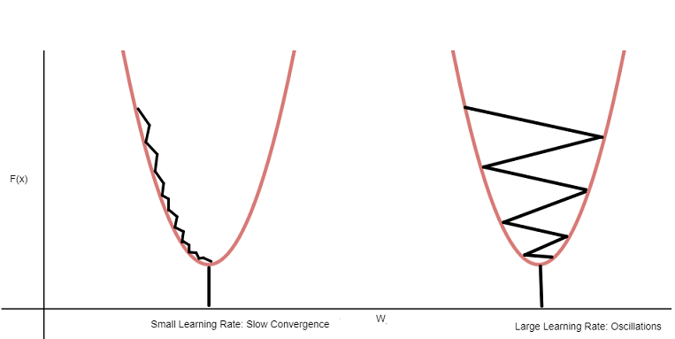

* In standard Mini-batch GD, you're forced to use a *small* $\alpha$ to prevent the oscillations from exploding.
* In Momentum, the oscillations are averaged out and damped. Since the path is now smooth, you can safely **increase $\alpha$** and take much bigger steps toward the minimum.

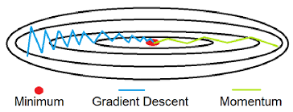

Here is the comparison that matters:

| Algorithm | Speed per Step | Path to Minimum | Key Benefit / Drawback |
| :--- | :--- | :--- | :--- |
| **Batch GD** | **Extremely Slow** (Processes all *m* examples) | Smooth (but still oscillates in a "canyon") | **Drawback:** Unusably slow for big data. |
| **Mini-Batch GD** | **Fast** (Processes e.g. 1000 examples) | **Very Noisy** (Canyon + mini-batch noise) | **Drawback:** Noise forces you to use a *small $\alpha$* to avoid diverging. |
| **Mini-Batch + Momentum** | **Fast** (Same as Mini-Batch) | **Smooth** (Averages out the noise) | **Benefit:** Lets you use a *larger $\alpha$* and converge in **far fewer epochs**. |

**Conclusion:** Momentum is not an "extra step" that slows things down. It is an **"accelerator"** that makes the existing fast steps *smarter*, allowing you to take bigger leaps and converge much, much faster.

---
# 📉 **RMSprop (Root Mean Square Prop)**

This algorithm is another clever solution to the "canyon" oscillation problem. While Momentum's strategy is to *accelerate* in the correct direction, RMSprop's strategy is to *dampen* the oscillations in the incorrect direction.

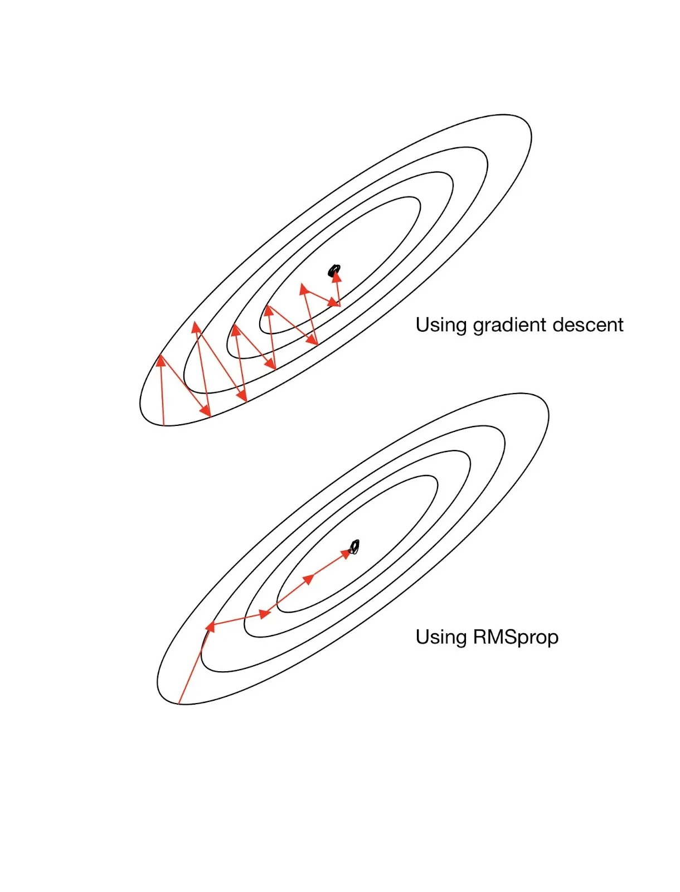

---

**1️⃣ The Core Idea: Adaptive Damping**

Let's return to the "canyon" analogy.
* **Vertical direction ($b$):** The gradient $db$ is *large*, causing big oscillations. We want to **slow down** learning in this direction.
* **Horizontal direction ($W$):** The gradient $dW$ is *small*, causing slow progress. We want to **speed up** (or at least not slow down) learning in this direction.

RMSprop accomplishes this by dividing the learning rate by an average of the *magnitude* of the recent gradients.

**2️⃣ The Intuition: How it Works**

1.  To get the magnitude (and ignore the sign), the algorithm **squares** the gradients. $dW^2$ will be a *small* number, and $db^2$ will be a *large* number.
2.  It then keeps an **exponentially weighted average** of these squared values (this is the "mean square" part). Let's call these averages $S_{dW}$ and $S_{db}$.
    * $S_{dW}$ (horizontal) will be an average of small numbers, so it will be **small**.
    * $S_{db}$ (vertical) will be an average of large numbers, so it will be **large**.
3.  In the update step, it divides the gradient by the **square root** of this average (this is the "root" part).

    * **Horizontal Update (W):**
        $W = W - \alpha \frac{dW}{\sqrt{S_{dW}}}$
        You are dividing by a *small* number ($\sqrt{S_{dW}}$), which makes the overall step **larger**.

    * **Vertical Update (b):**
        $b = b - \alpha \frac{db}{\sqrt{S_{db}}}$
        You are dividing by a *large* number ($\sqrt{S_{db}}$), which makes the overall step **smaller**.

This has the exact effect we want! It damps the oscillations (vertical) and accelerates progress (horizontal), allowing you to use a larger learning rate $\alpha$.

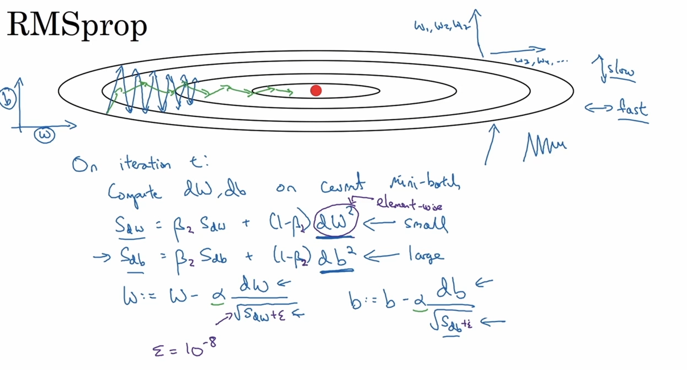

**3️⃣ The Algorithm**

On each iteration $t$ (for the current mini-batch):

1.  Compute the current gradients: $dW, db$.
2.  Compute the moving average of the *squares* of the gradients (using a new hyperparameter, $\beta_2$):
    $$
    S_{dW} = \beta_2 S_{dW} + (1 - \beta_2) (dW)^2 \quad \text{(element-wise square)}
    $$
    $$
    S_{db} = \beta_2 S_{db} + (1 - \beta_2) (db)^2 \quad \text{(element-wise square)}
    $$
3.  Update the parameters, dividing by the root of $S$ and adding a small $\epsilon$ for numerical stability:
    $$
    W = W - \alpha \frac{dW}{\sqrt{S_{dW} + \epsilon}}
    $$
    $$
    b = b - \alpha \frac{db}{\sqrt{S_{db} + \epsilon}}
    $$
   

**4️⃣ Hyperparameters**

| Hyperparameter | What it is | Typical Value |
| :--- | :--- | :--- |
| **$\alpha$** | The learning rate. | Still needs to be tuned. |
| **$\beta_2$** | The averaging parameter for the squares. | Common values are 0.9 or 0.999. |
| **$\epsilon$** | A tiny number to prevent division by zero. | **$10^{-8}$**. You don't need to tune this. |

---

🧠 **Deeper Dive: Fun Fact**
> RMSprop is a widely used algorithm, but it wasn't first published in a research paper. It was actually proposed by **Geoff Hinton** in a Coursera course lecture, long before this one!

---

So far, we have two powerful algorithms:
1.  **Momentum:** Cares about the *direction* of the gradient (builds velocity).
2.  **RMSprop:** Cares about the *magnitude* of the gradient (damps oscillations).

---

### ❓**Questions-**  but momentum also dampens the vertical direction oscillations right? and and by using the moving average for updatation rather the the actual gradient it prevents gradients from moving too much up or down but how does it provides acceleration? and if rmsprop also dampens to oscillations how it is different from momemtum?

**Answer:**
 You are asking the *perfect* questions. This is the most important distinction to understand, and you are absolutely right that Momentum also dampens oscillations.

The key is that they dampen *for different reasons* and have different side effects.

Let's clarify this.

### How Momentum Provides Acceleration

You are correct that Momentum dampens the up-and-down (vertical) oscillations. It does this because the vertical gradients are `+100`, then `-100`, then `+100`, and the **moving average of these opposing directions cancels out** towards zero.

The **acceleration** comes from the *horizontal* direction (the one you *want* to move in). In this direction, the gradients are *all* pointing the same way, for example: `+10`, `+12`, `+8`.

  * When you take a moving average of `+10`, `+12`, `+8`, they **do not** cancel out.
  * Instead, they **accumulate**, building up a large, positive "velocity" ($v_{dW}$) that gets bigger and bigger.

This is the "bowling ball" analogy from the lecture: the ball builds up speed (momentum/velocity) as it's consistently pushed in the same direction, letting it roll "faster" along the bottom of the canyon.

### How RMSprop is Different from Momentum

This is the key. They solve the same oscillation problem but with *completely different strategies*.

| Feature | 💨 **Momentum** | 📉 **RMSprop** |
| :--- | :--- | :--- |
| **Core Idea** | Builds "velocity" ($v_{dW}$). | Creates an "adaptive brake" ($S_{dW}$). |
| **How it Dampens** | **Averages Directions.**<br> It sees `+100` then `-100`. It averages them, and they **cancel out** to 0. | **Divides by Magnitude.**<br> It sees `(+100)^2` then `(-100)^2`. It averages them to `10000` (a *huge* number) and **divides the step by $\sqrt{10000}$** (making it tiny). |
| **How it Accelerates** | **Averages Directions.**<br> It sees `+10`, `+12`, `+8`. They **accumulate** into a large average velocity. | **Divides by Magnitude.**<br> It sees `(+10)^2`, `(+12)^2`, `(+8)^2`. It averages them to `~100` (a *small* number) and **divides the step by $\sqrt{100}$** (making it relatively larger). |
| **Looks at...** | The **sign** (direction) of the gradient. | The **square** (magnitude) of the gradient. |

**Analogy: Driving a Car in a Canyon**

Think of your algorithm as a car. The "canyon" has steep walls (vertical) and a long, gentle slope (horizontal).

  * **Momentum** is like driving a **very heavy car (like a train)**.

      * **Damping:** When it hits the canyon wall and bounces to the other wall, its own heavy inertia (velocity) resists the quick, jerky up-and-down motion. The oscillations are *smoothed out*.
      * **Acceleration:** Once it's pointed down the *long, straight* part of the canyon, it builds up more and more speed and is hard to stop.

  * **RMSprop** is like driving a **high-tech car with adaptive brakes**.

      * **Damping:** The car's sensors *detect* a very steep gradient (the canyon wall). It **slams on the brakes** for that direction (divides by a *large* $S_{db}$) to prevent a hard jolt.
      * **Acceleration:** The car's sensors *detect* a very gentle, flat road (the bottom of the canyon). It **releases the brakes** for that direction (divides by a *small* $S_{dW}$) to let the car move more freely.

**Summary:**

  * **Momentum** averages gradients to build *velocity* (damping is a side effect of averaging opposing directions).
  * **RMSprop** averages *squared* gradients to build an *adaptive brake* (damping is the primary goal).

This is why the next algorithm, **Adam**, is so powerful. It **combines** the "heavy car" (Momentum) with the "smart brakes" (RMSprop) to create the best of both worlds.

### ❓ **Question-** in rmsprop optimization algo how it decides which parameter to damp and which to boost? i mean if we take the course intuition we want to damp the vertical oscillations that is db and boost the horizontal oscillations that is dW but how it decides which to dam p and which to boost what if it damps the dW and boost the db?

**Anwser:**
 This is the most critical question about RMSprop, and it's a brilliant one.

The algorithm doesn't "decide" or "know" which parameter is $W$ and which is $b$. It's not a human, it's an automatic formula.

It "decides" based purely on one thing: **the historical magnitude of the gradient for that *specific* parameter.**

Here is the mechanism:

1.  **The Situation:** In the "canyon" example, your cost function is very steep in the vertical direction ($b$) and very flat in the horizontal direction ($W$).
2.  **Observation:** Because of this shape, the gradients you compute will *always* have large values for $b$ and small values for $W$.
    * `db` (vertical) will be a *large number* (e.g., +100, -90, +110).
    * `dW` (horizontal) will be a *small number* (e.g., +1, +2, +1.5).
3.  **The RMSprop Step:** The algorithm squares these values and keeps a moving average.
    * $S_{db} = \beta S_{db} + (1-\beta)(db)^2$. This will be an average of *large numbers* (e.g., 10000, 8100, 12100). So, $S_{db}$ becomes a **large number**.
    * $S_{dW} = \beta S_{dW} + (1-\beta)(dW)^2$. This will be an average of *small numbers* (e.g., 1, 4, 2.25). So, $S_{dW}$ becomes a **small number**.
4.  **The "Decision" (The Update):**
    * **For b:** $b = b - \alpha \frac{db}{\sqrt{S_{db}}}$. Since $S_{db}$ is **large**, you are dividing by a large number, which makes the update step **small**. This *damps* the oscillation.
    * **For W:** $W = W - \alpha \frac{dW}{\sqrt{S_{dW}}}$. Since $S_{dW}$ is **small**, you are dividing by a small number, which makes the update step **large**. This *boosts* the progress.

### "What if it damps the dW and boosts the db?"

**It can't.** It's mathematically impossible in this scenario.

The algorithm will *always* damp the parameter with the larger gradients ($db$) and *always* boost the parameter with the smaller gradients ($dW$). The damping is a *direct, automatic consequence* of the gradient's magnitude.


The algorithm is automatic. It will *always* damp directions with large gradients (steep slopes) and *always* boost directions with small gradients (flat slopes). This is precisely why it works.

Here is a table of the logic:

| Scenario | Gradient Value ($dW$) | Slope in Canyon | $S_{dW}$ (The Average) | Update Step $\frac{dW}{\sqrt{S_{dW}}}$ | Action Taken |
| :--- | :--- | :--- | :--- | :--- | :--- |
| **Oscillation** | Large | Steep (Bad) | Becomes Large | $\frac{\text{Large}}{\text{Large}}$ = Small | **Damped** (Good) |
| **Slow Progress** | Small | Flat (Good) | Becomes Small | $\frac{\text{Small}}{\text{Small}}$ = Large | **Boosted** (Good) |


### The Real Magic: It's Element-Wise

The $W$ and $b$ example is just an intuition-builder. In a real neural network, $W$ is a *massive matrix*, not one number.

The *true power* of RMSprop is that it does this calculation **element-wise** for every single parameter in your network.

* It might find that the weight $W^{[l]}_{5, 10}$ (row 5, col 10 of the matrix) is oscillating. Because its personal gradient $dW^{[l]}_{5, 10}$ is large, its personal $S_{dW[5,10]}$ will become large, and *it* will be damped.
* Meanwhile, it might find that $W^{[l]}_{20, 3}$ is learning very slowly. Because its gradient $dW^{[l]}_{20, 3}$ is small, its $S_{dW[20,3]}$ will be small, and *it* will be boosted.

It's not "damping $W$" and "boosting $b$". It's an adaptive "brake" that is applied *independently* to *every single weight* in your network, based on its own personal gradient history.

---
# 🏆 **Adam (Adaptive Moment Estimation) Algorithm**

**Adam** is arguably the most effective and widely used optimization algorithm in deep learning today. The reason it's so successful is that it **combines the best of both Momentum and RMSprop**.

---


**1️⃣ The Core Idea: Momentum + RMSprop**

Adam takes the two strategies we just discussed and does both of them at the same time:
1.  **Momentum:** It keeps an exponentially weighted average of the gradients (the "first moment," or **mean**) to build up velocity in the correct direction. We'll call this $v_{dW}$.
2.  **RMSprop:** It keeps an exponentially weighted average of the *squares* of the gradients (the "second moment") to create an adaptive brake that damps oscillations. We'll call this $S_{dW}$.

It then uses *both* $v_{dW}$ (the velocity) and $S_{dW}$ (the brake) in its update rule to get the best of both worlds.

**2️⃣ The Algorithm**

On each iteration $t$ (for the current mini-batch):

1.  **Initialize:** $v_{dW}=0, v_{db}=0, S_{dW}=0, S_{db}=0$.
2.  **Get Gradients:** Compute $dW, db$ on the current mini-batch.
3.  **Momentum "Velocity" Update (First Moment):**
    $$
    v_{dW} = \beta_1 v_{dW} + (1 - \beta_1) dW
    $$
    $$
    v_{db} = \beta_1 v_{db} + (1 - \beta_1) db
    $$
   
4.  **RMSprop "Brake" Update (Second Moment):**
    $$
    S_{dW} = \beta_2 S_{dW} + (1 - \beta_2) (dW)^2
    $$
    $$
    S_{db} = \beta_2 S_{db} + (1 - \beta_2) (db)^2
    $$
   
5.  **Apply Bias Correction (Crucial for Adam):**
    $$
    v_{dW}^{\text{corrected}} = \frac{v_{dW}}{1 - \beta_1^t}
    $$
    $$
    v_{db}^{\text{corrected}} = \frac{v_{db}}{1 - \beta_1^t}
    $$
    $$
    S_{dW}^{\text{corrected}} = \frac{S_{dW}}{1 - \beta_2^t}
    $$
    $$
    S_{db}^{\text{corrected}} = \frac{S_{db}}{1 - \beta_2^t}
    $$
   
6.  **Final Parameter Update:**
    This step looks just like RMSprop, but it uses the *velocity* $v^{\text{corrected}}$ in the numerator instead of the raw gradient $dW$.
    $$
    W = W - \alpha \frac{v_{dW}^{\text{corrected}}}{\sqrt{S_{dW}^{\text{corrected}} + \epsilon}}
    $$
    $$
    b = b - \alpha \frac{v_{db}^{\text{corrected}}}{\sqrt{S_{db}^{\text{corrected}} + \epsilon}}
    $$
   

**3️⃣ Hyperparameter Choices**

This algorithm has several hyperparameters, but the authors of the Adam paper provided strong "default" values that work well for most problems.

| Hyperparameter | What it is | Recommended Value |
| :--- | :--- | :--- |
| **$\alpha$** | The learning rate. | **Needs to be tuned**. |
| **$\beta_1$** | The Momentum parameter (for $v$). | **0.9** |
| **$\beta_2$** | The RMSprop parameter (for $S$). | **0.999** |
| **$\epsilon$** | For numerical stability. | **$10^{-8}$** (not tuned) |

In practice, you almost always just use the default values for $\beta_1$, $\beta_2$, and $\epsilon$, and only experiment with tuning the learning rate $\alpha$.

---
---
# 📉 **Learning Rate Decay**

This is a technique used to help your model converge more precisely at the end of training.

**1️⃣ The Problem: Oscillating Around the Minimum**


When you use mini-batch gradient descent with a fixed learning rate $\alpha$, your algorithm takes "noisy" steps.

As you get close to the minimum, these noisy steps will cause the algorithm to "wander" or **oscillate in a region *around* the minimum**, but it will never perfectly converge. This is because your step size (alpha) is fixed and is now too large to "settle" into the precise bottom of the bowl.


**2️⃣ The Core Idea: Taking Smaller Steps Over Time**

Learning rate decay solves this problem by **slowly reducing the learning rate $\alpha$ over time**.


In the above fig. Green is slowly decaying and converging in tighter region while the blue one without decay wanders around and not able to converge correctly.
The intuition is:
* **At the beginning:** You can afford to take large steps (a large $\alpha$) to make fast progress toward the minimum.
* **At the end:** As you get closer to the minimum, you need to take smaller and smaller steps to find the precise bottom. By "decaying" $\alpha$, your algorithm can settle into a much tighter region around the minimum.

**3️⃣ How to Implement Learning Rate Decay**

You typically decay the learning rate once per **epoch** (one full pass through the training data). Here are several common formulas:

| Decay Method | Formula | Description |
| :--- | :--- | :--- |
| **Standard Decay** | $\alpha = \frac{1}{1 + \text{decay\_rate} \cdot \text{epoch\_num}} \cdot \alpha_0$ | This is the most common formula, where `decay_rate` is a new hyperparameter to tune. |
| **Exponential Decay** | $\alpha = (0.95)^{\text{epoch\_num}} \cdot \alpha_0$ | The learning rate decays exponentially. |
| **Square Root Decay** | $\alpha = \frac{k}{\sqrt{\text{epoch\_num}}} \cdot \alpha_0$ | The learning rate decays proportional to the square root of the epoch number. |
| **Discrete Staircase** | (Manual) | You keep $\alpha$ constant for a while, then manually drop it by half, then another half, etc., after a certain number of epochs. |
| **Manual Decay** | (Manual) | If you are only training a few models, you can literally watch the training and manually reduce $\alpha$ when you see learning slow down. |

* $\alpha_0$ is your initial learning rate (a hyperparameter).
* `decay_rate` and $k$ are new hyperparameters.

**4️⃣ Practical Advice**

The lecture advises that **learning rate decay is usually a lower-priority hyperparameter to tune**. It's more important to first find a good, fixed value for $\alpha$. While decay can help, it's considered "icing on the cake" and is one of the last things you would typically try.

---
---

# 🏔️ **The Problem of Local Optima**

**1️⃣ The Old Fear: Local Optima**

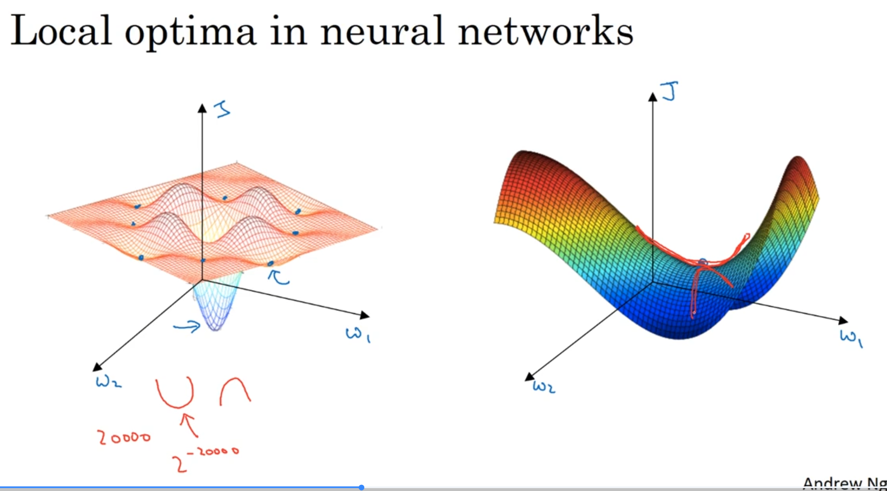

In the early days of deep learning, people's intuition was guided by simple 2D or 3D plots. On these plots, it's easy to draw a cost function that looks like a landscape with many "valleys" (local optima) and one "deepest valley" (the global optimum).


The fear was that your algorithm (like gradient descent) would get "stuck" in one of these "bad" local optima and never find the "good" global optimum.

**2️⃣ The New Insight: High Dimensions**

It turns out this intuition is wrong when you move to the high-dimensional spaces that neural networks operate in.

A large neural network might have 20,000 parameters (or 20 million). This means your cost function $J$ is defined over a 20,000-dimensional space, which we can't visualize.

In this high-dimensional space, it turns out that most points where the gradient is zero are **not** local optima. They are **Saddle Points**.

* **Local Optimum:** A point where the function "bends up" in *all* 20,000 directions. This is statistically impossible (the chance is tiny, like $2^{-20000}$).
* **Saddle Point:** A point where the function bends up in some directions (concave) and bends down in other directions (convex). This is *much* more likely.

**3️⃣ The Saddle Point Analogy**

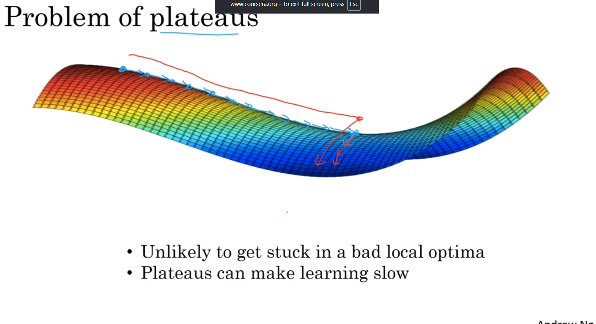

The lecture gives the perfect analogy: a **saddle you put on a horse**.
* If you move forward or backward (along the horse's spine), you go "up."
* If you move side-to-side (along the rider's legs), you go "down."

A saddle point is a point of zero gradient, but it's not a minimum *or* a maximum.


**4️⃣ The Real Problem: Plateaus**

The main takeaway from the lecture is that you are **unlikely to get stuck in a bad local optimum** in a large, high-dimensional neural network.

The *real* problem that slows down training is a **plateau**.

A plateau is a region of the cost function that is **very flat**, meaning the gradients are close to zero for a long time. Your algorithm doesn't get "stuck," but it moves *very, very slowly* as it takes tiny steps across this flat region. It can take a long time to "find its way off" the plateau and continue descending.

**5️⃣ Why Advanced Optimizers Help**

This is exactly why algorithms like **Momentum, RMSprop, and Adam** are so important.
* An algorithm like Momentum builds up "velocity" and can "roll" across the flat plateau much faster.
* An algorithm like Adam can adapt its learning rate and help the algorithm "get off" the plateau.

---


