# ⚙️ **Hyperparameter Tuning Process**


Training a neural network involves setting a lot of different "knobs" called hyperparameters. Think of it like trying to tune an old-fashioned radio: you have knobs for the learning rate ($\alpha$), momentum ($\beta$), the number of hidden units, the mini-batch size, and so on. Your goal is to find the one combination of settings that makes the music (your model's performance) come in clear.

This process of finding the best settings is called hyperparameter tuning. Here are the study notes for the first lecture.

---


### 1️⃣ Prioritizing Hyperparameters

The most important takeaway from the course is that **not all hyperparameters are created equal**. Some have a much bigger impact on your model's performance than others.

You should focus your energy on tuning the most important ones first.

| Priority | Hyperparameter | Notes |
| :--- | :--- | :--- |
| **1 (Most Important)** | $\alpha$ (Learning Rate) | This is almost always the most important parameter to get right. |
| **2 (High Priority)** | `mini-batch size` | Must be tuned to make sure your optimization runs efficiently. |
| | $\beta$ (Momentum) | A good default is 0.9, but it's worth tuning. |
| | `# of hidden units` | Controls the model's capacity and is often tuned. |
| **3 (Lower Priority)** | `# of layers` | Can make a huge difference, but it's usually tuned after the above. |
| | `learning rate decay` | Tuned less frequently. |
| **(Least Priority)** | Adam parameters ($\beta_1, \beta_2, \epsilon$) | The course recommends to almost never tune these. Stick with the defaults (0.9, 0.999, $10^{-8}$). |

### 2️⃣ How to Search: Grid vs. Random

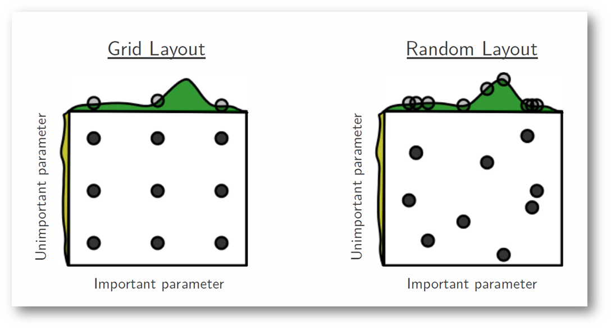

Let's say you're tuning two parameters: the learning rate ($\alpha$) and the Adam parameter $\epsilon$.

* **Grid Search (The Old Way):** In traditional ML, you might try 5 values for $\alpha$ and 5 values for $\epsilon$. You'd create a 5x5 grid and systematically test all 25 combinations.
* **The Problem:** What if $\epsilon$ is an unimportant parameter (which it is!)? You would train 25 models, but you would have only *really* tested 5 different values for $\alpha$. You've wasted 80% of your computation re-testing the same $\alpha$ values with different, useless $\epsilon$ values.

* **Random Search (The Deep Learning Way):** The course strongly recommends you **sample your points at random**.
* **The Benefit:** If you pick 25 points *randomly*, you will have tested **25 unique and different values for $\alpha$** and 25 unique values for $\epsilon$. This is much more efficient because it explores the space of the *important* parameters more thoroughly.


### 3️⃣ Coarse-to-Fine Search

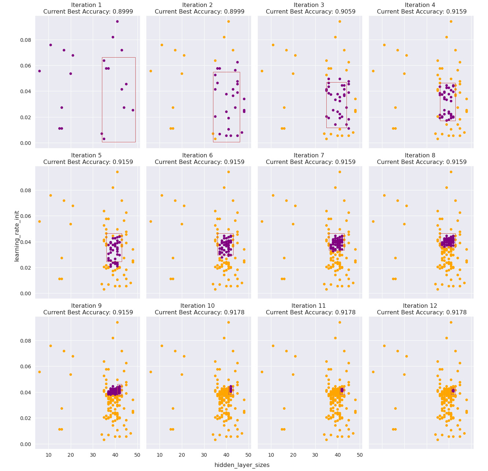

This is a common practice to refine your search:

1.  **Coarse:** First, sample points randomly across the entire, wide range of possible values.
2.  **Fine:** After your first batch of trials, identify the region where the best-performing models were. Then, "zoom in" to that smaller region and sample more densely, again at random.

---
# 📏 **Using the Appropriate Scale for Sampling**
 
 This is a subtle but critical part of the tuning process. Sampling "at random" doesn't mean sampling *uniformly* across the range. You have to pick the appropriate scale.

-----

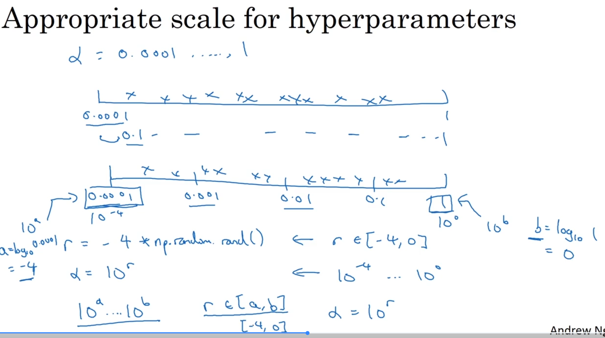

### 1️⃣ The Core Idea

The way you pick your random values matters. For some hyperparameters, a uniform random sample is fine. For others, it's incredibly inefficient. You must sample on a scale that respects the parameter's sensitivity.

### 2️⃣ Case 1: The Linear Scale (The "Normal" Case)

This is the most intuitive case and works well for parameters where changes are linear.

  * **Examples:**
      * **Number of Layers ($L$):** If you think you need 2 to 4 layers, picking 2, 3, or 4 uniformly at random is perfectly reasonable.
      * **Number of Hidden Units ($n^{[l]}$):** If you're searching between 50 and 100 units, any number in that range is a good candidate.
  * **Implementation:** You can sample uniformly.
    ```python
    # Sample a random integer between 50 and 100
    hidden_units = np.random.randint(50, 101)
    ```

### 3️⃣ Case 2: The Logarithmic Scale (e.g., Learning Rate $\alpha$)

This is the most common and important case for tuning.

  * **The Problem:** Imagine you're searching for $\alpha$ between 0.0001 and 1.

      * If you sample uniformly (linearly), about 90% of your samples will be between 0.1 and 1.
      * You'll only use 10% of your resources to explore the entire critical range from 0.0001 to 0.1. This is very wasteful.

  * **The Solution:** We must sample on a **logarithmic scale**. This gives equal resources to exploring each *order of magnitude* (e.g., 0.0001 to 0.001, 0.001 to 0.01, etc.).

  * **How to Implement:**
    To sample a value $\alpha$ between $10^a$ and $10^b$:

    1.  Find your range $[a, b]$. For 0.0001 to 1, this is $[10^{-4}, 10^{0}]$, so $a=-4$ and $b=0$.
    2.  Pick a random number $r$ uniformly from $[a, b]$.
    3.  Set your hyperparameter to $\alpha = 10^r$.

  * **Example Code (for $\alpha$ between $10^{-4}$ and $10^{0}$):**

    ```python
    # 1. Sample r uniformly from -4 to 0
    # (np.random.rand() gives a value in [0, 1])
    r = -4 * np.random.rand() 

    # 2. Compute alpha
    alpha = 10**r
    ```

### 4️⃣ Case 3: The "Tricky" Log Scale (e.g., $\beta$ for Momentum)

This case applies to parameters for exponentially weighted averages (like $\beta$ in Momentum or Adam) that are very close to 1.

  * **The Problem:** Let's say you're searching for $\beta$ between 0.9 and 0.999.

      * The sensitivity of $\beta$ is not linear. A change from 0.9 to 0.9005 (both averaging over \~10 values) is *far less* impactful than a change from 0.999 to 0.9995 (which changes the averaging from \~1000 values to \~2000 values).

  * **The Solution:** We are interested in the values of $1-\beta$. Don't sample $\beta$. Instead, sample $1-\beta$ on a log scale.

  * **How to Implement:**
    To sample $\beta$ between 0.9 and 0.999:

    1.  This means $1-\beta$ is in the range $[0.001, 0.1]$.
    2.  On a log scale, this range is $[10^{-3}, 10^{-1}]$. So, $a=-3$ and $b=-1$.
    3.  Pick a random number $r$ uniformly from $[-3, -1]$.
    4.  Set $1-\beta = 10^r$.
    5.  Your final parameter is $\beta = 1 - 10^r$.

  * **Example Code:**

    ```python
    # 1. Sample r uniformly from -3 to -1
    # r = -1 + (-3 - (-1)) * np.random.rand()
    r = -1 - 2 * np.random.rand()

    # 2. Compute beta
    one_minus_beta = 10**r
    beta = 1 - one_minus_beta
    ```
-----

## 💡 **A Deeper Dive: Why We Need Scaling (An Analogy)**

Imagine you have **10 "search parties"** (like 10 computers or 10 trials) to find a hidden "treasure" (the best hyperparameter setting). You have a giant, 100-kilometer-long island to search.

-----

### 1️⃣ The Linear Scale: "The Easy Island"

First, let's talk about the **linear scale**.

  * **The Island:** This island is a simple beach. The treasure is just as likely to be at Kilometer 1 as it is at Kilometer 99. The "value" of each kilometer is the same.
  * **The Parameter:** This is like the **number of hidden units**, say, from 50 to 100.
  * **The Intuition:** The difference in performance (the "impact") between 50 units and 51 units is *roughly the same* as the impact between 99 and 100 units. The impact is *linear*.
  * **Your Strategy (Linear Sampling):** You tell your 10 search parties to land at random, uniformly-spaced coordinates between km 0 and km 100.
  * **The Result:** This is a **good strategy\!** You've spread your 10 parties out evenly across an evenly-valued island. You'll get some parties in the 0-10km range, some in the 40-50km range, and some in the 90-100km range.
  * **What Linear Means:** "Sampling linearly" just means "sampling uniformly." Every *number* has an equal chance of being picked.
    ```python
    # This is linear sampling. 
    # 55 has the same chance as 95.
    units = np.random.uniform(50, 100) 
    ```

-----

### 2️⃣ The Logarithmic Scale: "The Tricky Island"

Now, let's talk about the **logarithmic scale**.

  * **The Island:** This island is *different*. It's 100km long, but it's 90km of useless desert, and 10km of dense jungle where the treasure is *almost certainly* hidden.

  * **The Parameter:** This is the **learning rate $\alpha$**, say, from 0.0001 to 1.0.

  * **The Intuition:**

      * The *impact* of changing $\alpha$ from 0.5 to 0.8 is **tiny**. (Both are too high and your model "explodes"). This is the "useless desert."
      * The *impact* of changing $\alpha$ from 0.001 to 0.01 is **massive**. (This could be the difference between a model that trains perfectly and one that's 10x too slow). This is the "dense jungle."

  * **Your Strategy (Linear Sampling):** You *don't* know this. You again tell your 10 parties to land at random, uniform coordinates between 0.0001 and 1.0.

  * **The Result:** This is a **TERRIBLE strategy\!**

      * The "useless desert" [0.1 to 1.0] makes up 90% of the island's *length*.
      * The "dense jungle" [0.0001 to 0.1] makes up only 10% of the *length*.
      * This means **9 of your 10 search parties** will land in the useless desert (e.g., 0.3, 0.5, 0.8...)\! You'll only have **1 search party** left to explore the *entire* dense jungle. You've completely wasted your search budget.

  * **The Solution (Logarithmic Sampling):** A wise guide tells you, "Don't search by *kilometer*, search by *order of magnitude* (by powers of 10)."
    You divide the island into "zones" and send an equal number of parties to each:

      * **Zone 1:** [0.1 to 1.0] $\implies$ Send 2-3 parties here.
      * **Zone 2:** [0.01 to 0.1] $\implies$ Send 2-3 parties here.
      * **Zone 3:** [0.001 to 0.01] $\implies$ Send 2-3 parties here.
      * **Zone 4:** [0.0001 to 0.001] $\implies$ Send 2-3 parties here.

    This is what "sampling on a log scale" *means*. It's a strategy to distribute your search parties *equally across zones of equal impact*. The code `r = -4 * np.random.rand(); alpha = 10**r` is just the clever math to make this "search by zones" happen automatically.

-----

### 3️⃣ The "Tricky" Log Scale (Momentum $\beta$)

This is just a special case of the "Tricky Island."

  * **The Parameter:** $\beta$, say from 0.9 to 0.999.

  * **The Intuition:** The *impact* of $\beta$ isn't about the number `0.9` or `0.99`. The impact is on the *number of steps you average over*, which is roughly $1 / (1-\beta)$.

  * Let's check the *real* impact:

      * **"Desert" Zone (low $\beta$):**
          * $\beta = 0.900 \implies$ Averages over \~10 steps.
          * $\beta = 0.905 \implies$ Averages over \~10.5 steps.
          * The *impact* of this change is tiny.
      * **"Jungle" Zone (high $\beta$):**
          * $\beta = 0.999 \implies$ Averages over \~1000 steps.
          * $\beta = 0.9995 \implies$ Averages over \~2000 steps.
          * The *impact* of this tiny change to $\beta$ is **MASSIVE\!**

  * **The Problem:** The "Jungle" (high-impact zone) is all crammed into the tiny numerical range [0.99, 0.999]. The "Desert" (low-impact zone) is the much larger range [0.9, 0.99].

  * **The Solution:** We must sample *this* on a log scale. But since the "jungle" is near 1, it's easier to think about $1-\beta$ (which ranges from 0.001 to 0.1).

  * We just apply the *exact same logic* as we did for $\alpha$. We want to search the "zones" for $1-\beta$ equally:

      * **Zone 1:** [0.01 to 0.1] (This corresponds to $\beta$ = 0.9 to 0.99)
      * **Zone 2:** [0.001 to 0.01] (This corresponds to $\beta$ = 0.99 to 0.999)

  * By sampling $1-\beta$ on a log scale, we ensure we send 5 search parties to Zone 1 and 5 search parties to Zone 2. This is *much* smarter than a linear search, which would send 9 parties to Zone 1 and only 1 to Zone 2.

**In short: "Scaling" is just a strategy to spend your limited search budget in the high-impact zones, not in the low-impact zones.**

---
---

# 🐼 **Hyperparameter Search Strategies: Panda vs. Caviar**

This part of the course is about how to manage your overall search process, which depends on how much computational power (CPUs, GPUs) you have.

### 1️⃣ The Two Schools of Thought

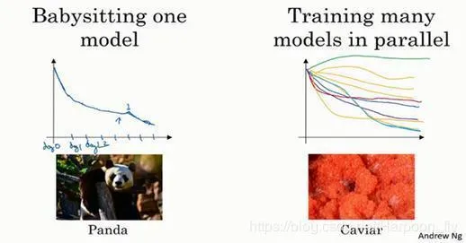

There are two major approaches to this:

| Strategy | Analogy | Core Idea | Best For... |
| :--- | :--- | :--- | :--- |
| **Babysitting One Model** | 🐼 **Panda Approach** | Pandas have very few children and invest a lot of time to ensure that one child survives. | **Low computational resources.** You can only afford to train one (or very few) models at a time. |
| **Training Many in Parallel** | 🐟 **Caviar Approach** | Fish lay millions of eggs and hope that a few of them survive on their own, without individual attention. | **High computational resources.** You have enough power to train many models simultaneously. |


### 2️⃣ How the "Panda" Approach Works

In this approach, you are actively "babysitting" a single model as it trains over many days or weeks.

* **Day 0:** Initialize the model and start training.
* **Day 1:** Watch the learning curve. If it's learning well, you might decide to "nudge" the learning rate up or down a tiny bit.
* **Day 2:** See how your change affected the model. Maybe you'll try tuning the momentum term.
* **Day 3:** You might see the learning rate was too high, so you revert to the model from Day 2 and try a smaller change.

You are patiently guiding one model to a good result. This is common in application areas with massive datasets where a single training run is extremely expensive (e.g., computer vision, online advertising).

### 3️⃣ How the "Caviar" Approach Works

This is what we've mostly been discussing with random search.

* You define your hyperparameter ranges (e.g., $\alpha$ on a log scale, hidden units on a linear scale).
* You launch 10, 20, or even 100 different models *in parallel*, each with its own random set of hyperparameters.
* You let them all run to completion (or for a fixed time, like one day).
* At the end, you just look at all the learning curves and pick the model that performed the best.

### 4️⃣ A Final Warning: Hyperparameters Get "Stale"

The course gives one last important piece of practical advice: **your best hyperparameter settings won't be the best forever.**

Your intuitions can get "stale". Your best settings might change because:
* Your data gradually changes over time.
* You upgrade your servers or data center hardware.

**Recommendation:** Even if you have a good model in production, you should plan to re-evaluate or re-run your hyperparameter search at least once every several months to make sure you still have the best settings.

---
 # **Batch Normalization (Batch Norm)**

Batch Normalization (or Batch Norm) is one of the most important and impactful ideas in deep learning. According to the course, it makes your networks much more robust, makes the hyperparameter search problem *much* easier, and allows you to train very deep networks much more effectively.

---


### 1️⃣ The Core Idea: Normalizing Inside the Network

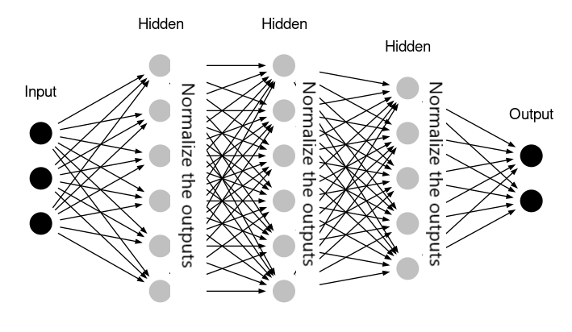

We already know from Course 1 that normalizing your *input features* $X$ (to have zero mean and unit variance) can speed up training significantly. It turns the "cost function bowl" from a long, narrow shape into a rounder one, making it easier for gradient descent to find the minimum.

**The Question:** If normalizing the *inputs* ($A^{[0]}$) helps, why not normalize the activations *inside* the network, like $A^{[1]}$, $A^{[2]}$, and so on?

This is the core idea of Batch Norm. It applies a similar normalization process to the values in the hidden layers, which helps to speed up the training of the later layers' parameters (e.g., $W^{[3]}$ and $b^{[3]}$ become easier to train if $A^{[2]}$ is normalized).

### 2️⃣ How Batch Norm Works (The Algorithm)

In practice, the course notes that we don't normalize the activations $A^{[l]}$ (after the activation function). Instead, we normalize the pre-activation values $Z^{[l]}$ (before the activation function).

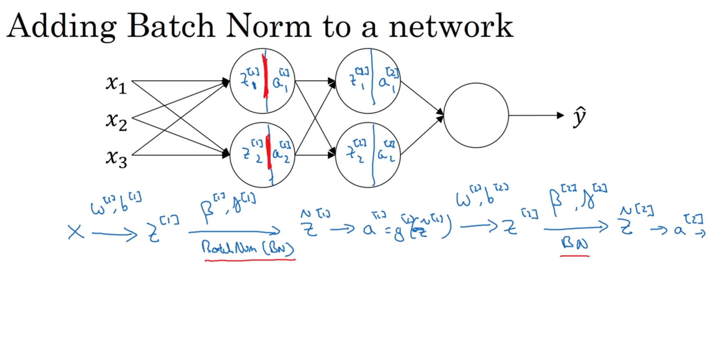

Here is the process, applied to a mini-batch of $m$ examples for a given hidden layer $l$:

Let $z^{(1)}, z^{(2)}, ..., z^{(m)}$ be the $z$ values for that layer in your mini-batch.

1.  **Calculate Mini-Batch Mean ($\mu$):**
    $$\mu = \frac{1}{m} \sum_{i=1}^{m} z^{(i)}$$

2.  **Calculate Mini-Batch Variance ($\sigma^2$):**
    $$\sigma^2 = \frac{1}{m} \sum_{i=1}^{m} (z^{(i)} - \mu)^2$$

3.  **Normalize $z$:**
    Now, take each $z^{(i)}$ and normalize it to have a mean of 0 and a variance of 1.
    $$z_{norm}^{(i)} = \frac{z^{(i)} - \mu}{\sqrt{\sigma^2 + \epsilon}}$$
    * $\epsilon$ is a very small number (e.g., $10^{-8}$) added for numerical stability, just in case the variance $\sigma^2$ is zero.

At this point, we have values ($z_{norm}$) that are forced to have a mean of 0 and a variance of 1. But we don't necessarily *want* this.

### 3️⃣ The "Learnable" Mean and Variance ( $\gamma$ and $\beta$ )

**The Problem:** We don't want to force our hidden units to *always* have a mean of 0 and a variance of 1.
* **Analogy:** Think about a sigmoid activation function. If all your inputs ($z_{norm}$) are clustered around 0, you're only using the *linear* part of the function. You're missing the non-linearity!
* **Solution:** We need to give the network the flexibility to decide what the mean and variance *should* be.

4.  **Rescale with $\gamma$ and $\beta$:**
    We introduce two new, *learnable* parameters for each layer, $\gamma$ (gamma) and $\beta$ (beta).
    $$\tilde{z}^{(i)} = \gamma z_{norm}^{(i)} + \beta$$

* $\gamma$ and $\beta$ are **not** hyperparameters. They are parameters, just like $W$ and $b$, that are learned and updated by gradient descent (or Adam, etc.).
* $\gamma$ allows the network to set the **variance** of $\tilde{z}$.
* $\beta$ allows the network to set the **mean** of $\tilde{z}$.
* This way, the network can learn the optimal mean and variance for its $z$ values to best take advantage of the activation function's non-linearity.
* In fact, if the network *wants* to "undo" Batch Norm, it can simply learn to set $\gamma = \sqrt{\sigma^2 + \epsilon}$ and $\beta = \mu$, which makes $\tilde{z}^{(i)}$ equal to the original $z^{(i)}$.

This final value, $\tilde{z}$, is what is fed into the activation function $g^{[l]}$ to get $A^{[l]}$.

---

### ⛓️ **Fitting Batch Norm into a Deep Network**

#### 1️⃣ The New Forward Pass

In a standard network, the calculation for one layer is:
1.  Compute $Z^{[l]} = W^{[l]}A^{[l-1]} + b^{[l]}$
2.  Compute $A^{[l]} = g^{[l]}(Z^{[l]})$

With Batch Norm, we insert a step in the middle. The **BN** (Batch Norm) step happens right after calculating $Z^{[l]}$ and *before* the activation function $g^{[l]}$.

The new calculation for one layer is:
1.  Compute $Z^{[l]} = W^{[l]}A^{[l-1]} + b^{[l]}$
2.  Apply Batch Norm: $\tilde{Z}^{[l]} = \text{BN}(Z^{[l]})$ (This step uses $\gamma^{[l]}$ and $\beta^{[l]}$)
3.  Compute $A^{[l]} = g^{[l]}(\tilde{Z}^{[l]})$


#### 2️⃣ Your New Network Parameters

Without Batch Norm, your parameters are $W^{[l]}$ and $b^{[l]}$ for each layer $l$.

With Batch Norm, you now have **four** parameters for each layer:
* $W^{[l]}$ (the weights)
* $b^{[l]}$ (the bias)
* $\gamma^{[l]}$ (the learnable variance scale)
* $\beta^{[l]}$ (the learnable mean shift)

All four of these are updated during gradient descent (or Adam, RMSprop, etc.).

🧠 **Deeper Dive: $\beta$ (Batch Norm) vs. $\beta$ (Momentum)**
> A very common point of confusion:
> * The $\beta$ from **Momentum** or **Adam** (e.g., $\beta_1, \beta_2$) is a **hyperparameter**. You set it *before* training (e.g., to 0.9).
> * The $\beta^{[l]}$ from **Batch Norm** is a **parameter**. It is learned *during* training, just like $W^{[l]}$.
>
> They are completely different things that just unfortunately share the same Greek letter.

#### 3️⃣ A Key Optimization: Getting Rid of $b^{[l]}$

There's a clever optimization we can make. Let's look at the math:
1.  $Z^{[l]} = W^{[l]}A^{[l-1]} + b^{[l]}$
2.  Batch Norm computes the mean $\mu$ of the mini-batch's $Z^{[l]}$ values.
3.  Batch Norm subtracts this mean: $Z_{norm}^{(i)} = (Z^{(i)} - \mu) / \dots$

Notice that $b^{[l]}$ is a constant added to every single $Z^{(i)}$ in the mini-batch. When you compute the mean $\mu$, that constant $b^{[l]}$ is part of the mean. When you then *subtract* the mean, the $b^{[l]}$ term is **perfectly and completely cancelled out**.

This means the parameter $b^{[l]}$ **has absolutely no effect** on the network.

* **The Action:** You can **eliminate $b^{[l]}$ from your network**.
* The *job* that $b^{[l]}$ used to do (shifting the mean of the activations) is now being done by the new, learnable $\beta^{[l]}$ parameter.

So, your *final, efficient* layer calculation is:
1.  Compute $Z^{[l]} = W^{[l]}A^{[l-1]}$ **(No more $b^{[l]}$!)**
2.  Apply Batch Norm: $\tilde{Z}^{[l]} = \text{BN}(Z^{[l]})$ (using $\gamma^{[l]}$ and $\beta^{[l]}$)
3.  Compute $A^{[l]} = g^{[l]}(\tilde{Z}^{[l]})$

#### 4️⃣ How it Works with Mini-Batch Gradient Descent

The "Batch" in Batch Norm refers to the mini-batch. The mean ($\mu$) and variance ($\sigma^2$) are calculated *on each mini-batch*.

Here is one step of gradient descent:
1.  **Forward Prop:**
    * Take your next mini-batch, $X^{\{t\}}$.
    * For each hidden layer $l$:
        * Compute $Z^{[l]} = W^{[l]}A^{[l-1]}$.
        * Compute $\mu$ and $\sigma^2$ **using only the examples in $X^{\{t\}}$**.
        * Compute $\tilde{Z}^{[l]} = \gamma^{[l]} Z_{norm}^{[l]} + \beta^{[l]}$.
        * Compute $A^{[l]} = g^{[l]}(\tilde{Z}^{[l]})$.
2.  **Backprop:**
    * Run backpropagation to compute the gradients: $dW^{[l]}$, $d\gamma^{[l]}$, and $d\beta^{[l]}$. (Note: $db^{[l]}$ is gone).
3.  **Parameter Update:**
    * Update your parameters (using Gradient Descent, Adam, etc.):
        * $W^{[l]} = W^{[l]} - \alpha dW^{[l]}$
        * $\gamma^{[l]} = \gamma^{[l]} - \alpha d\gamma^{[l]}$
        * $\beta^{[l]} = \beta^{[l]} - \alpha d\beta^{[l]}$
4.  Repeat for the next mini-batch.

---
---

## 🤔 **Why Does Batch Norm Work?**

### 1️⃣ Reason 1: Normalizing Hidden Layer Inputs

This is the most direct intuition. We already know that normalizing the *input layer* $X$ to have a mean of 0 and variance of 1 speeds up learning.

Batch Norm simply applies this same idea to the inputs of *every* hidden layer. It normalizes the values $Z^{[l]}$ (or $A^{[l-1]}$) that are being fed into the next layer $l$. This makes the "learning problem" for layer $l$ much easier, just as normalizing $X$ made the problem for layer 1 easier. This allows the whole network to learn faster.

### 2️⃣ Reason 2: Reducing "Internal Covariate Shift"

This is the more formal and powerful reason given in the original Batch Norm paper.

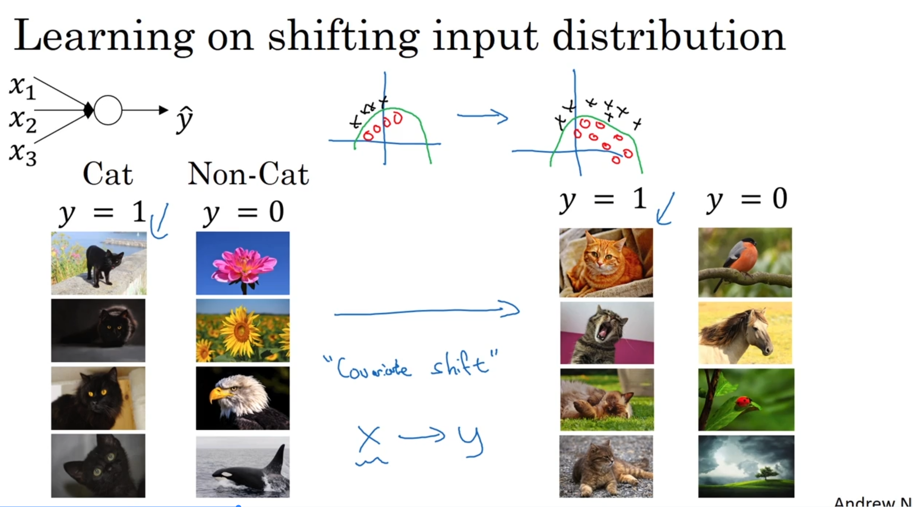

* **Analogy (The Cat Problem):** Imagine you're training a cat detector. Your training set *only* has pictures of black cats. Your model learns to associate "black pixels" with "cat." If you then try to use this model on colored cats, it will fail badly. The distribution of your data ($X$) has changed. This problem is called **covariate shift**. When this happens, you have to retrain your model.

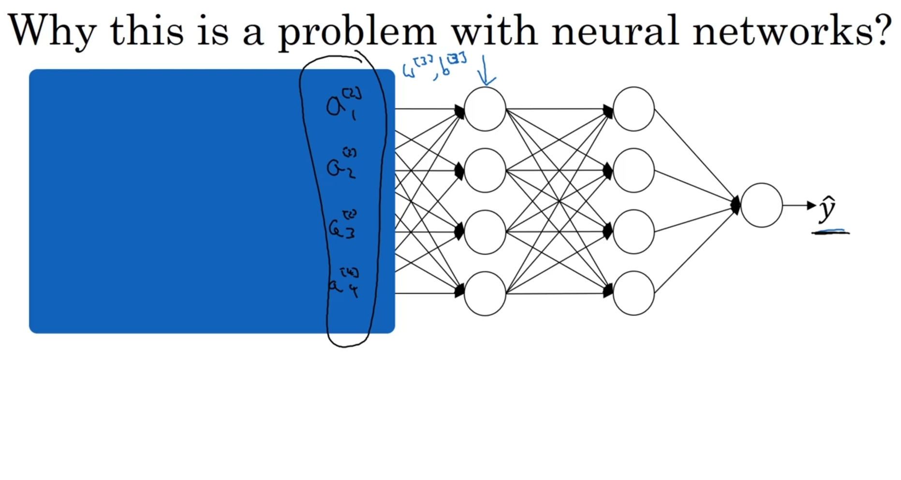

* **Internal Covariate Shift:** This same problem happens *inside* a deep network.
    * Think about Layer 3. Its "input data" is the activations $A^{[2]}$ from Layer 2.
    * As the network trains, the parameters $W^{[1]}, W^{[2]}$ are constantly changing.
    * This means the activations $A^{[2]}$ are *also* constantly changing their mean and variance.
    * From Layer 3's perspective, its "input data" is constantly shifting around! This is **Internal Covariate Shift**. It's like trying to learn a function while the floor is moving under your feet.

* **How Batch Norm Solves This:**
 
    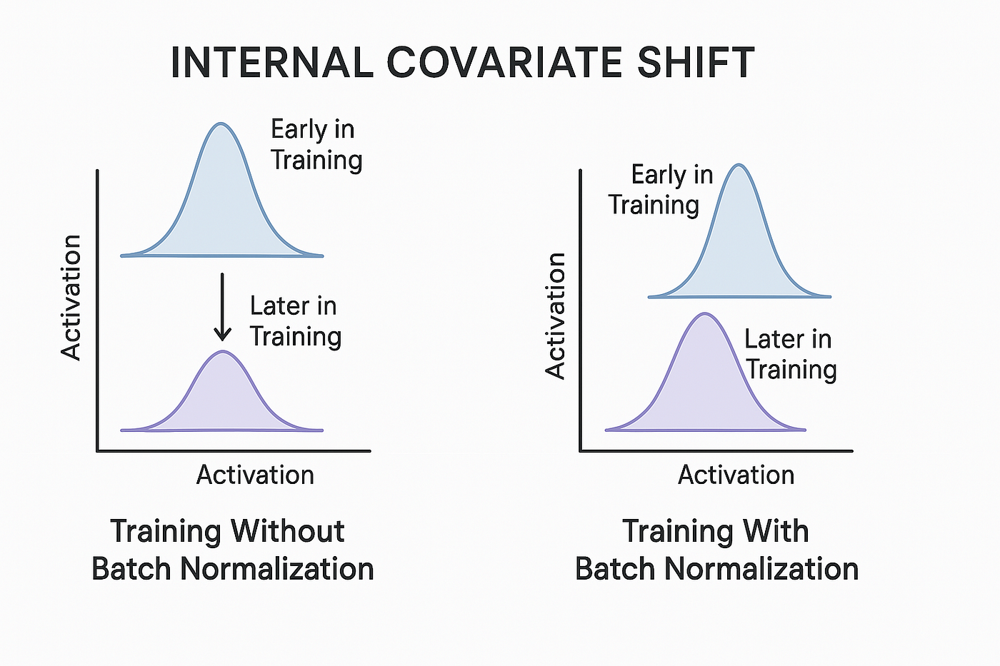

    * Batch Norm ensures that no matter how $Z^{[2]}$ (and thus $A^{[2]}$) changes, its **mean and variance are always fixed** (to the values $\beta^{[2]}$ and $\gamma^{[2]}$ that the network learns).
    * This makes the distribution of Layer 3's input data *much* more stable. Layer 3 no longer has to constantly re-adapt to a shifting input distribution.
    * It "weakens the coupling" between the earlier layers and the later layers, allowing each layer to learn a bit more independently. This stabilizes the whole learning process and speeds up training.


### 3️⃣ A Minor Side Effect: A Slight Regularization

Batch Norm also has a small, (and often unintended) regularization effect.

* **How it works:** The mean ($\mu$) and variance ($\sigma^2$) are calculated on a *mini-batch* (e.g., 64 examples), not the full dataset.
* Because the mini-batch is small, these $\mu$ and $\sigma^2$ values are a bit "noisy".
* This adds a small amount of noise to the activations in each layer, similar to (but much weaker than) Dropout.
* This noise forces the network to be slightly more robust and not rely too much on any one activation.

**Important:** This is just a side effect. You should **not** rely on Batch Norm as your primary regularizer. Use it *with* Dropout if you need strong regularization.

---

### 🧠 The "Student-Teacher Chain" Analogy

Imagine you have a deep network with 5 layers. Think of it as a line of 5 students, where **Student 5** (the last layer) has to learn a final, complex task (e.g., recognize a cat).

* **Student 1 (Layer 1)** learns from the textbook ($X$).
* **Student 2 (Layer 2)** learns *only* from what Student 1 tells them.
* **Student 3 (Layer 3)** learns *only* from what Student 2 tells them.
* ...and so on, until Student 5 learns from Student 4.

#### The Problem (Without Batch Norm)

1.  At the start of training, Student 1 is a terrible student. Their notes (activations $A^{[1]}$) are messy and all over the place.
2.  Student 2 tries to learn from Student 1's messy notes. Student 2's own notes ($A^{[2]}$) become even messier.
3.  By the time the "knowledge" gets to Student 4, their notes ($A^{[4]}$) are complete gibberish (e.g., the values have a huge mean and massive variance).
4.  **Here is the critical problem:** Student 5 is trying to learn "cat recognition" from Student 4. But Student 4's "gibberish" notes are *also constantly changing* every single mini-batch, because Student 1, 2, and 3 are also updating their knowledge.

Student 5's job is impossible. They are trying to learn a stable task from an input that is unstable and shifting all the time. **This is "Internal Covariate Shift."** The "covariate" (the input $A^{[4]}$) is "shifting".

#### The Solution (With Batch Norm)

Now, let's put **Batch Norm (a "Universal Translator")** between each student.

1.  Student 3 finishes their messy, gibberish notes ($Z^{[3]}$).
2.  The "Universal Translator" (Batch Norm) takes these notes. It says, "Whoa, this is a mess. I'm going to clean this up."
3.  It **normalizes** the notes: it subtracts the mean ($\mu$) and divides by the standard deviation ($\sigma^2$) of that "batch" of notes. Now the notes have a stable mean of 0 and variance of 1.
4.  Then, it **scales** them (using the learned $\gamma$ and $\beta$) to be in the *most helpful* format possible for the next student.
5.  Student 4 receives these perfectly clean, stable, and easy-to-read notes ($\tilde{Z}^{[3]}$).

**Why this is so effective:**

* **It gives Layer 4 "firm ground to stand on."** Layer 4 can now focus *all* its effort on learning its task, instead of wasting effort just trying to adapt to Layer 3's constantly shifting, messy inputs.
* It "weakens the coupling" between layers. Layer 4 doesn't have to worry so much about what Layer 3 is doing. It can learn "a little bit more independently".
* When all layers can learn more independently and from a stable input, the **entire network learns much, much faster.**


**In summary:** Batch Norm makes the learning job for each layer *easier* by ensuring the inputs it receives are always stable, clean, and predictable, rather than chaotic, messy, and constantly shifting.

---
## **The key idea is stability.**

### The Job of a Single Layer (e.g., Layer 3)

* Forget the rest of the network. Just think about **Layer 3**.
* Its job is to learn a function that takes the activations from Layer 2 ($A^{[2]}$) and produces its own activations, $A^{[3]}$.
* It's trying to learn the best parameters $W^{[3]}$ and $b^{[3]}$ to do this job.

### The Problem: A Constantly Shifting Input

* As the network trains, the parameters in Layer 1 ($W^{[1]}$) and Layer 2 ($W^{[2]}$) are also changing.
* When $W^{[1]}$ and $W^{[2]}$ change, the *output* of Layer 2 ($A^{[2]}$) also completely changes.
* One mini-batch, $A^{[2]}$ might have a mean of 5 and a variance of 10.
* The *next* mini-batch, after $W^{[1]}$ and $W^{[2]}$ update, $A^{[2]}$ might have a mean of -3 and a variance of 0.5.

**This is a nightmare for Layer 3.**

It's trying to learn a stable, consistent function, but its input data is like a "live wire" — its fundamental properties (mean, variance) are flickering and changing wildly with every single training step.

This problem is called **Internal Covariate Shift**: "Internal" (inside the network) "Covariate" (the input features, $A^{[2]}$) "Shift" (are shifting around).


### The Solution: How Batch Norm Fixes It

Batch Norm acts like a **"shock absorber"** or a **"voltage stabilizer"** between Layer 2 and Layer 3.

* It takes the messy, unstable output from Layer 2 ($Z^{[2]}$).
* It **forces** it to have a stable, consistent mean and variance.
* Specifically, it forces the mean to be $\beta^{[2]}$ and the variance to be (related to) $\gamma^{[2]}$—two parameters that Layer 3 itself gets to learn and control.

**Now, Layer 3's job is *much* easier:**

* **Without Batch Norm:** Layer 3 is trying to learn, but its input $A^{[2]}$ is "shifting" all over the place. It's trying to hit a moving target.
* **With Batch Norm:** Layer 3 gets a perfectly stable, predictable input every single time. It knows its input will always have the mean and variance it expects.

This "stabilization" is the main reason Batch Norm is so effective. It lets each layer focus on its own learning task without having to constantly re-adapt to the chaotic changes from the layers before it.

---
## ❓ **Question-** here the mean and standard daviation or variance that we are calculating in each layer is of the entire z[l] produced by each hidden unit or is it specific mean and variance for specific hidden unit i as we pass our activation from previous layer which are predictions for each datapoint in our dataset by each hidden unit so the mean and variance for normalization is calculated differently for each hidden unit ir it is calculated entirely of all the predictions made by each hidden unit for each datapoint? 

**Anwser:**
That is an **excellent** and very precise question. This is a critical detail.

Your second intuition is exactly correct: **the mean and variance are calculated differently for each hidden unit.**

You do *not* calculate one single mean for the entire $Z^{[l]}$ matrix.

Here’s a step-by-step breakdown.

### 1️⃣ The "Per-Unit" Calculation

Think of your $Z^{[l]}$ matrix for a single mini-batch. It has a specific shape:
* **Rows ($n^{[l]}$):** The number of hidden units in layer $l$.
* **Columns ($m$):** The number of examples in your mini-batch.

Let's say you have **4 hidden units** ($n^{[l]} = 4$) and a mini-batch of **64 examples** ($m = 64$). Your $Z^{[l]}$ matrix is **(4, 64)**.


Here is how Batch Norm is calculated:

1.  **For Hidden Unit 1 (Row 1):**
    * Take the first row of $Z^{[l]}$. This is a vector of 64 numbers.
    * Calculate the mean $\mu_1$ and variance $\sigma^2_1$ *only* for this row.
    * Normalize all 64 numbers in this row using $\mu_1$ and $\sigma^2_1$.
    * Scale the result using $\gamma_1$ and $\beta_1$.

2.  **For Hidden Unit 2 (Row 2):**
    * Take the second row of $Z^{[l]}$. This is another vector of 64 numbers.
    * Calculate *its own* mean $\mu_2$ and variance $\sigma^2_2$.
    * Normalize all 64 numbers in this row using $\mu_2$ and $\sigma^2_2$.
    * Scale the result using $\gamma_2$ and $\beta_2$.

3.  **For Hidden Units 3 & 4:**
    * You do the same, finding $\mu_3, \sigma^2_3$ and $\mu_4, \sigma^2_4$.

### 2️⃣ Why This Makes Sense (The Intuition)

You have to do it this way because **each hidden unit is learning to detect a different feature**.

* Maybe Hidden Unit 1 (Row 1) is learning to detect "vertical edges."
* Maybe Hidden Unit 2 (Row 2) is learning to detect "horizontal edges."
* Maybe Hidden Unit 3 (Row 3) is learning to detect "fur texture."

The "average" activation for the "fur texture" feature will be totally different from the "average" activation for the "vertical edge" feature. It would make no sense to lump them together and normalize them with the same mean and variance.

Each feature (each hidden unit) needs its own, independent normalization.

### 3️⃣ The Dimensions of the Parameters

This is why the course states that the dimensions for the learnable parameters $\gamma$ and $\beta$ are $(n^{[l]}, 1)$.

In our example, $\gamma$ and $\beta$ would both be **(4, 1)** vectors:

$$
\gamma = \begin{bmatrix} \gamma_1 \\ \gamma_2 \\ \gamma_3 \\ \gamma_4 \end{bmatrix}
\quad
\beta = \begin{bmatrix} \beta_1 \\ \beta_2 \\ \beta_3 \\ \beta_4 \end{bmatrix}
$$

* $\gamma_1$ and $\beta_1$ are the scale/shift for the **first hidden unit**.
* $\gamma_2$ and $\beta_2$ are the scale/shift for the **second hidden unit**.
* ...and so on.

## 🧪 **Batch Norm at Test Time**

The entire process of Batch Norm relies on having a "batch" (a mini-batch) to calculate a mean ($\mu$) and variance ($\sigma^2$). But at test time, you might be making a prediction on just *one* example. How can you calculate the mean and variance of a single example?

You can't. So, we need a different approach.

---


### 1️⃣ The Problem: No Mini-Batch

* **During Training:** We calculate $\mu$ and $\sigma^2$ *for each mini-batch*.
    $$\mu = \frac{1}{m} \sum_{i=1}^{m} z^{(i)}$$
    $$\sigma^2 = \frac{1}{m} \sum_{i=1}^{m} (z^{(i)} - \mu)^2$$
* **During Testing:** We get one example, $z^{(test)}$. We can't use these formulas, as $m=1$.

### 2️⃣ The Solution: Estimate $\mu$ and $\sigma^2$ During Training

The solution is to *estimate* the "true" $\mu$ and $\sigma^2$ for your whole dataset *during* the training process and then *save* these values.

The most common way to do this is with an **exponentially weighted average (or "running average")**.

* **Here's the process:** For each layer $l$, and for every mini-batch ($X^{\{1\}}$, $X^{\{2\}}$, etc.) you train on:
    1.  You compute the $\mu^{\{t\}}$ and $\sigma^{2\{t\}}$ for that mini-batch.
    2.  You update your "running average" estimates (let's call them $\mu_{\text{final}}$ and $\sigma^2_{\text{final}}$) using the new values.
    (e.g., $\mu_{\text{final}} = 0.9 \cdot \mu_{\text{final}} + 0.1 \cdot \mu^{\{t\}}$)

* You keep doing this for every mini-batch, for thousands of steps. By the end of training, $\mu_{\text{final}}$ and $\sigma^2_{\text{final}}$ are very stable, accurate estimates of the "true" mean and variance for that layer.

### 3️⃣ Using the Estimates at Test Time

When it's time to make a prediction (at test time) on a single example $z^{(test)}$:

1.  You **do not** calculate a new $\mu$ or $\sigma^2$.
2.  You simply "load" your saved, final estimates: $\mu_{\text{final}}$ and $\sigma^2_{\text{final}}$.
3.  You use *these* saved values in the Batch Norm equation to normalize your test example:

    $$z_{norm}^{(test)} = \frac{z^{(test)} - \mu_{\text{final}}}{\sqrt{\sigma^2_{\text{final}} + \epsilon}}$$

4.  Then, you apply the *same learned parameters* $\gamma$ and $\beta$ that your network found during training:

    $$\tilde{z}^{(test)} = \gamma z_{norm}^{(test)} + \beta$$

This gives you your final, normalized $\tilde{z}$ value, which you can then pass to the activation function.


---

That's it for Batch Norm! It's a powerful technique that speeds up training, stabilizes learning, and makes your hyperparameter search easier.

---
# 🗂️ **Softmax Regression (Multi-Class Classification)**

 This is the technique that lets us generalize logistic regression (which is binary, 0/1) to handle **multi-class classification**, where you have C > 2 possible outcomes.

---

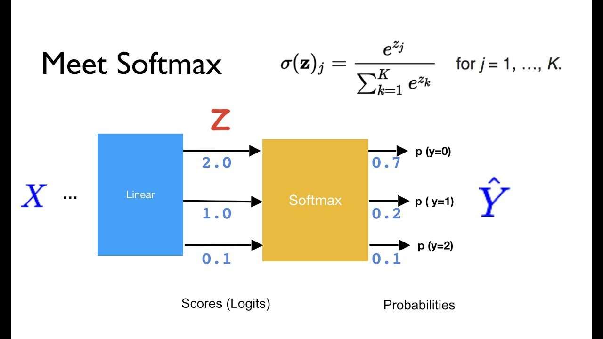

### 1️⃣ The Core Idea: Beyond Binary

* **Logistic Regression:** So far, we've focused on binary classification. Is this a cat ($y=1$) or not a cat ($y=0$)? This uses a single output unit with a sigmoid activation.
* **Multi-Class Classification:** What if we want to classify an image as a **cat ($y=1$)**, a **dog ($y=2$)**, a **baby chick ($y=3$)**, or **"other" ($y=0$)?**
* **The Problem:** We can't use a single sigmoid unit. We need an output layer that can give us a probability for *each* of our $C$ classes, and we need those probabilities to sum to 1.

### 2️⃣ The Softmax Output Layer

To solve this, we use a new type of activation function in the *final* layer, called **Softmax**.

1.  **Output Units:** Your output layer, $L$, will now have $C$ units, one for each class. In our example, $C=4$.
2.  **Compute $Z^{[L]}$:** You first compute $Z^{[L]}$ just as you always have:
    $$Z^{[L]} = W^{[L]}A^{[L-1]} + b^{[L]}$$
    In our example, this would be a $(4, 1)$ vector.


### 3️⃣ The Softmax Activation Function

This is the special part. Instead of applying sigmoid to $Z^{[L]}$, we apply the Softmax function, which has two steps:

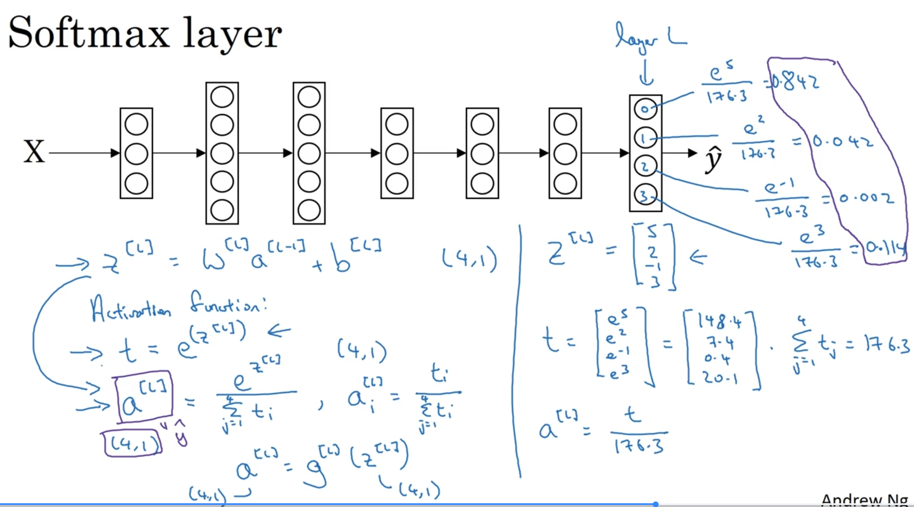

1.  **Exponentiate (Get $t$):** First, we create a temporary variable $t$ by taking $e$ to the power of each element in $Z^{[L]}$. This makes all the numbers positive.
    $$t = e^{Z^{[L]}}$$
    (This is an element-wise operation).

2.  **Normalize (Get $\hat{y}$):** Second, we normalize all the values in $t$ by dividing by their sum. This forces the final output probabilities to sum to 1.
    $$A^{[L]} = \hat{y} = \frac{t}{\sum_{j=1}^{C} t_j}$$

The final vector $A^{[L]}$ contains the probabilities for each of the $C$ classes, and they are all guaranteed to sum to 1.

### 4️⃣ An Example Calculation

Let's say we have $C=4$ classes and our network computes the following $Z^{[L]}$:
$$Z^{[L]} = \begin{bmatrix} 5 \\ 2 \\ -1 \\ 3 \end{bmatrix}$$

1.  **Exponentiate:**
    $$t = \begin{bmatrix} e^5 \\ e^2 \\ e^{-1} \\ e^3 \end{bmatrix} \approx \begin{bmatrix} 148.4 \\ 7.4 \\ 0.4 \\ 20.1 \end{bmatrix}$$
   

2.  **Normalize:** First, we find the sum of all elements in $t$:
    $\text{Sum}(t) \approx 148.4 + 7.4 + 0.4 + 20.1 = 176.3$

    Now, we divide each element in $t$ by this sum:
    $$A^{[L]} = \hat{y} = \begin{bmatrix} 148.4 / 176.3 \\ 7.4 / 176.3 \\ 0.4 / 176.3 \\ 20.1 / 176.3 \end{bmatrix} = \begin{bmatrix} 0.842 \\ 0.042 \\ 0.002 \\ 0.114 \end{bmatrix}$$
    (Note: Transcript has a typo, 0.002 is the correct calculation from its own premises).

This $\hat{y}$ vector is our prediction. The network is 84.2% sure this is class 0 ("other"), 4.2% sure it's class 1 ("cat"), 0.2% sure it's class 2 ("dog"), and 11.4% sure it's class 3 ("chick").

### 5️⃣ "Softmax" vs. "Hardmax"

The name "Softmax" comes in contrast to "Hardmax."
* **Hardmax:** A "hard max" would just look at $Z^{[L]}$ and put a $1$ in the largest value in a particular column in $Z^{[L]}$ (like 5 in our above example) and $0$s everywhere else: $\begin{bmatrix} 1 \\ 0 \\ 0 \\ 0 \end{bmatrix}$ the the class having 1 will be the final output
  
* **Softmax:** Softmax is a "softer," more gentle mapping that gives us probabilities for all classes instead of just picking one winner.


### 6️⃣ The Loss Function for Softmax

We can't use the old logistic loss. For Softmax, we use the **"Log Loss"** (or Negative Log-Likelihood).

For a **single training example**, the loss is:
$$L(\hat{y}, y) = -\sum_{j=1}^{C} y_j \log(\hat{y}_j)$$

where C is no. of classes and sumation is of $$y_j \log(\hat{y}_j)$$
for each class in the predicted and true lables. Each example will have prediction and true lables for each class probabilty.

* **Intuition:** Let's use our example. The *true label* $y$ for a cat picture would be:
    $$y = \begin{bmatrix} 0 \\ 1 \\ 0 \\ 0 \end{bmatrix}$$
   

    Our network's *prediction* $\hat{y}$ was:
    $$\hat{y} = \begin{bmatrix} 0.842 \\ 0.042 \\ 0.002 \\ 0.114 \end{bmatrix}$$

    If we plug these into the Loss formula, all the terms where $y_j = 0$ get multiplied to zero. We are left with only the $j=2$ term:
    $$L(\hat{y}, y) = -y_2 \log(\hat{y}_2) = -1 \cdot \log(0.042)$$
   

    Gradient descent's job is to **minimize this loss**. To make $-\log(0.042)$ small, it has to make $\log(0.042)$ *big*. The only way to do that is to make the network's prediction, $\hat{y}_2$, as big as possible (i.e., get it closer to $1$). This is exactly what we want!.So more generally, what this loss function does is it looks at whatever is the ground true class in your training set, and it tries to make the corresponding prediction probability of that class as high as possible.

### 7️⃣ The Cost Function (Entire Batch)

The cost function $J$ for the whole training set is just the average of the losses for each example.
$$J = 1/m\sum_{i=1}^{m} L(\hat{y}^{(i)}, y^{(i)})$$
m - No. of examples in training batch(mini or gradient)
### 8️⃣ The Backward Pass (Backpropagation)

The key to backprop with Softmax is the very first step. The derivative of the Loss with respect to $Z^{[L]}$ turns out to be a very simple and elegant expression:

$$dZ^{[L]} = \hat{y} - y$$


From this starting point, you can then backpropagate $dZ^{[L]}$ to find $dW^{[L]}$, $db^{[L]}$, $dA^{[L-1]}$, and so on, just as you did in Course 1.

---

## **Questions:** so if we have multiple class what will the the dimensions of examples and how are these different probabilities are getting calculated for each class is each hidden unit in the output layer is dedicated to calculating probality of each class 

**Anwser:**
That's an excellent set of questions, and your last point is exactly correct.

Here is a breakdown of how it all fits together.

### 1️⃣ One Unit Per Class (Your Final Question)

You are **exactly right**. Each unit in the *final output layer* (layer $L$) is dedicated to calculating the "score" for one specific class.

* If you have $C=4$ classes (e.g., other, cat, dog, chick), your final layer $L$ *must* have $n^{[L]} = 4$ units.
* **Unit 1** is responsible for the "other" class.
* **Unit 2** is responsible for the "cat" class.
* **Unit 3** is responsible for the "dog" class.
* **Unit 4** is responsible for the "chick" class.


### 2️⃣ How Probabilities are Calculated (Your Second Question)

This is a two-step process, which is the key to understanding Softmax:

1.  **Step 1: Each unit calculates a "score" (a logit).**
    Each unit $j$ in the output layer just does a normal linear calculation: $z_j = w_j \cdot a^{[L-1]} + b_j$. This gives you the vector $Z^{[L]}$. These $z$ values are *not* probabilities; they are just raw numbers (they can be negative or large, like `[5, 2, -1, 3]`).

2.  **Step 2: The Softmax function "converts" scores to probabilities.**
    This is the crucial part. The Softmax activation function $g^{[L]}$ takes the *entire vector* of scores $Z^{[L]}$ and turns it into the vector of probabilities $\hat{y}$ (or $A^{[L]}$). It does this by:
    * Exponentiating all the scores (to make them positive).
    * Dividing each score by the *sum of all scores* (to make them all add up to 1).

So, no single unit *alone* calculates its final probability. Each unit provides a "score," and the Softmax function *as a whole* looks at all the scores and normalizes them into the final probabilities.

### 3️⃣ The Dimensions of the Examples (Your First Question)

Because our *prediction* $\hat{y}$ is a vector of $C$ probabilities, our *true label* $y$ must also be a vector of the same shape.

We can't just use the number $y=2$ to mean "dog." We use a **"one-hot vector."**

A one-hot vector is a $C$-dimensional vector that is all 0s, *except* for a single 1 at the index corresponding to the correct class.

Here's how our examples look:

| Class | Label (as a number) | Label (as a one-hot vector $y$) |
| :--- | :--- | :--- |
| "other" | 0 | $\begin{bmatrix} 1 \\ 0 \\ 0 \\ 0 \end{bmatrix}$ |
| "cat" | 1 | $\begin{bmatrix} 0 \\ 1 \\ 0 \\ 0 \end{bmatrix}$ |
| "dog" | 2 | $\begin{bmatrix} 0 \\ 0 \\ 1 \\ 0 \end{bmatrix}$ |
| "chick" | 3 | $\begin{bmatrix} 0 \\ 0 \\ 0 \\ 1 \end{bmatrix}$ |

This one-hot $y$ vector has the exact same shape as our prediction $\hat{y}$, which is $(C, 1)$, or $(4, 1)$ in this case.

This is *why* the loss function $L = -\sum y_j \log(\hat{y}_j)$ works so well. The one-hot $y$ vector (which is all 0s and one 1) acts like a "selector," making all terms in the sum zero *except* for the one correct class.

---

## **Question-** i still dont understand did WL becomes 3 dimensional metrix [n[l],m,C]? i dont understand how this works and how each hiddent unit calculates probability for a specific class? and what is the output dimensions [C,m] if yes then how?

**Anwser:**
This is the most confusing part of the Softmax layer, and you are asking exactly the right questions.

Let's clear this up with a step-by-step "assembly line" example.

Your confusion is on two key points:
1.  **The dimension of $W^{[L]}$:** You are guessing 3D. It is **2D**.
2.  **How probability is calculated:** You are thinking *one unit* calculates *one probability*. This is not quite right. A unit calculates a **"score"**; the **Softmax *function*** then looks at *all* the scores to calculate the final probabilities.

Here is the entire process.

---

### The Setup (Our "Assembly Line" Parts)

Let's use a concrete example:
* **Previous Layer ($L-1$):** Has $n^{[L-1]} = 64$ units.
* **Batch Size ($m$):** We are processing $m = 128$ examples at once.
* **Output Layer ($L$):** We have $C = 4$ classes (cat, dog, chick, other).
* **Key:** Our output layer $L$ *must* have $n^{[L]} = C = 4$ units.

---

### Step 1: The Input to Layer $L$

The input is the activation from the previous layer.
* **Variable:** $A^{[L-1]}$
* **Shape:** $(n^{[L-1]}, m)$ $\implies$ **(64, 128)**
* **What it is:** A matrix with 64 rows of features, for 128 different examples.

---

### Step 2: The Linear Calculation (Calculating "Scores")

This is where the "dedication" happens and where we get our `(C, m)` shape.

* **Calculation:** $Z^{[L]} = W^{[L]} A^{[L-1]} + b^{[L]}$
* **$W^{[L]}$ (The Weights):** This is a **2D matrix**. It is **NOT** 3D.
    * Its job is to transform the 64 features into 4 "scores."
    * Shape of $W^{[L]}$: $(n^{[L]}, n^{[L-1]})$ $\implies$ **(4, 64)**
* **$b^{[L]}$ (The Biases):**
    * Shape of $b^{[L]}$: $(n^{[L]}, 1)$ $\implies$ **(4, 1)**

**How the math works (This is the most important part!):**

$$
\underbrace{Z^{[L]}}_{(C, m)} = \underbrace{W^{[L]}}_{(C, n^{[L-1]})} @ \underbrace{A^{[L-1]}}_{(n^{[L-1]}, m)} + \underbrace{b^{[L]}}_{(C, 1)}
$$

$$
\underbrace{Z^{[L]}}_{(\textbf{4}, \textbf{128})} = \underbrace{W^{[L]}}_{(\textbf{4}, 64)} @ \underbrace{A^{[L-1]}}_{(64, \textbf{128})} + \underbrace{b^{[L]}}_{(4, 1)}
$$

The matrix multiplication $W^{[L]} @ A^{[L-1]}$ produces a **(4, 128)** matrix. The `(4, 1)` bias $b^{[L]}$ is then *broadcast* (added) to every one of the 128 columns.

**This $Z^{[L]}$ matrix (shape (4, 128)) IS your output of "scores."**

* **Row 1:** The "cat scores" for all 128 examples.
* **Row 2:** The "dog scores" for all 128 examples.
* **Row 3:** The "chick scores" for all 128 examples.
* **Row 4:** The "other scores" for all 128 examples.

The "dedication" comes from the *rows* of $W^{[L]}$. The 1st row of $W^{[L]}$ is "dedicated" to calculating the "cat scores." The 2nd row is "dedicated" to the "dog scores," and so on.

---

### Step 3: The Softmax Activation (Calculating Probabilities)

Now, we finally answer your question about **how the probability is calculated.**

**A single unit does NOT calculate a probability.**

The Softmax *function* takes the entire **(4, 128)** score matrix $Z^{[L]}$ as input. It then processes it **one column at a time**.

Let's look at **Example 1** (the first column of $Z^{[L]}$):
$$
z^{(1)} = \begin{bmatrix}
  5 \text{ (cat score)} \\
  2 \text{ (dog score)} \\
  -1 \text{ (chick score)} \\
  3 \text{ (other score)}
\end{bmatrix}
$$
The Softmax function:
1.  **Exponentiates** this column: $\begin{bmatrix} e^5 \\ e^2 \\ e^{-1} \\ e^3 \end{bmatrix} \approx \begin{bmatrix} 148.4 \\ 7.4 \\ 0.4 \\ 20.1 \end{bmatrix}$
2.  **Sums** this column: $148.4 + 7.4 + 0.4 + 20.1 = 176.3$
3.  **Divides** the column by the sum: $\begin{bmatrix} 0.842 \text{ (prob cat)} \\ 0.042 \text{ (prob dog)} \\ 0.002 \text{ (prob chick)} \\ 0.114 \text{ (prob other)} \end{bmatrix}$

This new column is $A^{(1)}$ (or $\hat{y}^{(1)}$), the final probabilities for Example 1.

The Softmax function **repeats this process** for all 128 columns. Since it replaces each of the 128 score-columns with a probability-column, the final output matrix $A^{[L]}$ has the *exact same shape* as $Z^{[L]}$.

**Final Output:**
* **Variable:** $A^{[L]}$ (or $\hat{y}$)
* **Shape:** $(C, m)$ $\implies$ **(4, 128)**
* **What it is:** The final probabilities. Each of the 128 columns is a vector of 4 probabilities that sums to 1.

---
-----

# 🚀 **Deep Learning Frameworks**

### 1️⃣ The Core Idea: Don't Re-Invent the Wheel

In the first course, you built your models "from scratch" using Python and NumPy. This is critical for understanding *how* backpropagation and optimization work.

However, as models get more complex (like Convolutional Nets or Sequence Models), or the scale of data gets very large, building everything from scratch is **"increasingly not practical"**.

  * **Analogy:** You *could* write your own function to multiply two matrices. But in practice, you just call a numerical library (like `np.dot`) that does it for you, because it's highly optimized and bug-free.
  * **Deep Learning Frameworks** (like TensorFlow, PyTorch, or Keras) are the same idea. They provide a "higher level of abstraction" and give you pre-built, optimized components for building networks.


### 2️⃣ How to Choose a Framework

The course doesn't endorse one single framework, as they all evolve very quickly. Instead, it gives **three key criteria** for making a good choice:

| Criteria | Description |
| :--- | :--- |
| **1. Ease of Programming** | How easy is it to develop your neural network, iterate on it, and deploy it for real users (production)? |
| **2. Running Speed** | How fast can the framework train your models, especially on very large datasets? |
| **3. "Truly Open"** | Is the framework just open-source, or does it have good governance that ensures it will *stay* open? |

🧠 **Deeper Dive: The "Truly Open" Warning**

> The course gives an important warning about open-source projects. Some companies "have a history of open sourcing software but maintaining single corporation control". They might later decide to close off parts of the software or move key features into their own proprietary cloud services. This is a factor to consider when choosing a framework for a long-term project.

-----

🤖 **Introduction to TensorFlow**

TensorFlow is the framework you'll use in the course assignments. Its main power is that you **only have to implement forward propagation**, and it will *automatically* figure out the backward pass (the derivatives) for you.

### 1️⃣ The "Hello World" of TensorFlow: Minimizing $J(w)$

Let's use the simple example from the course:
Find the value of $w$ that minimizes the cost function $J(w) = w^2 - 10w + 25$.

We know from algebra that this is just $(w-5)^2$, so the minimum is obviously at $w=5$. Let's see how TensorFlow figures this out.

### 2️⃣ The 4 Key Steps in TensorFlow

Here is the basic workflow to train a model in TensorFlow.

**Step 1. Define Parameters as `tf.Variable`**
You must explicitly tell TensorFlow which numbers are *parameters* that it should learn. You do this by wrapping them in `tf.Variable`.

```python
# 1. Define the parameter (w) we want to optimize
# Initialize w to 0.0
w = tf.Variable(0.0, dtype=tf.float32) 
```

**Step 2. Define the Cost Function**
You just write the simple math for your cost function, $J$.

```python
# 2. Define the cost function (J)
# This is J = w^2 - 10w + 25
cost = w**2 - 10*w + 25 
```

**Step 3. Compute Gradients with `tf.GradientTape`**
This is the magic part. You tell TensorFlow to "record" the calculations for `cost` using a `tf.GradientTape`. Then, you just ask the tape to give you the gradient (the derivative) of the `cost` with respect to your parameter `w`.

```python
# 3. Compute the gradients
with tf.GradientTape() as tape:
    cost = w**2 - 10*w + 25

# Ask the tape for the gradient of cost with respect to w
grads = tape.gradient(cost, [w]) # This is [dw]
```

**Step 4. Apply Optimizer**
Finally, you pick an optimizer (like Adam) and tell it to `apply_gradients`. This is the step that actually updates $w$.

```python
# 4. Define optimizer and apply gradients
optimizer = tf.keras.optimizers.Adam(learning_rate=0.1)
optimizer.apply_gradients(zip(grads, [w])) # This updates w
```

If you run these 4 steps in a loop 1,000 times, the value of $w$ will be almost exactly 5.0. The key is that **we never had to calculate the derivative $\frac{dJ}{dw} = 2w - 10$ ourselves\!**

### 3️⃣ The Core Concept: The Computation Graph

How does TensorFlow do this? When you define your cost, TensorFlow builds a **computation graph** (a flowchart) of all your calculations.

It builds a graph that looks like: $w \rightarrow \text{square} \rightarrow ... \rightarrow J$.

Because it has this exact, step-by-step map of the forward pass, it can automatically trace the path backward using the chain rule to compute all the necessary derivatives for backpropagation.

-----

