---

# 🧭 **Vectors – The Foundation of Linear Algebra**

## 🔹 What is a Vector?

A **vector** is the most fundamental concept in linear algebra.
It can be viewed from three major perspectives:

### 1. **Physics Perspective**

* Vectors are **arrows in space**.
* Defined by:

  * **Length (magnitude)**
  * **Direction**
* Can be **moved freely** in space as long as direction and length remain the same.
* Examples:

  * 2D vectors → lie in a plane.
  * 3D vectors → exist in space (x, y, z).

### 2. **Computer Science Perspective**

* Vectors are **ordered lists of numbers**.
  Example:
  For house data — `[square footage, price]`
* Order matters:
  `[1000, 200000] ≠ [200000, 1000]`
* Dimension = **length of the list**

  * 2 numbers → 2D vector
  * 3 numbers → 3D vector

### 3. **Mathematician’s Perspective**

* A **generalized abstraction**:

  * Anything that supports **vector addition** and **scalar multiplication**.
* Abstract view (useful later), but for now:

  * Think geometrically (arrows rooted at the origin).

---

## 🔹 Coordinate System (2D & 3D)

### **2D Vectors**

* Coordinate axes:
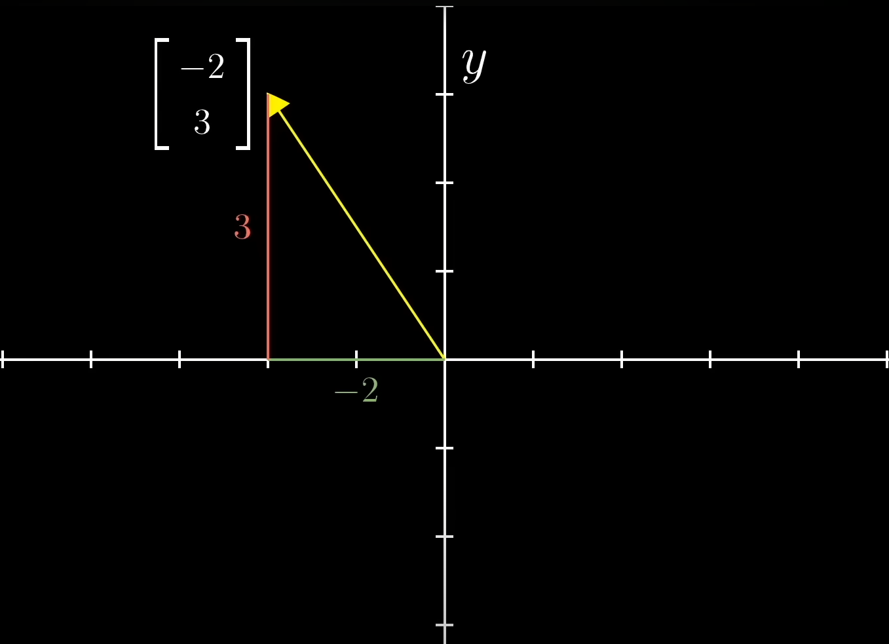
  * **x-axis** (horizontal)
  * **y-axis** (vertical)
* **Origin (0,0)** → tail of all vectors.
* A vector `[x, y]` means:

  * Move `x` units along x-axis (→ right if +, ← left if -)
  * Move `y` units along y-axis (↑ up if +, ↓ down if -)

👉 Each **pair of numbers** ↔ one unique **vector**.

### **3D Vectors**
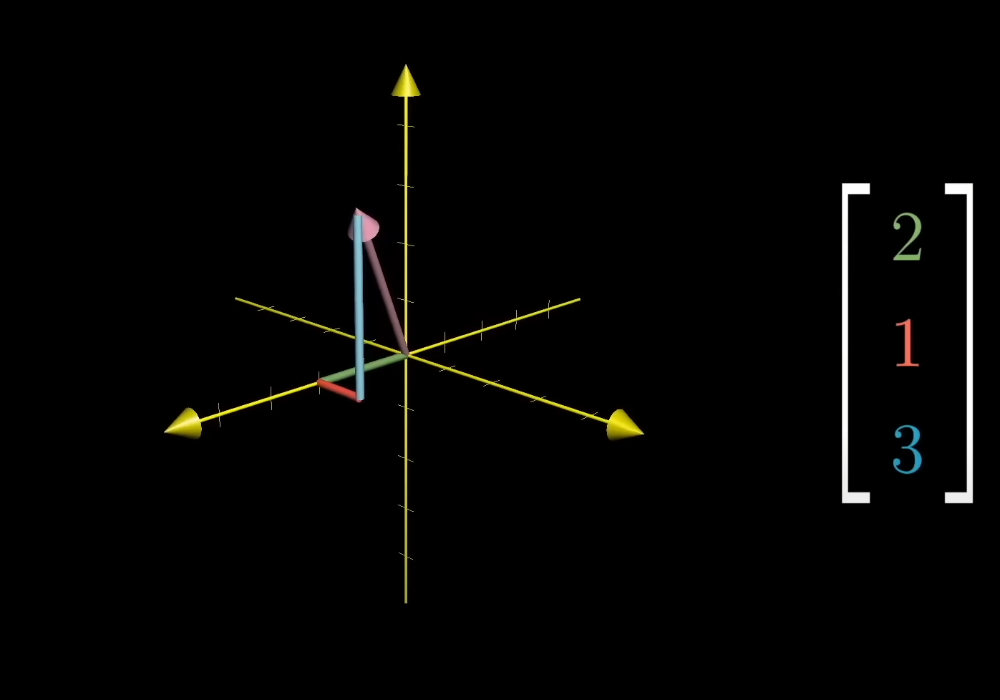
* Add a **z-axis** (perpendicular to x and y).
* A vector `[x, y, z]` means:

  * Move `x` along x-axis
  * Move `y` along y-axis
  * Move `z` along z-axis

👉 Each **triplet** ↔ one unique **3D vector**.

---

## 🔹 Vector Addition

### **Geometric Interpretation**
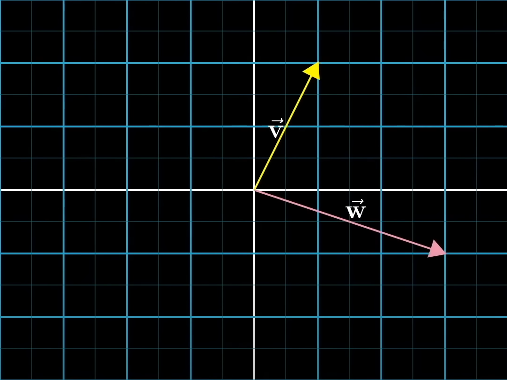             
         | |
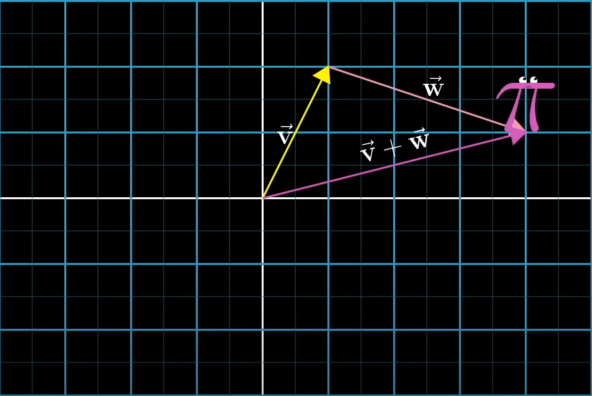
* Place the **tail of the 2nd vector** at the **tip of the 1st vector**.
* Draw a new vector from the **tail of the 1st** to the **tip of the 2nd**.
* This new arrow = **Sum of vectors**.

**Example:**

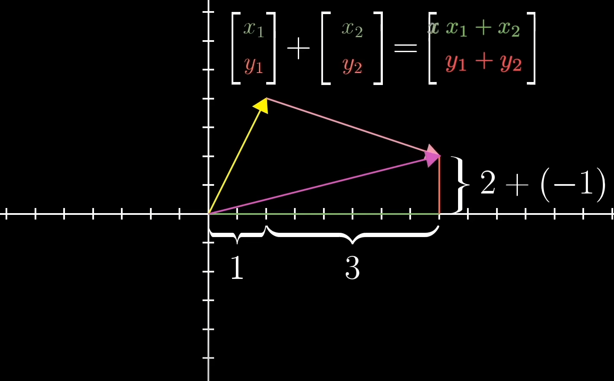
```
v₁ = [1, 2]
v₂ = [3, -1]
v₁ + v₂ = [1 + 3, 2 + (-1)] = [4, 1]
```

### **Conceptual View**

* Each vector = a **movement or step** in space.
* Adding them = combining movements.
* Analogy:

  * On number line, 2 + 5 = moving 2 right, then 5 right → 7 right.

---

## 🔹 Scalar Multiplication

### **Geometric Meaning**

* Multiply a vector by a **number (scalar)** → **scaling**.
* Examples:

  * `2 × v` → stretch the vector to twice its length.
  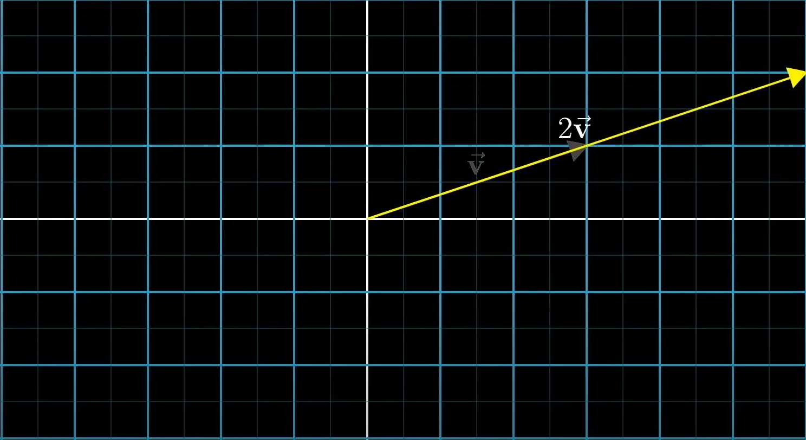
  * `(1/3) × v` → compress to one-third.
  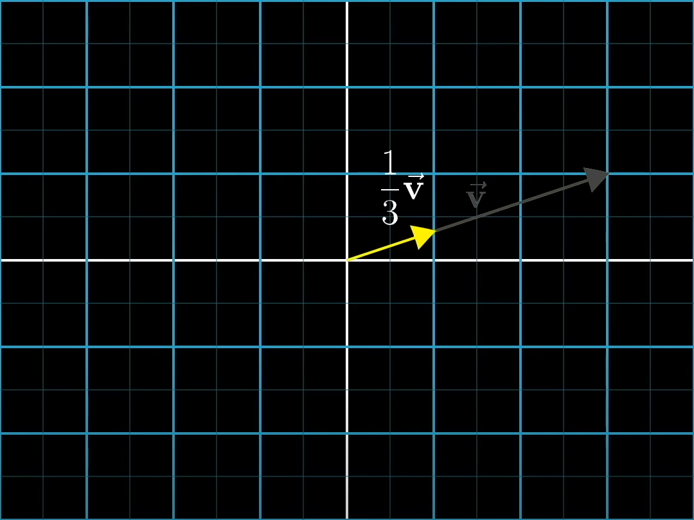
  * `(-1.8) × v` → flip direction and stretch by 1.8×.
  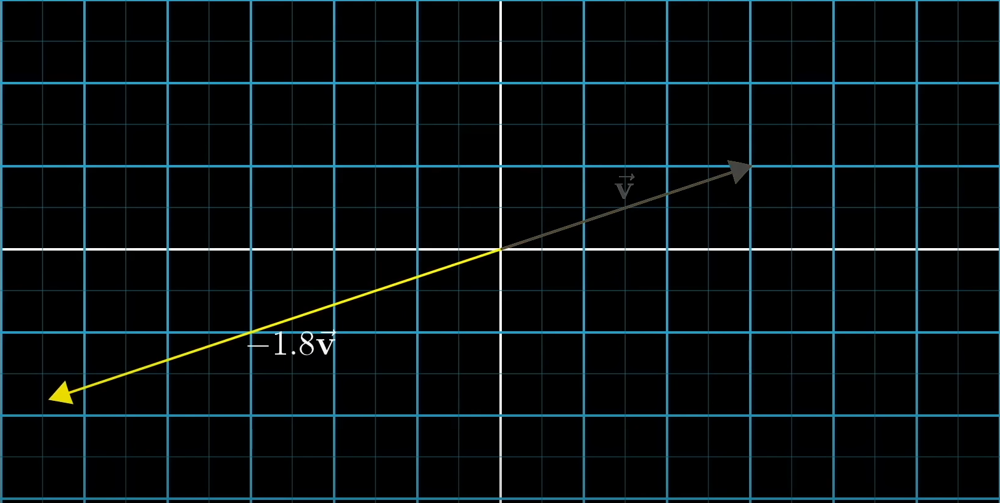

> 🔸 “Scaling” = stretching, squishing, or reversing a vector.

### **Numerical Definition**
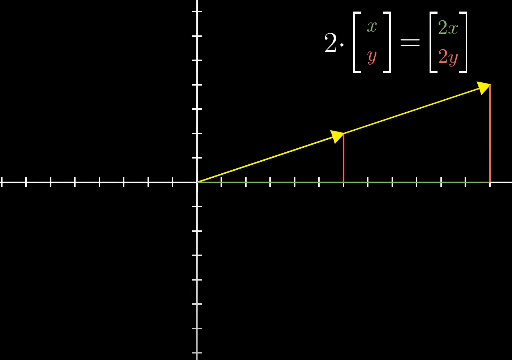
If
[
v = [x, y]
]
then
[
k × v = [k×x, k×y]
]

So, multiplying a vector by a scalar = multiply **each component** by that scalar.

---

## 🔹 Core Idea of Linear Algebra

All concepts in linear algebra revolve around:

1. **Vector addition**
2. **Scalar multiplication**

Everything else — span, basis, linear dependence — builds on these two.

---

## 🔹 Dual Nature of Vectors

| Viewpoint     | Representation   | Key Use                                                    |
| ------------- | ---------------- | ---------------------------------------------------------- |
| **Geometric** | Arrows in space  | Helps visualize relationships, directions, transformations |
| **Numeric**   | Lists of numbers | Enables computation and data manipulation                  |

👉 Linear algebra’s power lies in **translating** between these two worlds.

---

## 🔹 Importance of Understanding Vectors

* **For data analysts:**
  Visualizing lists of numbers (like features) geometrically reveals **patterns**.
* **For physicists / graphics programmers:**
  Vectors help **represent space** using numbers that computers can process.
* **For animations / simulations:**
  Start with geometric ideas → express numerically → compute pixel positions.

---

## 🧩 **Summary**

| Concept                   | Description                             |
| ------------------------- | --------------------------------------- |
| **Vector**                | Quantity with magnitude and direction   |
| **2D Vector**             | `[x, y]`                                |
| **3D Vector**             | `[x, y, z]`                             |
| **Addition**              | Combine two vectors tip-to-tail         |
| **Scalar Multiplication** | Stretch, compress, or reverse a vector  |
| **Scalar**                | A number used to scale vectors          |
| **Linear Algebra Core**   | Vector addition + scalar multiplication |
| **Dual Nature**           | Geometric ↔ Numeric representation      |
---


---

# 📘 **Lecture 2: Linear Combinations, Span, and Linear Dependence**

---

## 🔹 **Recap: Coordinates and Vectors**

* Vectors can be represented by coordinates — e.g., **(3, -2)** represents a 2D vector.
* Each coordinate acts as a **scalar** — it *scales* or *stretches* a base direction.
* In 2D:
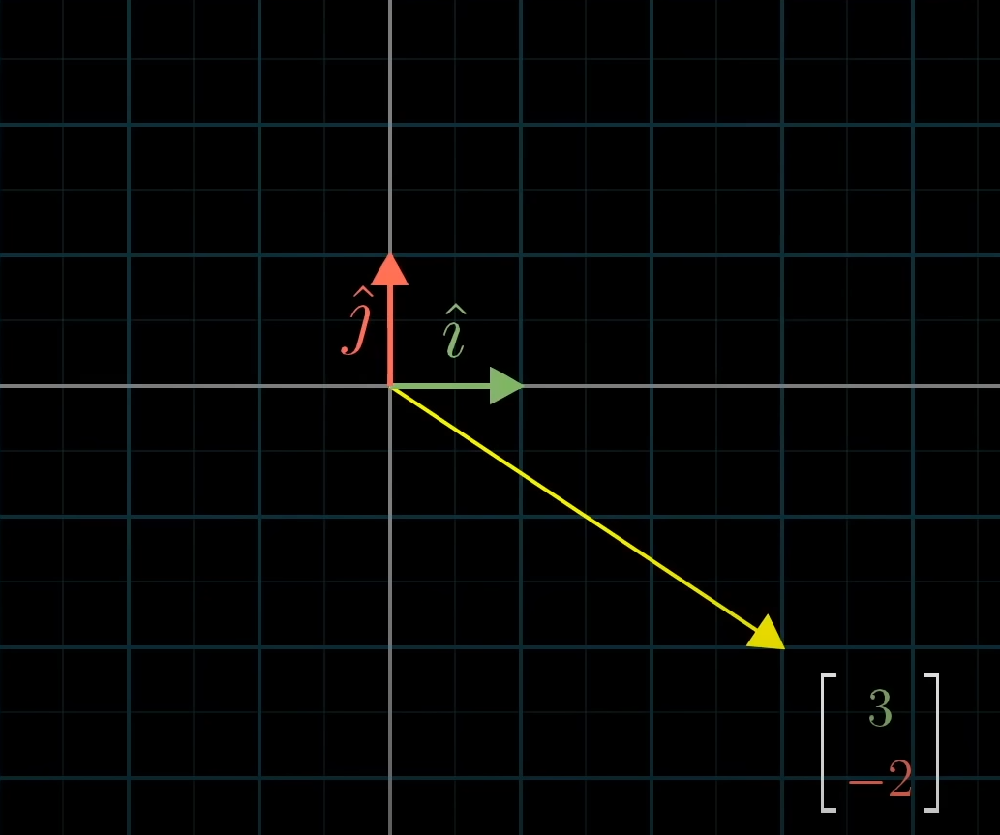

  * **î (i-hat)** → unit vector along x-axis
  * **ĵ (j-hat)** → unit vector along y-axis
* So, a vector **v = [3, -2]** can be expressed as:
  [
  v = 3{i} - 2{j}
  ]
  → the sum of two *scaled basis vectors*.
  
  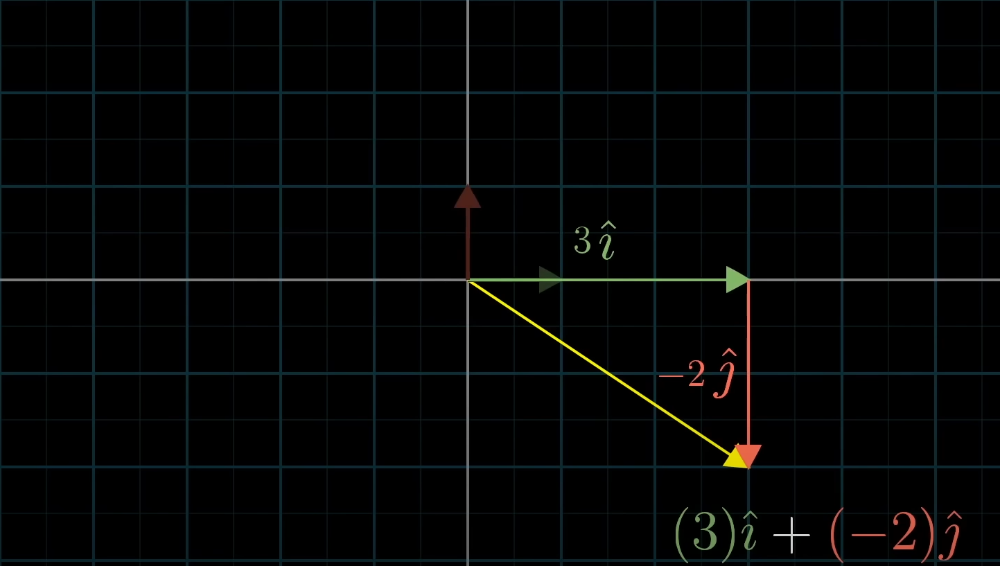

---

## 🧭 **Basis Vectors**

* **Basis vectors** are the fundamental building blocks of a coordinate system.
* In 2D, the **standard basis** = { î , ĵ }.
* You can choose **different basis vectors** — not necessarily perpendicular or unit length — and still form a valid coordinate system.
* Basis defines **how coordinates correspond** to vectors.

---

## 🧩 **Linear Combination**
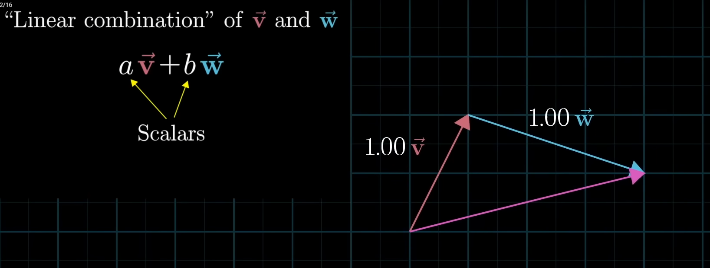
* When you **scale** vectors and **add** them, the result is a **linear combination**.

  **Example:**
  [
  v = a{u} + b{w}
  ]

  * **a, b** → scalars
  * **u, w** → base vectors
  * **v** → resulting vector

---

## 🔸 **Why “Linear”?**

* If you fix one scalar and vary the other, the **tip of the resulting vector** traces a **straight line**.
* Hence, the term **linear** combination.

---

## 🌐 **Span of Vectors**

* The **span** of a set of vectors = **all possible linear combinations** of them.
  
  [
  Span{{u}, {w}} = a{u} + b{w} 
  ]

### Examples:

* In **2D**:

  * If **u** and **w** point in *different directions* → their span = entire plane.
  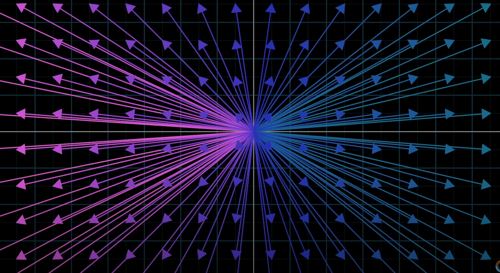
  * If **u** and **w** line up → their span = a single line.
  
  * If both are zero → span = only the origin.
  

* In **3D**:

  * Two non-parallel vectors → span a **flat sheet (plane)**.
  * Three non-coplanar vectors → span the **entire 3D space**.
  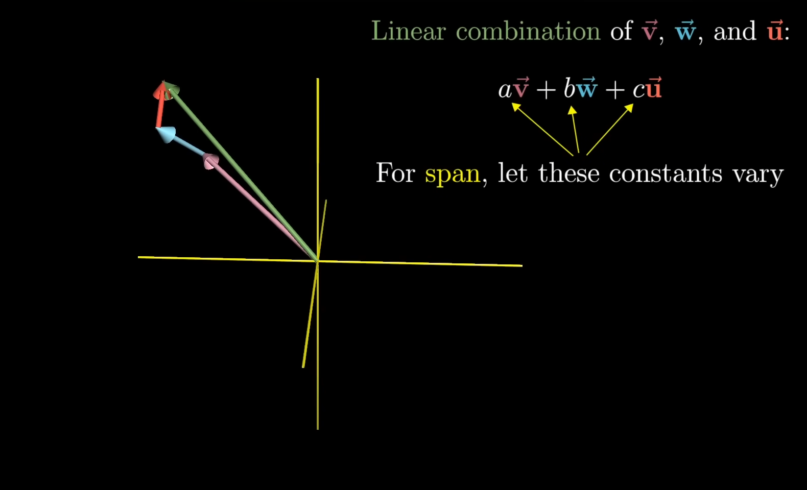
---

## 🪞 **Visualizing Span**

* Instead of arrows, you can represent each vector by the **point at its tip** (tail at origin).
* Then:

  * Span of two 2D vectors → a **line** or the **entire plane**.
  * Span of two 3D vectors → a **plane**.
  * Span of three 3D vectors → the **entire space**.

---

## ⚖️ **Linear Dependence and Independence**

### 🔹 **Linearly Dependent Vectors**

* At least one vector is **redundant** — it can be expressed as a linear combination of the others.
  → Removing it **does not change the span**.

  **Example:**

  * If **v₃ = 2v₁ + 3v₂**, then {v₁, v₂, v₃} are *linearly dependent*.

### 🔹 **Linearly Independent Vectors**

* No vector in the set can be expressed as a linear combination of the others.
  → Each vector adds a **new dimension** to the span.

---

## 🧠 **Definition: Basis of a Space**

A **basis** is a **set of linearly independent vectors** that **span** the entire space.

* In 2D → two linearly independent vectors form a basis.
* In 3D → three linearly independent vectors form a basis.

**Why this definition makes sense:**

* “Independent” ensures no redundancy.
* “Span” ensures they cover the entire space.
  → So, a basis is the *minimal and complete* set of vectors for describing the space.

---

## 💡 **Key Takeaways**

| Concept                 | Meaning                                                         |
| ----------------------- | --------------------------------------------------------------- |
| **Linear Combination**  | Scaling and adding vectors                                      |
| **Span**                | All vectors reachable from given vectors via linear combination |
| **Linear Dependence**   | One vector can be formed from others                            |
| **Linear Independence** | Each vector adds a new direction                                |
| **Basis**               | Linearly independent set that spans the space                   |

---


---

## 📘 **Topic: Linear Transformations and Matrices (2D Case)**

---

### 🌟 **1. Introduction**

* **Linear transformation** is the **core concept** that connects **geometry, functions, and matrices** in linear algebra.
* Understanding it helps make **all other topics** like determinants, eigenvalues, and matrix multiplication more intuitive.

---

### 🔹 **2. Meaning of the Term "Linear Transformation"**

| Term               | Meaning                                                                   |
| ------------------ | ------------------------------------------------------------------------- |
| **Transformation** | A function that takes an **input vector** and gives an **output vector**. |
| **Linear**         | Has special properties: lines stay straight, origin stays fixed.          |

👉 In simpler words,
A linear transformation is a **rule or function** that moves vectors around **without bending lines or shifting the origin**.

---

### 🎯 **3. Visualizing Transformations**

* Think of every **vector** as an **arrow** or as a **point** where its tip lies.
* The transformation moves every point to another location → like **morphing the entire grid**.
* To visualize:

  * Draw a **grid of points (x, y)**.
  * After applying transformation → watch how the **grid deforms** (stretches, squishes, rotates, etc.).

🌀 This gives the feeling of **space being squished or rotated**.

---

### ⚙️ **4. Conditions for a Linear Transformation**

A transformation is **linear** if:

1. **Lines remain straight** (not curved).
2. **The origin stays fixed** (does not move).

🚫 Not Linear Examples:

* Curves lines → ❌
* Moves origin → ❌
* Makes evenly spaced lines uneven → ❌

✅ Linear Example:

* Rotations, reflections, scaling, and shears — all keep the origin fixed and lines straight.

---

### 🧭 **5. Representing Transformations Numerically**

To describe any 2D linear transformation, we only need to know:

* Where **basis vectors** go:

  * ( $\hat{i}$ = (1, 0) )
  * ( $\hat{j}$ = (0, 1) )

➡️ Once we know **where $\hat{i}$** and **$\hat{j}$** land after transformation,
we can find **where any vector (x, y)** will land.

---

### 🧩 **6. Example: Finding the Transformed Vector**
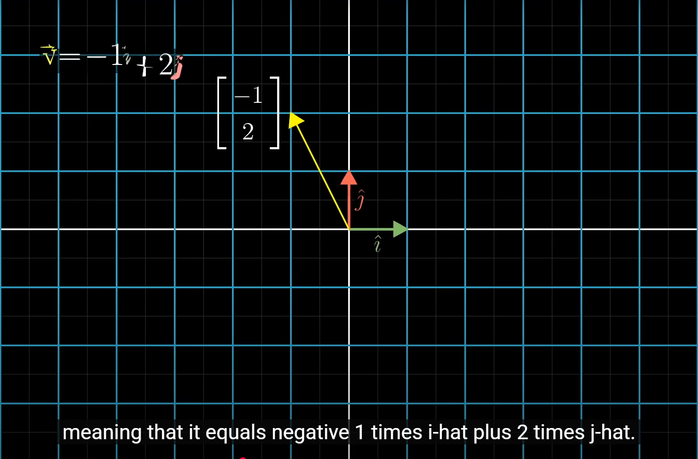
||
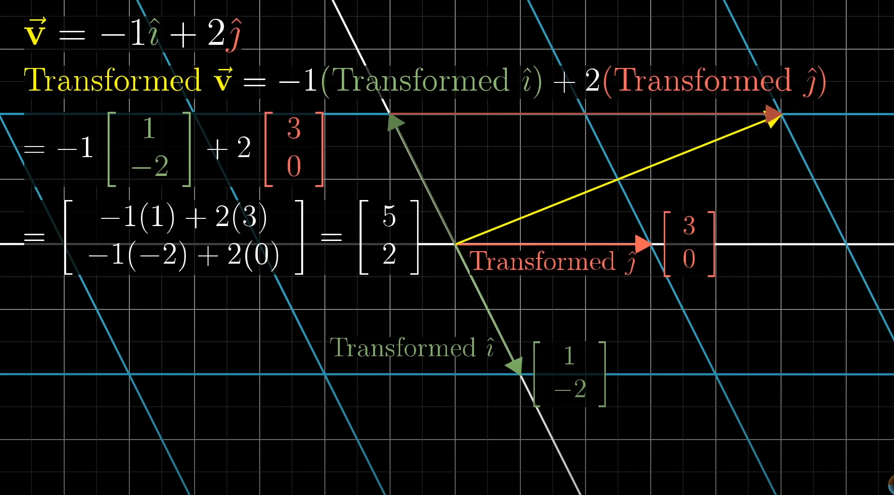
Suppose:

* $\hat{i}$ lands on ( (1, -2) )
* $\hat{j}$ lands on ( (3, 0) )

Now, a vector ( v = (-1, 2) ) can be written as:
[
v = -1.i + 2.j
]

After transformation:

[
v' = -1.(1, -2) + 2.(3, 0)
]

[
v' = (5, 2)
]

📘 So, **knowing where (i)** and **(j)** go helps find where **any vector goes**.

---

### 🧮 **7. General Formula for Linear Transformation**

Let:

* $\hat{i} \to (a, c)$ 
* $\hat{j} \to (b, d)$ 

Then any vector ( (x, y) ) transforms to:
[
(x, y) to (ax + by, cx + dy)
]

---

### 🧱 **8. Matrix Representation**

We represent these coordinates as a **2×2 matrix**:

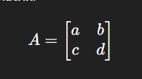

* **Columns = Images of basis vectors**

  * 1st column → where $\hat{i}$ lands
  * 2nd column → where $\hat{j}$ lands 

Then, transformation is:
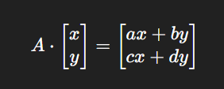
=============


---

### 💡 **9. Geometric Interpretation of Matrix–Vector Multiplication**

Matrix-vector multiplication = applying a **linear transformation**.

| Step                      | Meaning                                                           |
| ------------------------- | ----------------------------------------------------------------- |
| Multiply matrix by vector | Combines transformed basis vectors using the vector’s coordinates |
| Result                    | The transformed version of that vector in the new space           |

---

### 🔁 **10. Examples of Common Transformations**

| Transformation                      | Effect                          | Matrix                                       |
| ----------------------------------- | ------------------------------- | -------------------------------------------- |
| **90° Rotation (Counterclockwise)** | Rotates all space around origin | (0 & -1 \ 1 & 0) |
| **Shear (x-direction)**             | Slants the grid horizontally    | (1 & 1 \ 0 & 1)  |
| **Scaling**                         | Stretches space                 | (k & 0 \ 0 & k)  |
| **Reflection (x-axis)**             | Flips over x-axis               | (1 & 0 \ 0 & -1) |

---

### 🧠 **11. Linear Dependence and Dimension Change**

If **$\hat{i}$** and **$\hat{j}$** land on **linearly dependent vectors**,
then:

* The transformation **squishes 2D space** onto a **line** (1D).
* The determinant of such a matrix = 0.

---

### 🧩 **12. Summary of Key Ideas**

| Concept                              | Description                                                                            |
| ------------------------------------ | -------------------------------------------------------------------------------------- |
| **Linear Transformation**            | A function that maps vectors to vectors while keeping lines straight and origin fixed. |
| **Basis Vectors**                    | (i = (1, 0)), (j = (0, 1)) — their images determine the transformation.    |
| **Matrix Columns**                   | Show where $\hat{i}$ and $\hat{j}$ go.                                                 |
| **Matrix–Vector Multiplication**     | Gives transformed vector coordinates.                                                  |
| **Geometric Meaning**                | Every matrix represents a transformation of 2D space.                                  |
| **When Basis Vectors Are Dependent** | The transformation compresses space to a lower dimension.                              |

---

### 🚀 **13. Why This Concept is Important**

Once you see matrices as **transformations of space**,
topics like:

* **Matrix multiplication**
* **Determinants**
* **Change of basis**
* **Eigenvalues**

become **much easier and more visual**.

---

### 🧾 **14. Key Takeaway**

> Every **matrix** = A **transformation** of space.
>
> Matrix columns = Transformed basis vectors.
>
> Multiplying a matrix and a vector = Applying that transformation to the vector.

---

---

# 🧭 **Notes — Matrix Multiplication as Composition of Linear Transformations**

---

## 🔁 Recap: Linear Transformations and Matrices

* A **linear transformation** is a function that takes vectors as **inputs** and produces **vectors as outputs**.

* Visually, it can be thought of as **smooshing space** — grid lines remain **parallel and evenly spaced**, and the **origin stays fixed**.

* Every transformation in 2D is completely determined by **where it sends**:

  * $\hat{i}$ → the first basis vector
  * $\hat{j}$ → the second basis vector

* A vector $\vec{v}$ with coordinates $(x, y)$ can be expressed as:

  $$
  \vec{v} = x\hat{i} + y\hat{j}
  $$

* After transformation:

  $$
  T(\vec{v}) = x , T(\hat{i}) + y , T(\hat{j})
  $$

* Thus, if we record the coordinates of $T(\hat{i})$ and $T(\hat{j})$ as **columns of a matrix**, then matrix-vector multiplication represents applying that transformation to a vector.

  $$
  T(\hat{i}) =
  \begin{bmatrix} a \\ c \end{bmatrix},
  \quad
  T(\hat{j}) =
  \begin{bmatrix} b \\ d \end{bmatrix}
  $$

  ⇒ Transformation matrix:

  $$
  A =
  \begin{bmatrix}
  a & b \\
  c & d
  \end{bmatrix}
  $$


  Applying $A$ to $\begin{bmatrix} x \\ y \end{bmatrix}$ gives:

  $$ A \begin{bmatrix} x \\ y \end{bmatrix} =  $$
  $$
  \begin{bmatrix}
  ax + by \\
  cx + dy
  \end{bmatrix}
  $$

---

## 🔄 Composing Transformations

Sometimes, we apply **one transformation after another** — for example:
<video controls src="WhatsApp Video 2025-10-12 at 23.13.17_41cfaa55.mp4" title="Title"></video>
1. Rotate by 90° counterclockwise.
2. Then apply a shear.

The **combined effect** is a new linear transformation, called the **composition**.


### 🧩 Example

* Suppose we rotate first, then shear.
* The overall transformation can again be represented by a single matrix.

Let’s call the rotation matrix $R$ and the shear matrix $S$.
If we apply **rotation first** and **shear second**, the total effect on any vector $\vec{v}$ is:
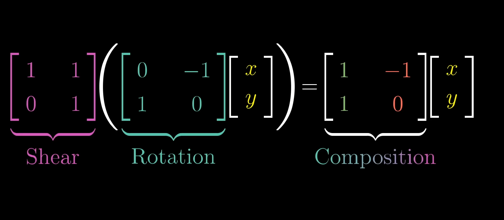
$$
S(R\vec{v}) = (SR)\vec{v}
$$

So, the **composition matrix** = product of the two matrices:

$$
\text{Composition Matrix} = S \times R
$$

> ⚠️ **Order matters:**
> Matrix multiplication represents *function composition*, which is applied **right to left**:
>
> * The **rightmost matrix** acts **first**.
> * The **leftmost matrix** acts **second**.

---

## 🧮 How to Compute the Product Geometrically

To find the **composition matrix** without animation:

1. Follow where $\hat{i}$ and $\hat{j}$ go:

   * After applying the right-hand matrix.
   * Then apply the left-hand matrix to those results.

2. The resulting coordinates become the **columns** of the new (product) matrix.

### General Case
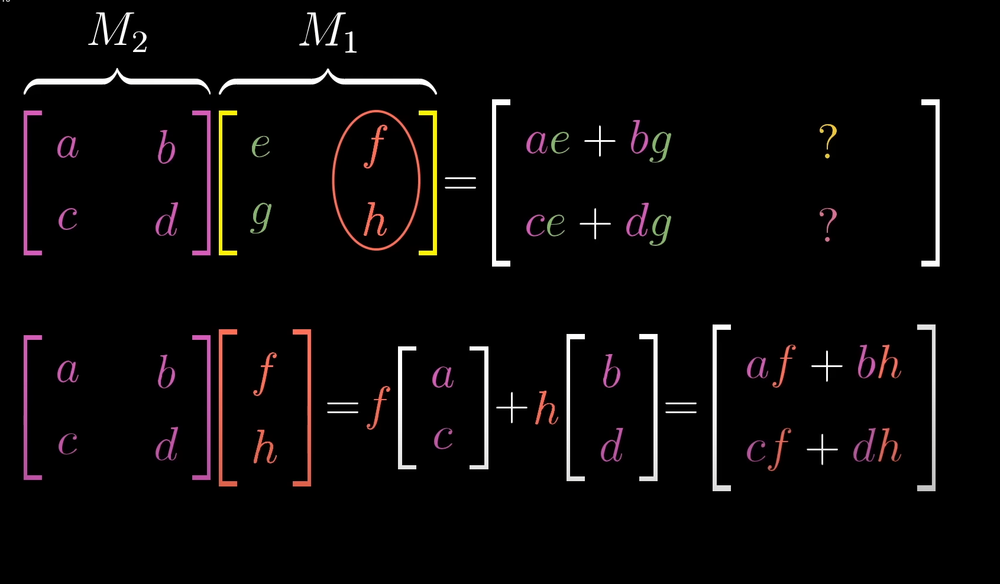
Let:
$$
M_1 =
\begin{bmatrix}
a & b \\
c & d
\end{bmatrix},
\quad
M_2 =
\begin{bmatrix}
p & q \\
r & s
\end{bmatrix}
$$

Then:

* First column of product = $M_1 \times$ (first column of $M_2$)
* Second column of product = $M_1 \times$ (second column of $M_2$)

Carrying out the multiplication:

$$
M_1 M_2 =
\begin{bmatrix}
ap + br & aq + bs \\
cp + dr & cq + ds
\end{bmatrix}
$$

---

## 🔁 Conceptual Understanding: Why Matrix Multiplication Works

* Multiplying two matrices corresponds to **applying one transformation after another**.
* Each column represents **where the basis vectors end up** after both transformations.

So, even though numerically it may look like a bunch of formulas, geometrically it means:

> “Apply the transformation represented by the right matrix, then the one represented by the left.”

---

## ⚠️ Order Matters!

Matrix multiplication is **not commutative**:
$$
AB \neq BA
$$

* Example:

  * If you first apply a **shear**, then a **rotation**, the final position of vectors is **different** than if you rotate first and shear after.
* Visualization makes this clear — the same vectors move to **different positions**.

---

## ✅ Associativity (Why It Works)

Matrix multiplication **is associative**:
$$
(A B) C = A (B C)
$$

* Geometric reasoning:

  * Applying three transformations one after another:

    * First $C$, then $B$, then $A$
  * No matter where you put parentheses, you’re still applying **the same sequence** of transformations.

So associativity just means:

> The order of transformations **remains the same**, even if we group them differently.

This understanding is much simpler (and deeper) than memorizing algebraic proofs.

---

## 🧠 Key Takeaways

| Concept                      | Meaning                                                           |
| ---------------------------- | ----------------------------------------------------------------- |
| Linear Transformation        | A mapping that keeps lines straight and origin fixed              |
| Matrix Columns               | Represent where basis vectors land                                |
| Matrix-Vector Multiplication | Applying a transformation to a vector                             |
| Matrix-Matrix Multiplication | Composing two transformations (apply right first, then left)      |
| Non-Commutativity            | Order matters — $AB \neq BA$                                      |
| Associativity                | Grouping doesn’t matter — $(AB)C = A(BC)$                         |
| Geometric View               | Think in terms of movement and deformation of space, not formulas |

---


---

## 🧭 Topic: Determinant – Geometric Meaning of a Linear Transformation

---

### 🔹 Recap: Linear Transformations and Matrices

* A **linear transformation** ( T ) is a function that maps vectors to vectors while keeping grid lines parallel and evenly spaced, and keeping the origin fixed.
* In 2D:

  * $( \hat{i} ) and ( \hat{j} )$ (basis vectors) determine the transformation.
  * Any vector $( \vec{v} = x\hat{i} + y\hat{j} )$ transforms as-
    
    
    $[
    T(\vec{v}) = x , T(\hat{i}) + y , T(\hat{j})
    ]$
* The columns of a matrix record **where ( $\hat{i} )$** and **( $\hat{j}$ )** land.
* Hence, **a matrix represents a linear transformation**.

---

## 🧩 The Idea of “Stretching” or “Squishing” — The Determinant

### 🔹 What it Represents

The **determinant** of a linear transformation measures **how much area (in 2D)** or **volume (in 3D)** is scaled.

Determinant is basically the scale by which area of any region(in 2D) or volume of any space(in 3D) changes in a linear tranformation
| Situation                   | Geometric Meaning    | Determinant            |
| --------------------------- | -------------------- | ---------------------- |
| Area doubles                | Scales area by 2     | $( \det = 2 )$           |
| Area halves                 | Scales area by ½     | $( \det = \frac{1}{2} )$ |
| Space flattened into a line | Area → 0             | $( \det = 0 )$           |
| Space flipped (mirrored)    | Orientation reversed | $( \det < 0 )$           |

---

### 🔹 Example 1: Simple Scaling
<video controls src="WhatsApp Video 2025-10-13 at 00.36.11_d8ac2085.mp4" title="Title"></video>
Matrix:
$$
A =
\begin{bmatrix}
3 & 0 \\
0 & 2
\end{bmatrix}
$$


* $( \hat{i} )$ → scaled by 3
* $( \hat{j} )$ → scaled by 2
* Unit square (area = 1) → rectangle (area = 6)
  ⇒ $( \det(A) = 6 )$

---

### 🔹 Example 2: Shear Transformation
<video controls src="WhatsApp Video 2025-10-13 at 00.40.50_bea75778.mp4" title="Title"></video>
Matrix:
$
B =
\begin{bmatrix}
1 & 1 \\
0 & 1
\end{bmatrix}
$

* Unit square becomes a **parallelogram**.
* Area remains 1 (no change).
  ⇒ $( \det(B) = 1 )$

---

## 🧭 Determinant as a Universal Area Scaling Factor

* Whatever happens to **one** unit square in the grid happens to **all** (because lines remain parallel and evenly spaced).
* So, **one area scaling factor** applies to every shape.
* This **scaling factor = determinant**.

---

## 🔄 Orientation and Sign of the Determinant

### 🔹 Positive vs. Negative Determinant
<video controls src="WhatsApp Video 2025-10-13 at 01.07.03_8f2cab0d.mp4" title="Title"></video>
* If a transformation **flips** space (like a mirror reflection), the **orientation** reverses.
  → Determinant becomes **negative**.
* $( |\det| )$ still gives the **magnitude of area scaling**.

### 🔹 Example

Matrix:
$$
C =
\begin{bmatrix}
1 & 2 \\
1 & -1
\end{bmatrix}
$$

* Determinant = ( (1)(-1) - (2)(1) = -3 )
* Area scaled by 3; orientation flipped (hence negative).

---

## 🧱 Intuition for the Formula (2×2 Case)

For matrix
$$
A =
\begin{bmatrix}
a & b \\
c & d
\end{bmatrix}
$$
the determinant is:
$
\det(A) = ad - bc
$

**Why?**

* ( a ) and ( d ) stretch the axes — their product gives the rectangular area.
* ( b ) and ( c ) skew (shear) the grid — subtracting ( bc ) corrects for diagonal distortion.

---

## 🧊 Determinant in 3D

* Measures **volume scaling**.
* Imagine a unit cube spanned by $( \hat{i}, \hat{j}, \hat{k} )$.
* After transformation → **parallelepiped** (a “slanty cube”).

  * Volume of that shape = |determinant|.
* $( \det = 0 )$ → space squished into a plane or line (0 volume).
* Negative determinant → space orientation flips (like mirror inversion).

---

## 🧤 Right-Hand Rule for Orientation in 3D

* Start with:

  * Forefinger → $( \hat{i} )$
  * Middle finger → $( \hat{j} )$
  * Thumb → $( \hat{k} )$
* If after transformation, this alignment works with the **right hand**, orientation preserved → $( \det > 0 )$.
* If only works with the **left hand**, orientation flipped → $( \det < 0 )$.

---

## ⚙️ Properties of Determinant

| Property                              | Meaning                                                                                    |
| ------------------------------------- | ------------------------------------------------------------------------------------------ |
| $( \det(AB) = \det(A) \times \det(B) )$ | Applying two transformations scales area/volume by the product of their individual scales. |
| $( \det(I) = 1 )$                       | Identity transformation keeps area unchanged.                                              |
| $( \det(A^{-1}) = \frac{1}{\det(A)} )$  | Inverse transformation reverses the scaling.                                               |
| $( \det(A^T) = \det(A) )$               | Transposing doesn’t change scaling.                                                        |
| $( \det(A) = 0 )$                       | Transformation flattens space (not invertible).                                            |

---

## 🧠 Conceptual Summary

| Concept               | Visual Meaning                           | Algebraic Meaning              |
| --------------------- | ---------------------------------------- | ------------------------------ |
| Linear Transformation | Warps space but keeps grid straight      | Represented by a matrix        |
| Determinant           | Area/Volume scaling + orientation        | ( ad - bc ) (2×2 case)         |
| $( \det = 0 )$          | Space collapses to lower dimension       | Columns are linearly dependent |
| $( \det < 0 )$          | Flips orientation                        | Reflection-like transformation |
| $( \det(AB) )$          | Combined scaling of both transformations | Product of determinants        |

---

### 💬 Quick Intuition Exercise

If
$$
\det(A) = 2 \quad \text{and} \quad \det(B) = -3
$$
then
$$\
\det(AB) = \det(A) \cdot \det(B) = -6
$$
→ The combined transformation flips orientation and scales area by a factor of 6.

---

### 🧩 Final Takeaway

> The determinant tells **how much a linear transformation scales space** and **whether it flips orientation** — a single elegant number encoding both geometry and algebra.

---


