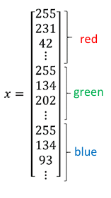
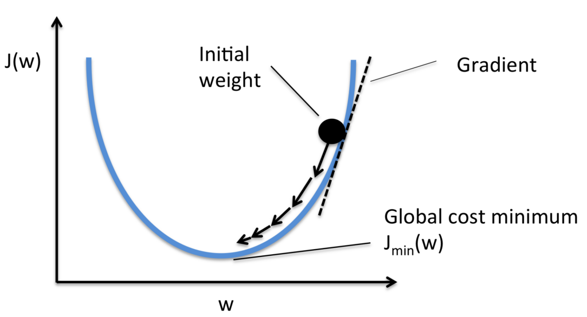
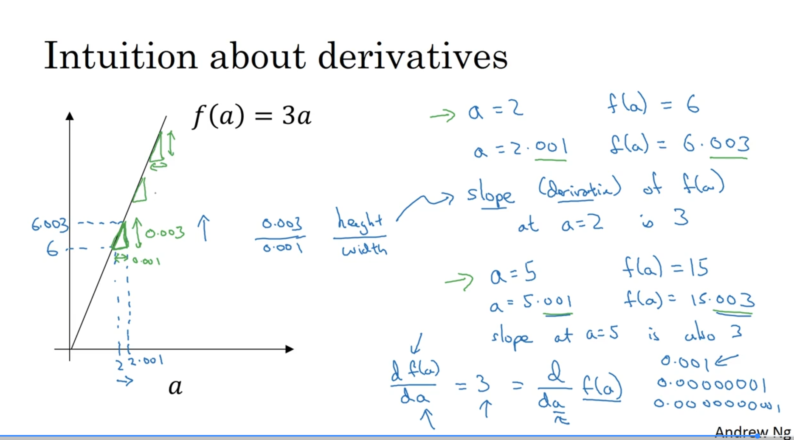
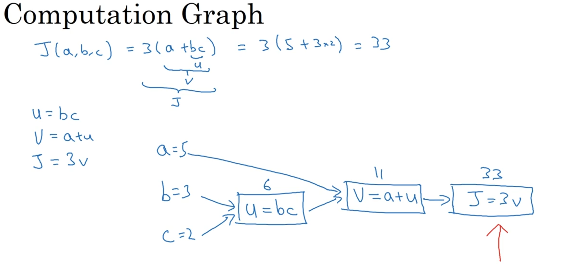
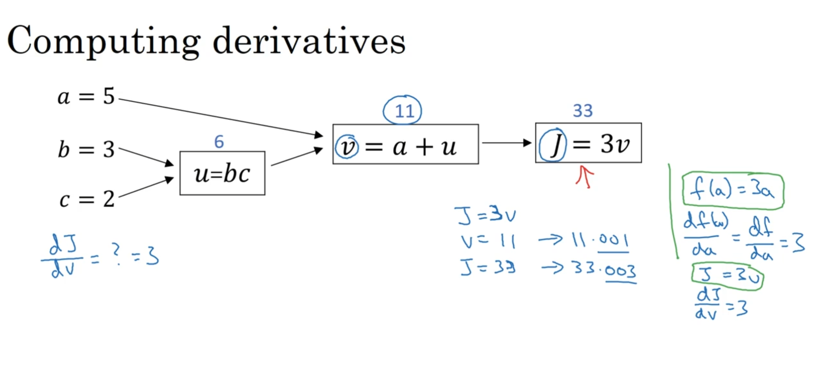
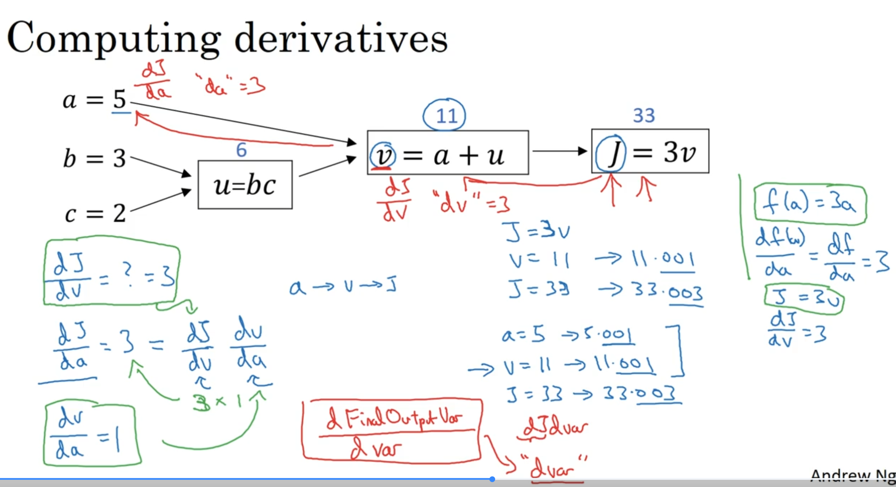
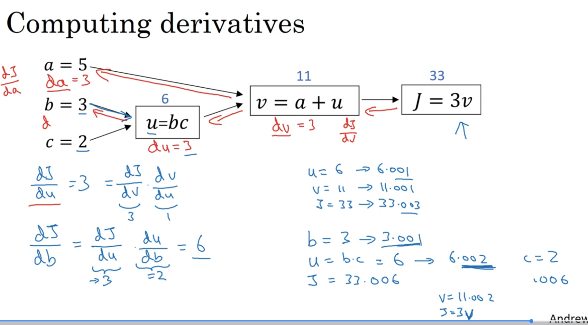
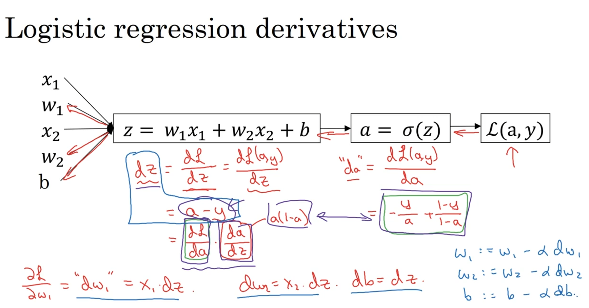
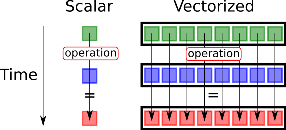
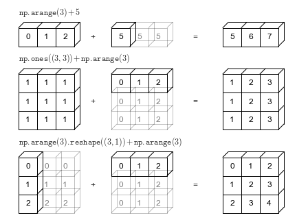

# 🐾 **Binary Classification**

### 1️⃣ The Goal: Cat vs. Non-Cat

Binary classification is a supervised learning task where the goal is to predict one of two possible outcomes. The output, `y`, is always a discrete value, either **0** (negative class) or **1** (positive class).

A classic example used throughout the course is building a **cat detector**.
* **Input (x):** An image.
* **Output (y):** 1 if the image is a cat, 0 if it's not a cat.


### 2️⃣ Representing the Input (x)


How does a computer "see" an image? An image is stored as three separate matrices for the **Red, Green, and Blue (RGB)** color channels.

* **Pixel Intensities:** Each cell in these matrices contains a value representing pixel intensity.
* **Feature Vector:** To feed this into a neural network, we "unroll" or "reshape" these three matrices into a single, long column vector called a **feature vector, `x`**.
* **Input Size ($n_x$):** For a 64x64 pixel image, the resulting feature vector `x` has a dimension of `64 * 64 * 3 = 12,288`. This number is the input size, denoted as $n_x$.



### 3️⃣ Notation for the Dataset

To work with data efficiently, we use a standard set of notations:

* **A single example:** is represented by a pair `(x, y)`, where `x` is the $n_x$-dimensional feature vector and `y` is the label (0 or 1).
* **Training set size:** The number of training examples is denoted by `m`.
* **Input Matrix (X):** To process all examples at once (vectorization), we stack the individual feature vectors $`x^i`$ side-by-side in columns to form a matrix `X`.
    * The shape of `X` is $(n_x, m)$.
* **Label Matrix (Y):** Similarly, we stack the labels $`y^i`$ side-by-side to form a row vector `Y`.
    * The shape of `Y` is $(1, m)$.

---


# 📈 **Logistic Regression**

### 1️⃣ The Core Idea

Logistic Regression is a learning algorithm used for binary classification, where the output `y` is always either 0 or 1. Given an input feature vector `x` (like our unrolled cat image), the goal is to output a prediction, which we call `ŷ` (y-hat), that represents the probability of `y` being 1.

* **Goal:** Predict `ŷ = P(y=1 | x)`, which is the probability that the image is a cat, given the input pixels `x`.
* **Constraint:** `ŷ` must be between 0 and 1.

### 2️⃣ The Problem with a Linear Function

A simple approach would be to use a linear function, just like in linear regression: `ŷ = wᵀx + b`. However, this doesn't work for classification because the output can be any real number—much larger than 1 or even negative—which doesn't make sense for a probability.

### 3️⃣ The Solution: The Sigmoid Function

To solve this, we use the **sigmoid function**, denoted by the Greek letter sigma (σ). This function takes any real number `z` and "squashes" it into a value between 0 and 1, which is exactly what we need for a probability.

The formula is: ******σ(z) = 1 / (1 + e⁻ᶻ)****** 


It has some very useful properties:
* If `z` is a large positive number, σ(z) is close to **1**.
* If `z` is a large negative number, σ(z) is close to **0**.
* If `z` is 0, σ(z) is **0.5**.

### 4️⃣ The Logistic Regression Model

By combining the linear function with the sigmoid function, we get the final model for logistic regression:

1.  First, we compute `z = wᵀx + b`.
2.  Then, we pass the result through the sigmoid function: `ŷ = a = σ(z)`.
    * (Here, we introduce `a` for "activation," a term that will become very important in neural networks).

The job of the learning algorithm is to find the best parameters **w** (weights) and **b** (bias) so that `ŷ` is a good estimate of the true probability.

***

### 🧠 Understanding Parameters 'w' and 'b'

Think of **'w'** and **'b'** as the "dials" or "knobs" that the learning algorithm tunes to make accurate predictions. They are the core components that transform your input data into a final output.

---
### 1️⃣ **'w': The Weights**

The variable **'w'** stands for **weights**. It's a vector of numbers, and its job is to determine the importance of each input feature.

* **Analogy:** Imagine you're predicting if a student will pass an exam. The input features might be `hours_studied`, `previous_grades`, and `hours_of_sleep`. The weights `w` would assign a numerical importance to each of these features. Intuitively, `hours_studied` would get a high positive weight, while `hours_of_sleep` might get a smaller positive weight.
* **Vector Dimension:** The reason **'w'** is an $n_x$-dimensional vector is that there is one weight for each of the $n_x$ input features. For our cat detector example, $n_x$ was 12,288, so **'w'** would be a vector with 12,288 numbers, one for each pixel. Each weight signifies how important that specific pixel is for determining if the image is a cat.

---
### 2️⃣ **'b': The Bias**

The variable **'b'** stands for **bias**. It's a single real number, not a vector. Its job is to provide an offset or a baseline, independent of any input features.

* **Analogy:** Continuing the exam example, the bias 'b' could represent a student's baseline probability of passing, even before we consider any specific features. Perhaps the exam is generally very easy, so there's a high baseline chance of passing. The bias captures this.
* **In Mathematics:** In the linear equation `z = wᵀx + b`, the bias **'b'** is exactly like the y-intercept in the equation of a line, `y = mx + c`. It shifts the entire function up or down, allowing the model to fit the data better.

---
### 3️⃣ **Putting It Together**

In logistic regression, the model first calculates a linear combination: `z = wᵀx + b`.

* The `wᵀx` part calculates a weighted sum, essentially a "score" based on how important each input feature is.
* The `+ b` part then shifts this score up or down.

This final score `z` is then passed through the sigmoid function to produce the final probability `ŷ = σ(z)`. The learning process is all about adjusting **'w'** and **'b'** to make this probability as accurate as possible across all your training examples.

### 📐 **Mathmetical Intuition**

This equation is a linear function, just like `y = mx + c` from high school math, but applied to vectors. Its purpose is to calculate a "score" or a "log-odds" value (`z`) based on the input features.

-----

### 🧠 The "Ingredients": w, x, and b

First, let's be very clear about what each variable is and, most importantly, its **shape**.

| Variable | Name | What it is | Shape / Dimension |
| :--- | :--- | :--- | :--- |
| **x** | **Input Features** | A vector containing all the input data for a *single* example (e.g., all 12,288 pixel values for one image).  | An $n_x$ by 1 column vector. |
| **w** | **Weights** | A vector containing the "importance" value for each corresponding input feature. The model *learns* these values.  | An $n_x$ by 1 column vector. |
| **b** | **Bias** | A single number that provides an offset, like the y-intercept in a line. The model *learns* this value.  | A 1 by 1 scalar (a single real number). |
| **z** | **Output Score** | The raw output of the linear calculation, before it's turned into a probability. | A 1 by 1 scalar (a single real number). |

-----

### 🔄 The "T" Operator: Transpose

The superscript **'T'** stands for **Transpose**. The transpose operation "flips" a matrix or vector over its main diagonal. For a vector, it simply changes a **column vector** into a **row vector**, or vice versa.

  * **w** starts as a column vector (shape: $n_x$ by 1).
  * **wᵀ** (w-transpose) becomes a row vector (shape: 1 by $n_x$).

**Example:** If $n_x = 3$:
If `w` =

```
[w₁]
[w₂]
[w₃]
```

Then 
``` 
wᵀ = [w₁ w₂ w₃] 
```

-----

### 🔢 The Multiplication: `wᵀx` (The Dot Product)

This is the most important part of the calculation. We are multiplying the **row vector** `wᵀ` by the **column vector** `x`. This specific operation is called a **dot product**.

**Rule of Matrix Multiplication:** To multiply two matrices (or vectors), the number of columns in the first matrix must equal the number of rows in the second.

  * Shape of `wᵀ`: (1, $n_x$)
  * Shape of `x`: ($n_x$, 1)

Since the inner dimensions ($n_x$ and $n_x$) match, we can multiply them. The result will have the shape of the outer dimensions: (1, 1), which is a single number.

**How it's calculated:** You multiply each element of `wᵀ` by the corresponding element of `x` and then sum up all the results.

`wᵀx = (w₁ * x₁) + (w₂ * x₂) + ... + (wₙₓ * xₙₓ)`

This gives you a single number, which is a weighted sum of the features.

-----

### ✨ Putting It All Together: A Concrete Example

Let's assume we have 3 input features ($n_x = 3$).

1.  **Define our "ingredients":**

      * `x` (inputs):
        ```
        [200]   (e.g., hours_studied)
        [  8]   (e.g., hours_of_sleep)
        [  4]   (e.g., previous_grades_avg)
        ```
      * `w` (weights learned by the model):
        ```
        [0.5]
        [0.1]
        [0.8]
        ```
      * `b` (bias learned by the model): `-10`

2.  **Transpose the weights `w` to get `wᵀ`:**

      * `wᵀ = [0.5  0.1  0.8]`

3.  **Calculate the dot product `wᵀx`:**

      * `wᵀx = (0.5 * 200) + (0.1 * 8) + (0.8 * 4)`
      * `wᵀx = 100 + 0.8 + 3.2`
      * `wᵀx = 104` (This is our weighted score)

4.  **Add the bias `b` to get the final score `z`:**

      * `z = wᵀx + b` 
      * `z = 104 + (-10)`
      * `z = 94`

This final number, `z=94`, is then passed into the sigmoid function `σ(z)` to get the final probability prediction `ŷ`.


# 📉 **Logistic Regression Cost Function**

### 1️⃣ The Core Idea: Measuring Error

The goal of training is to find the parameters `w` and `b` that make our predictions `ŷ` as close to the true labels `y` as possible. To do this, we need a way to quantify the error.

We do this in two steps:
1.  **Loss Function (L):** Measures the error for a *single* training example.
2.  **Cost Function (J):** Measures the average error over the *entire* training set.

The purpose of a loss or cost function is to measure how well a machine learning model's predictions match the actual correct answers while using some given Parameters(w,b) so that we can find the best set of parameters for our model to imporve the model performance by checking its performance for different values of parameters using cost function.
### 2️⃣ The Loss Function (L)

A simple idea would be to use the squared error, `L = ½(ŷ - y)²`, just like in linear regression. However, for logistic regression, this creates a "non-convex" optimization problem, meaning it has many local minima, making it hard to find the best parameters.

Instead, we use a different loss function that is convex and works well for this problem:
**L(ŷ, y) = -[ y log(ŷ) + (1 - y) log(1 - ŷ) ]**

Let's see why this makes sense:

* **Case 1: If the true label y = 1**
    * The loss becomes `L = -log(ŷ)`.
    * To make the loss small, we need `log(ŷ)` to be large, which means `ŷ` must be as close to **1** as possible. This is exactly what we want!

* **Case 2: If the true label y = 0**
    * The loss becomes `L = -log(1 - ŷ)`.
    * To make the loss small, we need `log(1 - ŷ)` to be large, which means `(1 - ŷ)` should be close to 1, and therefore `ŷ` must be as close to **0** as possible. Again, this is what we want.

### 3️⃣ The Cost Function (J)

The cost function `J(w, b)` is simply the average of the loss function over all `m` training examples. This gives us a single number that tells us how well our current parameters `w` and `b` are performing on the entire dataset.

The formula is:
**J(w, b) = (1/m) * Σ L(ŷ⁽ⁱ⁾, y⁽ⁱ⁾) = -(1/m) * Σ y⁽ⁱ⁾log(ŷ⁽ⁱ⁾) + (1-y⁽ⁱ⁾)log(1-ŷ⁽ⁱ⁾)** (from i=1 to m)

Our ultimate goal is to find the values of `w` and `b` that **minimize** this cost function `J`.

***


# ⛰️ **Gradient Descent**

### 1️⃣ The Core Idea: Finding the Bottom of a Valley

Imagine you are standing on a hill in a thick fog and want to get to the lowest point. What would you do? You would look at the ground around your feet, find the direction that goes steepest downhill, and take a small step in that direction. If you repeat this process over and over, you will eventually reach the bottom of the valley.

That's exactly what Gradient Descent does.
* **The Hill:** Is our cost function `J(w, b)`. The height of the hill at any point represents the error for a given set of parameters `w` and `b`.
* **Your Position:** Is determined by the current values of your parameters `w` and `b`.
* **The Goal:** Find the values of `w` and `b` that correspond to the lowest point on the hill, which is the **minimum of the cost function**.


Because our cost function for logistic regression is **convex** (it's a single, bowl-shaped curve), this method guarantees that no matter where you start, you will always reach the same, single global minimum.

### 2️⃣ The Algorithm: How to Take a Step

Gradient Descent works by repeatedly updating the parameters `w` and `b` in the opposite direction of the gradient of the cost function.

The update rule is:
**Repeat {**
&nbsp;&nbsp;&nbsp;&nbsp;`w := w - α *  (∂J/∂w)`\
&nbsp;&nbsp;&nbsp;&nbsp;`b := b - α * (∂J/∂b)`
**}**

Let's break down this formula:
* **w :=** This means we are **updating** the value of `w`.
* **α (alpha):** This is the **learning rate**, a small number that controls how big of a step we take. Choosing a good learning rate is crucial for training.
* **∂J/∂w:** This is the **derivative** (or gradient) of the cost function with respect to the parameter `w`. It tells us the slope of the hill, or the direction of steepest *ascent*. By subtracting it, we move in the direction of steepest *descent*. We do the same for the bias `b`.
* 1.The Direction: The sign of the derivative tells us whether the "hill" of the cost function is sloping upwards or downwards. This tells us which way to go to reduce the error.

* 2.The Steepness: The magnitude of the derivative tells us how steep the slope is. A steeper slope means we are far from the minimum, while a slope close to zero means we are nearing the bottom.

#### How the Slope Affects Gradient Descent

The sign of the derivative (the slope) is the crucial signal that tells Gradient Descent which way to move to find the minimum. Let's look at the update rule again: `w := w - α * (∂J/∂w)`. 

* **Case 1: The slope is positive (∂J/∂w > 0)**
    * **Intuition:** This means we are on the right side of the valley. As we increase `w`, the cost `J` goes up. To get to the bottom, we need to move left, meaning we must **decrease `w`**.
    * **The Math:** The update rule becomes `w := w - α * (a positive number)`. This subtracts a small value from `w`, causing it to decrease and move closer to the minimum. 

* **Case 2: The slope is negative (∂J/∂w < 0)**
    * **Intuition:** This means we are on the left side of the valley. As we increase `w`, the cost `J` goes down. To get to the bottom, we need to move right, meaning we must **increase `w`**. 
    * **The Math:** The update rule becomes `w := w - α * (a negative number)`. Subtracting a negative is the same as adding a positive. This adds a small value to `w`, causing it to increase and move closer to the minimum. 

In both cases, the algorithm uses the slope to automatically take a step in the correct downhill direction, guiding the parameters toward the global minimum where the error is lowest.


By repeatedly applying these updates, we gradually walk down the cost function until we converge to the minimum point, where our model has the lowest possible error.

***

---
# 📉 **Derivatives Explained**

#### 1. The Core Idea: What is a Derivative?

At its heart, a **derivative** is simply the **slope** of a function at a specific point. It measures how much the output of a function changes when you make a tiny "nudge" to its input.

* **Analogy:** Imagine you're driving a car. Your speed is the derivative of your position. If you nudge time forward by one second, your speed tells you how much your position will change in that instant.

#### 2. Derivatives of Straight Lines

Let's take a simple function, `f(a) = 3a`, which is a straight line. 

* If `a = 2`, then `f(a) = 6`. 
* If we "nudge" `a` by a tiny amount, say to `a = 2.001`, then `f(a)` becomes `6.003`. 
* **Observation:** The output `f(a)` increased by **3 times** the amount we nudged the input `a`. 

The **slope**, or derivative, of this function is **3**.  For a straight line, the slope is the same everywhere.  No matter what value `a` has, a small change in `a` will always result in a change in `f(a)` that is 3 times larger.  We write this formally as `df/da = 3`. 

#### 3. Derivatives of Curved Lines

What about a more complex, curved function like `f(a) = a²`?  Unlike a straight line, the slope of a curve is different at every point. 

* **At `a = 2`:**
    * `f(a) = 4`. If we nudge `a` to `2.001`, `f(a)` becomes approximately `4.004`.

    * Here, the output changed by **4 times** the nudge to the input. So, the derivative (slope) at `a = 2` is **4**. 

* **At `a = 5`:**
    * `f(a) = 25`. If we nudge `a` to `5.001`, `f(a)` becomes approximately `25.010`. 

    * Here, the output changed by **10 times** the nudge to the input. The derivative (slope) at `a = 5` is **10**. 

Calculus provides a general formula for the derivative of `f(a) = a²`, which is `df/da = 2a`.  This single formula correctly gives us the slope at any point on the curve. 


---
# 📈 Computation Graph
---


### **1. The Core Idea: Visualizing a Function**

A computation graph is a way to visualize a complex mathematical function by breaking it down into a series of simple, individual operations.  It organizes the calculation into two distinct phases: a **forward pass** and a **backward pass**.

### 🔸 **Why We Use It**

When a function is complicated (like in deep learning), we don’t compute it all at once.
Instead, we:

1. **Break it down** into simple mathematical operations (addition, multiplication, etc.)
2. **Represent** each operation as a **node** in a graph.
3. **Connect** these nodes to show how data flows — from inputs → intermediate results → final output.

* **Analogy**: Think of it like a recipe. The **forward pass** is following the recipe step-by-step to bake a cake. The **backward pass** is like figuring out how a small change in one ingredient (e.g., a little more sugar) would affect the final taste of the cake.

### **2. The Forward Pass: Calculating the Output**

The forward pass moves from left to right, from the inputs to the final output.  Let's use the course's example function: `J(a, b, c) = 3 * (a + b * c)`.

We can break this down into three steps:
1.  Calculate `u = b * c`
2.  Calculate `v = a + u`
3.  Calculate `J = 3 * v`

This sequence of operations can be drawn as a graph:


With inputs `a=5`, `b=3`, and `c=2`, the forward pass would compute `u=6`, then `v=11`, and finally the output `J=33`. 
### **3. The Backward Pass: Calculating Derivatives**

The real power of a computation graph is that it provides a clear and efficient way to calculate derivatives, which we need for gradient descent. This process is called **backpropagation**.

The backward pass moves from right to left, from the final output back to the inputs.  It calculates the derivative of the final output (`J`) with respect to each intermediate variable and input (`v`, `u`, `a`, `b`, `c`).

This right-to-left flow is highly efficient because it follows the **chain rule** from calculus. It allows us to reuse calculations from later steps to compute derivatives for earlier steps, saving a lot of redundant work. 


---
### ⛓️ **Derivatives with a Computation Graph**

#### 1. The Goal: Calculate the Impact of Each Input on the Final Output

Our objective is to compute the derivative of the final output `J` with respect to every input and intermediate variable (`dJ/dv`, `dJ/da`, `dJ/db`, etc.). This tells us how a small "nudge" in any variable will affect the final result.

We start from the end of the graph and move backward (from right to left). In code, we'll use a simple notation: `dvar` will represent `dJ/dvar`. For example, `dv` will store the value of `dJ/dv`.

#### 2. The Backward Pass: Applying the Chain Rule

**Step 1: Find `dJ/dv`**\

The final operation is `J = 3v`. The derivative of `J` with respect to `v` is simply 3. A small nudge to `v` causes a 3x larger nudge to `J`.
* **Calculation:** `dJ/dv = 3`
* **In code:** `dv = 3`

---
**Step 2: Find `dJ/da`**\

To find the effect of `a` on `J`, we use the **chain rule**. A change in `a` first affects `v`, which in turn affects `J`.
* **Chain Rule:** `dJ/da = (dJ/dv) * (dv/da)`
* **We already know `dJ/dv` is 3.**
* The operation is `v = a + u`. The derivative of `v` with respect to `a` is 1 (a nudge in `a` causes an equal nudge in `v`).
* **Calculation:** `dJ/da = 3 * 1 = 3`
* **In code:** `da = 3`

---
**Step 3: Find `dJ/db`**\

Again, we use the chain rule. A change in `b` affects `u`, which affects `v`, which affects `J`. We can trace this backward path.
* **Chain Rule:** `dJ/db = (dJ/dv) * (dv/du) * (du/db)`. A simpler way is `dJ/db = (dJ/du) * (du/db)`[cite: 688].
* We can calculate `dJ/du` first: `dJ/du = (dJ/dv) * (dv/du) = 3 * 1 = 3`[cite: 682].
* The operation is `u = b * c`. The derivative of `u` with respect to `b` is `c`. In our example, `c=2`.
* **Calculation:** `dJ/db = 3 * 2 = 6`
* **In code:** `db = 6`

**Step 3: Find `dJ/dc`**\
A similar calculation for `c` gives `dJ/dc = 9`.


#### 3. The Key Takeaway

The most efficient way to compute all the derivatives is through this **right-to-left** backward pass. Notice how we reused the result of `dJ/dv` to compute `dJ/da`, and then we reused `dJ/du` to compute `dJ/db`. This reuse of intermediate values is what makes backpropagation computationally efficient.


---
# ⚙️ **Logistic Regression Gradient Descent**

#### 1. The Forward and Backward Pass for One Example

We can map out the entire process for a single training example on a computation graph. For simplicity, let's assume our input `x` has only two features, `x₁` and `x₂`.



**Forward Pass (Calculating the Loss):**
1.  **Input:** `w₁`, `x₁`, `w₂`, `x₂`, `b`
2.  **Compute z:** `z = w₁x₁ + w₂x₂ + b` 
3.  **Compute a:** `a = σ(z)` (This is our prediction `ŷ`) 
4.  **Compute Loss L(a,y):** `L = -[ y log(a) + (1 - y) log(1 - a) ]` 

**Backward Pass (Calculating the Derivatives):**
Now, we move from right to left to find the derivatives needed for our gradient descent update. The course provides the results of the calculus for us.

1.  **Compute `da`:** The first step is to find the derivative of the Loss with respect to `a`. The formula is `da = -(y/a) + (1-y)/(1-a)`.
2.  **Compute `dz`:** Next, we find the derivative of the Loss with respect to `z`. Thanks to a convenient simplification of the chain rule, this comes out to a very simple expression: `dz = da*{d(a)/d(z)} = a - y`. This term represents the prediction error.
3.  **Compute Derivatives for Parameters:** Finally, we find the derivatives with respect to the parameters we want to update:
    * `dw₁ = (dL/dz) * (dz/dw₁) = x₁ * dz` 
    * `dw₂ = (dL/dz) * (dz/dw₂) = x₂ * dz` 
    * `db  = (dL/dz) * (dz/db)  = dz` 

---
#### 2. The Gradient Descent Update Step

After the backward pass, we have the gradients (`dw₁`, `dw₂`, `db`). We can now perform a single step of gradient descent to update our parameters and reduce the error:

* `w₁ := w₁ - α * dw₁` 
* `w₂ := w₂ - α * dw₂`
* `b := b - α * db` 

This process is repeated for each training example to slowly nudge the parameters toward the optimal values that minimize the overall cost function.

---
---
### 🖥️ **Gradient Descent on m Examples**

#### 1. The Core Idea: Averaging the Gradients

The overall cost function `J(w, b)` is the average of the loss `L` across all `m` training examples.  It follows that the gradient of the overall cost function is also the average of the gradients from each individual example. 

So, the process is:
1.  Calculate the gradients for **each** training example individually.
2.  **Average** these gradients together.
3.  Use the averaged gradient to perform a **single** update to the parameters `w` and `b`.

---
#### 2. The Algorithm (with a For-Loop)

Here is how you would implement one step of gradient descent for the entire dataset. This approach uses a `for` loop, which is intuitive but less efficient.

**Step 1: Initialize Accumulators**
* Initialize the total cost to zero: `J = 0`
* Initialize the gradient accumulators to zero: `dw = 0`, `db = 0` 

**Step 2: Loop Through the Dataset**
* **For i = 1 to m:**
    * **Forward Pass:**
        * Calculate `z⁽ⁱ⁾ = wᵀx⁽ⁱ⁾ + b` 
        * Calculate `a⁽ⁱ⁾ = σ(z⁽ⁱ⁾)` 
        * Add to the total cost: `J += L(a⁽ⁱ⁾, y⁽ⁱ⁾)` 
    * **Backward Pass:**
        * Calculate the error: `dz⁽ⁱ⁾ = a⁽ⁱ⁾ - y⁽ⁱ⁾` 
        * Add to the gradient accumulators:
            * `dw += x⁽ⁱ⁾ * dz⁽ⁱ⁾` 
            * `db += dz⁽ⁱ⁾` 

**Step 3: Calculate the Averages**
* After the loop, divide the accumulators by `m` to get the final average cost and gradients:
    * `J = J / m`
    * `dw = dw / m`
    * `db = db / m`

**Step 4: Update the Parameters**
* Perform a single gradient descent update using the averaged gradients:
    * `w := w - α * dw`
    * `b := b - α * db` 

#### 3. The Problem with For-Loops

This implementation is correct, but it has a major weakness: the explicit `for` loop over `m` training examples.  When `m` is very large (millions of examples), this loop becomes extremely slow. 

In the deep learning era, we need a way to perform these calculations without loops to handle massive datasets efficiently. This brings us to a critical technique for speeding up our code: **Vectorization**. 

```python
import numpy as np

# Assume X, Y, w, b are already defined
# X.shape = (n_x, m)
# Y.shape = (1, m)
# w.shape = (n_x, 1)
# b is a scalar

# Also assume a sigmoid function is defined
def sigmoid(z):
    return 1 / (1 + np.exp(-z))

# Get dimensions
n_x, m = X.shape

# Initialize accumulators for cost and gradients
J = 0
dw = np.zeros((n_x, 1))
db = 0
alpha = 0.01 # Example learning rate

# --- Start of the For-Loop Implementation ---

# Step 2: Loop through the m training examples
for i in range(m):
    # Extract a single example
    x_i = X[:, i].reshape(n_x, 1) # Ensure x_i is a column vector
    y_i = Y[0, i]

    # --- Forward Pass for a single example ---
    z_i = np.dot(w.T, x_i) + b
    a_i = sigmoid(z_i)
    
    # Add to the total cost
    J += -1 * (y_i * np.log(a_i) + (1 - y_i) * np.log(1 - a_i))

    # --- Backward Pass for a single example ---
    dz_i = a_i - y_i
    
    # Add to gradient accumulators
    dw += x_i * dz_i
    db += dz_i

# Step 3: Calculate the average cost and gradients
J = J / m
dw = dw / m
db = db / m

# Step 4: Update the parameters
w = w - alpha * dw
b = b - alpha * db

# --- End of one step of Gradient Descent ---

print(f"Cost after one iteration: {J}")
print(f"Updated weights (dw): {dw}")
print(f"Updated bias (db): {db}")
```


# 🚀 Vectorization

-----

#### 1\. What is Vectorization?

Vectorization is the process of getting rid of explicit `for` loops in your code and replacing them with built-in functions for matrix and vector operations. Deep learning libraries like NumPy are highly optimized to perform these operations quickly.

Fundamentally, vectorization is the process of executing operations on entire arrays of data at once, rather than iterating through the elements one by one. This is achieved by leveraging a specific type of parallel processing available on modern CPUs and GPUs.

-----

#### 2\. Why is it Important?

The main reason is **speed**.  In deep learning, you often train on massive datasets, and inefficient code can take hours or even days to run. 

  * **Parallel Processing**: Modern CPUs and GPUs have parallel processing capabilities (like SIMD, or Single Instruction, Multiple Data).  Vectorized operations in libraries like NumPy can take full advantage of this hardware, allowing them to perform many calculations simultaneously. 
  * **Efficiency**: A `for` loop in Python can be hundreds of times slower than its vectorized equivalent. 

-----

#### 3\. A Practical Example: The Dot Product

Let's revisit our `z = wᵀx + b` calculation.

**Non-Vectorized Version (with a `for` loop):**
This code iterates through each element one by one, which is slow. 

```python
import numpy as np
import time
n_x = 1000000 # Number of Input Features
x = np.random.rand(n_x) # Generates Random Input Features
w = np.random.rand(n_x) # Generates Random Weights for Each Feature
b = np.random.randint(1,999999,size=1) # Generates Random bias value

z = 0 # Output of Regression(z = wᵀx + b)

tic = time.time() # Time before proccessing starts
for i in range(n_x): 
  z += w[i] * x[i]
z += b
toc = time.time() # Time after proccessing ends
print(f"For loop Method:\n Z={z} \n Time Taken:{toc-tic}")
```

**Vectorized Version (with NumPy):**
This single line of code is much faster and more readable. 

```python
tic = time.time() # Time before proccessing starts
z = np.dot(w.T, x) + b
toc = time.time() # Time after proccessing ends
print(f"Vectorization Method:\n Z={z} \n Time Taken:{toc-tic}")
```

This simple change can make your code run significantly faster, which is essential for building effective deep learning models.
---
### The "How": Single Instruction, Multiple Data (SIMD)

The magic behind vectorization lies in a hardware capability called **SIMD**, which stands for **Single Instruction, Multiple Data**.

Think of it like an assembly line versus a single craftsman.

* **The For-Loop (A Craftsman):** A `for` loop is like a craftsman working on one item at a time. To add two lists of numbers, the loop performs the first addition, then the second, then the third, sequentially. Each addition is a separate instruction.
    `1 + 5 = 6` (Instruction 1)
    `2 + 6 = 8` (Instruction 2)
    `3 + 7 = 10` (Instruction 3)
    `4 + 8 = 12` (Instruction 4)

* **Vectorization (An Assembly Line):** SIMD allows the processor to act like an assembly line. It takes a *single instruction* (e.g., "add") and applies it to *multiple data points* all at the same time, often in a single CPU cycle.
    `[1, 2, 3, 4] + [5, 6, 7, 8] = [6, 8, 10, 12]` (Single "add" instruction)


---
### Why NumPy is the Key

A standard Python `for` loop cannot access this SIMD hardware. It's interpreted line-by-line, which is inherently slow.

When you use a NumPy function like `np.dot(w, x)` or an operation like `A + B` on NumPy arrays, you are not just running Python code. You are calling a highly optimized, pre-compiled function written in a low-level language like C or Fortran. This function is specifically designed to:
1.  Package your data into a format the processor can understand.
2.  Execute a single SIMD instruction to perform the operation on the entire block of data in parallel.

So, while it looks like a simple function call in Python, you are fundamentally switching from a slow, sequential execution model to a highly efficient, parallel one at the hardware level. This is why the speed difference is so dramatic.

Fundamentally, the difference between scalar and SIMD (Single Instruction, Multiple Data) processing lies in how many pieces of data are handled per instruction.  Scalar operations are sequential, while SIMD operations are parallel.

---

### Scalar Processing
**Core Concept**: A scalar processor executes one instruction on one piece of data at a time.  It's a sequential, one-by-one approach.

* **Analogy**: A single craftsman working on one item from start to finish before beginning the next.
* **Example**: To add two arrays, it would perform `1 + 5`, then `2 + 6`, and so on, with each addition being a separate step.

---
### SIMD Processing
**Core Concept**: A SIMD processor executes a single instruction on multiple pieces of data simultaneously in one clock cycle.  This is achieved through specialized hardware like wide registers(larger register that can store more values or data) and parallel processing units(multiple circuites in ALU that can proccess multiple data points at once).

* **Analogy**: An assembly line or a multi-lane highway, where the same operation (like attaching a car door or paying a toll) happens to multiple cars at once.
* **Example**: To add two arrays, it loads multiple elements from each into wide registers and adds them all in a single step: `[1, 2, 3, 4] + [5, 6, 7, 8] = [6, 8, 10, 12]`. 

---
### Comparison Table

| Aspect | Scalar (e.g., Python `for` loop) | SIMD (e.g., NumPy operation) |
| :--- | :--- | :--- |
| **Execution** | Sequential | Parallel  |
| **Data Handling** | One element at a time | A vector of elements at a time |
| **Hardware** | Standard ALU and registers | Wide registers and parallel ALUs |
| **Speed** | Slow | Very Fast |

---
### 🚀 **Vectorizing the Forward Pass**

Our goal is to compute the predictions `a⁽ⁱ⁾` for all `m` training examples at once, without a `for` loop.

```python
import numpy as np

def sigmoid(z):
    """A numerically stable sigmoid function."""
    return 1 / (1 + np.exp(-z))

# 1. CREATE EXAMPLE DATA
# We will create a dataset with 3 training examples (m=3)
# and 4 features for each example (n_x=4).
m = 3
n_x = 4

# X represents the input data, with each column being one training example.
X = np.array([[1, 2, -1],
              [3, 4, -3.2], 
              [1.2, -1.1, 0],
              [-2.1, 1.3, -0.5]])

# Y represents the true labels for each example.
Y = np.array([[1, 0, 1]])

print(f"Number of training examples: m = {m}")
print(f"Number of features: n_x = {n_x}")
print(f"Input data X shape: {X.shape}")
print(f"Labels Y shape: {Y.shape}")
print("-" * 20)


# 2. INITIALIZE MODEL PARAMETERS
# Initialize the weights 'w' as a column vector of zeros.
w = np.zeros((n_x, 1))

# Initialize the bias 'b' to zero.
b = 0

print(f"Weights w shape: {w.shape}")
print(f"Bias b: {b}")
print("-" * 20)


# 3. IMPLEMENT THE FORWARD PASS (VECTORIZED)
# This is the core of the implementation, done in just two lines.

# Z = w^T * X + b
# Z will have shape (1, m)
Z = np.dot(w.T, X) + b

# A = sigmoid(Z)
# A contains the predicted probabilities for each example, shape (1, m)
A = sigmoid(Z)


# --- Verification ---
print("FORWARD PASS OUTPUT:")
print(f"Z = {Z}")
print(f"Shape of Z: {Z.shape}")
print(f"A (predictions) = {A}")
print(f"Shape of A: {A.shape}")

```

### Expected Output

When you run this code, you should see the following output. Since the parameters `w` and `b` are initialized to zero, the value of `Z` for every example will be 0, and the sigmoid activation `A` will be 0.5 for every example.

```
Number of training examples: m = 3
Number of features: n_x = 4
Input data X shape: (4, 3)
Labels Y shape: (1, 3)
--------------------
Weights w shape: (4, 1)
Bias b: 0
--------------------
FORWARD PASS OUTPUT:
Z = [[0. 0. 0.]]
Shape of Z: (1, 3)
A (predictions) = [[0.5 0.5 0.5]]
Shape of A: (1, 3)
```
#### 1. Computing Z for all examples
Instead of calculating `z = wᵀx + b` one example at a time, we can compute them all in a single line of code.

Remember our input matrix `X`, which has the shape $(n_x, m)$:
`X = [x⁽¹⁾, x⁽²⁾, ..., x⁽ᵐ⁾]`

We can compute `Z = [z⁽¹⁾, z⁽²⁾, ..., z⁽ᵐ⁾]` for all examples using a matrix multiplication:

**`Z = wᵀX + b`**

Let's check the dimensions:
* `wᵀ` has shape `(1, nₓ)`.
* `X` has shape `(nₓ, m)`.
* The result `wᵀX` has shape `(1, m)`, which is exactly what we want for `Z`.

In NumPy, this is:
`Z = np.dot(w.T, X) + b`

**What about `b`?** Here, `b` is just a single number (a scalar). [cite_start]When you add it to a matrix in Python, a feature called **broadcasting** automatically expands `b` into a row vector of shape `(1, m)` so it can be added element-wise to the result of `wᵀX`[cite: 655, 1710].

#### 2. Computing A for all examples
Once we have the matrix `Z`, we can compute `A = [a⁽¹⁾, a⁽²⁾, ..., a⁽ᵐ⁾]` by applying the sigmoid function element-wise to the entire `Z` matrix.

**`A = σ(Z)`**

Most libraries, including NumPy, allow you to apply functions like sigmoid to an entire matrix in one go.

With just these two lines of code, we have completed the forward pass for all `m` examples without a single `for` loop.

---
Of course. Let's vectorize the backward pass to complete our efficient, loop-free implementation.

-----

### 🚀 **Vectorizing the Gradient Computation**

Our goal is to compute the gradients `dw` (a vector) and `db` (a number) averaged over all `m` examples without using a `for` loop.

#### 1\. Computing `dZ` (The Error Matrix)

The first step in the backward pass is to calculate the error, `dz = a - y`, for every example. We can do this in one step using our vectorized `A` and `Y` matrices. [cite: 698]

  * **`dZ = A - Y`**

Since `A` (predictions) and `Y` (true labels) are both of shape `(1, m)`, `dZ` will also be a `(1, m)` matrix containing the error for each example. [cite: 699, 1795]

-----

#### 2\. Computing `db` (The Bias Gradient)

The gradient `db` is the average of all the individual error terms in `dZ`. [cite: 707, 712, 1792]

  * **`db = (1/m) * np.sum(dZ)`**

This one line of code sums up all the elements in the `dZ` matrix and divides by `m` to get the average. [cite: 713, 1793]

-----

#### 3\. Computing `dw` (The Weights Gradient)

The gradient `dw` is the average of the input `x⁽ⁱ⁾` weighted by its error `dz⁽ⁱ⁾`, for all examples. The vectorized formula for this is: [cite: 716]

  * **`dw = (1/m) * X * dZᵀ`**

Let's break down why this works by looking at the matrix shapes:

  * `X` has shape `(nₓ, m)`.
  * `dZ` has shape `(1, m)`.
  * Therefore, `dZᵀ` (the transpose of `dZ`) has shape `(m, 1)`.
  * The matrix multiplication `X * dZᵀ` has shapes `(nₓ, m) * (m, 1)`, resulting in a vector of shape `(nₓ, 1)`. [cite: 718]

This is the correct shape for `dw`, and the multiplication correctly computes the weighted average of the gradients for all features. [cite: 719, 1794]

-----

### Summary: One Step of Vectorized Gradient Descent

With vectorization, a full iteration of gradient descent becomes incredibly concise and efficient:


```python
import numpy as np

# Forward Pass
Z = np.dot(w.T, X) + b
A = sigmoid(Z)

# --- Backward Pass (Vectorized Gradient Computation) ---

# STEP 1: Compute the error matrix dZ
# [cite_start]This calculates the element-wise error between our prediction (A) and the true label (Y). [cite: 639, 643]
# The result, dZ, is a matrix of shape (1, m) where each element is the error for one training example.
dZ = A - Y

# STEP 2: Compute the gradient for the weights (dw)
# [cite_start]This calculates the derivative of the cost function with respect to the weights 'w'. [cite: 661]
# The formula averages the input features (X) weighted by their corresponding error (dZ).
# - X has shape (n_x, m)
# - dZ.T (dZ transposed) has shape (m, 1)
# - The dot product results in a vector of shape (n_x, 1), which is the correct shape for dw.
dw = (1 / m) * np.dot(X, dZ.T)

# STEP 3: Compute the gradient for the bias (db)
# [cite_start]This calculates the derivative of the cost function with respect to the bias 'b'. [cite: 657, 658]
# It is simply the average of all the error terms in dZ.
db = (1 / m) * np.sum(dZ)


# --- Verification ---
print("BACKWARD PASS OUTPUT:")
print(f"Shape of dZ: {dZ.shape}")
print(f"Shape of dw: {dw.shape}")
print(f"Value of db: {db}")
```

We used a feature called "broadcasting" in the forward pass (`+ b`). 

### 📡 Broadcasting in Python

---
#### 1. What is Broadcasting?

Broadcasting is a powerful mechanism in NumPy that allows you to perform arithmetic operations on arrays of different shapes. Instead of you having to manually reshape or copy the smaller array to match the shape of the larger one, NumPy does this automatically and efficiently behind the scenes.

* **Analogy:** Think of it as "stretching" the smaller array to match the dimensions of the larger one, but without actually using extra memory to make the copies.

---
#### 2. Key Examples

Broadcasting has a few key rules that apply to most situations you'll encounter.

* **Matrix and a Scalar (Number)**
    This is the case we saw with `Z = wᵀX + b`. When you add a scalar `b` to a matrix, NumPy "stretches" the scalar to a matrix of the same shape and then performs element-wise addition.
    `[1, 2, 3] + 100` becomes `[101, 102, 103]`

* **An (m, n) Matrix and a (1, n) Row Vector**
    This was our food calories example. If you perform an operation between a `(3, 4)` matrix and a `(1, 4)` row vector, NumPy will "stretch" or "copy" the row vector vertically 3 times to create a `(3, 4)` matrix, then perform the element-wise operation.

    

* **An (m, n) Matrix and an (m, 1) Column Vector**
    Similarly, if you perform an operation between a `(3, 4)` matrix and a `(3, 1)` column vector, NumPy will "stretch" the column vector horizontally 4 times to match the `(3, 4)` shape.


### Broadcasting Code Examples
```python
import numpy as np

# --- Example 1: Matrix and a Scalar ---
# This is the type of broadcasting used for adding the bias 'b'.
print("## Example 1: Matrix + Scalar ##")
A = np.array([[1, 2, 3],
              [4, 5, 6]])
b = 100

# The scalar 'b' is "broadcast" to the shape of A and added element-wise.
C = A + b

print(f"Shape of A: {A.shape}")
print(f"Value of b: {b}")
print("Result of A + b:\n", C)
print("-" * 30)


# --- Example 2: (m, n) Matrix and a (1, n) Row Vector ---
# This was the food calories example from the course.
print("## Example 2: Matrix + Row Vector ##")
A = np.array([[1, 2, 3],
              [4, 5, 6]])
row_vector = np.array([[100, 200, 300]]) # Shape (1, 3)

# The row_vector is "stretched" or "copied" down to match the rows of A.
C = A + row_vector

print(f"Shape of A: {A.shape}")
print(f"Shape of row_vector: {row_vector.shape}")
print("Result of A + row_vector:\n", C)
print("-" * 30)


# --- Example 3: (m, n) Matrix and an (m, 1) Column Vector ---
print("## Example 3: Matrix + Column Vector ##")
A = np.array([[1, 2, 3],
              [4, 5, 6]])
col_vector = np.array([[100], [200]]) # Shape (2, 1)

# The col_vector is "stretched" or "copied" sideways to match the columns of A.
C = A + col_vector

print(f"Shape of A: {A.shape}")
print(f"Shape of col_vector: {col_vector.shape}")
print("Result of A + col_vector:\n", C)
print("-" * 30)

```
---
> 🧠 **Deeper Dive: The General Principle**
>
> When operating on two arrays, NumPy compares their shapes element-wise, starting from the trailing dimensions and working its way forward. Two dimensions are compatible when:
> 1.  they are equal, or
> 2.  one of them is 1.
>
> If these conditions are met, the operation can proceed. The smaller dimensions are "stretched" to match the larger ones.

---
This mechanism is what makes code like `Z = np.dot(w.T, X) + b` both simple and efficient.


-----

# 🐛 A Note on Python/NumPy Vectors (Avoiding Bugs)

#### 1\. The Problem: "Rank 1 Arrays"

A common source of bugs in NumPy comes from using data structures called "rank 1 arrays." This happens when you create a vector without explicitly defining it as a row or column vector.

**Example of a rank 1 array:**

```python
import numpy as np
a = np.random.randn(5) # Creates a rank 1 array
```

This creates an array `a` with a shape of `(5,)`. This is neither a row vector `(1, 5)` nor a column vector `(5, 1)`, and it can lead to non-intuitive behavior:

  * `a.T` (the transpose of `a`) will look exactly the same as `a`.
  * `np.dot(a, a.T)` will compute the inner product (a single number), not the outer product (a matrix) you might expect.

-----

#### 2\. The Solution: Be Explicit

The best practice is to **never use rank 1 arrays**. Always explicitly define your vectors as either column vectors or row vectors from the start.

**Column Vector (Recommended for features and weights):**

```python
a = np.random.randn(5, 1) # Creates a column vector
# a.shape is (5, 1)
# a.T is a row vector of shape (1, 5)
```

**Row Vector:**

```python
a = np.random.randn(1, 5) # Creates a row vector
# a.shape is (1, 5)
```

When you use these explicit shapes, operations like transpose and dot product behave consistently and predictably.

-----

> 🧠 **Deeper Dive: Best Practices Summary**
>
> 1.  **Avoid Rank 1 Arrays:** Don't create vectors with shapes like `(n,)`.
> 2.  **Be Explicit:** Always create vectors with shapes `(n, 1)` for column vectors or `(1, n)` for row vectors.
> 3.  **Use `reshape()`:** If you're unsure about the shape of a vector, use `a.reshape((n, 1))` to lock it into the desired dimension.
> 4.  **Use `assert()`:** Use assertions like `assert(a.shape == (5, 1))` in your code to check the dimensions of your matrices and vectors. This helps you catch bugs early.

-----

