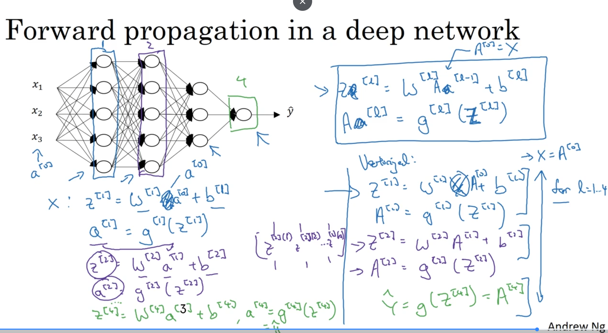
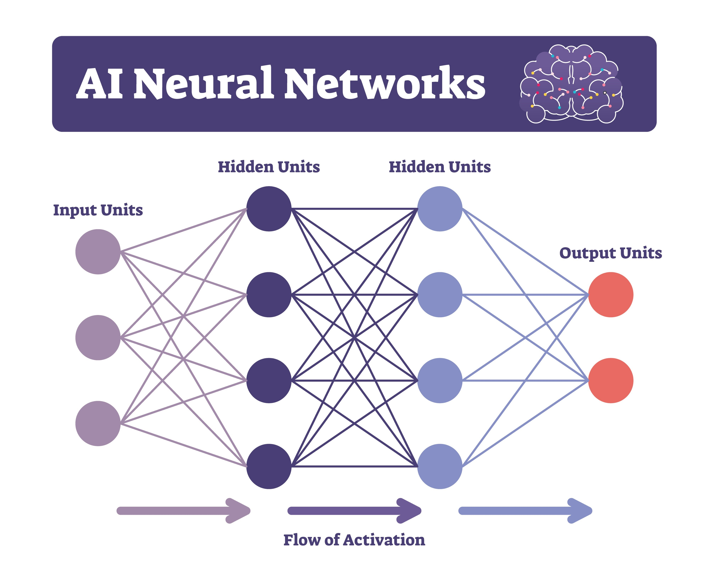
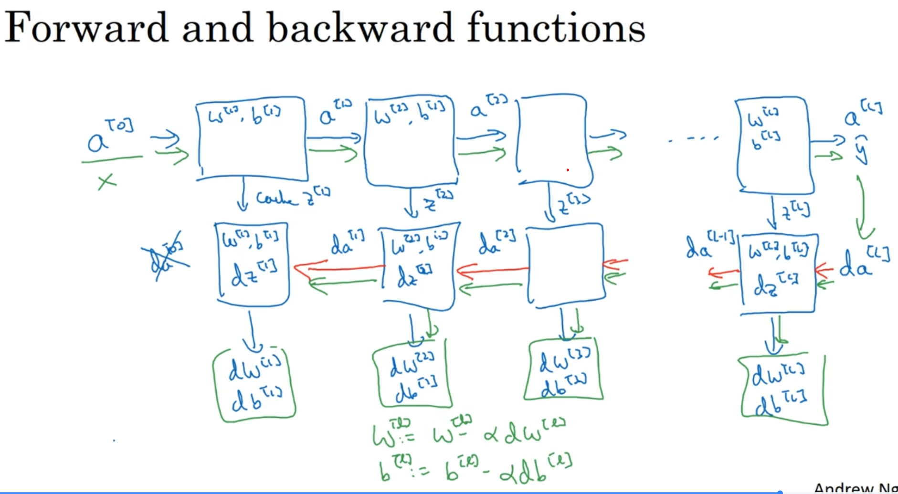
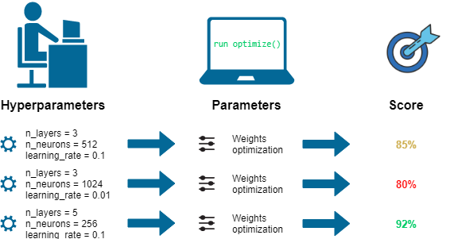
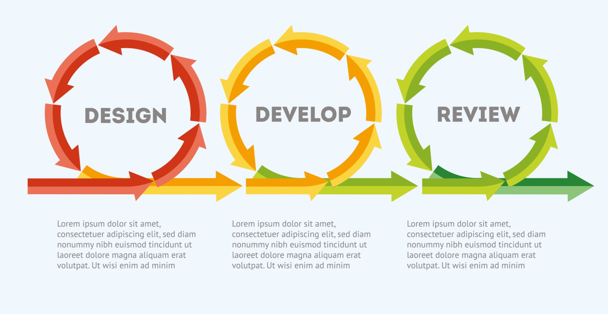
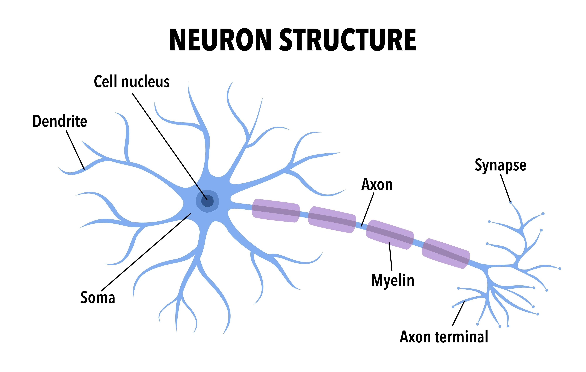

# **Deep Neural Network**
---
## 🧠 **Deep L-layer Neural Network**

#### 1️⃣ What Does "Deep" Mean?

A "deep" neural network is simply a network with many layers. While our previous network had only one hidden layer (total `L=2` layers: one hidden, one output), a deep network can have multiple hidden layers (e.g., 3, 5, 20, or even hundreds).

* **Shallow Network:** Input Layer → Hidden Layer → Output Layer
* **Deep Network:** Input Layer → Hidden 1 → Hidden 2 → ... → Hidden `L-1` → Output Layer

This "depth" allows the network to learn complex hierarchical features. The first layer might learn simple edges, the second layer might combine edges to learn shapes (like circles or squares), the third might combine shapes to learn objects (like eyes or noses), and so on.

---
#### 2️⃣ Notation for a Deep Network

To manage this complexity, we need a consistent notation where `L` represents the total number of layers in the network.

* **`L` = Total Number of Layers:**
    * We do not count the input layer.
    * A network with 3 hidden layers is an `L=4` layer network (3 hidden + 1 output).
* **`l` = Layer Index:**
    * `l` ranges from `1` to `L`.
    * **Input Layer:** This is **Layer 0**. Its "activation" `A[0]` is just the input data `X`.
    * **Hidden Layers:** These are layers `l = 1, 2, ..., L-1`.
    * **Output Layer:** This is the final layer, **Layer `L`**. Its activation `A[L]` is the final prediction `Ŷ`.

---
#### 3️⃣ Layer Dimensions (`n[l]`)

We use `n[l]` to denote the number of units (neurons) in a given layer `l`.

* **`n[0]` = `n_x`:** The number of units in the input layer (Layer 0) is the number of input features.
* **`n[1]`:** Number of units in the first hidden layer.
* **`n[2]`:** Number of units in the second hidden layer.
* ...
* **`n[L]` = `n_y`:** The number of units in the output layer (Layer `L`). For binary classification, `n[L] = 1`.

---
#### 4️⃣ Parameters: Weights (`W[l]`) and Biases (`b[l]`)

Each layer `l` (from 1 to `L`) has its own parameters `W[l]` and `b[l]`. The shape of these parameters is determined by the dimensions of the layer it connects *from* (`l-1`) and the layer it connects *to* (`l`).

* **`W[l]`:** The weight matrix for layer `l`.
    * **Shape:** `(n[l], n[l-1])`
    * *Why?* As we discussed, this is the only shape that can transform the activations from the previous layer (`A[l-1]`, shape `(n[l-1], m)`) into the linear output for the current layer (`Z[l]`, shape `(n[l], m)`).
* **`b[l]`:** The bias vector for layer `l`.
    * **Shape:** `(n[l], 1)`
    * This vector is broadcast across all `m` examples during the vectorized computation.

---
#### 5️⃣ Activations (`A[l]`) and Linear Outputs (`Z[l]`)

* **`A[l]`:** The matrix of activations (outputs) for layer `l`.
    * **Shape:** `(n[l], m)`
    * The input `X` is denoted as `A[0]`.
    * The final prediction `Ŷ` is `A[L]`.
* **`Z[l]`:** The matrix of linear outputs for layer `l` (before the activation function is applied).
    * **Shape:** `(n[l], m)`

This notation gives us a consistent way to describe any layer in the network.

---
---
## ➡️ **Forward Propagation in a Deep Network**

#### 1️⃣ The Core Idea: A Chain Reaction

Forward propagation in a deep network is simply a chain of repeated calculations. The output of one layer becomes the input for the next.

This process is executed in a loop, from `l=1` (the first hidden layer) all the way to `l=L` (the output layer).

---
#### 2️⃣ The General Formula (for any Layer `l`)

For any given layer `l` (from `l=1` to `l=L`), the calculation is always the same two steps. We just "hand off" the result from the previous layer.

1.  **Linear Step:**
    `Z[l] = W[l]A[l-1] + b[l]`

2.  **Activation Step:**
    `A[l] = g[l](Z[l])`

Here, `A[l-1]` is the activation (output) from the *previous* layer, and `g[l]` is the activation function (e.g., ReLU, Tanh, or Sigmoid) chosen for the *current* layer.

---
#### 3️⃣ The Full Process (Input to Output)

Here is the complete step-by-step flow for the vectorized implementation:

* **Start (Layer 0):**
    * `A[0] = X` (The input features `X` are the "activations" of Layer 0).

* **Hidden Layers (l = 1 to L-1):**
    * `Z[1] = W[1]A[0] + b[1]`
    * `A[1] = ReLU(Z[1])` (Using ReLU as an example for hidden layers)
    *
    * `Z[2] = W[2]A[1] + b[2]`
    * `A[2] = ReLU(Z[2])`
    * ... (This loop repeats for all hidden layers)

* **Output Layer (l = L):**
    * `Z[L] = W[L]A[L-1] + b[L]`
    * `A[L] = Sigmoid(Z[L])` (Using Sigmoid for binary classification)

* **Final Result:**
    * `A[L]` is the final matrix of predictions, `Ŷ`.

---
#### 4️⃣ The Importance of Caching

When we implement this, we don't just throw away the intermediate values `Z[l]` and `A[l-1]`. These values are essential for the backward propagation step later.

* **Cache:** We store the computed `Z[l]`, `A[l-1]`, and `W[l]` for each layer in a "cache" (like a Python dictionary).
* **Why?**
    * We'll need `Z[l]` to calculate the derivative of the activation function `g[l]'(Z[l])`.
    * We'll need `A[l-1]` to calculate the gradient for the weights, `dW[l]`.
    * We'll need `W[l]` to calculate the gradient for the *previous* layer, `dZ[l-1]`.

This cache is then passed to the backward propagation function.

---

You're right, we skipped ahead slightly. Lecture 3, "Getting your matrix dimensions right," is an extremely practical and important topic. It's less about new theory and more about a fundamental skill for implementation.

The core idea is that **getting your matrix dimensions correct is the single most effective way to debug your neural network implementation.** If the dimensions don't line up, your code is definitely broken. If they do line up, your code is *probably* correct.

Here are the notes on how to systematically check your dimensions.

---
#### 📏 **Getting Your Matrix Dimensions Right**

#### 4️⃣ Summary Table

This table is your best friend during implementation. (`m` is the number of examples).

>| Variable | Shape (Vectorized) | Why? |
>| :--- | :--- | :--- |
>| `W[l]` | `(n[l], n[l-1])` | To transform `(n>[l-1], m)` input to `(n[l], m)` output. |
>| `b[l]` | `(n[l], 1)` | One bias per unit in layer `l`. |
>| `Z[l]`, `A[l]` | `(n[l], m)` | `n[l]` units, `m` examples. |
>| `dZ[l]`, `dA[l]` | `(n[l], m)` | Must match the shape of `Z[l]` and `A[l]`. |
>| `dW[l]` | `(n[l], n[l-1])` | Must match the shape of `W[l]`. |
>| `db[l]` | `(n[l], 1)` | Must match the shape of `b[l]`. |

---
---
## 💡 **Why Deep Representations?**

The main reason deep networks are powerful is that they can learn **hierarchical features**, building up complex concepts from simple ones, layer by layer.

---
#### 1️⃣ Learning Simple to Complex Features

A deep network learns features in a hierarchy, similar to how the human brain might process information. The first layer learns simple features, and subsequent layers combine them into progressively more complex ones.

* **Layer 1 (Early Layers):** Might learn to detect simple features, like edges at different orientations or patches of color.
* **Layer 2 (Middle Layers):** Might learn to combine these edges to form more complex shapes, like corners, circles, or simple textures.
* **Layer 3 (Deeper Layers):** Might learn to combine *those* shapes to form parts of objects, like an eye, a nose, or a wheel.
* **Final Layers:** Can combine these object parts to recognize entire, complex objects, like a specific person's face or a car.

This hierarchical structure is very effective for natural data like images and audio, which have a similar built-in hierarchy (pixels $\rightarrow$ edges $\rightarrow$ shapes $\rightarrow$ objects, or sound waves $\rightarrow$ phonemes $\rightarrow$ words $\rightarrow$ sentences).

---
#### 2️⃣ The "Circuit Theory" Analogy (Efficiency)

There's also a more formal argument, based on circuit theory, for why deep networks can be much more *efficient* than shallow ones.

* **The Problem:** Consider a complex function, like computing the **XOR** of many inputs ($x_1$ XOR $x_2$ XOR ... XOR $x_n$).
* **Shallow Network Solution:** A shallow network (with only one hidden layer) *can* learn this function, but it would need a massive, "fat" hidden layer, requiring an **exponential** number of hidden units (e.g., $2^{n-1}$ units). This is computationally very expensive.
* **Deep Network Solution:** A deep network can solve this much more efficiently. It can be structured like a tree:
    * Layer 1 computes the XOR of pairs of inputs.
    * Layer 2 computes the XOR of the results from Layer 1.
    * ...and so on, until the final result is computed.
    This deep, tree-like structure only requires a *linear* number of total units, which is exponentially smaller than the shallow network's requirement.

This analogy shows that for certain types of complex functions, a deep architecture is exponentially more efficient at representing and computing them.

---
#### 3️⃣ Summary

Deep networks work well because:
1.  They are excellent at learning the **hierarchical features** present in many real-world datasets (like images and speech).
2.  They can be **exponentially more parameter-efficient** at representing complex functions compared to shallow networks. This efficiency often helps them generalize better to new data.

---
---
## 🧱 **Building Blocks of Deep Neural Networks**

#### 1️⃣ The Core Idea: Modularity

Instead of writing one giant, monolithic function for forward and backward propagation, we build the network from reusable "building blocks." This makes the code much easier to write, debug, and maintain.

The main blocks are:
* A "forward" function for a single layer.
* A "backward" function for a single layer.

We then stack these blocks together to build the full deep network.

---
#### 2️⃣ Forward Propagation Building Blocks

The forward pass for one layer `l` (`Z[l] = W[l]A[l-1] + b[l]` and `A[l] = g[l](Z[l])`) is broken into two parts:

1.  **`linear_forward(A_prev, W, b)`:**
    * This function takes the activations from the previous layer (`A_prev`) and the current layer's parameters (`W`, `b`).
    * It computes the linear part: `Z = W * A_prev + b`.
    * It returns `Z` and a `cache` containing `(A_prev, W, b)`, which we'll need for backpropagation.

2.  **`linear_activation_forward(A_prev, W, b, activation)`:**
    * This function wraps the first one.
    * It calls `linear_forward` to get `Z` and the `linear_cache`.
    * It applies the chosen `activation` function (`ReLU` or `Sigmoid`) to `Z` to get `A`.
    * It returns `A` and a `cache` containing both the `linear_cache` and the `activation_cache` (`Z`).

---
#### 3️⃣ Assembling the Full Forward Pass (`L_model_forward`)

The full forward pass function (`L_model_forward`) uses these blocks to go from `X` to `A[L]`:

* It initializes `A_prev = X`.
* It **loops from `l = 1` to `L-1`** (all the hidden layers):
    * It calls `linear_activation_forward` using `A_prev` and the parameters for layer `l` (`W[l]`, `b[l]`) with the **ReLU** activation.
    * It stores the returned `cache` in a list.
* It **runs one last time for Layer `L`** (the output layer):
    * It calls `linear_activation_forward` using the final hidden layer's output, parameters `W[L]`, `b[L]`, and the **Sigmoid** activation.
    * It stores this final cache.
* It returns the final activations `A[L]` (the predictions) and the `caches` list.

---
#### 4️⃣ Backward Propagation Building Blocks

Similarly, the backward pass is broken into blocks:

1.  **`linear_backward(dZ, cache)`:**
    * This function takes the gradient `dZ` for the current layer and the `cache` from the `linear_forward` step (`A_prev`, `W`, `b`).
    * It uses `dZ` and the cached values to compute:
        * `dA_prev` (the gradient to pass to the previous layer).
        * `dW` (the gradient for the current layer's weights).
        * `db` (the gradient for the current layer's bias).
    * It returns `dA_prev`, `dW`, and `db`.

2.  **`linear_activation_backward(dA, cache, activation)`:**
    * This function wraps the first one. It takes the gradient `dA` for the *current* layer's activations.
    * It computes `dZ` by multiplying `dA` with the derivative of the `activation` function (`g'(Z)`). (The `Z` value is retrieved from the `cache`).
    * It then calls `linear_backward` with this new `dZ` and the `linear_cache`.
    * It returns `dA_prev`, `dW`, and `db`.

---
#### 5️⃣ Assembling the Full Backward Pass (`L_model_backward`)

The full backward pass function (`L_model_backward`) uses these blocks to compute all gradients:

* It starts with the initial gradients `dA[L]` (which is derived from the cost function, `A[L] - Y`).
* It calls `linear_activation_backward` for **Layer `L`** using `dA[L]`, the `cache` for layer `L`, and the **Sigmoid** activation. This gives `dA[L-1]`, `dW[L]`, and `db[L]`.
* It then **loops backward from `l = L-1` down to `1`**:
    * It calls `linear_activation_backward` using the `dA[l]` it just received from the previous step, the `cache` for layer `l`, and the **ReLU** activation.
    * This gives `dA[l-1]`, `dW[l]`, and `db[l]`.
* It stores all the gradients (`dW[l]`, `db[l]`) in a `grads` dictionary and returns it.

This modular design is the foundation for the programming assignment and for all modern deep learning frameworks.

---
---
## ⬅️ **Backward Propagation in a Deep Network**

#### 1️⃣ The Core Idea: A Reverse Chain Reaction

Backward propagation does the opposite of forward propagation. It starts with the final error (the difference between your prediction `A[L]` and the true label `Y`) and passes this "error signal" backward through the network, layer by layer, to see how much each parameter (`W` and `b`) contributed to the error.

Our goal is to compute the gradients `dW[l]` and `db[l]` for every layer `l` (from `L` down to `1`).

---

#### 2️⃣ Starting at the End (Layer `L`)

We begin by calculating the gradient of the cost with respect to the output.

1.  **Compute `dZ[L]`:**
    The first step is to find the derivative of the cost with respect to `Z[L]`. This is the most crucial step.
    * **Calculus:** `dZ[L] = dA[L] * g[L]'(Z[L])`
    * **The Key Simplification:** For binary classification, we use the (log) cost function and the sigmoid activation function `g[L]` in the output layer. When you combine the derivatives of these two specific functions, they simplify beautifully to:
        **`dZ[L] = A[L] - Y`**
    * This `dZ[L]` (shape `(n[L], m)` or `(1, m)`) represents the initial "error" for each example.

2.  **Compute Gradients for Layer `L`:**
    Once we have `dZ[L]`, we can immediately compute the gradients for the parameters of the final layer, `W[L]` and `b[L]`. This uses the formulas we've seen before, which require values from the **cache** (specifically `A[L-1]`).
    * **`dW[L] = (1/m) * dZ[L] * A[L-1]ᵀ`**
    * **`db[L] = (1/m) * np.sum(dZ[L], axis=1, keepdims=True)`**

---
#### 3️⃣ The General Backward Step (for `l = L-1` down to `1`)

Now we have a loop that goes backward from the second-to-last layer (`L-1`) down to the first layer (`1`). For each layer `l`, we do the following:

1.  **Compute `dA[l]`:**
    First, we propagate the error from the *next* layer (`l+1`) back to the *current* layer `l`. This tells us the gradient of the cost with respect to the *output* (activation) of our current layer.
    * **`dA[l] = W[l+1]ᵀ * dZ[l+1]`**

2.  **Compute `dZ[l]`:**
    Next, we find the gradient of the cost with respect to the *linear output* `Z[l]` of our current layer. This requires multiplying `dA[l]` by the derivative of this layer's activation function, `g[l]'(Z[l])`. The `*` is element-wise multiplication.
    * **`dZ[l] = dA[l] * g[l]'(Z[l])`**
    * (Remember: if `g[l]` is ReLU, `g[l]'(Z[l])` is 1 if `Z[l] > 0` and 0 otherwise. If `g[l]` is Tanh, `g[l]'(Z[l]) = 1 - A[l]²`.)

3.  **Compute Gradients for Layer `l`:**
    Now that we have `dZ[l]`, we can compute the gradients for this layer's parameters, `W[l]` and `b[l]`, using the activations from the *previous* layer (`A[l-1]`).
    * **`dW[l] = (1/m) * dZ[l] * A[l-1]ᵀ`**
    * **`db[l] = (1/m) * np.sum(dZ[l], axis=1, keepdims=True)`**

This loop repeats, passing the error signal (`dA` and `dZ`) backward until we reach `l=1` and have computed `dW[1]` and `db[1]`.

---
#### 4️⃣ 🏁 Finishing the Process

After the loop is complete, we will have a full set of gradients: `dW[1]`, `db[1]`, `dW[2]`, `db[2]`, ..., `dW[L]`, `db[L]`.

These are exactly what we need for a single step of gradient descent:
`W[l] = W[l] - α * dW[l]`
`b[l] = b[l] - α * db[l]`

---
Of course. This is a very important distinction in all of machine learning.

---
## ⚙️ **Parameters vs. Hyperparameters**

#### 1️⃣ The Core Idea: An Analogy

A simple way to think about this is **baking a cake**:

* **Parameters (`W`, `b`):** This is the **batter** itself. Its internal structure, consistency, and state (the actual values of `W` and `b`) are what *change and develop* during the baking (training) process.
* **Hyperparameters:** These are the **recipe settings** you choose *before* you start baking. This includes the oven temperature (learning rate), how long to bake (iterations), and the number/size of your cake pans (network architecture).

You don't "learn" the oven temperature; you *set* it to create the best environment for the batter (parameters) to transform into a good cake (the final model).

---
#### 2️⃣ Parameters (What the Model Learns)

Parameters are the values that the learning algorithm (gradient descent) **learns and updates on its own** during the training process. They are the internal "knowledge" of the network.

* **What are they?** The weights and biases of the network.
* **Notation:** `W[l]` and `b[l]` for every layer `l`.
* **How are they found?** They are the direct result of the forward and backward propagation steps, optimized to minimize the cost function `J`.

---
#### 3️⃣ Hyperparameters (What You Set)

Hyperparameters are the **high-level configuration choices** that you, the data scientist or engineer, must set *before* you start training. The algorithm cannot learn these from the data.

The main hyperparameters are:
* **Learning Rate (`α`):** How big of a step to take during gradient descent.
* **Number of Iterations:** How many times to run gradient descent.
* **Number of Hidden Layers (`L`):** The depth of your network.
* **Number of Hidden Units (`n[l]`):** The width (size) of each hidden layer.
* **Choice of Activation Function:** (ReLU, Tanh, Sigmoid, etc.)
* **Other settings:** (e.aag., initialization methods, regularization techniques, which are covered in Course 2).

---
#### 4️⃣ Why This Matters (The Empirical Process)

Finding good hyperparameters is a major part of applied deep learning. The process is highly empirical (based on trial and error).

The development loop for a deep learning project looks like this:
1.  **Idea:** Choose an architecture (L, `n[l]`, activation functions).
2.  **Code:** Implement the model.
3.  **Experiment:** Train the model with a chosen set of hyperparameters (like `α` and iteration count).
4.  **Analyze:** Look at the results (the learning curve) and decide if you need to adjust your hyperparameters (e.g., "the learning rate is too high," "the model is too small").
5.  **Repeat:** Go back to step 1 and try a new idea.

This iterative process of tuning hyperparameters is key to building a high-performing model.

---
Of course. This is a short, optional lecture that puts the field into a broader context.

---
## 🧠 **What does this have to do with the brain?**

#### 1️⃣ The Core Idea: A Loose Analogy

The core idea of "neural networks" was **loosely inspired by the brain**, but it's best to think of it as just an analogy, not an accurate simulation.

* **Biological Neuron:** A single neuron in the brain receives electrical signals (inputs) from other neurons via its **dendrites**. It "processes" these signals in its cell body, and if a certain threshold is met, it "fires," sending an output signal down its **axon** to other neurons.
    

* **Artificial Neuron:** A single logistic unit (our "neuron") is similar in principle. It takes inputs (`x`), does a weighted calculation (`z = Wᵀx + b`), and "fires" based on an activation function (`a = g(z)`).
    

This analogy was a powerful source of inspiration for early AI researchers, but the comparison mostly ends there.

#### 2️⃣ Why It's Not a Simulation

You should not take the brain analogy too literally. Deep learning, as it's practiced today, has diverged significantly from neuroscience.

* **Simple vs. Complex:** A single artificial neuron is a vast oversimplification of a single biological neuron, which is an incredibly complex cell.
* **Unknown Learning Rule:** We don't really know if the brain learns using an algorithm that resembles backpropagation and gradient descent. The brain's true learning mechanism is likely very different and is still an active area of research in neuroscience.

#### 3️⃣ The Takeaway

Think of deep learning as a **powerful engineering and mathematical tool** for learning complex functions from data. It's a technology that has proven to be extremely effective, but it is not an attempt to accurately model how the human brain works.

---

