# **NeuralNetworks And Deep Learning**

----
# **WEEK-1**
----

# 🧠 **Basic Neural Networks**

### 1️⃣ The Core Idea: Predicting House Prices


Imagine you're trying to predict the price of a house. A very simple model might take one input, the **size** of the house, and output a **price**. This simple input-to-output mapping is the most basic form of a neural network—a single "neuron".

But house prices are more complex. They depend on multiple factors like the **number of bedrooms**, the **zip code**, and the **local wealth**. A neural network handles this by adding more complexity, allowing it to weigh these different factors to make a better prediction.

### 2️⃣ The Building Blocks: Layers

A neural network is organized into layers, where each layer is made up of small individual units called neurons.
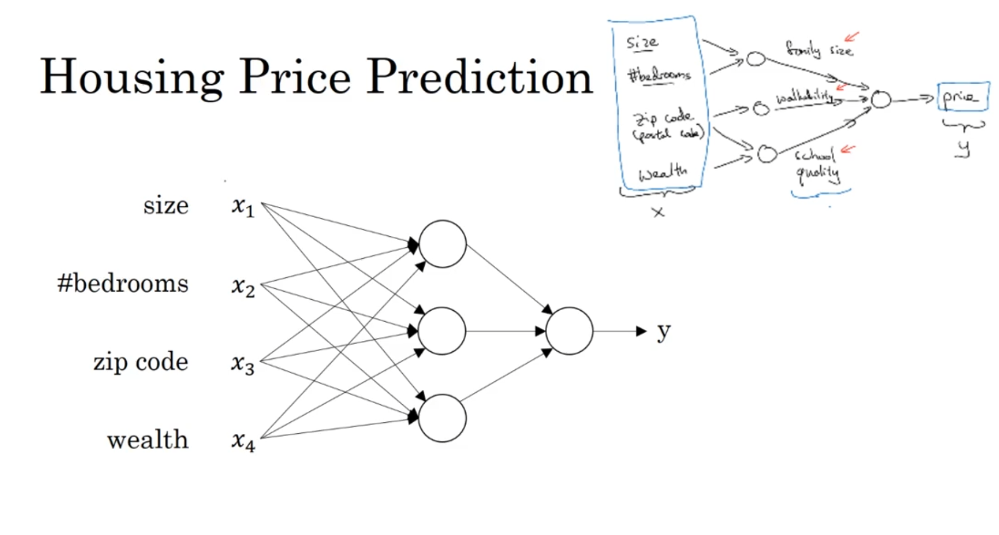

| **Layer**           | **Purpose**                                                                                                      | **Example (House Prices)**                                                                                       |
|----------------------|------------------------------------------------------------------------------------------------------------------|-------------------------------------------------------------------------------------------------------------------|
| **Input Layer**      | Receives the initial data.                                                                                       | House size, number of bedrooms, zip code.                                                                         |
| **Hidden Layer(s)**  | Performs computations and learns abstract features from the inputs. These layers are "hidden" because we don't define what they learn — the network figures it out automatically. | It might learn to combine "size" and "number of bedrooms" into a concept of "family size," or combine "zip code" and "wealth" into "school quality." |
| **Output Layer**     | Produces the final result or prediction.                                                                         | The final predicted price of the house.                                                                           |


This structure, with an input layer, one or more hidden layers, and an output layer, forms the basis of most neural networks9999.

### 3️⃣ How It Works: Connecting the Neurons

The magic happens in how the layers are connected. In a standard network, every neuron in one layer is connected to **every neuron** in the next layer10. This is called a **densely connected** network.

-   Each connection has a "weight," which is a number that the network learns during training. These weights determine the influence of one neuron's output on the next neuron's input.
    
-   The network takes the input features (e.g., house size), passes them through the hidden layers which learn to recognize complex patterns, and finally combines everything to produce the output prediction (price)11.
    

The remarkable thing is that given enough examples of inputs (house features) and outputs (prices), the network is incredibly good at figuring out the complex relationships between them all by itself12.

----------

# 🤖 ***Supervised Learning***

### 1️⃣ The Core Idea

Supervised learning is a type of machine learning where the goal is to learn a mapping from an **input (x)** to an **output (y)** based on a set of labeled examples[cite: 97]. Think of it like a student learning with a teacher. The teacher provides questions (`x`) and the correct answers (`y`). After seeing enough examples, the student (our model) learns to predict the answer for new, unseen questions.

Formally, the algorithm learns an **inferred function** that best approximates the relationship between the inputs and outputs in the training data. This function can then be used to generate predictions for new data points. The remarkable thing about neural networks is their ability to learn these complex `x-to-y` mappings automatically, given enough data[cite: 91].

### 2️⃣ Key Applications

A huge part of the value created by deep learning comes from cleverly defining `x` and `y` for a specific problem[cite: 108]. The course highlights several powerful examples:

| Application | Input (x) | Output (y) | Neural Network Type |
| :--- | :--- | :--- | :--- |
| **Real Estate** | Home features (size, bedrooms) | Price | Standard NN [cite: 111] |
| **Online Advertising** | Ad and user information | Click on ad? (0/1) | Standard NN [cite: 100] |
| **Computer Vision** | Image | Object ID (e.g., 1..1000) | CNN [cite: 104, 112] |
| **Speech Recognition** | Audio clip | Text transcript | RNN [cite: 105, 114] |
| **Machine Translation** | English sentence | Chinese sentence | RNN [cite: 106, 115, 116] |
| **Autonomous Driving** | Image, radar info | Position of other cars | Custom/Hybrid NN [cite: 107, 118] |

### 3️⃣ Structured vs. Unstructured Data

Supervised learning works on two main types of data, and deep learning has revolutionized how we handle one of them.


* **Structured Data:** This is data organized in a tabular format, like a database, where each feature has a clear, defined meaning[cite: 126, 128]. Examples include predicting housing prices from features like "size" and "#bedrooms" or predicting ad clicks based on "User Age" and "Ad ID"[cite: 127, 359, 363]. A lot of the short-term economic value from neural networks has come from applications using structured data[cite: 138].

* **Unstructured Data:** This refers to raw data without a pre-defined model or organization, such as audio, images, or text[cite: 129, 358]. Humans are naturally good at interpreting this data[cite: 132, 133]. One of the most exciting breakthroughs of deep learning is that computers are now much better at understanding unstructured data than they were just a few years ago, opening up many new applications[cite: 134, 135]. 
***


# 🚀 **Why Deep Learning Is Taking Off**

The recent explosion in deep learning's success isn't because of one single, revolutionary invention. [cite_start]The core ideas have been around for decades. [cite: 291] Instead, it's the result of three key factors converging, with the central theme being **scale**.

### 1️⃣ The Power of Scale
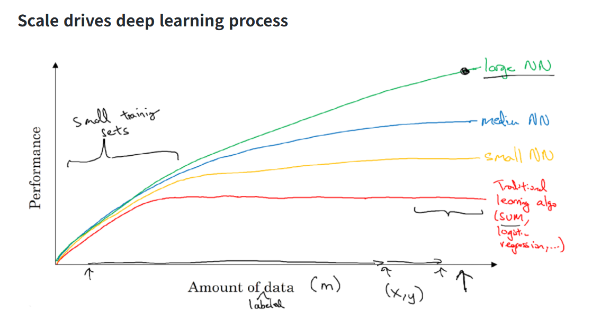

[cite_start]The single most important driver is scale. [cite: 108, 305] To understand this, let's look at how algorithm performance changes with the amount of data.

* [cite_start]**Traditional ML Algorithms:** Algorithms like Support Vector Machines (SVM) or Logistic Regression improve as you give them more data, but only up to a point. [cite: 297] [cite_start]After that, their performance plateaus because they don't have the capacity to learn from massive datasets. [cite: 297]
* [cite_start]**Neural Networks:** In contrast, the performance of neural networks, especially large ones, often keeps getting better the more data you feed them. [cite: 302]

As shown in the course diagram, to achieve state-of-the-art performance, you generally need two things:
1.  [cite_start]A **large amount of labeled data** (denoted as `m`). [cite: 116, 307, 308]
2.  [cite_start]A **large neural network** with many parameters to learn the complex patterns in that data. [cite: 112, 303]

This leads us to the three specific drivers that enabled this scale.

Of course. Here is a concise summary of the key drivers, perfect for your notes.

---

### 🚀 **The 3 Key Drivers of Deep Learning's Rise**

The recent success of deep learning is driven by a convergence of three factors, all related to **scale**[cite: 358, 359].

* 📊 **Data:** The digitization of society has generated massive amounts of labeled data, which is essential for training large, high-performing neural networks[cite: 175, 353, 354].

* 💻 **Computation:** The rise of powerful hardware, especially GPUs, provides the computational power needed to train these large models in a reasonable amount of time[cite: 176, 368]. This speed also accelerates the cycle of experimentation and innovation[cite: 379, 381].

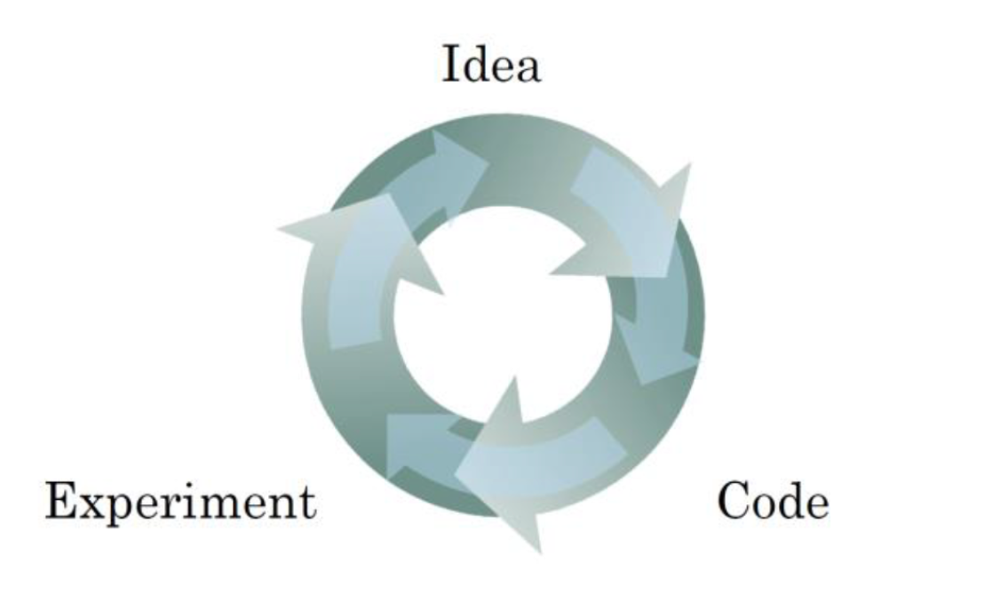

When you can get experimental results in minutes or days instead of weeks, you can test ideas much more rapidly, which dramatically speeds up progress for both researchers and practitioners. 

* 💡 **Algorithms:** Smarter and more efficient algorithms have been developed. A key example is the switch to the **ReLU activation function**, which significantly speeds up training compared to older functions like Sigmoid[cite: 178, 374].

---

## 🧠 Practice Question

**Question:**  
Which of the following play a major role to achieve a very high level of performance with Deep Learning algorithms?

Deep learning has resulted in significant improvements in important applications such as **online advertising**, **speech recognition**, and **image recognition**.

---

### 🟩 Option 1: Large models
**✅ Correct**  
Yes. In most cases, it is necessary for a very large neural network to make use of all the available data.

---

### 🟥 Option 2: Better designed features to use
**❌ Incorrect**  
No. One main difference between *classical* machine learning algorithms and deep learning algorithms is that **Deep Learning models automatically learn the best features** using the hidden layers.

---

### 🟩 Option 3: Large amounts of data
**✅ Correct**  
Yes. Some of the most successful Deep Learning algorithms make use of very large datasets for training.

---

### 🟥 Option 4: Smaller models
**❌ Incorrect**

---

**Score:** 0.6 / 1 point

----
# **WEEK-2**
----


# 🐾 **Binary Classification**

### 1️⃣ The Goal: Cat vs. Non-Cat

Binary classification is a supervised learning task where the goal is to predict one of two possible outcomes. The output, `y`, is always a discrete value, either **0** (negative class) or **1** (positive class).

A classic example used throughout the course is building a **cat detector**.
* **Input (x):** An image.
* **Output (y):** 1 if the image is a cat, 0 if it's not a cat.


### 2️⃣ Representing the Input (x)


How does a computer "see" an image? An image is stored as three separate matrices for the **Red, Green, and Blue (RGB)** color channels.

* **Pixel Intensities:** Each cell in these matrices contains a value representing pixel intensity.
* **Feature Vector:** To feed this into a neural network, we "unroll" or "reshape" these three matrices into a single, long column vector called a **feature vector, `x`**.
* **Input Size ($n_x$):** For a 64x64 pixel image, the resulting feature vector `x` has a dimension of `64 * 64 * 3 = 12,288`. This number is the input size, denoted as $n_x$.


### 3️⃣ Notation for the Dataset

To work with data efficiently, we use a standard set of notations:

* **A single example:** is represented by a pair `(x, y)`, where `x` is the $n_x$-dimensional feature vector and `y` is the label (0 or 1).
* **Training set size:** The number of training examples is denoted by `m`.
* **Input Matrix (X):** To process all examples at once (vectorization), we stack the individual feature vectors $`x^i`$ side-by-side in columns to form a matrix `X`.
    * The shape of `X` is $(n_x, m)$.
* **Label Matrix (Y):** Similarly, we stack the labels $`y^i`$ side-by-side to form a row vector `Y`.
    * The shape of `Y` is $(1, m)$.

---


# 📈 **Logistic Regression**

### 1️⃣ The Core Idea

Logistic Regression is a learning algorithm used for binary classification, where the output `y` is always either 0 or 1. Given an input feature vector `x` (like our unrolled cat image), the goal is to output a prediction, which we call `ŷ` (y-hat), that represents the probability of `y` being 1.

* **Goal:** Predict `ŷ = P(y=1 | x)`, which is the probability that the image is a cat, given the input pixels `x`.
* **Constraint:** `ŷ` must be between 0 and 1.

### 2️⃣ The Problem with a Linear Function

A simple approach would be to use a linear function, just like in linear regression: `ŷ = wᵀx + b`. However, this doesn't work for classification because the output can be any real number—much larger than 1 or even negative—which doesn't make sense for a probability.

### 3️⃣ The Solution: The Sigmoid Function

To solve this, we use the **sigmoid function**, denoted by the Greek letter sigma (σ). This function takes any real number `z` and "squashes" it into a value between 0 and 1, which is exactly what we need for a probability.

The formula is: ******σ(z) = 1 / (1 + e⁻ᶻ)****** 


It has some very useful properties:
* If `z` is a large positive number, σ(z) is close to **1**.
* If `z` is a large negative number, σ(z) is close to **0**.
* If `z` is 0, σ(z) is **0.5**.

### 4️⃣ The Logistic Regression Model

By combining the linear function with the sigmoid function, we get the final model for logistic regression:

1.  First, we compute `z = wᵀx + b`.
2.  Then, we pass the result through the sigmoid function: `ŷ = a = σ(z)`.
    * (Here, we introduce `a` for "activation," a term that will become very important in neural networks).

The job of the learning algorithm is to find the best parameters **w** (weights) and **b** (bias) so that `ŷ` is a good estimate of the true probability.

***

### 🧠 Understanding Parameters 'w' and 'b'

Think of **'w'** and **'b'** as the "dials" or "knobs" that the learning algorithm tunes to make accurate predictions. They are the core components that transform your input data into a final output.

---
### 1️⃣ **'w': The Weights**

The variable **'w'** stands for **weights**. It's a vector of numbers, and its job is to determine the importance of each input feature.

* **Analogy:** Imagine you're predicting if a student will pass an exam. The input features might be `hours_studied`, `previous_grades`, and `hours_of_sleep`. The weights `w` would assign a numerical importance to each of these features. Intuitively, `hours_studied` would get a high positive weight, while `hours_of_sleep` might get a smaller positive weight.
* **Vector Dimension:** The reason **'w'** is an $n_x$-dimensional vector is that there is one weight for each of the $n_x$ input features. For our cat detector example, $n_x$ was 12,288, so **'w'** would be a vector with 12,288 numbers, one for each pixel. Each weight signifies how important that specific pixel is for determining if the image is a cat.

---
### 2️⃣ **'b': The Bias**

The variable **'b'** stands for **bias**. It's a single real number, not a vector. Its job is to provide an offset or a baseline, independent of any input features.

* **Analogy:** Continuing the exam example, the bias 'b' could represent a student's baseline probability of passing, even before we consider any specific features. Perhaps the exam is generally very easy, so there's a high baseline chance of passing. The bias captures this.
* **In Mathematics:** In the linear equation `z = wᵀx + b`, the bias **'b'** is exactly like the y-intercept in the equation of a line, `y = mx + c`. It shifts the entire function up or down, allowing the model to fit the data better.

---
### 3️⃣ **Putting It Together**

In logistic regression, the model first calculates a linear combination: `z = wᵀx + b`.

* The `wᵀx` part calculates a weighted sum, essentially a "score" based on how important each input feature is.
* The `+ b` part then shifts this score up or down.

This final score `z` is then passed through the sigmoid function to produce the final probability `ŷ = σ(z)`. The learning process is all about adjusting **'w'** and **'b'** to make this probability as accurate as possible across all your training examples.

### 📐 **Mathmetical Intuition**

This equation is a linear function, just like `y = mx + c` from high school math, but applied to vectors. Its purpose is to calculate a "score" or a "log-odds" value (`z`) based on the input features.

-----

### 🧠 The "Ingredients": w, x, and b

First, let's be very clear about what each variable is and, most importantly, its **shape**.

| Variable | Name | What it is | Shape / Dimension |
| :--- | :--- | :--- | :--- |
| **x** | **Input Features** | A vector containing all the input data for a *single* example (e.g., all 12,288 pixel values for one image).  | An $n_x$ by 1 column vector. |
| **w** | **Weights** | A vector containing the "importance" value for each corresponding input feature. The model *learns* these values.  | An $n_x$ by 1 column vector. |
| **b** | **Bias** | A single number that provides an offset, like the y-intercept in a line. The model *learns* this value.  | A 1 by 1 scalar (a single real number). |
| **z** | **Output Score** | The raw output of the linear calculation, before it's turned into a probability. | A 1 by 1 scalar (a single real number). |

-----

### 🔄 The "T" Operator: Transpose

The superscript **'T'** stands for **Transpose**. The transpose operation "flips" a matrix or vector over its main diagonal. For a vector, it simply changes a **column vector** into a **row vector**, or vice versa.

  * **w** starts as a column vector (shape: $n_x$ by 1).
  * **wᵀ** (w-transpose) becomes a row vector (shape: 1 by $n_x$).

**Example:** If $n_x = 3$:
If `w` =

```
[w₁]
[w₂]
[w₃]
```

Then 
``` 
wᵀ = [w₁ w₂ w₃] 
```

-----

### 🔢 The Multiplication: `wᵀx` (The Dot Product)

This is the most important part of the calculation. We are multiplying the **row vector** `wᵀ` by the **column vector** `x`. This specific operation is called a **dot product**.

**Rule of Matrix Multiplication:** To multiply two matrices (or vectors), the number of columns in the first matrix must equal the number of rows in the second.

  * Shape of `wᵀ`: (1, $n_x$)
  * Shape of `x`: ($n_x$, 1)

Since the inner dimensions ($n_x$ and $n_x$) match, we can multiply them. The result will have the shape of the outer dimensions: (1, 1), which is a single number.

**How it's calculated:** You multiply each element of `wᵀ` by the corresponding element of `x` and then sum up all the results.

`wᵀx = (w₁ * x₁) + (w₂ * x₂) + ... + (wₙₓ * xₙₓ)`

This gives you a single number, which is a weighted sum of the features.

-----

### ✨ Putting It All Together: A Concrete Example

Let's assume we have 3 input features ($n_x = 3$).

1.  **Define our "ingredients":**

      * `x` (inputs):
        ```
        [200]   (e.g., hours_studied)
        [  8]   (e.g., hours_of_sleep)
        [  4]   (e.g., previous_grades_avg)
        ```
      * `w` (weights learned by the model):
        ```
        [0.5]
        [0.1]
        [0.8]
        ```
      * `b` (bias learned by the model): `-10`

2.  **Transpose the weights `w` to get `wᵀ`:**

      * `wᵀ = [0.5  0.1  0.8]`

3.  **Calculate the dot product `wᵀx`:**

      * `wᵀx = (0.5 * 200) + (0.1 * 8) + (0.8 * 4)`
      * `wᵀx = 100 + 0.8 + 3.2`
      * `wᵀx = 104` (This is our weighted score)

4.  **Add the bias `b` to get the final score `z`:**

      * `z = wᵀx + b` 
      * `z = 104 + (-10)`
      * `z = 94`

This final number, `z=94`, is then passed into the sigmoid function `σ(z)` to get the final probability prediction `ŷ`.


# 📉 **Logistic Regression Cost Function**

### 1️⃣ The Core Idea: Measuring Error

The goal of training is to find the parameters `w` and `b` that make our predictions `ŷ` as close to the true labels `y` as possible. To do this, we need a way to quantify the error.

We do this in two steps:
1.  **Loss Function (L):** Measures the error for a *single* training example.
2.  **Cost Function (J):** Measures the average error over the *entire* training set.

The purpose of a loss or cost function is to measure how well a machine learning model's predictions match the actual correct answers while using some given Parameters(w,b) so that we can find the best set of parameters for our model to imporve the model performance by checking its performance for different values of parameters using cost function.
### 2️⃣ The Loss Function (L)

A simple idea would be to use the squared error, `L = ½(ŷ - y)²`, just like in linear regression. However, for logistic regression, this creates a "non-convex" optimization problem, meaning it has many local minima, making it hard to find the best parameters.

Instead, we use a different loss function that is convex and works well for this problem:
**L(ŷ, y) = -[ y log(ŷ) + (1 - y) log(1 - ŷ) ]**

Let's see why this makes sense:

* **Case 1: If the true label y = 1**
    * The loss becomes `L = -log(ŷ)`.
    * To make the loss small, we need `log(ŷ)` to be large, which means `ŷ` must be as close to **1** as possible. This is exactly what we want!

* **Case 2: If the true label y = 0**
    * The loss becomes `L = -log(1 - ŷ)`.
    * To make the loss small, we need `log(1 - ŷ)` to be large, which means `(1 - ŷ)` should be close to 1, and therefore `ŷ` must be as close to **0** as possible. Again, this is what we want.

### 3️⃣ The Cost Function (J)

The cost function `J(w, b)` is simply the average of the loss function over all `m` training examples. This gives us a single number that tells us how well our current parameters `w` and `b` are performing on the entire dataset.

The formula is:
**J(w, b) = (1/m) * Σ L(ŷ⁽ⁱ⁾, y⁽ⁱ⁾) = -(1/m) * Σ y⁽ⁱ⁾log(ŷ⁽ⁱ⁾) + (1-y⁽ⁱ⁾)log(1-ŷ⁽ⁱ⁾)** (from i=1 to m)

Our ultimate goal is to find the values of `w` and `b` that **minimize** this cost function `J`.

***


# ⛰️ **Gradient Descent**

### 1️⃣ The Core Idea: Finding the Bottom of a Valley

Imagine you are standing on a hill in a thick fog and want to get to the lowest point. What would you do? You would look at the ground around your feet, find the direction that goes steepest downhill, and take a small step in that direction. If you repeat this process over and over, you will eventually reach the bottom of the valley.

That's exactly what Gradient Descent does.
* **The Hill:** Is our cost function `J(w, b)`. The height of the hill at any point represents the error for a given set of parameters `w` and `b`.
* **Your Position:** Is determined by the current values of your parameters `w` and `b`.
* **The Goal:** Find the values of `w` and `b` that correspond to the lowest point on the hill, which is the **minimum of the cost function**.


Because our cost function for logistic regression is **convex** (it's a single, bowl-shaped curve), this method guarantees that no matter where you start, you will always reach the same, single global minimum.

### 2️⃣ The Algorithm: How to Take a Step

Gradient Descent works by repeatedly updating the parameters `w` and `b` in the opposite direction of the gradient of the cost function.

The update rule is:
**Repeat {**
&nbsp;&nbsp;&nbsp;&nbsp;`w := w - α *  (∂J/∂w)`\
&nbsp;&nbsp;&nbsp;&nbsp;`b := b - α * (∂J/∂b)`
**}**

Let's break down this formula:
* **w :=** This means we are **updating** the value of `w`.
* **α (alpha):** This is the **learning rate**, a small number that controls how big of a step we take. Choosing a good learning rate is crucial for training.
* **∂J/∂w:** This is the **derivative** (or gradient) of the cost function with respect to the parameter `w`. It tells us the slope of the hill, or the direction of steepest *ascent*. By subtracting it, we move in the direction of steepest *descent*. We do the same for the bias `b`.
* 1.The Direction: The sign of the derivative tells us whether the "hill" of the cost function is sloping upwards or downwards. This tells us which way to go to reduce the error.

* 2.The Steepness: The magnitude of the derivative tells us how steep the slope is. A steeper slope means we are far from the minimum, while a slope close to zero means we are nearing the bottom.

#### How the Slope Affects Gradient Descent

The sign of the derivative (the slope) is the crucial signal that tells Gradient Descent which way to move to find the minimum. Let's look at the update rule again: `w := w - α * (∂J/∂w)`. 

* **Case 1: The slope is positive (∂J/∂w > 0)**
    * **Intuition:** This means we are on the right side of the valley. As we increase `w`, the cost `J` goes up. To get to the bottom, we need to move left, meaning we must **decrease `w`**.
    * **The Math:** The update rule becomes `w := w - α * (a positive number)`. This subtracts a small value from `w`, causing it to decrease and move closer to the minimum. 

* **Case 2: The slope is negative (∂J/∂w < 0)**
    * **Intuition:** This means we are on the left side of the valley. As we increase `w`, the cost `J` goes down. To get to the bottom, we need to move right, meaning we must **increase `w`**. 
    * **The Math:** The update rule becomes `w := w - α * (a negative number)`. Subtracting a negative is the same as adding a positive. This adds a small value to `w`, causing it to increase and move closer to the minimum. 

In both cases, the algorithm uses the slope to automatically take a step in the correct downhill direction, guiding the parameters toward the global minimum where the error is lowest.


By repeatedly applying these updates, we gradually walk down the cost function until we converge to the minimum point, where our model has the lowest possible error.

***

---
# 📉 **Derivatives Explained**

#### 1. The Core Idea: What is a Derivative?

At its heart, a **derivative** is simply the **slope** of a function at a specific point. It measures how much the output of a function changes when you make a tiny "nudge" to its input.

* **Analogy:** Imagine you're driving a car. Your speed is the derivative of your position. If you nudge time forward by one second, your speed tells you how much your position will change in that instant.

#### 2. Derivatives of Straight Lines

Let's take a simple function, `f(a) = 3a`, which is a straight line. 

* If `a = 2`, then `f(a) = 6`. 
* If we "nudge" `a` by a tiny amount, say to `a = 2.001`, then `f(a)` becomes `6.003`. 
* **Observation:** The output `f(a)` increased by **3 times** the amount we nudged the input `a`. 

The **slope**, or derivative, of this function is **3**.  For a straight line, the slope is the same everywhere.  No matter what value `a` has, a small change in `a` will always result in a change in `f(a)` that is 3 times larger.  We write this formally as `df/da = 3`. 

#### 3. Derivatives of Curved Lines

What about a more complex, curved function like `f(a) = a²`?  Unlike a straight line, the slope of a curve is different at every point. 

* **At `a = 2`:**
    * `f(a) = 4`. If we nudge `a` to `2.001`, `f(a)` becomes approximately `4.004`.

    * Here, the output changed by **4 times** the nudge to the input. So, the derivative (slope) at `a = 2` is **4**. 

* **At `a = 5`:**
    * `f(a) = 25`. If we nudge `a` to `5.001`, `f(a)` becomes approximately `25.010`. 

    * Here, the output changed by **10 times** the nudge to the input. The derivative (slope) at `a = 5` is **10**. 

Calculus provides a general formula for the derivative of `f(a) = a²`, which is `df/da = 2a`.  This single formula correctly gives us the slope at any point on the curve. 


---
# 📈 Computation Graph
---


### **1. The Core Idea: Visualizing a Function**

A computation graph is a way to visualize a complex mathematical function by breaking it down into a series of simple, individual operations.  It organizes the calculation into two distinct phases: a **forward pass** and a **backward pass**.

### 🔸 **Why We Use It**

When a function is complicated (like in deep learning), we don’t compute it all at once.
Instead, we:

1. **Break it down** into simple mathematical operations (addition, multiplication, etc.)
2. **Represent** each operation as a **node** in a graph.
3. **Connect** these nodes to show how data flows — from inputs → intermediate results → final output.

* **Analogy**: Think of it like a recipe. The **forward pass** is following the recipe step-by-step to bake a cake. The **backward pass** is like figuring out how a small change in one ingredient (e.g., a little more sugar) would affect the final taste of the cake.

### **2. The Forward Pass: Calculating the Output**

The forward pass moves from left to right, from the inputs to the final output.  Let's use the course's example function: `J(a, b, c) = 3 * (a + b * c)`.

We can break this down into three steps:
1.  Calculate `u = b * c`
2.  Calculate `v = a + u`
3.  Calculate `J = 3 * v`

This sequence of operations can be drawn as a graph:


With inputs `a=5`, `b=3`, and `c=2`, the forward pass would compute `u=6`, then `v=11`, and finally the output `J=33`. 
### **3. The Backward Pass: Calculating Derivatives**

The real power of a computation graph is that it provides a clear and efficient way to calculate derivatives, which we need for gradient descent. This process is called **backpropagation**.

The backward pass moves from right to left, from the final output back to the inputs.  It calculates the derivative of the final output (`J`) with respect to each intermediate variable and input (`v`, `u`, `a`, `b`, `c`).

This right-to-left flow is highly efficient because it follows the **chain rule** from calculus. It allows us to reuse calculations from later steps to compute derivatives for earlier steps, saving a lot of redundant work. 


---
### ⛓️ **Derivatives with a Computation Graph**

#### 1. The Goal: Calculate the Impact of Each Input on the Final Output

Our objective is to compute the derivative of the final output `J` with respect to every input and intermediate variable (`dJ/dv`, `dJ/da`, `dJ/db`, etc.). This tells us how a small "nudge" in any variable will affect the final result.

We start from the end of the graph and move backward (from right to left). In code, we'll use a simple notation: `dvar` will represent `dJ/dvar`. For example, `dv` will store the value of `dJ/dv`.

#### 2. The Backward Pass: Applying the Chain Rule

**Step 1: Find `dJ/dv`**\

The final operation is `J = 3v`. The derivative of `J` with respect to `v` is simply 3. A small nudge to `v` causes a 3x larger nudge to `J`.
* **Calculation:** `dJ/dv = 3`
* **In code:** `dv = 3`

---
**Step 2: Find `dJ/da`**\

To find the effect of `a` on `J`, we use the **chain rule**. A change in `a` first affects `v`, which in turn affects `J`.
* **Chain Rule:** `dJ/da = (dJ/dv) * (dv/da)`
* **We already know `dJ/dv` is 3.**
* The operation is `v = a + u`. The derivative of `v` with respect to `a` is 1 (a nudge in `a` causes an equal nudge in `v`).
* **Calculation:** `dJ/da = 3 * 1 = 3`
* **In code:** `da = 3`

---
**Step 3: Find `dJ/db`**\

Again, we use the chain rule. A change in `b` affects `u`, which affects `v`, which affects `J`. We can trace this backward path.
* **Chain Rule:** `dJ/db = (dJ/dv) * (dv/du) * (du/db)`. A simpler way is `dJ/db = (dJ/du) * (du/db)`[cite: 688].
* We can calculate `dJ/du` first: `dJ/du = (dJ/dv) * (dv/du) = 3 * 1 = 3`[cite: 682].
* The operation is `u = b * c`. The derivative of `u` with respect to `b` is `c`. In our example, `c=2`.
* **Calculation:** `dJ/db = 3 * 2 = 6`
* **In code:** `db = 6`

**Step 3: Find `dJ/dc`**\
A similar calculation for `c` gives `dJ/dc = 9`.


#### 3. The Key Takeaway

The most efficient way to compute all the derivatives is through this **right-to-left** backward pass. Notice how we reused the result of `dJ/dv` to compute `dJ/da`, and then we reused `dJ/du` to compute `dJ/db`. This reuse of intermediate values is what makes backpropagation computationally efficient.


---
# ⚙️ **Logistic Regression Gradient Descent**

#### 1. The Forward and Backward Pass for One Example

We can map out the entire process for a single training example on a computation graph. For simplicity, let's assume our input `x` has only two features, `x₁` and `x₂`.


**Forward Pass (Calculating the Loss):**
1.  **Input:** `w₁`, `x₁`, `w₂`, `x₂`, `b`
2.  **Compute z:** `z = w₁x₁ + w₂x₂ + b` 
3.  **Compute a:** `a = σ(z)` (This is our prediction `ŷ`) 
4.  **Compute Loss L(a,y):** `L = -[ y log(a) + (1 - y) log(1 - a) ]` 

**Backward Pass (Calculating the Derivatives):**
Now, we move from right to left to find the derivatives needed for our gradient descent update. The course provides the results of the calculus for us.

1.  **Compute `da`:** The first step is to find the derivative of the Loss with respect to `a`. The formula is `da = -(y/a) + (1-y)/(1-a)`.
2.  **Compute `dz`:** Next, we find the derivative of the Loss with respect to `z`. Thanks to a convenient simplification of the chain rule, this comes out to a very simple expression: `dz = da*{d(a)/d(z)} = a - y`. This term represents the prediction error.
3.  **Compute Derivatives for Parameters:** Finally, we find the derivatives with respect to the parameters we want to update:
    * `dw₁ = (dL/dz) * (dz/dw₁) = x₁ * dz` 
    * `dw₂ = (dL/dz) * (dz/dw₂) = x₂ * dz` 
    * `db  = (dL/dz) * (dz/db)  = dz` 

---
#### 2. The Gradient Descent Update Step

After the backward pass, we have the gradients (`dw₁`, `dw₂`, `db`). We can now perform a single step of gradient descent to update our parameters and reduce the error:

* `w₁ := w₁ - α * dw₁` 
* `w₂ := w₂ - α * dw₂`
* `b := b - α * db` 

This process is repeated for each training example to slowly nudge the parameters toward the optimal values that minimize the overall cost function.

---
---
### 🖥️ **Gradient Descent on m Examples**

#### 1. The Core Idea: Averaging the Gradients

The overall cost function `J(w, b)` is the average of the loss `L` across all `m` training examples.  It follows that the gradient of the overall cost function is also the average of the gradients from each individual example. 

So, the process is:
1.  Calculate the gradients for **each** training example individually.
2.  **Average** these gradients together.
3.  Use the averaged gradient to perform a **single** update to the parameters `w` and `b`.

---
#### 2. The Algorithm (with a For-Loop)

Here is how you would implement one step of gradient descent for the entire dataset. This approach uses a `for` loop, which is intuitive but less efficient.

**Step 1: Initialize Accumulators**
* Initialize the total cost to zero: `J = 0`
* Initialize the gradient accumulators to zero: `dw = 0`, `db = 0` 

**Step 2: Loop Through the Dataset**
* **For i = 1 to m:**
    * **Forward Pass:**
        * Calculate `z⁽ⁱ⁾ = wᵀx⁽ⁱ⁾ + b` 
        * Calculate `a⁽ⁱ⁾ = σ(z⁽ⁱ⁾)` 
        * Add to the total cost: `J += L(a⁽ⁱ⁾, y⁽ⁱ⁾)` 
    * **Backward Pass:**
        * Calculate the error: `dz⁽ⁱ⁾ = a⁽ⁱ⁾ - y⁽ⁱ⁾` 
        * Add to the gradient accumulators:
            * `dw += x⁽ⁱ⁾ * dz⁽ⁱ⁾` 
            * `db += dz⁽ⁱ⁾` 

**Step 3: Calculate the Averages**
* After the loop, divide the accumulators by `m` to get the final average cost and gradients:
    * `J = J / m`
    * `dw = dw / m`
    * `db = db / m`

**Step 4: Update the Parameters**
* Perform a single gradient descent update using the averaged gradients:
    * `w := w - α * dw`
    * `b := b - α * db` 

#### 3. The Problem with For-Loops

This implementation is correct, but it has a major weakness: the explicit `for` loop over `m` training examples.  When `m` is very large (millions of examples), this loop becomes extremely slow. 

In the deep learning era, we need a way to perform these calculations without loops to handle massive datasets efficiently. This brings us to a critical technique for speeding up our code: **Vectorization**. 

```python
import numpy as np

# Assume X, Y, w, b are already defined
# X.shape = (n_x, m)
# Y.shape = (1, m)
# w.shape = (n_x, 1)
# b is a scalar

# Also assume a sigmoid function is defined
def sigmoid(z):
    return 1 / (1 + np.exp(-z))

# Get dimensions
n_x, m = X.shape

# Initialize accumulators for cost and gradients
J = 0
dw = np.zeros((n_x, 1))
db = 0
alpha = 0.01 # Example learning rate

# --- Start of the For-Loop Implementation ---

# Step 2: Loop through the m training examples
for i in range(m):
    # Extract a single example
    x_i = X[:, i].reshape(n_x, 1) # Ensure x_i is a column vector
    y_i = Y[0, i]

    # --- Forward Pass for a single example ---
    z_i = np.dot(w.T, x_i) + b
    a_i = sigmoid(z_i)
    
    # Add to the total cost
    J += -1 * (y_i * np.log(a_i) + (1 - y_i) * np.log(1 - a_i))

    # --- Backward Pass for a single example ---
    dz_i = a_i - y_i
    
    # Add to gradient accumulators
    dw += x_i * dz_i
    db += dz_i

# Step 3: Calculate the average cost and gradients
J = J / m
dw = dw / m
db = db / m

# Step 4: Update the parameters
w = w - alpha * dw
b = b - alpha * db

# --- End of one step of Gradient Descent ---

print(f"Cost after one iteration: {J}")
print(f"Updated weights (dw): {dw}")
print(f"Updated bias (db): {db}")
```


# 🚀 Vectorization

-----

#### 1\. What is Vectorization?

Vectorization is the process of getting rid of explicit `for` loops in your code and replacing them with built-in functions for matrix and vector operations. Deep learning libraries like NumPy are highly optimized to perform these operations quickly.

Fundamentally, vectorization is the process of executing operations on entire arrays of data at once, rather than iterating through the elements one by one. This is achieved by leveraging a specific type of parallel processing available on modern CPUs and GPUs.

-----

#### 2\. Why is it Important?

The main reason is **speed**.  In deep learning, you often train on massive datasets, and inefficient code can take hours or even days to run. 

  * **Parallel Processing**: Modern CPUs and GPUs have parallel processing capabilities (like SIMD, or Single Instruction, Multiple Data).  Vectorized operations in libraries like NumPy can take full advantage of this hardware, allowing them to perform many calculations simultaneously. 
  * **Efficiency**: A `for` loop in Python can be hundreds of times slower than its vectorized equivalent. 

-----

#### 3\. A Practical Example: The Dot Product

Let's revisit our `z = wᵀx + b` calculation.

**Non-Vectorized Version (with a `for` loop):**
This code iterates through each element one by one, which is slow. 

```python
import numpy as np
import time
n_x = 1000000 # Number of Input Features
x = np.random.rand(n_x) # Generates Random Input Features
w = np.random.rand(n_x) # Generates Random Weights for Each Feature
b = np.random.randint(1,999999,size=1) # Generates Random bias value

z = 0 # Output of Regression(z = wᵀx + b)

tic = time.time() # Time before proccessing starts
for i in range(n_x): 
  z += w[i] * x[i]
z += b
toc = time.time() # Time after proccessing ends
print(f"For loop Method:\n Z={z} \n Time Taken:{toc-tic}")
```

**Vectorized Version (with NumPy):**
This single line of code is much faster and more readable. 

```python
tic = time.time() # Time before proccessing starts
z = np.dot(w.T, x) + b
toc = time.time() # Time after proccessing ends
print(f"Vectorization Method:\n Z={z} \n Time Taken:{toc-tic}")
```

This simple change can make your code run significantly faster, which is essential for building effective deep learning models.
---
### The "How": Single Instruction, Multiple Data (SIMD)

The magic behind vectorization lies in a hardware capability called **SIMD**, which stands for **Single Instruction, Multiple Data**.

Think of it like an assembly line versus a single craftsman.

* **The For-Loop (A Craftsman):** A `for` loop is like a craftsman working on one item at a time. To add two lists of numbers, the loop performs the first addition, then the second, then the third, sequentially. Each addition is a separate instruction.
    `1 + 5 = 6` (Instruction 1)
    `2 + 6 = 8` (Instruction 2)
    `3 + 7 = 10` (Instruction 3)
    `4 + 8 = 12` (Instruction 4)

* **Vectorization (An Assembly Line):** SIMD allows the processor to act like an assembly line. It takes a *single instruction* (e.g., "add") and applies it to *multiple data points* all at the same time, often in a single CPU cycle.
    `[1, 2, 3, 4] + [5, 6, 7, 8] = [6, 8, 10, 12]` (Single "add" instruction)


---
### Why NumPy is the Key

A standard Python `for` loop cannot access this SIMD hardware. It's interpreted line-by-line, which is inherently slow.

When you use a NumPy function like `np.dot(w, x)` or an operation like `A + B` on NumPy arrays, you are not just running Python code. You are calling a highly optimized, pre-compiled function written in a low-level language like C or Fortran. This function is specifically designed to:
1.  Package your data into a format the processor can understand.
2.  Execute a single SIMD instruction to perform the operation on the entire block of data in parallel.

So, while it looks like a simple function call in Python, you are fundamentally switching from a slow, sequential execution model to a highly efficient, parallel one at the hardware level. This is why the speed difference is so dramatic.

Fundamentally, the difference between scalar and SIMD (Single Instruction, Multiple Data) processing lies in how many pieces of data are handled per instruction.  Scalar operations are sequential, while SIMD operations are parallel.

---

### Scalar Processing
**Core Concept**: A scalar processor executes one instruction on one piece of data at a time.  It's a sequential, one-by-one approach.

* **Analogy**: A single craftsman working on one item from start to finish before beginning the next.
* **Example**: To add two arrays, it would perform `1 + 5`, then `2 + 6`, and so on, with each addition being a separate step.

---
### SIMD Processing
**Core Concept**: A SIMD processor executes a single instruction on multiple pieces of data simultaneously in one clock cycle.  This is achieved through specialized hardware like wide registers(larger register that can store more values or data) and parallel processing units(multiple circuites in ALU that can proccess multiple data points at once).

* **Analogy**: An assembly line or a multi-lane highway, where the same operation (like attaching a car door or paying a toll) happens to multiple cars at once.
* **Example**: To add two arrays, it loads multiple elements from each into wide registers and adds them all in a single step: `[1, 2, 3, 4] + [5, 6, 7, 8] = [6, 8, 10, 12]`. 

---
### Comparison Table

| Aspect | Scalar (e.g., Python `for` loop) | SIMD (e.g., NumPy operation) |
| :--- | :--- | :--- |
| **Execution** | Sequential | Parallel  |
| **Data Handling** | One element at a time | A vector of elements at a time |
| **Hardware** | Standard ALU and registers | Wide registers and parallel ALUs |
| **Speed** | Slow | Very Fast |

---
### 🚀 **Vectorizing the Forward Pass**

Our goal is to compute the predictions `a⁽ⁱ⁾` for all `m` training examples at once, without a `for` loop.

```python
import numpy as np

def sigmoid(z):
    """A numerically stable sigmoid function."""
    return 1 / (1 + np.exp(-z))

# 1. CREATE EXAMPLE DATA
# We will create a dataset with 3 training examples (m=3)
# and 4 features for each example (n_x=4).
m = 3
n_x = 4

# X represents the input data, with each column being one training example.
X = np.array([[1, 2, -1],
              [3, 4, -3.2], 
              [1.2, -1.1, 0],
              [-2.1, 1.3, -0.5]])

# Y represents the true labels for each example.
Y = np.array([[1, 0, 1]])

print(f"Number of training examples: m = {m}")
print(f"Number of features: n_x = {n_x}")
print(f"Input data X shape: {X.shape}")
print(f"Labels Y shape: {Y.shape}")
print("-" * 20)


# 2. INITIALIZE MODEL PARAMETERS
# Initialize the weights 'w' as a column vector of zeros.
w = np.zeros((n_x, 1))

# Initialize the bias 'b' to zero.
b = 0

print(f"Weights w shape: {w.shape}")
print(f"Bias b: {b}")
print("-" * 20)


# 3. IMPLEMENT THE FORWARD PASS (VECTORIZED)
# This is the core of the implementation, done in just two lines.

# Z = w^T * X + b
# Z will have shape (1, m)
Z = np.dot(w.T, X) + b

# A = sigmoid(Z)
# A contains the predicted probabilities for each example, shape (1, m)
A = sigmoid(Z)


# --- Verification ---
print("FORWARD PASS OUTPUT:")
print(f"Z = {Z}")
print(f"Shape of Z: {Z.shape}")
print(f"A (predictions) = {A}")
print(f"Shape of A: {A.shape}")

```

### Expected Output

When you run this code, you should see the following output. Since the parameters `w` and `b` are initialized to zero, the value of `Z` for every example will be 0, and the sigmoid activation `A` will be 0.5 for every example.

```
Number of training examples: m = 3
Number of features: n_x = 4
Input data X shape: (4, 3)
Labels Y shape: (1, 3)
--------------------
Weights w shape: (4, 1)
Bias b: 0
--------------------
FORWARD PASS OUTPUT:
Z = [[0. 0. 0.]]
Shape of Z: (1, 3)
A (predictions) = [[0.5 0.5 0.5]]
Shape of A: (1, 3)
```
#### 1. Computing Z for all examples
Instead of calculating `z = wᵀx + b` one example at a time, we can compute them all in a single line of code.

Remember our input matrix `X`, which has the shape $(n_x, m)$:
`X = [x⁽¹⁾, x⁽²⁾, ..., x⁽ᵐ⁾]`

We can compute `Z = [z⁽¹⁾, z⁽²⁾, ..., z⁽ᵐ⁾]` for all examples using a matrix multiplication:

**`Z = wᵀX + b`**

Let's check the dimensions:
* `wᵀ` has shape `(1, nₓ)`.
* `X` has shape `(nₓ, m)`.
* The result `wᵀX` has shape `(1, m)`, which is exactly what we want for `Z`.

In NumPy, this is:
`Z = np.dot(w.T, X) + b`

**What about `b`?** Here, `b` is just a single number (a scalar). When you add it to a matrix in Python, a feature called **broadcasting** automatically expands `b` into a row vector of shape `(1, m)` so it can be added element-wise to the result of `wᵀX`.

#### 2. Computing A for all examples
Once we have the matrix `Z`, we can compute `A = [a⁽¹⁾, a⁽²⁾, ..., a⁽ᵐ⁾]` by applying the sigmoid function element-wise to the entire `Z` matrix.

**`A = σ(Z)`**

Most libraries, including NumPy, allow you to apply functions like sigmoid to an entire matrix in one go.

With just these two lines of code, we have completed the forward pass for all `m` examples without a single `for` loop.


-----

### 🚀 **Vectorizing the Gradient Computation**

Our goal is to compute the gradients `dw` (a vector) and `db` (a number) averaged over all `m` examples without using a `for` loop.

#### 1\. Computing `dZ` (The Error Matrix)

The first step in the backward pass is to calculate the error, `dz = a - y`, for every example. We can do this in one step using our vectorized `A` and `Y` matrices. 

  * **`dZ = A - Y`**

Since `A` (predictions) and `Y` (true labels) are both of shape `(1, m)`, `dZ` will also be a `(1, m)` matrix containing the error for each example. 

-----

#### 2\. Computing `db` (The Bias Gradient)

The gradient `db` is the average of all the individual error terms in `dZ`. 

  * **`db = (1/m) * np.sum(dZ)`**

This one line of code sums up all the elements in the `dZ` matrix and divides by `m` to get the average. 
-----

#### 3\. Computing `dw` (The Weights Gradient)

The gradient `dw` is the average of the input `x⁽ⁱ⁾` weighted by its error `dz⁽ⁱ⁾`, for all examples. The vectorized formula for this is: 

  * **`dw = (1/m) * X * dZᵀ`**

Let's break down why this works by looking at the matrix shapes:

  * `X` has shape `(nₓ, m)`.
  * `dZ` has shape `(1, m)`.
  * Therefore, `dZᵀ` (the transpose of `dZ`) has shape `(m, 1)`.
  * The matrix multiplication `X * dZᵀ` has shapes `(nₓ, m) * (m, 1)`, resulting in a vector of shape `(nₓ, 1)`. 

This is the correct shape for `dw`, and the multiplication correctly computes the weighted average of the gradients for all features. 

-----

### Summary: One Step of Vectorized Gradient Descent

With vectorization, a full iteration of gradient descent becomes incredibly concise and efficient:


```python
import numpy as np

# Forward Pass
Z = np.dot(w.T, X) + b
A = sigmoid(Z)

# --- Backward Pass (Vectorized Gradient Computation) ---

# STEP 1: Compute the error matrix dZ
# This calculates the element-wise error between our prediction (A) and the true label (Y). 
# The result, dZ, is a matrix of shape (1, m) where each element is the error for one training example.
dZ = A - Y

# STEP 2: Compute the gradient for the weights (dw)
# This calculates the derivative of the cost function with respect to the weights 'w'. 
# The formula averages the input features (X) weighted by their corresponding error (dZ).
# - X has shape (n_x, m)
# - dZ.T (dZ transposed) has shape (m, 1)
# - The dot product results in a vector of shape (n_x, 1), which is the correct shape for dw.
dw = (1 / m) * np.dot(X, dZ.T)

# STEP 3: Compute the gradient for the bias (db)
# This calculates the derivative of the cost function with respect to the bias 'b'. 
# It is simply the average of all the error terms in dZ.
db = (1 / m) * np.sum(dZ)


# --- Verification ---
print("BACKWARD PASS OUTPUT:")
print(f"Shape of dZ: {dZ.shape}")
print(f"Shape of dw: {dw.shape}")
print(f"Value of db: {db}")
```

We used a feature called "broadcasting" in the forward pass (`+ b`). 

### 📡 Broadcasting in Python

---
#### 1. What is Broadcasting?


Broadcasting is a powerful mechanism in NumPy that allows you to perform arithmetic operations on arrays of different shapes. Instead of you having to manually reshape or copy the smaller array to match the shape of the larger one, NumPy does this automatically and efficiently behind the scenes.

* **Analogy:** Think of it as "stretching" the smaller array to match the dimensions of the larger one, but without actually using extra memory to make the copies.

---
#### 2. Key Examples

Broadcasting has a few key rules that apply to most situations you'll encounter.

* **Matrix and a Scalar (Number)**
    This is the case we saw with `Z = wᵀX + b`. When you add a scalar `b` to a matrix, NumPy "stretches" the scalar to a matrix of the same shape and then performs element-wise addition.
    `[1, 2, 3] + 100` becomes `[101, 102, 103]`

* **An (m, n) Matrix and a (1, n) Row Vector**
    This was our food calories example. If you perform an operation between a `(3, 4)` matrix and a `(1, 4)` row vector, NumPy will "stretch" or "copy" the row vector vertically 3 times to create a `(3, 4)` matrix, then perform the element-wise operation.

    

* **An (m, n) Matrix and an (m, 1) Column Vector**
    Similarly, if you perform an operation between a `(3, 4)` matrix and a `(3, 1)` column vector, NumPy will "stretch" the column vector horizontally 4 times to match the `(3, 4)` shape.


### Broadcasting Code Examples
```python
import numpy as np

# --- Example 1: Matrix and a Scalar ---
# This is the type of broadcasting used for adding the bias 'b'.
print("## Example 1: Matrix + Scalar ##")
A = np.array([[1, 2, 3],
              [4, 5, 6]])
b = 100

# The scalar 'b' is "broadcast" to the shape of A and added element-wise.
C = A + b

print(f"Shape of A: {A.shape}")
print(f"Value of b: {b}")
print("Result of A + b:\n", C)
print("-" * 30)


# --- Example 2: (m, n) Matrix and a (1, n) Row Vector ---
# This was the food calories example from the course.
print("## Example 2: Matrix + Row Vector ##")
A = np.array([[1, 2, 3],
              [4, 5, 6]])
row_vector = np.array([[100, 200, 300]]) # Shape (1, 3)

# The row_vector is "stretched" or "copied" down to match the rows of A.
C = A + row_vector

print(f"Shape of A: {A.shape}")
print(f"Shape of row_vector: {row_vector.shape}")
print("Result of A + row_vector:\n", C)
print("-" * 30)


# --- Example 3: (m, n) Matrix and an (m, 1) Column Vector ---
print("## Example 3: Matrix + Column Vector ##")
A = np.array([[1, 2, 3],
              [4, 5, 6]])
col_vector = np.array([[100], [200]]) # Shape (2, 1)

# The col_vector is "stretched" or "copied" sideways to match the columns of A.
C = A + col_vector

print(f"Shape of A: {A.shape}")
print(f"Shape of col_vector: {col_vector.shape}")
print("Result of A + col_vector:\n", C)
print("-" * 30)

```
---
> 🧠 **Deeper Dive: The General Principle**
>
> When operating on two arrays, NumPy compares their shapes element-wise, starting from the trailing dimensions and working its way forward. Two dimensions are compatible when:
> 1.  they are equal, or
> 2.  one of them is 1.
>
> If these conditions are met, the operation can proceed. The smaller dimensions are "stretched" to match the larger ones.

---
This mechanism is what makes code like `Z = np.dot(w.T, X) + b` both simple and efficient.


-----

# 🐛 A Note on Python/NumPy Vectors (Avoiding Bugs)

#### 1\. The Problem: "Rank 1 Arrays"

A common source of bugs in NumPy comes from using data structures called "rank 1 arrays." This happens when you create a vector without explicitly defining it as a row or column vector.

**Example of a rank 1 array:**

```python
import numpy as np
a = np.random.randn(5) # Creates a rank 1 array
```

This creates an array `a` with a shape of `(5,)`. This is neither a row vector `(1, 5)` nor a column vector `(5, 1)`, and it can lead to non-intuitive behavior:

  * `a.T` (the transpose of `a`) will look exactly the same as `a`.
  * `np.dot(a, a.T)` will compute the inner product (a single number), not the outer product (a matrix) you might expect.

-----

#### 2\. The Solution: Be Explicit

The best practice is to **never use rank 1 arrays**. Always explicitly define your vectors as either column vectors or row vectors from the start.

**Column Vector (Recommended for features and weights):**

```python
a = np.random.randn(5, 1) # Creates a column vector
# a.shape is (5, 1)
# a.T is a row vector of shape (1, 5)
```

**Row Vector:**

```python
a = np.random.randn(1, 5) # Creates a row vector
# a.shape is (1, 5)
```

When you use these explicit shapes, operations like transpose and dot product behave consistently and predictably.

-----

> 🧠 **Deeper Dive: Best Practices Summary**
>
> 1.  **Avoid Rank 1 Arrays:** Don't create vectors with shapes like `(n,)`.
> 2.  **Be Explicit:** Always create vectors with shapes `(n, 1)` for column vectors or `(1, n)` for row vectors.
> 3.  **Use `reshape()`:** If you're unsure about the shape of a vector, use `a.reshape((n, 1))` to lock it into the desired dimension.
> 4.  **Use `assert()`:** Use assertions like `assert(a.shape == (5, 1))` in your code to check the dimensions of your matrices and vectors. This helps you catch bugs early.

-----
# **WEEK-3**
-----


---
# 🧠 Neural Network Overview

#### 1️⃣ The Core Idea: Stacking Logistic Units
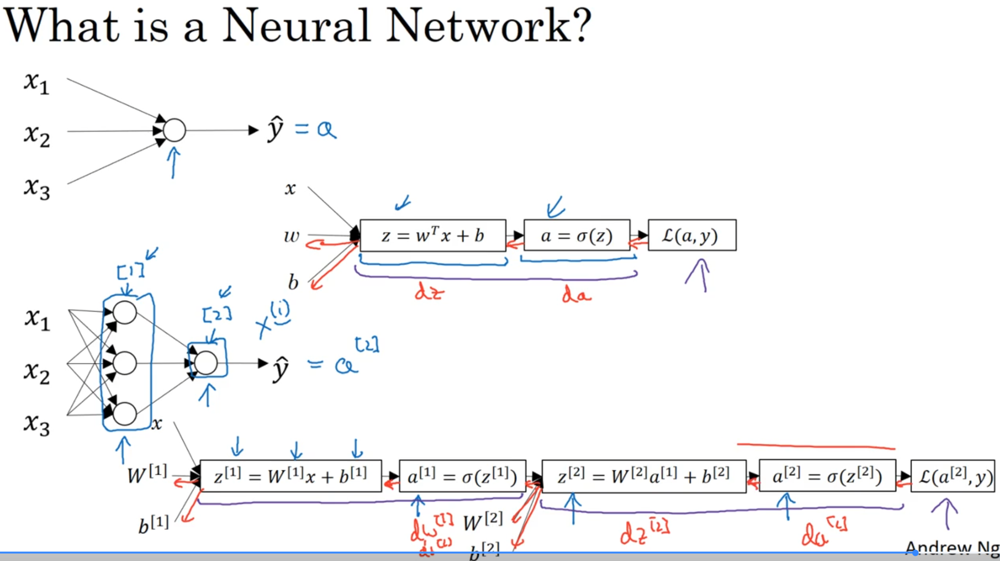

Think of a neural network as stacking together simpler units, like logistic regression, into layers. Just like you build complex structures by stacking Lego bricks, you build a neural network by connecting these simple units.

Each "neuron" or unit in the network performs two steps:
1.  **Linear Calculation:** Computes `z = wᵀx + b`.
2.  **Activation:** Applies a non-linear activation function `a = g(z)` (like sigmoid, tanh, or ReLU).

A simple neural network with one "hidden layer" takes the input `x`, processes it through the hidden layer, and then processes the result through an "output layer" to produce the final prediction `ŷ`.

---
#### 2️⃣ Forward Propagation: The Calculation Flow

The process of calculating the output `ŷ` from an input `x` is called **forward propagation**. It flows from left to right through the network:

1.  **Input:** Starts with the input features `x` (also denoted as `a[0]`).
2.  **Hidden Layer Calculation:**
    * `z[1] = W[1]x + b[1]`
    * `a[1] = g[1](z[1])` (Apply activation function `g[1]`, e.g., ReLU or tanh).
3.  **Output Layer Calculation:**
    * `z[2] = W[2]a[1] + b[2]`
    * `a[2] = g[2](z[2])` (Apply activation function `g[2]`, e.g., sigmoid for binary classification).
4.  **Prediction:** The final output `a[2]` is the prediction `ŷ`.
5.  **Loss Calculation:** Calculate the loss `L(a[2], y)` to measure the error.

**Notation:**
* Superscript square brackets `[l]` refer to layer `l` of the Neural Network(e.g., `W[1]`, `b[1]`, `a[1]`).
* Superscript round brackets `(i)` refer to the i-th training example `x(i)`.

---
#### 3️⃣ Backward Propagation: Calculating Gradients

To train the network (i.e., learn the parameters `W[1]`, `b[1]`, `W[2]`, `b[2]`), we need to calculate how the loss changes with respect to each parameter. This is done via **backward propagation**, flowing from right to left:

1.  Start by calculating the derivative of the Loss with respect to the output `a[2]`.
2.  Then calculate the derivative with respect to `z[2]`.
3.  Use this to find the derivatives for `W[2]` and `b[2]`.
4.  Continue backwards to find derivatives for `a[1]`, `z[1]`, and finally `W[1]` and `b[1]`.

This backward flow allows us to compute all the necessary gradients efficiently.

---
---
#  Representation

#### 1️⃣ Layers of the Network

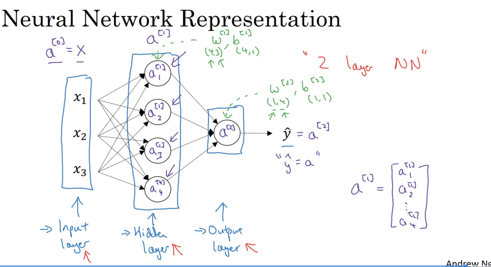

A neural network is organized into layers:

* **Input Layer (Layer 0):** This isn't usually counted as a formal layer but holds the input features `x`. The activations of this layer are denoted as `a[0]`, which is simply the input `x`.
* **Hidden Layer (Layer 1):** This is the first *actual* layer. It takes inputs from the input layer and performs computations. The term "hidden" comes from the fact that its true values aren't directly observed in the training data (you only see the input `x` and the final output `y`).
* **Output Layer (Layer 2):** This is the final layer that produces the prediction `ŷ`.

This structure is therefore called a **2-layer neural network** because we don't count the input layer.


---
#### 2️⃣ Activations (a)

* **Activation:** The value calculated by a neuron and passed to the next layer is called its activation.
* **Notation `a[l]j`:** Represents the activation of the `j`-th neuron in layer `l`.
    * `a[0]` = `x` (Input features).
    * `a[1]` = Vector of activations from the hidden layer. For a hidden layer with 4 units, `a[1]` would be a 4x1 vector containing `a[1]1`, `a[1]2`, `a[1]3`, `a[1]4`.
    * `a[2]` = Activation of the output layer (a single value for binary classification), which is the final prediction `ŷ`.

---
#### 3️⃣ Parameters (W and b)

Each layer (excluding the input layer) has associated parameters that are learned during training:

* **Weights (W[l]):** A matrix containing the connection strengths between layer `l-1` and layer `l`.
    * `W[1]` connects the input layer (0) to the hidden layer (1). Its shape is `(n[1], n[0])`, where `n[1]` is the number of units in layer 1 and `n[0]` (or `nx`) is the number of input features.
    * `W[2]` connects the hidden layer (1) to the output layer (2). Its shape is `(n[2], n[1])`, where `n[2]` is the number of units in layer 2 (which is 1 for binary classification).
* **Biases (b[l]):** A vector containing an offset term for each neuron in layer `l`.
    * `b[1]` has shape `(n[1], 1)`.
    * `b[2]` has shape `(n[2], 1)` (which is `(1, 1)` for binary classification).

---
## ❓ Why "Hidden"?

In **supervised learning**, your training dataset consists of pairs: an **input (`x`)** and the **correct output (`y`)**.

* **You See the Inputs:** You provide the network with the input features (`x`), like the pixel values of an image or the size of a house. These are the activations of the input layer (`a[0]`).
* **You See the Desired Output:** You tell the network what the final answer *should* be (`y`), like "cat" (1) or "not cat" (0), or the correct house price.
* **You *Don't* See the Middle:** The training data **does not explicitly tell you** what the values (activations) of the neurons in the layers between the input and output *should* be. These intermediate activations (`a[1]` in our example) are not part of the labeled data.

The network has to **learn** what values these intermediate neurons should take on its own during the training process. It figures out how to represent the input data in a useful way in these hidden layers to help it make the final prediction.

**Analogy:** Imagine asking someone to identify a cat in a picture.
* **Input:** You show them the picture (`x`).
* **Output:** They tell you "cat" or "not cat" (`y`).
* **Hidden Layer:** You don't know exactly what features their brain focused on or the intermediate processing steps they took (e.g., recognizing pointy ears, whiskers, fur texture). Those internal steps are "hidden" from you, just like the activations in the hidden layer are "hidden" relative to the training data.

So, the layers are called "hidden" because their specific activation values for a given input aren't provided in the training set; the network learns them internally.

---
---
### 💻 Computing a Neural Network's Output

let's break down how the neural network calculates its output, `ŷ`, starting from the input `x`. This is the **forward propagation** process.


#### 1️⃣ Single Neuron Calculation (Logistic Regression Unit)

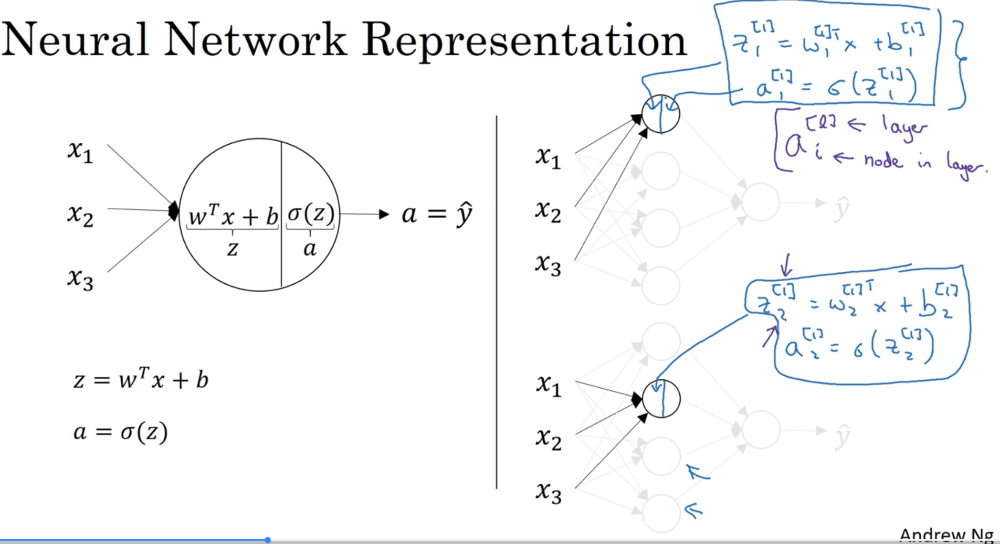

Remember that each neuron (circle) in the network performs a two-step calculation, just like in logistic regression:
1.  **Linear Step:** `z = wᵀx + b`
2.  **Activation Step:** `a = g(z)` (where `g` is the activation function, like sigmoid)


---
#### 2️⃣ Hidden Layer Calculation (Layer 1)

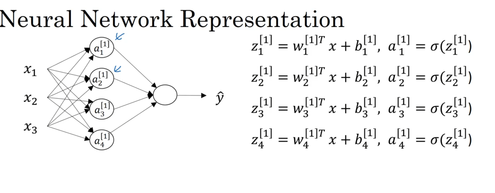

The hidden layer consists of multiple neurons (in our example, 4). Each neuron in this layer performs the two-step calculation using the *same input `x`* but with its *own set of parameters* (`w` vector and `b` scalar).

* **Neuron 1:**
    * `z[1]1 = w[1]1ᵀx + b[1]1`
    * `a[1]1 = g[1](z[1]1)`
* **Neuron 2:**
    * `z[1]2 = w[1]2ᵀx + b[1]2`
    * `a[1]2 = g[1](z[1]2)`
* ...and so on for all neurons in the layer.

**Vectorized Calculation:** Instead of computing these one by one using a loop (which is inefficient), we vectorize the process:

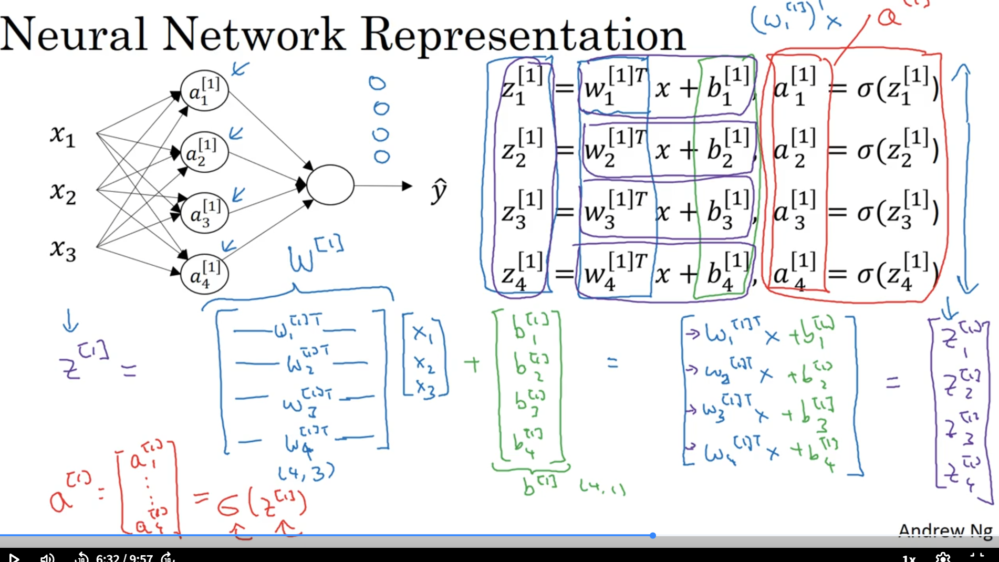

1.  Stack the weight vectors `w[1]jᵀ` into a matrix `W[1]`.
2.  Stack the biases `b[1]j` into a vector `b[1]`.
3.  Compute all `z` values at once: `z[1] = W[1]x + b[1]`.
4.  Apply the activation function `g[1]` (e.g., tanh or ReLU) element-wise to get the activation vector `a[1]`: `a[1] = g[1](z[1])`.

`a[1]` is now the vector of outputs from the hidden layer, which serves as the input for the next layer.

---
#### 3️⃣ Output Layer Calculation (Layer 2)

The output layer (in our binary classification example, just one neuron) takes the activations `a[1]` from the hidden layer as its input and performs the same two steps, but using its own parameters `W[2]` and `b[2]`:

1.  **Linear Step:** `z[2] = W[2]a[1] + b[2]`.
2.  **Activation Step:** `a[2] = g[2](z[2])`. Here, `g[2]` would typically be the sigmoid function for binary classification, ensuring the output is between 0 and 1.

---
#### 4️⃣ Final Output

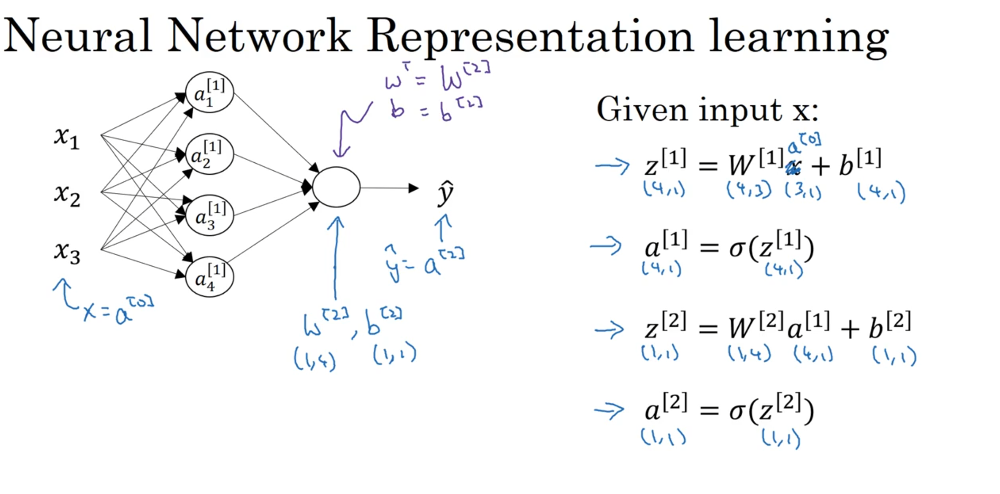

The activation of the output layer, `a[2]`, is the final prediction of the neural network, `ŷ`.

**Summary of Equations (for one input `x`):**
1.  `z[1] = W[1]x + b[1]`
2.  `a[1] = g[1](z[1])`
3.  `z[2] = W[2]a[1] + b[2]`
4.  `a[2] = g[2](z[2]) = ŷ`

These four equations represent the complete forward pass for a 2-layer neural network.

---
Okay, let's look at how to efficiently compute the outputs for the *entire training set* at once using vectorization.

-----

### 🚀 Vectorizing Across Multiple Examples

#### 1️⃣ The Problem: Avoiding Loops

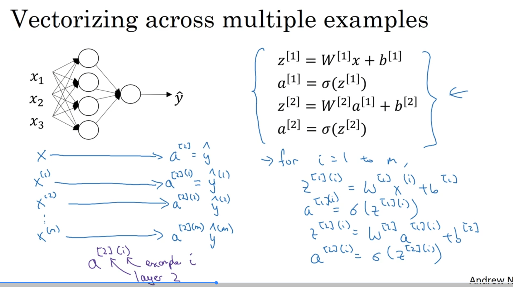

Computing the output for each training example `x⁽ⁱ⁾` one by one using a `for` loop is very slow, especially with large datasets.

```python
# SLOW: Using a for-loop
for i in range(m):
  z_1__i = W1 @ x_i + b1 # Compute z for example i
  a_1__i = sigmoid(z_i)   # Compute a for example i
  # ... (and so on for layer 2)
```

#### 2️⃣ The Solution: Matrix Operations

The key idea is to stack the individual training examples `x⁽ⁱ⁾` into columns to form a large input matrix `X`.

  * **Input Matrix (X):**
      * `X = [ x⁽¹⁾  x⁽²⁾ ... x⁽ᵐ⁾ ]`
      * Shape: `(nₓ, m)`, where `nₓ` is the number of features and `m` is the number of examples.
      * `X` is also denoted as `A[0]`.

Now, we can compute the results for all examples simultaneously for each layer.

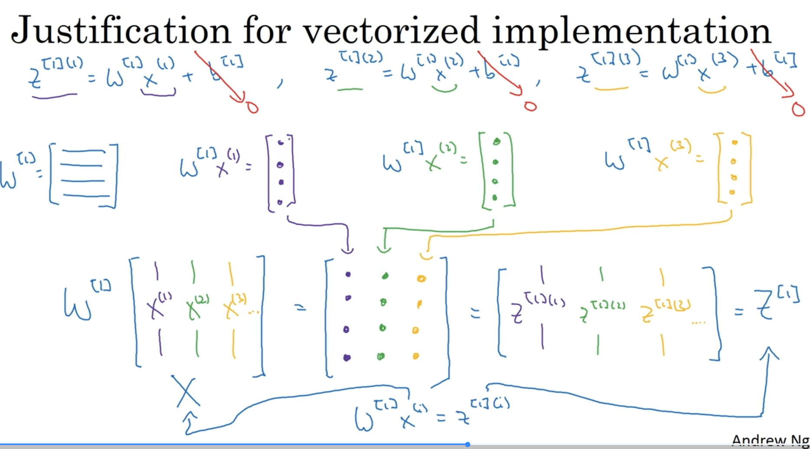

  * **Hidden Layer (Layer 1):**

      * Instead of `z[1]⁽ⁱ⁾ = W[1]x⁽ⁱ⁾ + b[1]` for each `i`, we compute:
          * `Z[1] = W[1]X + b[1]`
          * `Z[1]` shape: `(n[1], m)`, where `n[1]` is the number of hidden units.
          * **Broadcasting:** The bias vector `b[1]` (shape `(n[1], 1)`) is automatically "broadcast" across all `m` examples (columns).
      * Apply the activation function element-wise:
          * `A[1] = g[1](Z[1])`
          * `A[1]` shape: `(n[1], m)`. Each column `a[1]⁽ⁱ⁾` is the hidden layer activation for example `i`.

  * **Output Layer (Layer 2):**

      * Similarly, compute:
          * `Z[2] = W[2]A[1] + b[2]`
          * `Z[2]` shape: `(n[2], m)` (which is `(1, m)` for binary classification).
          * `b[2]` (shape `(n[2], 1)`) is broadcast.
      * Apply activation function element-wise:
          * `A[2] = g[2](Z[2])`
          * `A[2]` shape: `(n[2], m)`. This matrix contains the final predictions `ŷ⁽ⁱ⁾` for all examples.

#### 3️⃣ Summary of Vectorized Equations (Forward Pass):

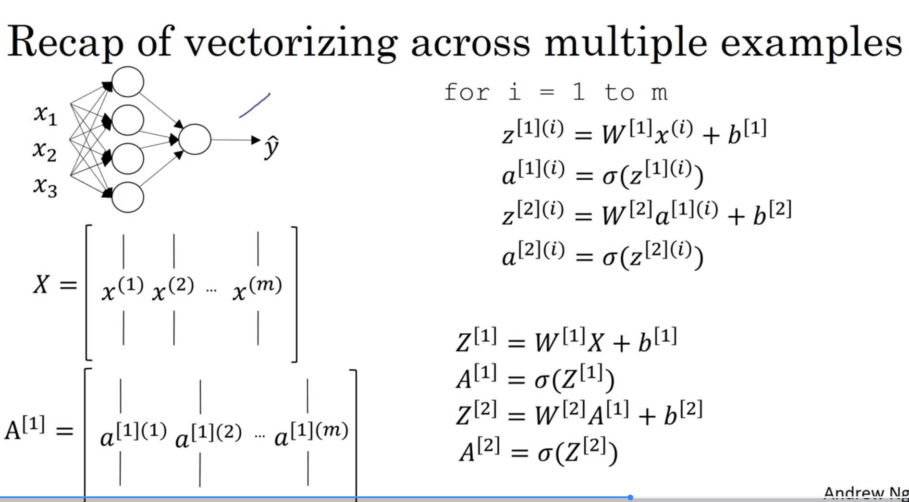

1.  `Z[1] = W[1]X + b[1]`
2.  `A[1] = g[1](Z[1])`
3.  `Z[2] = W[2]A[1] + b[2]`
4.  `A[2] = g[2](Z[2]) = Ŷ` (Matrix of all predictions)

These four lines compute the forward pass for all `m` examples without any explicit `for` loops, leveraging efficient matrix multiplication and broadcasting.

**Matrix Dimensions Intuition:**

  * **Horizontal Index:** Sweeping across columns corresponds to different training examples (from 1 to `m`).
  * **Vertical Index:** Sweeping down rows corresponds to different features (in `X`) or different hidden/output units (in `Z`, `A`).

-----

# Activation Functions

 These are the non-linear functions applied after the linear step (`z = Wx + b`) in each neuron.

---
### 🤔 **Why Non-Linear Activation Functions?**

First, why do we need *non-linear* activation functions at all? If we only used linear activation functions (or no activation function, which is the same as `g(z) = z`), the entire neural network, no matter how many layers, would just be computing a linear function of the input. Using non-linear functions allows the network to learn much more complex patterns and relationships in the data.

---
### 📈 **Common Activation Functions**

Here are some of the most common activation functions and their derivatives (slopes), which are needed for backpropagation:

#### 1. Sigmoid


* **Formula:** `g(z) = 1 / (1 + e⁻ᶻ)`
* **Graph:** An "S"-shaped curve.
    
* **Range:** Outputs values between 0 and 1.
* **Derivative (`g'(z)`):** `g'(z) = g(z) * (1 - g(z))`. If `a = g(z)`, then `g'(z) = a * (1 - a)`. This means if you've already calculated the activation `a`, you can easily find its derivative.
* **Usage:** Mainly used in the **output layer** for **binary classification** problems, because the output needs to be between 0 and 1 (representing a probability). It's **rarely used in hidden layers** anymore because Tanh and ReLU generally perform better.
* **Drawback:** When `z` is very large or very small, the slope of the sigmoid function becomes very close to zero. This can slow down learning during gradient descent (the "vanishing gradient" problem).

---
#### 2. Tanh (Hyperbolic Tangent)

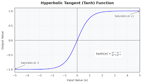

* **Formula:** `g(z) = (eᶻ - e⁻ᶻ) / (eᶻ + e⁻ᶻ)`
* **Graph:** Also "S"-shaped, but centered around zero.
    
* **Range:** Outputs values between -1 and 1.
* **Derivative (`g'(z)`):** `g'(z) = 1 - (tanh(z))²`. If `a = g(z)`, then `g'(z) = 1 - a²`.
* **Usage:** Often preferred over sigmoid for **hidden layers**. Its outputs are centered around zero (mean closer to zero), which helps "center" the data being fed into the next layer, often making learning easier.
* **Drawback:** Like sigmoid, the gradients can become very small when `z` is large or small.

---
#### 3. ReLU (Rectified Linear Unit)


* **Formula:** `g(z) = max(0, z)`
* **Graph:** Zero for negative inputs, then increases linearly for positive inputs.
    
* **Range:** Outputs values from 0 to infinity.
* **Derivative (`g'(z)`):** `g'(z) = 0` if `z < 0`, and `g'(z) = 1` if `z > 0`. The derivative is technically undefined at `z=0`, but in practice, you can set it to 0 or 1, and it works fine.
* **Usage:** The **most common default choice** for **hidden layers** nowadays.
* **Advantages:**
    * Computationally very simple (just a comparison).
    * Avoids the vanishing gradient problem for positive values (the slope doesn't saturate).
    * Often results in faster learning compared to sigmoid or tanh.
* **Drawback:** The derivative is zero for all negative inputs, which can sometimes lead to "dead neurons" that stop learning (though this often isn't a major issue in practice).

---
#### 4. Leaky ReLU

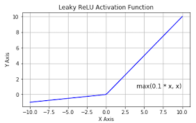

* **Formula:** `g(z) = max(0.01*z, z)` (The 0.01 can sometimes vary)
* **Graph:** Similar to ReLU, but has a small positive slope for negative inputs instead of being flat zero.
    
* **Range:** Outputs values from -infinity to +infinity.
* **Derivative (`g'(z)`):** `g'(z) = 0.01` if `z < 0`, and `g'(z) = 1` if `z > 0`.
* **Usage:** An alternative to ReLU for **hidden layers**, sometimes works slightly better.
* **Advantage:** Addresses the "dead neuron" issue by allowing a small, non-zero gradient when the input is negative.

---
### 🛠️ **Choosing an Activation Function**

* **Hidden Layers:** Start with **ReLU** as the default. Tanh is also commonly used. You can experiment with Leaky ReLU if you suspect issues with ReLU.
* **Output Layer:**
    * **Binary Classification (0/1):** Use **Sigmoid**.
    * **Regression (predicting real numbers):** Use a **Linear** activation (`g(z)=z`).
    * **Regression (predicting non-negative numbers, e.g., housing prices):** You might use **ReLU**.

* **Recommendation:** If unsure, try different functions and see which performs best on a validation set.

---

# Some Questions and Answers about Activation Funcions

Okay, let's break down those excellent questions about activation functions.

## 1. Why Non-Linear Activation Functions are Essential

You're right, we *must* use non-linear activations in the hidden layers. If we only used linear activations (like `g(z) = z`), stacking multiple layers wouldn't help.

* **Linear Stacking is Still Linear:** Imagine Layer 1 computes `a[1] = W[1]x + b[1]` (linear) and Layer 2 computes `a[2] = W[2]a[1] + b[2]` (also linear). If you substitute the first equation into the second, you get `a[2] = W[2](W[1]x + b[1]) + b[2]`. This simplifies to `(W[2]W[1])x + (W[2]b[1] + b[2])`, which is just another linear function `W'x + b'`.
* **Limited Power:** No matter how many layers you stack, if they're all linear, the entire network behaves like a single linear layer. This means it can only learn linear relationships between inputs and outputs, which is insufficient for most real-world problems (like recognizing cats!).
* **Non-linearity Adds Complexity:** Introducing non-linear activation functions (Sigmoid, Tanh, ReLU) between the linear calculations allows the network to learn much more complex, non-linear mappings from input to output. This is what gives neural networks their power.
---
## 2. Linear vs. Non-linear Relationships

* **Linear Relationship:** Think of a **straight line**. If you change the input by a certain amount, the output always changes by a proportional amount (like `y = 2x`). No matter how many straight-line functions you combine, you still end up with a straight-line function. Real-world data (like identifying a cat in complex images) rarely follows simple straight-line patterns.
* **Non-linear Relationship:** Think of **any curved line** or shape. The change in output is *not* directly proportional to the change in input. Non-linear functions allow the network to bend and twist its "decision boundary" to fit complex patterns in the data. By stacking layers with non-linear activations, neural networks can approximate incredibly complex, wiggly functions, which is necessary to learn tasks like image recognition or language translation. Without non-linearity in the hidden layers, a deep network wouldn't be any more powerful than a simple linear model like logistic regression.

### Linear vs. Non-Linear: Why Curves Matter 🐈

Imagine you're trying to separate pictures of cats from pictures of dogs based on just two features: "pointiness of ears" (x-axis) and "fluffiness" (y-axis).

* **Linear Approach (Straight Line):** A linear classifier (like basic logistic regression without hidden layers, or a neural network with only linear activations) can only draw a **straight line** to separate the cats from the dogs.
    
    If all the cat pictures happen to fall neatly on one side of the line and all the dogs on the other, great! But what if the data looks more like this?
    
    Maybe cats are generally fluffy *or* have pointy ears, but not always both, while dogs are somewhere in the middle. A straight line just can't effectively separate these groups. You'll always misclassify some cats or dogs.

* **Non-Linear Approach (Curved Line):** A neural network with **non-linear activation functions** (like ReLU or Tanh) in its hidden layers can learn to draw **curved decision boundaries**.
    
    By combining multiple non-linear functions across layers, the network can create much more complex shapes to accurately separate the cat pictures from the dog pictures, even if the relationship isn't simple. It can learn that "cats" are in *this* region (maybe high fluffiness OR high pointiness) and "dogs" are in *that* region.
    Without non-linearity, you're stuck with only straight lines, which severely limits the complexity of problems the network can solve. Cat recognition is a complex problem that needs these flexible, curved boundaries.
---
## 3. Sigmoid Drawback: Why Near-Zero Gradients are Bad (Slow Learning)

The gradient (derivative/slope) tells the gradient descent algorithm *how much* to update the weights (`w`) and biases (`b`) to reduce the cost. The update rule is `w = w - learning_rate * gradient`.

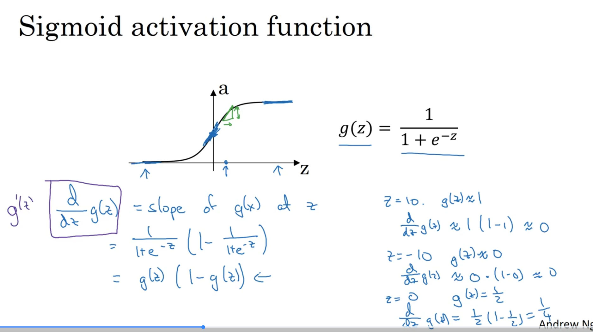

* **Small Gradient = Small Update:** When the gradient is close to zero (which happens when the input `z` to the sigmoid function is very large or very small, where the curve flattens out), the update `learning_rate * gradient` becomes tiny.
* **Slow Learning:** This means the weights and biases change very slowly, and the network takes a very long time to learn or might even get stuck. This effect is particularly problematic in deeper networks.

---
## 4. Tanh Advantage: How Centering Helps

Tanh outputs values between -1 and 1, meaning its average output is closer to zero than sigmoid's (which outputs 0 to 1, average around 0.5).

* **Impact on Next Layer:** Consider the gradient calculation for the weights `W[l]` in the *next* layer during backpropagation. The update involves the activations `a[l-1]` from the *previous* layer.
* **Consistent Updates:** If the inputs (`a[l-1]`) coming into layer `l` are roughly centered around zero, the gradients calculated for `W[l]` tend to be more consistent. If the inputs are always positive (like sigmoid's output), the weight updates can be more skewed, potentially making the optimization path less direct and slower.
* **Analogy:** Imagine adjusting screws on a panel. If all your tools push only in one direction, it's harder to fine-tune than if you can push and pull (positive and negative adjustments). Zero-centered activations allow for more balanced updates.

So, Tanh often leads to slightly faster convergence because it helps keep the inputs to subsequent layers centered.

### Tanh Advantage: Balanced Pushing and Pulling

Let's revisit why having activations centered around zero (like Tanh's -1 to 1 output) helps compared to always positive activations (like Sigmoid's 0 to 1 output).

Think about how weights are updated during training using gradient descent: `New Weight = Old Weight - Learning Rate * Gradient`. The gradient calculation for a weight in Layer 2 depends on the activations coming *out* of Layer 1.

* **Scenario 1: Sigmoid in Layer 1 (Activations always 0 to 1):** All inputs to Layer 2 are positive. When backpropagation calculates the gradient for Layer 2's weights, this positivity can create a bias. Imagine the gradient calculation simplifies to something like `Gradient ≈ (Error Signal) * (Activation from Layer 1)`. Since the activation is always positive, the sign of the gradient (whether we increase or decrease the weight) is determined *only* by the error signal. All weights connected to a specific neuron in Layer 2 might tend to increase or decrease together. This can make the learning path less direct – like trying to steer a car that can only make right turns.

* **Scenario 2: Tanh in Layer 1 (Activations -1 to 1):** The inputs to Layer 2 are now both positive and negative (centered around zero). The gradient calculation `Gradient ≈ (Error Signal) * (Activation from Layer 1)` is now influenced by the sign of the activation. Some weights might get positive updates, while others get negative updates, even if they're connected to the same neuron. This allows for more flexible and balanced adjustments to the weights. It's like being able to steer both left and right, allowing for a potentially quicker and more direct path to the optimal weights.

While this zero-centering often helps speed up convergence, Tanh still has the vanishing gradient issue in its flat parts, which is why ReLU became popular.
---
## 5. ReLU Range (0 to Infinity): Not a Problem for Hidden Layers

You're right that ReLU's output isn't bounded between 0 and 1. But remember, ReLU is primarily used in **hidden layers**, not usually the final output layer for classification.

* **Hidden Layers Transform Data:** The job of hidden layers is to transform the input data into representations that make it easier for the *next* layer to do its job. It doesn't matter if these intermediate representations range from 0 to infinity. The non-linearity introduced by ReLU is the crucial part. It allows the network to learn complex features.
* **Output Layer Handles Classification:** For binary classification, the **output layer** still typically uses a **sigmoid** function. This final sigmoid takes the output of the last hidden layer (which might have used ReLU) and squashes it into the desired 0-to-1 probability range. For multi-class classification, a function called Softmax is used in the output layer.
* **Benefit:** ReLU avoids the saturation problem (zero gradients) for positive inputs, leading to faster training.

---
## 6. Vanishing Gradient Problem

This is exactly the issue we discussed with sigmoid and tanh:

* **Definition:** In deep neural networks (networks with many layers), gradients are calculated during backpropagation by multiplying derivatives layer by layer (using the chain rule).
* **The Problem:** If activation functions like sigmoid or tanh are used, their derivatives are often numbers less than 1 (especially in the flat regions). When you multiply many numbers less than 1 together, the result becomes extremely small, approaching zero.
* **Effect:** This means the gradients calculated for the *early layers* (close to the input) become vanishingly small. Consequently, the weights in these early layers update extremely slowly, or stop updating altogether. The network fails to learn effectively, especially in its initial layers.
* **ReLU's Role:** ReLU helps mitigate this because its derivative is 1 for positive inputs, preventing the gradient from shrinking multiplicatively in those cases.

---
Here are the notes on Gradient Descent for a Neural Network, which is the core training algorithm from Course 1, Week 3.

---

# 📉 **Gradient Descent for Neural Networks**

This is the optimization algorithm we use to train our neural network. It finds the optimal values for the parameters (`W` and `b`) by minimizing the cost function `J`.

### 1️⃣ The Core Idea: The "Gradient Descent" Loop

* **Analogy:** Imagine you are on a foggy hill and want to get to the lowest point (the valley). You can't see far, but you can feel the slope of the ground where you are. You check the slope (the gradient), take a small step in the steepest downhill direction, and repeat.
* **The Algorithm:** Gradient descent is an iterative process that repeats the following steps:
    1.  **Initialize** Start with random values for `W[1]` and `W[2]` (not zeros, as this causes symmetry problems) and zeros for `b[1]` and `b[2]`. We'll discuss initialization details later.
    2.  **Forward Propagation:** Compute the predictions (`A[2]`) for the entire training set.
    3.  **Compute Cost:** Use the predictions (`A[2]`) and true labels (`Y`) to calculate the cost `J`.
    4.  **Backpropagation:** Compute the gradients (derivatives) of the cost `J` with respect to all parameters (`dW[1]`, `db[1]`, `dW[2]`, `db[2]`).
    5.  **Update Parameters:** Adjust the parameters by "taking a step" in the opposite direction of the gradient.

---

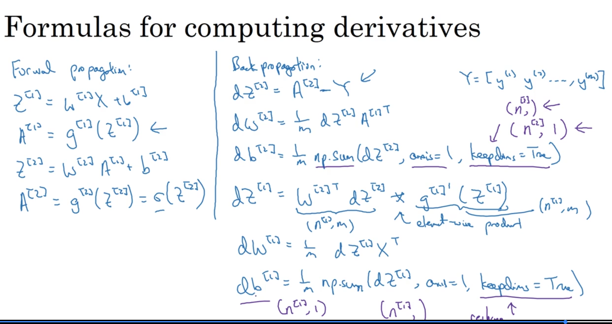

### 2️⃣ Step 1: Forward Propagation (Vectorized)

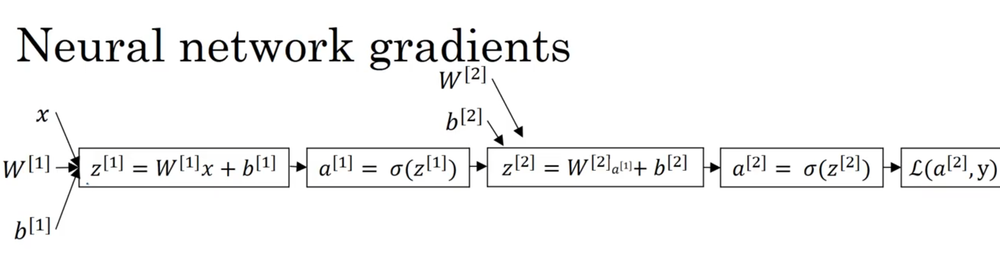

First, we make predictions for all `m` training examples at once using a vectorized implementation.

* `Z[1] = W[1]X + b[1]`
* `A[1] = g[1](Z[1])` (e.g., `tanh` or `ReLU` activation)
* `Z[2] = W[2]A[1] + b[2]`
* `A[2] = g[2](Z[2])` (e.g., `sigmoid` for binary classification)

Here, `A[2]` represents our predictions (`Y_hat`) for the entire batch of examples.

---

### 3️⃣ Step 2: Backpropagation (Vectorized)

This is the most critical step, where we compute the gradients. We move backward through the network, from the output layer to the hidden layer.

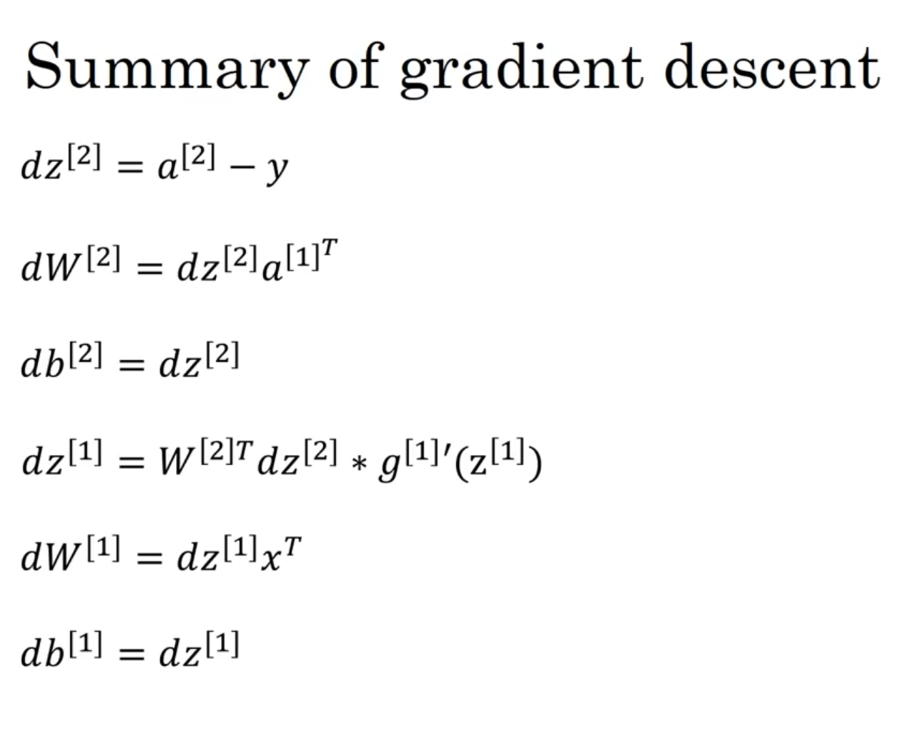

#### **Output Layer (Layer 2) Gradients:**

1.  **`dZ[2] = A[2] - Y`**
    * This is the error in the output layer's `z` calculation. (This formula is specific to the sigmoid activation and its associated loss function).
2.  **`dW[2] = (1/m) * dZ[2] ⋅ A[1].T`**
    * This gives us the gradient for the Layer 2 weights. The `.T` denotes the transpose.
3.  **`db[2] = (1/m) * np.sum(dZ[2], axis=1, keepdims=True)`**
    * This gives us the gradient for the Layer 2 bias.

#### **Hidden Layer (Layer 1) Gradients:**

1.  **`dZ[1] = (W[2].T ⋅ dZ[2]) * g[1]'(Z[1])`**
    * This is the core of backpropagation. We take the error from Layer 2 (`dZ[2]`) and propagate it backward (`W[2].T ⋅ dZ[2]`).
    * We then multiply it (element-wise) by the *derivative of the hidden layer's activation function*, `g[1]'`.
2.  **`dW[1] = (1/m) * dZ[1] ⋅ X.T`**
    * This gives us the gradient for the Layer 1 weights.
3.  **`db[1] = (1/m) * np.sum(dZ[1], axis=1, keepdims=True)`**
    * This gives us the gradient for the Layer 1 bias.

---

### 4️⃣ Step 3: The Update Step

Finally, we use the computed gradients to update our parameters. `α` (alpha) is the **learning rate**, which controls how big each step is.

* `W[1] = W[1] - α * dW[1]`
* `b[1] = b[1] - α * db[1]`
* `W[2] = W[2] - α * dW[2]`
* `b[2] = b[2] - α * db[2]`

We repeat this entire process many times, and with each iteration, our parameters get better, and the cost `J` goes down.

Okay, let's discuss why **random initialization** is crucial when training neural networks.

---
# 🎲 Random Initialization

#### 1️⃣ The Problem: Initializing Weights to Zero

Unlike logistic regression where initializing weights to zero is acceptable, doing so in a neural network with hidden layers **prevents the network from learning effectively**.

* **Symmetry Issue:** Consider a simple network with 2 input features and 2 hidden units. If you initialize the weight matrix `W[1]` and the bias `b[1]` to all zeros, both hidden units are connected to the inputs in exactly the same way.
* **Identical Computations:** Because they start with identical parameters, both hidden units will compute the exact same function during the forward pass (`a[1]1` will always equal `a[1]2`).
* **Identical Gradients:** During backpropagation, it turns out (due to this symmetry) that both hidden units will also receive the exact same gradient signal (`dz[1]1` will equal `dz[1]2`).
* **Identical Updates:** Consequently, when you update the weights using gradient descent (`W[1] = W[1] - α * dW[1]`), the updates applied to the weights connected to the first hidden unit will be identical to the updates for the second hidden unit.
* **No Learning Differentiation:** This symmetry persists through every iteration. No matter how long you train, both hidden units will always compute the same function. It's as if you only have one hidden unit, making the additional units redundant.

This is often called the **symmetry breaking problem**. Initializing to zero fails to "break" the initial symmetry between hidden units in the same layer.

---
#### 2️⃣ The Solution: Random Initialization

To break this symmetry, we initialize the weights **randomly**, usually to small values close to zero.

* **Weights (W):** Initialize `W[1]`, `W[2]`, etc., using random values drawn from a distribution (like a standard Gaussian `np.random.randn(...)`) and then multiply by a small number (e.g., 0.01).
    * `W[1] = np.random.randn(n[1], n[0]) * 0.01`
* **Biases (b):** The biases `b[1]`, `b[2]`, etc., do not suffer from the symmetry problem, so they can safely be initialized to zero.
    * `b[1] = np.zeros((n[1], 1))`

By starting with slightly different random weights, each hidden unit computes a slightly different function, receives different gradients, and evolves uniquely during training, allowing the network to learn diverse features.

---
#### 3️⃣ Why *Small* Random Values?

We initialize weights to *small* random numbers to avoid issues with activation functions like **tanh** or **sigmoid**, especially during the early stages of training.

* **Large Weights → Large |z|:** If weights `W` are large, the linear combination `z = Wx + b` is more likely to result in large positive or negative values.
* **Saturation:** For sigmoid and tanh, large absolute values of `z` fall into the flat parts of the curve where the gradient (slope) is very close to zero.
* **Slow Learning:** If gradients are near zero, gradient descent updates become tiny, and learning becomes very slow.

Initializing with small random weights helps keep `z` values initially in a range where gradients are larger, allowing learning to proceed more effectively from the start. (While this is less critical for ReLU activations in the hidden layers, it's still relevant if the output layer uses sigmoid).

The specific constant (like 0.01) might need adjustment for very deep networks, a topic explored later.

---
### 4️⃣ Implementation in Python

Here is the standard way to initialize parameters for a two-layer network.

```python
# W1 is for the first layer (layer 1)
# We multiply by 0.01 to make the weights small
W1 = np.random.randn((n_h, n_x)) * 0.01  #

# b1 can be initialized to zeros
b1 = np.zeros((n_h, 1)) #

# W2 is for the second layer (output layer)
W2 = np.random.randn((n_y, n_h)) * 0.01 #

# b2 can be initialized to zeros
b2 = np.zeros((n_y, 1)) #
```
-----

### 5. Why we can Initialize 'b' to Zero:

1.  **Symmetry = Identical Units:** The "symmetry problem" means that all hidden units in a layer are computing the exact same function. If they all start the same and get the same updates, they will always be identical, and you're just computing the same feature multiple times.

2.  **What Makes Units Different?** A unit's computation is `z = Wx + b`. The symmetry is broken if the `z` value is different for each unit in the layer *even when given the same input x*.

3.  **Weights (W) are Multiplicative:** The weights `W` are *multiplied* by the inputs `x`. This is the crucial part.
    * **If W is zero:** `z = (0 * x) + b = b`. If all `b`'s are also zero, then `z=0` for every unit. They are all symmetric.
    * **If W is random:** `z = (W_random * x) + b`. Now, even if `b` is zero, the `W_random * x` term will be different for every unit because each unit has its own set of small random weights.

4.  **Biases (b) are Additive:** The bias `b` is just an *offset*. It doesn't interact with the input `x`.

The key insight is this: **The random weights `W` are already doing the job of breaking the symmetry**.

Because the `W` matrix is initialized to small random numbers, each hidden unit is already "looking" at the inputs `x` in a slightly different way from the very first forward pass. Their `z` values will be different, their activations `a` will be different, and their gradients `dW` will be different.

Since the random `W` *already* solves the symmetry problem, there is no need to also initialize `b` randomly. Initializing `b` to zero is simpler, perfectly effective, and has no negative impact because the weights have already made every unit unique.

---


----
# **WEEK-4**
----

# **Deep Neural Network**
---
## 🧠 **Deep L-layer Neural Network**

#### 1️⃣ What Does "Deep" Mean?

A "deep" neural network is simply a network with many layers. While our previous network had only one hidden layer (total `L=2` layers: one hidden, one output), a deep network can have multiple hidden layers (e.g., 3, 5, 20, or even hundreds).

* **Shallow Network:** Input Layer → Hidden Layer → Output Layer
* **Deep Network:** Input Layer → Hidden 1 → Hidden 2 → ... → Hidden `L-1` → Output Layer

This "depth" allows the network to learn complex hierarchical features. The first layer might learn simple edges, the second layer might combine edges to learn shapes (like circles or squares), the third might combine shapes to learn objects (like eyes or noses), and so on.


---
#### 2️⃣ Notation for a Deep Network

To manage this complexity, we need a consistent notation where `L` represents the total number of layers in the network.

* **`L` = Total Number of Layers:**
    * We do not count the input layer.
    * A network with 3 hidden layers is an `L=4` layer network (3 hidden + 1 output).
* **`l` = Layer Index:**
    * `l` ranges from `1` to `L`.
    * **Input Layer:** This is **Layer 0**. Its "activation" `A[0]` is just the input data `X`.
    * **Hidden Layers:** These are layers `l = 1, 2, ..., L-1`.
    * **Output Layer:** This is the final layer, **Layer `L`**. Its activation `A[L]` is the final prediction `Ŷ`.

---
#### 3️⃣ Layer Dimensions (`n[l]`)

We use `n[l]` to denote the number of units (neurons) in a given layer `l`.

* **`n[0]` = `n_x`:** The number of units in the input layer (Layer 0) is the number of input features.
* **`n[1]`:** Number of units in the first hidden layer.
* **`n[2]`:** Number of units in the second hidden layer.
* ...
* **`n[L]` = `n_y`:** The number of units in the output layer (Layer `L`). For binary classification, `n[L] = 1`.

---
#### 4️⃣ Parameters: Weights (`W[l]`) and Biases (`b[l]`)

Each layer `l` (from 1 to `L`) has its own parameters `W[l]` and `b[l]`. The shape of these parameters is determined by the dimensions of the layer it connects *from* (`l-1`) and the layer it connects *to* (`l`).

* **`W[l]`:** The weight matrix for layer `l`.
    * **Shape:** `(n[l], n[l-1])`
    * *Why?* As we discussed, this is the only shape that can transform the activations from the previous layer (`A[l-1]`, shape `(n[l-1], m)`) into the linear output for the current layer (`Z[l]`, shape `(n[l], m)`).
* **`b[l]`:** The bias vector for layer `l`.
    * **Shape:** `(n[l], 1)`
    * This vector is broadcast across all `m` examples during the vectorized computation.

---
#### 5️⃣ Activations (`A[l]`) and Linear Outputs (`Z[l]`)

* **`A[l]`:** The matrix of activations (outputs) for layer `l`.
    * **Shape:** `(n[l], m)`
    * The input `X` is denoted as `A[0]`.
    * The final prediction `Ŷ` is `A[L]`.
* **`Z[l]`:** The matrix of linear outputs for layer `l` (before the activation function is applied).
    * **Shape:** `(n[l], m)`

This notation gives us a consistent way to describe any layer in the network.

---
---
## ➡️ **Forward Propagation in a Deep Network**

#### 1️⃣ The Core Idea: A Chain Reaction

Forward propagation in a deep network is simply a chain of repeated calculations. The output of one layer becomes the input for the next.

This process is executed in a loop, from `l=1` (the first hidden layer) all the way to `l=L` (the output layer).


---
#### 2️⃣ The General Formula (for any Layer `l`)


For any given layer `l` (from `l=1` to `l=L`), the calculation is always the same two steps. We just "hand off" the result from the previous layer.

1.  **Linear Step:**
    `Z[l] = W[l]A[l-1] + b[l]`

2.  **Activation Step:**
    `A[l] = g[l](Z[l])`

Here, `A[l-1]` is the activation (output) from the *previous* layer, and `g[l]` is the activation function (e.g., ReLU, Tanh, or Sigmoid) chosen for the *current* layer.

---
#### 3️⃣ The Full Process (Input to Output)

Here is the complete step-by-step flow for the vectorized implementation:

* **Start (Layer 0):**
    * `A[0] = X` (The input features `X` are the "activations" of Layer 0).

* **Hidden Layers (l = 1 to L-1):**
    * `Z[1] = W[1]A[0] + b[1]`
    * `A[1] = ReLU(Z[1])` (Using ReLU as an example for hidden layers)
    *
    * `Z[2] = W[2]A[1] + b[2]`
    * `A[2] = ReLU(Z[2])`
    * ... (This loop repeats for all hidden layers)

* **Output Layer (l = L):**
    * `Z[L] = W[L]A[L-1] + b[L]`
    * `A[L] = Sigmoid(Z[L])` (Using Sigmoid for binary classification)

* **Final Result:**
    * `A[L]` is the final matrix of predictions, `Ŷ`.

---
#### 4️⃣ The Importance of Caching

When we implement this, we don't just throw away the intermediate values `Z[l]` and `A[l-1]`. These values are essential for the backward propagation step later.

* **Cache:** We store the computed `Z[l]`, `A[l-1]`, and `W[l]` for each layer in a "cache" (like a Python dictionary).
* **Why?**
    * We'll need `Z[l]` to calculate the derivative of the activation function `g[l]'(Z[l])`.
    * We'll need `A[l-1]` to calculate the gradient for the weights, `dW[l]`.
    * We'll need `W[l]` to calculate the gradient for the *previous* layer, `dZ[l-1]`.

This cache is then passed to the backward propagation function.

---

You're right, we skipped ahead slightly. Lecture 3, "Getting your matrix dimensions right," is an extremely practical and important topic. It's less about new theory and more about a fundamental skill for implementation.

The core idea is that **getting your matrix dimensions correct is the single most effective way to debug your neural network implementation.** If the dimensions don't line up, your code is definitely broken. If they do line up, your code is *probably* correct.

Here are the notes on how to systematically check your dimensions.

---
#### 📏 **Getting Your Matrix Dimensions Right**


#### 4️⃣ Summary Table

This table is your best friend during implementation. (`m` is the number of examples).

>| Variable | Shape (Vectorized) | Why? |
>| :--- | :--- | :--- |
>| `W[l]` | `(n[l], n[l-1])` | To transform `(n>[l-1], m)` input to `(n[l], m)` output. |
>| `b[l]` | `(n[l], 1)` | One bias per unit in layer `l`. |
>| `Z[l]`, `A[l]` | `(n[l], m)` | `n[l]` units, `m` examples. |
>| `dZ[l]`, `dA[l]` | `(n[l], m)` | Must match the shape of `Z[l]` and `A[l]`. |
>| `dW[l]` | `(n[l], n[l-1])` | Must match the shape of `W[l]`. |
>| `db[l]` | `(n[l], 1)` | Must match the shape of `b[l]`. |

---
---
## 💡 **Why Deep Representations?**

The main reason deep networks are powerful is that they can learn **hierarchical features**, building up complex concepts from simple ones, layer by layer.

---
#### 1️⃣ Learning Simple to Complex Features

A deep network learns features in a hierarchy, similar to how the human brain might process information. The first layer learns simple features, and subsequent layers combine them into progressively more complex ones.

* **Layer 1 (Early Layers):** Might learn to detect simple features, like edges at different orientations or patches of color.
* **Layer 2 (Middle Layers):** Might learn to combine these edges to form more complex shapes, like corners, circles, or simple textures.
* **Layer 3 (Deeper Layers):** Might learn to combine *those* shapes to form parts of objects, like an eye, a nose, or a wheel.
* **Final Layers:** Can combine these object parts to recognize entire, complex objects, like a specific person's face or a car.


This hierarchical structure is very effective for natural data like images and audio, which have a similar built-in hierarchy (pixels $\rightarrow$ edges $\rightarrow$ shapes $\rightarrow$ objects, or sound waves $\rightarrow$ phonemes $\rightarrow$ words $\rightarrow$ sentences).

---
#### 2️⃣ The "Circuit Theory" Analogy (Efficiency)

There's also a more formal argument, based on circuit theory, for why deep networks can be much more *efficient* than shallow ones.

* **The Problem:** Consider a complex function, like computing the **XOR** of many inputs ($x_1$ XOR $x_2$ XOR ... XOR $x_n$).
* **Shallow Network Solution:** A shallow network (with only one hidden layer) *can* learn this function, but it would need a massive, "fat" hidden layer, requiring an **exponential** number of hidden units (e.g., $2^{n-1}$ units). This is computationally very expensive.
* **Deep Network Solution:** A deep network can solve this much more efficiently. It can be structured like a tree:
    * Layer 1 computes the XOR of pairs of inputs.
    * Layer 2 computes the XOR of the results from Layer 1.
    * ...and so on, until the final result is computed.
    This deep, tree-like structure only requires a *linear* number of total units, which is exponentially smaller than the shallow network's requirement.

This analogy shows that for certain types of complex functions, a deep architecture is exponentially more efficient at representing and computing them.

---
#### 3️⃣ Summary

Deep networks work well because:
1.  They are excellent at learning the **hierarchical features** present in many real-world datasets (like images and speech).
2.  They can be **exponentially more parameter-efficient** at representing complex functions compared to shallow networks. This efficiency often helps them generalize better to new data.

---
---
## 🧱 **Building Blocks of Deep Neural Networks**

#### 1️⃣ The Core Idea: Modularity


Instead of writing one giant, monolithic function for forward and backward propagation, we build the network from reusable "building blocks." This makes the code much easier to write, debug, and maintain.

The main blocks are:
* A "forward" function for a single layer.
* A "backward" function for a single layer.

We then stack these blocks together to build the full deep network.


---
#### 2️⃣ Forward Propagation Building Blocks

The forward pass for one layer `l` (`Z[l] = W[l]A[l-1] + b[l]` and `A[l] = g[l](Z[l])`) is broken into two parts:

1.  **`linear_forward(A_prev, W, b)`:**
    * This function takes the activations from the previous layer (`A_prev`) and the current layer's parameters (`W`, `b`).
    * It computes the linear part: `Z = W * A_prev + b`.
    * It returns `Z` and a `cache` containing `(A_prev, W, b)`, which we'll need for backpropagation.

2.  **`linear_activation_forward(A_prev, W, b, activation)`:**
    * This function wraps the first one.
    * It calls `linear_forward` to get `Z` and the `linear_cache`.
    * It applies the chosen `activation` function (`ReLU` or `Sigmoid`) to `Z` to get `A`.
    * It returns `A` and a `cache` containing both the `linear_cache` and the `activation_cache` (`Z`).

---
#### 3️⃣ Assembling the Full Forward Pass (`L_model_forward`)

The full forward pass function (`L_model_forward`) uses these blocks to go from `X` to `A[L]`:

* It initializes `A_prev = X`.
* It **loops from `l = 1` to `L-1`** (all the hidden layers):
    * It calls `linear_activation_forward` using `A_prev` and the parameters for layer `l` (`W[l]`, `b[l]`) with the **ReLU** activation.
    * It stores the returned `cache` in a list.
* It **runs one last time for Layer `L`** (the output layer):
    * It calls `linear_activation_forward` using the final hidden layer's output, parameters `W[L]`, `b[L]`, and the **Sigmoid** activation.
    * It stores this final cache.
* It returns the final activations `A[L]` (the predictions) and the `caches` list.

---
#### 4️⃣ Backward Propagation Building Blocks

Similarly, the backward pass is broken into blocks:

1.  **`linear_backward(dZ, cache)`:**
    * This function takes the gradient `dZ` for the current layer and the `cache` from the `linear_forward` step (`A_prev`, `W`, `b`).
    * It uses `dZ` and the cached values to compute:
        * `dA_prev` (the gradient to pass to the previous layer).
        * `dW` (the gradient for the current layer's weights).
        * `db` (the gradient for the current layer's bias).
    * It returns `dA_prev`, `dW`, and `db`.

2.  **`linear_activation_backward(dA, cache, activation)`:**
    * This function wraps the first one. It takes the gradient `dA` for the *current* layer's activations.
    * It computes `dZ` by multiplying `dA` with the derivative of the `activation` function (`g'(Z)`). (The `Z` value is retrieved from the `cache`).
    * It then calls `linear_backward` with this new `dZ` and the `linear_cache`.
    * It returns `dA_prev`, `dW`, and `db`.

---
#### 5️⃣ Assembling the Full Backward Pass (`L_model_backward`)

The full backward pass function (`L_model_backward`) uses these blocks to compute all gradients:

* It starts with the initial gradients `dA[L]` (which is derived from the cost function, `A[L] - Y`).
* It calls `linear_activation_backward` for **Layer `L`** using `dA[L]`, the `cache` for layer `L`, and the **Sigmoid** activation. This gives `dA[L-1]`, `dW[L]`, and `db[L]`.
* It then **loops backward from `l = L-1` down to `1`**:
    * It calls `linear_activation_backward` using the `dA[l]` it just received from the previous step, the `cache` for layer `l`, and the **ReLU** activation.
    * This gives `dA[l-1]`, `dW[l]`, and `db[l]`.
* It stores all the gradients (`dW[l]`, `db[l]`) in a `grads` dictionary and returns it.

This modular design is the foundation for the programming assignment and for all modern deep learning frameworks.

---
---
## ⬅️ **Backward Propagation in a Deep Network**

#### 1️⃣ The Core Idea: A Reverse Chain Reaction

Backward propagation does the opposite of forward propagation. It starts with the final error (the difference between your prediction `A[L]` and the true label `Y`) and passes this "error signal" backward through the network, layer by layer, to see how much each parameter (`W` and `b`) contributed to the error.


Our goal is to compute the gradients `dW[l]` and `db[l]` for every layer `l` (from `L` down to `1`).

---

#### 2️⃣ Starting at the End (Layer `L`)

We begin by calculating the gradient of the cost with respect to the output.

1.  **Compute `dZ[L]`:**
    The first step is to find the derivative of the cost with respect to `Z[L]`. This is the most crucial step.
    * **Calculus:** `dZ[L] = dA[L] * g[L]'(Z[L])`
    * **The Key Simplification:** For binary classification, we use the (log) cost function and the sigmoid activation function `g[L]` in the output layer. When you combine the derivatives of these two specific functions, they simplify beautifully to:
        **`dZ[L] = A[L] - Y`**
    * This `dZ[L]` (shape `(n[L], m)` or `(1, m)`) represents the initial "error" for each example.

2.  **Compute Gradients for Layer `L`:**
    Once we have `dZ[L]`, we can immediately compute the gradients for the parameters of the final layer, `W[L]` and `b[L]`. This uses the formulas we've seen before, which require values from the **cache** (specifically `A[L-1]`).
    * **`dW[L] = (1/m) * dZ[L] * A[L-1]ᵀ`**
    * **`db[L] = (1/m) * np.sum(dZ[L], axis=1, keepdims=True)`**

---
#### 3️⃣ The General Backward Step (for `l = L-1` down to `1`)

Now we have a loop that goes backward from the second-to-last layer (`L-1`) down to the first layer (`1`). For each layer `l`, we do the following:

1.  **Compute `dA[l]`:**
    First, we propagate the error from the *next* layer (`l+1`) back to the *current* layer `l`. This tells us the gradient of the cost with respect to the *output* (activation) of our current layer.
    * **`dA[l] = W[l+1]ᵀ * dZ[l+1]`**

2.  **Compute `dZ[l]`:**
    Next, we find the gradient of the cost with respect to the *linear output* `Z[l]` of our current layer. This requires multiplying `dA[l]` by the derivative of this layer's activation function, `g[l]'(Z[l])`. The `*` is element-wise multiplication.
    * **`dZ[l] = dA[l] * g[l]'(Z[l])`**
    * (Remember: if `g[l]` is ReLU, `g[l]'(Z[l])` is 1 if `Z[l] > 0` and 0 otherwise. If `g[l]` is Tanh, `g[l]'(Z[l]) = 1 - A[l]²`.)

3.  **Compute Gradients for Layer `l`:**
    Now that we have `dZ[l]`, we can compute the gradients for this layer's parameters, `W[l]` and `b[l]`, using the activations from the *previous* layer (`A[l-1]`).
    * **`dW[l] = (1/m) * dZ[l] * A[l-1]ᵀ`**
    * **`db[l] = (1/m) * np.sum(dZ[l], axis=1, keepdims=True)`**

This loop repeats, passing the error signal (`dA` and `dZ`) backward until we reach `l=1` and have computed `dW[1]` and `db[1]`.

---
#### 4️⃣ 🏁 Finishing the Process

After the loop is complete, we will have a full set of gradients: `dW[1]`, `db[1]`, `dW[2]`, `db[2]`, ..., `dW[L]`, `db[L]`.

These are exactly what we need for a single step of gradient descent:
`W[l] = W[l] - α * dW[l]`
`b[l] = b[l] - α * db[l]`

---
Of course. This is a very important distinction in all of machine learning.

---
## ⚙️ **Parameters vs. Hyperparameters**


#### 1️⃣ The Core Idea: An Analogy

A simple way to think about this is **baking a cake**:

* **Parameters (`W`, `b`):** This is the **batter** itself. Its internal structure, consistency, and state (the actual values of `W` and `b`) are what *change and develop* during the baking (training) process.
* **Hyperparameters:** These are the **recipe settings** you choose *before* you start baking. This includes the oven temperature (learning rate), how long to bake (iterations), and the number/size of your cake pans (network architecture).

You don't "learn" the oven temperature; you *set* it to create the best environment for the batter (parameters) to transform into a good cake (the final model).

---
#### 2️⃣ Parameters (What the Model Learns)


Parameters are the values that the learning algorithm (gradient descent) **learns and updates on its own** during the training process. They are the internal "knowledge" of the network.

* **What are they?** The weights and biases of the network.
* **Notation:** `W[l]` and `b[l]` for every layer `l`.
* **How are they found?** They are the direct result of the forward and backward propagation steps, optimized to minimize the cost function `J`.

---
#### 3️⃣ Hyperparameters (What You Set)

Hyperparameters are the **high-level configuration choices** that you, the data scientist or engineer, must set *before* you start training. The algorithm cannot learn these from the data.

The main hyperparameters are:
* **Learning Rate (`α`):** How big of a step to take during gradient descent.
* **Number of Iterations:** How many times to run gradient descent.
* **Number of Hidden Layers (`L`):** The depth of your network.
* **Number of Hidden Units (`n[l]`):** The width (size) of each hidden layer.
* **Choice of Activation Function:** (ReLU, Tanh, Sigmoid, etc.)
* **Other settings:** (e.aag., initialization methods, regularization techniques, which are covered in Course 2).

---
#### 4️⃣ Why This Matters (The Empirical Process)

Finding good hyperparameters is a major part of applied deep learning. The process is highly empirical (based on trial and error).

The development loop for a deep learning project looks like this:
1.  **Idea:** Choose an architecture (L, `n[l]`, activation functions).
2.  **Code:** Implement the model.
3.  **Experiment:** Train the model with a chosen set of hyperparameters (like `α` and iteration count).
4.  **Analyze:** Look at the results (the learning curve) and decide if you need to adjust your hyperparameters (e.g., "the learning rate is too high," "the model is too small").
5.  **Repeat:** Go back to step 1 and try a new idea.


This iterative process of tuning hyperparameters is key to building a high-performing model.

---
Of course. This is a short, optional lecture that puts the field into a broader context.

---
## 🧠 **What does this have to do with the brain?**

#### 1️⃣ The Core Idea: A Loose Analogy

The core idea of "neural networks" was **loosely inspired by the brain**, but it's best to think of it as just an analogy, not an accurate simulation.

* **Biological Neuron:** A single neuron in the brain receives electrical signals (inputs) from other neurons via its **dendrites**. It "processes" these signals in its cell body, and if a certain threshold is met, it "fires," sending an output signal down its **axon** to other neurons.
    


* **Artificial Neuron:** A single logistic unit (our "neuron") is similar in principle. It takes inputs (`x`), does a weighted calculation (`z = Wᵀx + b`), and "fires" based on an activation function (`a = g(z)`).
    

This analogy was a powerful source of inspiration for early AI researchers, but the comparison mostly ends there.

#### 2️⃣ Why It's Not a Simulation

You should not take the brain analogy too literally. Deep learning, as it's practiced today, has diverged significantly from neuroscience.

* **Simple vs. Complex:** A single artificial neuron is a vast oversimplification of a single biological neuron, which is an incredibly complex cell.
* **Unknown Learning Rule:** We don't really know if the brain learns using an algorithm that resembles backpropagation and gradient descent. The brain's true learning mechanism is likely very different and is still an active area of research in neuroscience.

#### 3️⃣ The Takeaway

Think of deep learning as a **powerful engineering and mathematical tool** for learning complex functions from data. It's a technology that has proven to be extremely effective, but it is not an attempt to accurately model how the human brain works.

---


