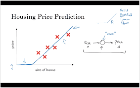

# 🧠 **Basic Neural Networks**

### 1️⃣ The Core Idea: Predicting House Prices

Imagine you're trying to predict the price of a house. A very simple model might take one input, the **size** of the house, and output a **price**. This simple input-to-output mapping is the most basic form of a neural network—a single "neuron".

But house prices are more complex. They depend on multiple factors like the **number of bedrooms**, the **zip code**, and the **local wealth**. A neural network handles this by adding more complexity, allowing it to weigh these different factors to make a better prediction.

### 2️⃣ The Building Blocks: Layers

A neural network is organized into layers, where each layer is made up of small individual units called neurons.

| **Layer**           | **Purpose**                                                                                                      | **Example (House Prices)**                                                                                       |
|----------------------|------------------------------------------------------------------------------------------------------------------|-------------------------------------------------------------------------------------------------------------------|
| **Input Layer**      | Receives the initial data.                                                                                       | House size, number of bedrooms, zip code.                                                                         |
| **Hidden Layer(s)**  | Performs computations and learns abstract features from the inputs. These layers are "hidden" because we don't define what they learn — the network figures it out automatically. | It might learn to combine "size" and "number of bedrooms" into a concept of "family size," or combine "zip code" and "wealth" into "school quality." |
| **Output Layer**     | Produces the final result or prediction.                                                                         | The final predicted price of the house.                                                                           |

This structure, with an input layer, one or more hidden layers, and an output layer, forms the basis of most neural networks9999.

### 3️⃣ How It Works: Connecting the Neurons

The magic happens in how the layers are connected. In a standard network, every neuron in one layer is connected to **every neuron** in the next layer10. This is called a **densely connected** network.

-   Each connection has a "weight," which is a number that the network learns during training. These weights determine the influence of one neuron's output on the next neuron's input.
    
-   The network takes the input features (e.g., house size), passes them through the hidden layers which learn to recognize complex patterns, and finally combines everything to produce the output prediction (price)11.
    

The remarkable thing is that given enough examples of inputs (house features) and outputs (prices), the network is incredibly good at figuring out the complex relationships between them all by itself12.

----------

# 🤖 ***Supervised Learning***

### 1️⃣ The Core Idea

Supervised learning is a type of machine learning where the goal is to learn a mapping from an **input (x)** to an **output (y)** based on a set of labeled examples[cite: 97]. Think of it like a student learning with a teacher. The teacher provides questions (`x`) and the correct answers (`y`). After seeing enough examples, the student (our model) learns to predict the answer for new, unseen questions.

Formally, the algorithm learns an **inferred function** that best approximates the relationship between the inputs and outputs in the training data. This function can then be used to generate predictions for new data points. The remarkable thing about neural networks is their ability to learn these complex `x-to-y` mappings automatically, given enough data[cite: 91].

### 2️⃣ Key Applications

A huge part of the value created by deep learning comes from cleverly defining `x` and `y` for a specific problem[cite: 108]. The course highlights several powerful examples:

| Application | Input (x) | Output (y) | Neural Network Type |
| :--- | :--- | :--- | :--- |
| **Real Estate** | Home features (size, bedrooms) | Price | Standard NN [cite: 111] |
| **Online Advertising** | Ad and user information | Click on ad? (0/1) | Standard NN [cite: 100] |
| **Computer Vision** | Image | Object ID (e.g., 1..1000) | CNN [cite: 104, 112] |
| **Speech Recognition** | Audio clip | Text transcript | RNN [cite: 105, 114] |
| **Machine Translation** | English sentence | Chinese sentence | RNN [cite: 106, 115, 116] |
| **Autonomous Driving** | Image, radar info | Position of other cars | Custom/Hybrid NN [cite: 107, 118] |

### 3️⃣ Structured vs. Unstructured Data

Supervised learning works on two main types of data, and deep learning has revolutionized how we handle one of them.

* **Structured Data:** This is data organized in a tabular format, like a database, where each feature has a clear, defined meaning[cite: 126, 128]. Examples include predicting housing prices from features like "size" and "#bedrooms" or predicting ad clicks based on "User Age" and "Ad ID"[cite: 127, 359, 363]. A lot of the short-term economic value from neural networks has come from applications using structured data[cite: 138].

* **Unstructured Data:** This refers to raw data without a pre-defined model or organization, such as audio, images, or text[cite: 129, 358]. Humans are naturally good at interpreting this data[cite: 132, 133]. One of the most exciting breakthroughs of deep learning is that computers are now much better at understanding unstructured data than they were just a few years ago, opening up many new applications[cite: 134, 135]. 
***

# 🚀 **Why Deep Learning Is Taking Off**

The recent explosion in deep learning's success isn't because of one single, revolutionary invention. [cite_start]The core ideas have been around for decades. [cite: 291] Instead, it's the result of three key factors converging, with the central theme being **scale**.

### 1️⃣ The Power of Scale

[cite_start]The single most important driver is scale. [cite: 108, 305] To understand this, let's look at how algorithm performance changes with the amount of data.

* [cite_start]**Traditional ML Algorithms:** Algorithms like Support Vector Machines (SVM) or Logistic Regression improve as you give them more data, but only up to a point. [cite: 297] [cite_start]After that, their performance plateaus because they don't have the capacity to learn from massive datasets. [cite: 297]
* [cite_start]**Neural Networks:** In contrast, the performance of neural networks, especially large ones, often keeps getting better the more data you feed them. [cite: 302]

As shown in the course diagram, to achieve state-of-the-art performance, you generally need two things:
1.  [cite_start]A **large amount of labeled data** (denoted as `m`). [cite: 116, 307, 308]
2.  [cite_start]A **large neural network** with many parameters to learn the complex patterns in that data. [cite: 112, 303]

This leads us to the three specific drivers that enabled this scale.

Of course. Here is a concise summary of the key drivers, perfect for your notes.

---

### 🚀 **The 3 Key Drivers of Deep Learning's Rise**

The recent success of deep learning is driven by a convergence of three factors, all related to **scale**[cite: 358, 359].

* 📊 **Data:** The digitization of society has generated massive amounts of labeled data, which is essential for training large, high-performing neural networks[cite: 175, 353, 354].

* 💻 **Computation:** The rise of powerful hardware, especially GPUs, provides the computational power needed to train these large models in a reasonable amount of time[cite: 176, 368]. This speed also accelerates the cycle of experimentation and innovation[cite: 379, 381].

When you can get experimental results in minutes or days instead of weeks, you can test ideas much more rapidly, which dramatically speeds up progress for both researchers and practitioners. 

* 💡 **Algorithms:** Smarter and more efficient algorithms have been developed. A key example is the switch to the **ReLU activation function**, which significantly speeds up training compared to older functions like Sigmoid[cite: 178, 374].

---

## 🧠 Practice Question

**Question:**  
Which of the following play a major role to achieve a very high level of performance with Deep Learning algorithms?

Deep learning has resulted in significant improvements in important applications such as **online advertising**, **speech recognition**, and **image recognition**.

---

### 🟩 Option 1: Large models
**✅ Correct**  
Yes. In most cases, it is necessary for a very large neural network to make use of all the available data.

---

### 🟥 Option 2: Better designed features to use
**❌ Incorrect**  
No. One main difference between *classical* machine learning algorithms and deep learning algorithms is that **Deep Learning models automatically learn the best features** using the hidden layers.

---

### 🟩 Option 3: Large amounts of data
**✅ Correct**  
Yes. Some of the most successful Deep Learning algorithms make use of very large datasets for training.

---

### 🟥 Option 4: Smaller models
**❌ Incorrect**

---

**Score:** 0.6 / 1 point
