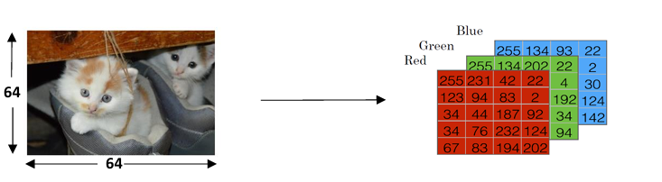
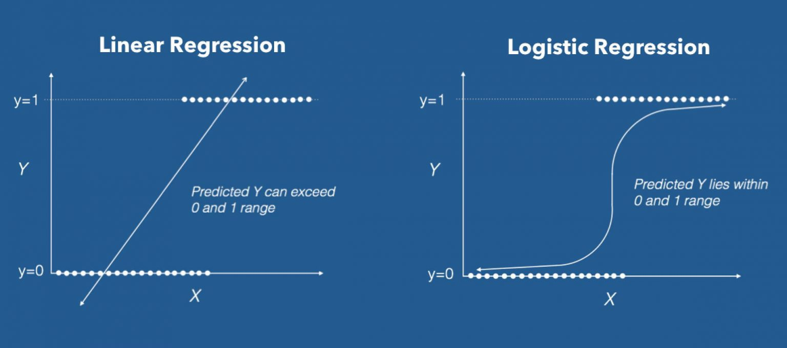
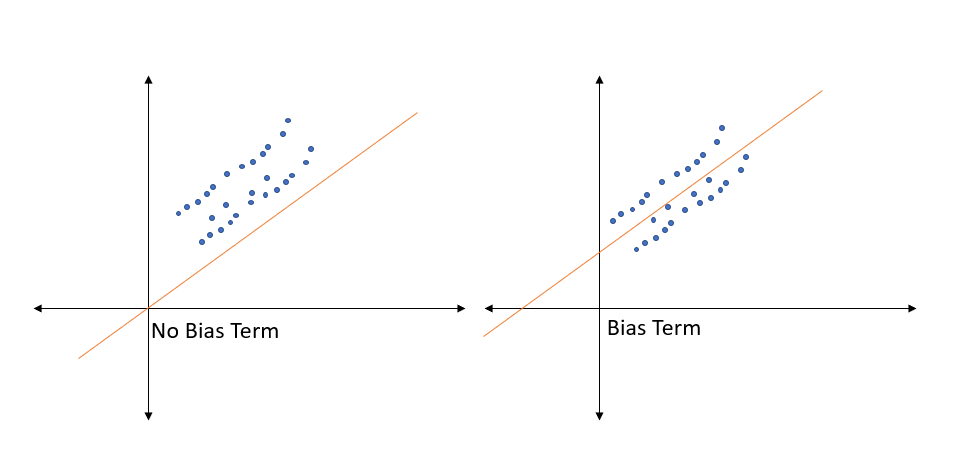
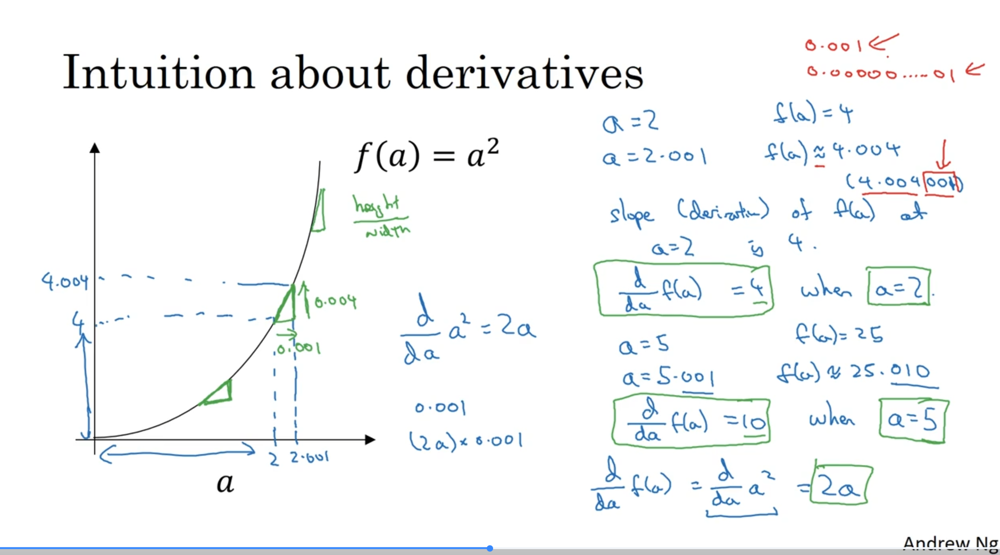
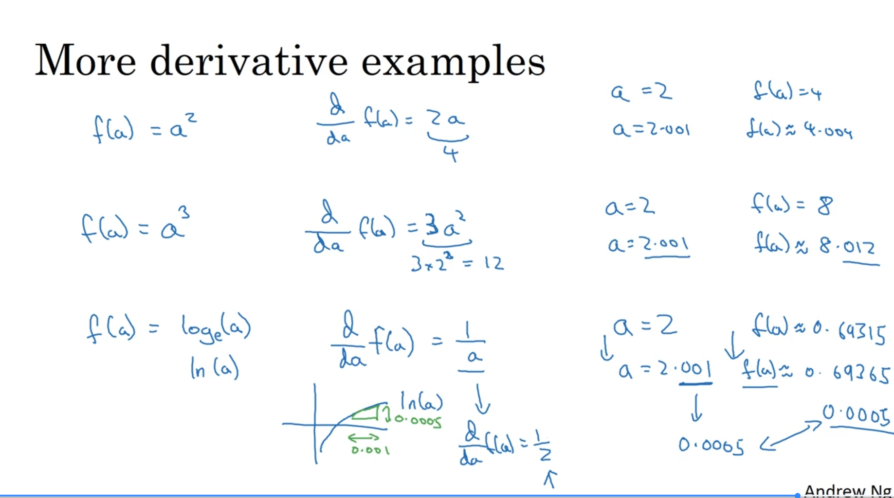

# 🐾 **Binary Classification**

### 1️⃣ The Goal: Cat vs. Non-Cat

Binary classification is a supervised learning task where the goal is to predict one of two possible outcomes. The output, `y`, is always a discrete value, either **0** (negative class) or **1** (positive class)[cite: 57, 1399].

A classic example used throughout the course is building a **cat detector**.
* **Input (x):** An image.
* **Output (y):** 1 if the image is a cat, 0 if it's not a cat[cite: 62].


### 2️⃣ Representing the Input (x)


How does a computer "see" an image? An image is stored as three separate matrices for the **Red, Green, and Blue (RGB)** color channels[cite: 68, 379].

* **Pixel Intensities:** Each cell in these matrices contains a value representing pixel intensity.
* **Feature Vector:** To feed this into a neural network, we "unroll" or "reshape" these three matrices into a single, long column vector called a **feature vector, `x`**[cite: 72].
* **Input Size ($n_x$):** For a 64x64 pixel image, the resulting feature vector `x` has a dimension of `64 * 64 * 3 = 12,288`[cite: 73, 1447]. This number is the input size, denoted as $n_x$[cite: 8, 95, 1448].


### 3️⃣ Notation for the Dataset

To work with data efficiently, we use a standard set of notations[cite: 1]:

* **A single example:** is represented by a pair `(x, y)`, where `x` is the $n_x$-dimensional feature vector and `y` is the label (0 or 1)[cite: 1461].
* **Training set size:** The number of training examples is denoted by `m`[cite: 7, 93].
* **Input Matrix (X):** To process all examples at once (vectorization), we stack the individual feature vectors `x^(i)` side-by-side in columns to form a matrix `X`[cite: 15, 398].
    * The shape of `X` is $(n_x, m)$[cite: 15, 1467].
* **Label Matrix (Y):** Similarly, we stack the labels `y^(i)` side-by-side to form a row vector `Y`.
    * The shape of `Y` is $(1, m)$[cite: 17, 103, 1469].

---


# 📈 **Logistic Regression**

### 1️⃣ The Core Idea

Logistic Regression is a learning algorithm used for binary classification, where the output `y` is always either 0 or 1[cite: 241, 1080]. Given an input feature vector `x` (like our unrolled cat image), the goal is to output a prediction, which we call `ŷ` (y-hat), that represents the probability of `y` being 1[cite: 245, 1121].

* **Goal:** Predict `ŷ = P(y=1 | x)`, which is the probability that the image is a cat, given the input pixels `x`.
* **Constraint:** `ŷ` must be between 0 and 1.

### 2️⃣ The Problem with a Linear Function

A simple approach would be to use a linear function, just like in linear regression: `ŷ = wᵀx + b`. However, this doesn't work for classification because the output can be any real number—much larger than 1 or even negative—which doesn't make sense for a probability[cite: 1126, 1127].

### 3️⃣ The Solution: The Sigmoid Function

To solve this, we use the **sigmoid function**, denoted by the Greek letter sigma (σ). This function takes any real number `z` and "squashes" it into a value between 0 and 1, which is exactly what we need for a probability.

The formula is: **σ(z) = 1 / (1 + e⁻ᶻ)** [cite: 252]


It has some very useful properties:
* If `z` is a large positive number, σ(z) is close to **1**.
* If `z` is a large negative number, σ(z) is close to **0**.
* If `z` is 0, σ(z) is **0.5**.

### 4️⃣ The Logistic Regression Model

By combining the linear function with the sigmoid function, we get the final model for logistic regression:

1.  First, we compute `z = wᵀx + b`.
2.  Then, we pass the result through the sigmoid function: `ŷ = a = σ(z)`.
    * (Here, we introduce `a` for "activation," a term that will become very important in neural networks).

The job of the learning algorithm is to find the best parameters **w** (weights) and **b** (bias) so that `ŷ` is a good estimate of the true probability[cite: 1139].

***

### 🧠 Understanding Parameters 'w' and 'b'

Think of **'w'** and **'b'** as the "dials" or "knobs" that the learning algorithm tunes to make accurate predictions. They are the core components that transform your input data into a final output.

---
### 1️⃣ **'w': The Weights**

The variable **'w'** stands for **weights**. It's a vector of numbers, and its job is to determine the importance of each input feature.

* **Analogy:** Imagine you're predicting if a student will pass an exam. The input features might be `hours_studied`, `previous_grades`, and `hours_of_sleep`. The weights `w` would assign a numerical importance to each of these features. Intuitively, `hours_studied` would get a high positive weight, while `hours_of_sleep` might get a smaller positive weight.
* **Vector Dimension:** The reason **'w'** is an $n_x$-dimensional vector is that there is one weight for each of the $n_x$ input features[cite: 8, 10]. For our cat detector example, $n_x$ was 12,288, so **'w'** would be a vector with 12,288 numbers, one for each pixel. Each weight signifies how important that specific pixel is for determining if the image is a cat.

---
### 2️⃣ **'b': The Bias**

The variable **'b'** stands for **bias**. It's a single real number, not a vector[cite: 11]. Its job is to provide an offset or a baseline, independent of any input features.

* **Analogy:** Continuing the exam example, the bias 'b' could represent a student's baseline probability of passing, even before we consider any specific features. Perhaps the exam is generally very easy, so there's a high baseline chance of passing. The bias captures this.
* **In Mathematics:** In the linear equation `z = wᵀx + b`, the bias **'b'** is exactly like the y-intercept in the equation of a line, `y = mx + c`. It shifts the entire function up or down, allowing the model to fit the data better.

---
### 3️⃣ **Putting It Together**

In logistic regression, the model first calculates a linear combination: `z = wᵀx + b`.

* The `wᵀx` part calculates a weighted sum, essentially a "score" based on how important each input feature is.
* The `+ b` part then shifts this score up or down.

This final score `z` is then passed through the sigmoid function to produce the final probability `ŷ = σ(z)`. The learning process is all about adjusting **'w'** and **'b'** to make this probability as accurate as possible across all your training examples.

### 📐 **Mathmetical Intuition**

This equation is a linear function, just like `y = mx + c` from high school math, but applied to vectors. Its purpose is to calculate a "score" or a "log-odds" value (`z`) based on the input features.

-----

### 🧠 The "Ingredients": w, x, and b

First, let's be very clear about what each variable is and, most importantly, its **shape**.

| Variable | Name | What it is | Shape / Dimension |
| :--- | :--- | :--- | :--- |
| **x** | **Input Features** | [cite\_start]A vector containing all the input data for a *single* example (e.g., all 12,288 pixel values for one image). [cite: 318, 404] | An $n_x$ by 1 column vector. |
| **w** | **Weights** | A vector containing the "importance" value for each corresponding input feature. [cite\_start]The model *learns* these values. [cite: 320, 404] | An $n_x$ by 1 column vector. |
| **b** | **Bias** | A single number that provides an offset, like the y-intercept in a line. [cite\_start]The model *learns* this value. [cite: 321, 404] | A 1 by 1 scalar (a single real number). |
| **z** | **Output Score** | The raw output of the linear calculation, before it's turned into a probability. | A 1 by 1 scalar (a single real number). |

-----

### 🔄 The "T" Operator: Transpose

The superscript **'T'** stands for **Transpose**. The transpose operation "flips" a matrix or vector over its main diagonal. For a vector, it simply changes a **column vector** into a **row vector**, or vice versa.

  * **w** starts as a column vector (shape: $n_x$ by 1).
  * **wᵀ** (w-transpose) becomes a row vector (shape: 1 by $n_x$).

**Example:** If $n_x = 3$:
If `w` =

```
[w₁]
[w₂]
[w₃]
```

Then `wᵀ` = `[w₁ w₂ w₃]`

-----

### 🔢 The Multiplication: `wᵀx` (The Dot Product)

This is the most important part of the calculation. We are multiplying the **row vector** `wᵀ` by the **column vector** `x`. This specific operation is called a **dot product**.

**Rule of Matrix Multiplication:** To multiply two matrices (or vectors), the number of columns in the first matrix must equal the number of rows in the second.

  * Shape of `wᵀ`: (1, $n_x$)
  * Shape of `x`: ($n_x$, 1)

Since the inner dimensions ($n_x$ and $n_x$) match, we can multiply them. The result will have the shape of the outer dimensions: (1, 1), which is a single number.

**How it's calculated:** You multiply each element of `wᵀ` by the corresponding element of `x` and then sum up all the results.

`wᵀx = (w₁ * x₁) + (w₂ * x₂) + ... + (wₙₓ * xₙₓ)`

This gives you a single number, which is a weighted sum of the features.

-----

### ✨ Putting It All Together: A Concrete Example

Let's assume we have 3 input features ($n_x = 3$).

1.  **Define our "ingredients":**

      * `x` (inputs):
        ```
        [200]   (e.g., hours_studied)
        [  8]   (e.g., hours_of_sleep)
        [  4]   (e.g., previous_grades_avg)
        ```
      * `w` (weights learned by the model):
        ```
        [0.5]
        [0.1]
        [0.8]
        ```
      * `b` (bias learned by the model): `-10`

2.  **Transpose the weights `w` to get `wᵀ`:**

      * `wᵀ = [0.5  0.1  0.8]`

3.  **Calculate the dot product `wᵀx`:**

      * `wᵀx = (0.5 * 200) + (0.1 * 8) + (0.8 * 4)`
      * `wᵀx = 100 + 0.8 + 3.2`
      * `wᵀx = 104` (This is our weighted score)

4.  **Add the bias `b` to get the final score `z`:**

      * [cite\_start]`z = wᵀx + b` [cite: 322, 406]
      * `z = 104 + (-10)`
      * `z = 94`

This final number, `z=94`, is then passed into the sigmoid function `σ(z)` to get the final probability prediction `ŷ`.


# 📉 **Logistic Regression Cost Function**

### 1️⃣ The Core Idea: Measuring Error

The goal of training is to find the parameters `w` and `b` that make our predictions `ŷ` as close to the true labels `y` as possible[cite: 1727]. To do this, we need a way to quantify the error.

We do this in two steps:
1.  **Loss Function (L):** Measures the error for a *single* training example.
2.  **Cost Function (J):** Measures the average error over the *entire* training set.

The purpose of a loss or cost function is to measure how well a machine learning model's predictions match the actual correct answers while using some given Parameters(w,b) so that we can find the best set of parameters for our model to imporve the model performance by checking its performance for different values of parameters using cost function.
### 2️⃣ The Loss Function (L)

A simple idea would be to use the squared error, `L = ½(ŷ - y)²`, just like in linear regression. However, for logistic regression, this creates a "non-convex" optimization problem, meaning it has many local minima, making it hard to find the best parameters.

Instead, we use a different loss function that is convex and works well for this problem:
**L(ŷ, y) = -[ y log(ŷ) + (1 - y) log(1 - ŷ) ]**

Let's see why this makes sense:

* **Case 1: If the true label y = 1**
    * The loss becomes `L = -log(ŷ)`.
    * To make the loss small, we need `log(ŷ)` to be large, which means `ŷ` must be as close to **1** as possible. This is exactly what we want!

* **Case 2: If the true label y = 0**
    * The loss becomes `L = -log(1 - ŷ)`.
    * To make the loss small, we need `log(1 - ŷ)` to be large, which means `(1 - ŷ)` should be close to 1, and therefore `ŷ` must be as close to **0** as possible. Again, this is what we want.

### 3️⃣ The Cost Function (J)

The cost function `J(w, b)` is simply the average of the loss function over all `m` training examples. This gives us a single number that tells us how well our current parameters `w` and `b` are performing on the entire dataset.

The formula is:
**J(w, b) = (1/m) * Σ L(ŷ⁽ⁱ⁾, y⁽ⁱ⁾) = -(1/m) * Σ y⁽ⁱ⁾log(ŷ⁽ⁱ⁾) + (1-y⁽ⁱ⁾)log(1-ŷ⁽ⁱ⁾)** (from i=1 to m)

Our ultimate goal is to find the values of `w` and `b` that **minimize** this cost function `J`.

***


# ⛰️ **Gradient Descent**

### 1️⃣ The Core Idea: Finding the Bottom of a Valley

Imagine you are standing on a hill in a thick fog and want to get to the lowest point. What would you do? You would look at the ground around your feet, find the direction that goes steepest downhill, and take a small step in that direction. If you repeat this process over and over, you will eventually reach the bottom of the valley.

That's exactly what Gradient Descent does.
* **The Hill:** Is our cost function `J(w, b)`. The height of the hill at any point represents the error for a given set of parameters `w` and `b`.
* **Your Position:** Is determined by the current values of your parameters `w` and `b`.
* **The Goal:** Find the values of `w` and `b` that correspond to the lowest point on the hill, which is the **minimum of the cost function**.


Because our cost function for logistic regression is **convex** (it's a single, bowl-shaped curve), this method guarantees that no matter where you start, you will always reach the same, single global minimum.

### 2️⃣ The Algorithm: How to Take a Step

Gradient Descent works by repeatedly updating the parameters `w` and `b` in the opposite direction of the gradient of the cost function.

The update rule is:
**Repeat {**
&nbsp;&nbsp;&nbsp;&nbsp;`w := w - α *  (∂J/∂w)`\
&nbsp;&nbsp;&nbsp;&nbsp;`b := b - α * (∂J/∂b)`
**}**

Let's break down this formula:
* **w :=** This means we are **updating** the value of `w`.
* **α (alpha):** This is the **learning rate**, a small number that controls how big of a step we take. Choosing a good learning rate is crucial for training.
* **∂J/∂w:** This is the **derivative** (or gradient) of the cost function with respect to the parameter `w`. It tells us the slope of the hill, or the direction of steepest *ascent*. By subtracting it, we move in the direction of steepest *descent*. We do the same for the bias `b`.
* 1.The Direction: The sign of the derivative tells us whether the "hill" of the cost function is sloping upwards or downwards. This tells us which way to go to reduce the error.

* 2.The Steepness: The magnitude of the derivative tells us how steep the slope is. A steeper slope means we are far from the minimum, while a slope close to zero means we are nearing the bottom.

#### How the Slope Affects Gradient Descent

The sign of the derivative (the slope) is the crucial signal that tells Gradient Descent which way to move to find the minimum. Let's look at the update rule again: `w := w - α * (∂J/∂w)`. [cite: 663, 1526, 1531]

* **Case 1: The slope is positive (∂J/∂w > 0)**
    * **Intuition:** This means we are on the right side of the valley. As we increase `w`, the cost `J` goes up. To get to the bottom, we need to move left, meaning we must **decrease `w`**. [cite: 673, 674]
    * **The Math:** The update rule becomes `w := w - α * (a positive number)`. This subtracts a small value from `w`, causing it to decrease and move closer to the minimum. [cite: 673]

* **Case 2: The slope is negative (∂J/∂w < 0)**
    * **Intuition:** This means we are on the left side of the valley. As we increase `w`, the cost `J` goes down. To get to the bottom, we need to move right, meaning we must **increase `w`**. [cite: 677]
    * **The Math:** The update rule becomes `w := w - α * (a negative number)`. Subtracting a negative is the same as adding a positive. This adds a small value to `w`, causing it to increase and move closer to the minimum. [cite: 677, 678]

In both cases, the algorithm uses the slope to automatically take a step in the correct downhill direction, guiding the parameters toward the global minimum where the error is lowest.


By repeatedly applying these updates, we gradually walk down the cost function until we converge to the minimum point, where our model has the lowest possible error.

***

---
# 📉 **Derivatives Explained**

#### 1. The Core Idea: What is a Derivative?

At its heart, a **derivative** is simply the **slope** of a function at a specific point. It measures how much the output of a function changes when you make a tiny "nudge" to its input.

* **Analogy:** Imagine you're driving a car. Your speed is the derivative of your position. If you nudge time forward by one second, your speed tells you how much your position will change in that instant.

#### 2. Derivatives of Straight Lines

Let's take a simple function, `f(a) = 3a`, which is a straight line. [cite: 1543]

* If `a = 2`, then `f(a) = 6`. [cite: 1553]
* If we "nudge" `a` by a tiny amount, say to `a = 2.001`, then `f(a)` becomes `6.003`. [cite: 1552, 1553]
* **Observation:** The output `f(a)` increased by **3 times** the amount we nudged the input `a`. [cite: 729, 730, 1544, 1554]

The **slope**, or derivative, of this function is **3**. [cite: 730, 1559] For a straight line, the slope is the same everywhere. [cite: 751] No matter what value `a` has, a small change in `a` will always result in a change in `f(a)` that is 3 times larger. [cite: 751] We write this formally as `df/da = 3`. [cite: 740, 1561]

#### 3. Derivatives of Curved Lines

What about a more complex, curved function like `f(a) = a²`? [cite: 757, 1572] Unlike a straight line, the slope of a curve is different at every point. [cite: 766, 811]

* **At `a = 2`:**
    * `f(a) = 4`. If we nudge `a` to `2.001`, `f(a)` becomes approximately `4.004`. [cite: 761, 763, 1588, 1589]
    * Here, the output changed by **4 times** the nudge to the input. So, the derivative (slope) at `a = 2` is **4**. [cite: 765, 1592]

* **At `a = 5`:**
    * `f(a) = 25`. If we nudge `a` to `5.001`, `f(a)` becomes approximately `25.010`. [cite: 768, 769]
    * Here, the output changed by **10 times** the nudge to the input. The derivative (slope) at `a = 5` is **10**. [cite: 771, 1583]

Calculus provides a general formula for the derivative of `f(a) = a²`, which is `df/da = 2a`. [cite: 774, 1577] This single formula correctly gives us the slope at any point on the curve. [cite: 778]


