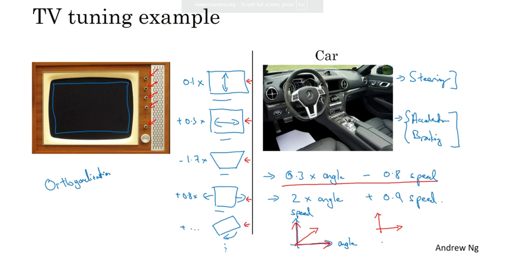
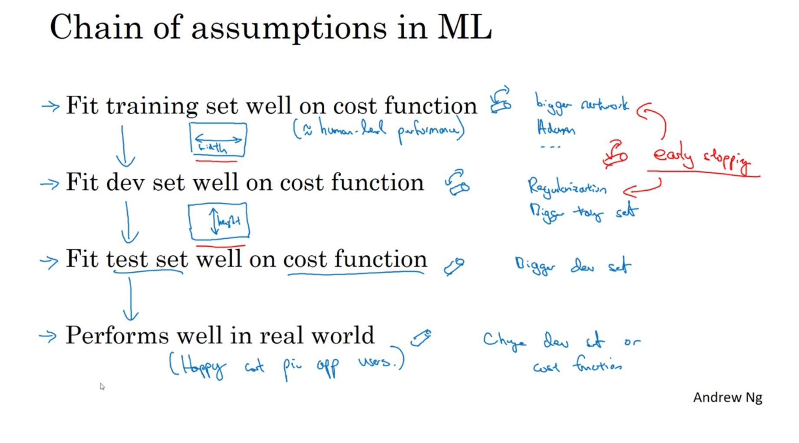
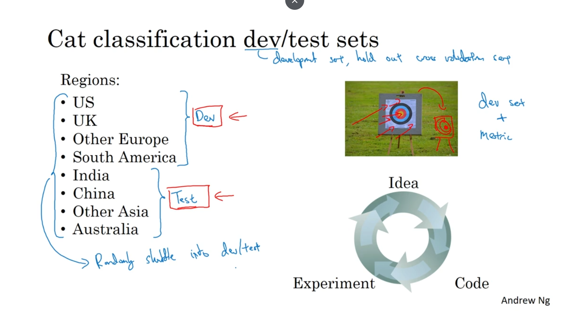
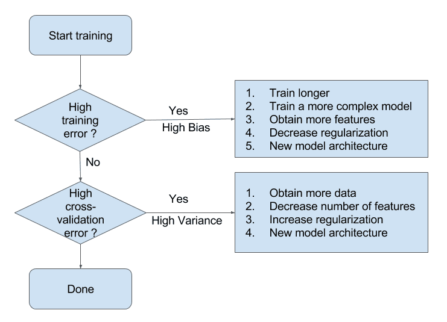

# **Structuring Machine Learning Projects**
---

## 🧭 **Why ML Strategy is Important**

#### **1️⃣ The Motivating Example: A Fork in the Road**

Imagine you've built a cat classifier and your model has achieved 90% accuracy. This is good, but not good enough for your application.

Your team brainstorms many potential ideas for how to improve it. The problem is, you have a *lot* of possible directions, and you need to decide what to do next.

#### **2️⃣ The "Many Ideas" Problem**

When trying to improve a deep learning system, you'll almost always have a long list of things you *could* try.

Here is a summary of the common ideas mentioned in the lecture:

| Category | Potential Idea to Try |
| :--- | :--- |
| **Data Strategy** | Collect more training data |
| | Collect a more diverse training set (e.g., cats in new poses) |
| **Algorithm/Training** | Train the algorithm longer (more gradient descent iterations) |
| | Try a different optimization algorithm (e.g., Adam) |
| **Network Size** | Try a bigger network (more layers/hidden units) |
| | Try a smaller network |
| **Regularization** | Try Dropout |
| | Try $L_2$ regularization |
| **Architecture** | Change the network architecture (e.g., different activation functions) |

#### **3️⃣ The High Cost of Bad Choices**

The central challenge of ML projects is that **if you choose poorly, you can waste months of work**.

The course gives a powerful example: some teams spend *six months* collecting more data, only to find that it barely improves their system's performance. This is a disaster for a project.

#### **4️⃣ The Solution: What is ML Strategy?**

ML Strategy provides the "quick and effective ways" to analyze your problem so you can figure out which ideas are worth pursuing and which you can safely discard.

* **Course Intuition:** ML strategy is about having ways to analyze a machine learning problem that point you in the direction of the most promising things to try.
* **Formal Definition:** Machine Learning Strategy is the process of analyzing a machine learning problem to identify the most promising directions, allowing you to prioritize changes that will most efficiently and effectively improve your system's performance.

The goal is to give you a set of "strategies" to help you become much more effective at getting your deep learning systems to work, without wasting six months on an idea that doesn't help.

-----
-----

# 🎯 **Orthogonalization**

### 1️⃣ The Core Idea: The "TV Tuning" Analogy

Imagine you have an old-school television set with knobs to adjust the picture.

  * **Orthogonal Controls:** One knob adjusts the **width**, and another distinct knob adjusts the **height**. If the picture is too narrow, you just turn the "width" knob. It’s simple because the controls are independent.
  * **Non-Orthogonal Controls:** Imagine a knob that changes `0.5 * width + 0.5 * height`. If you turn it, the picture gets wider *and* taller. It becomes almost impossible to get the picture perfectly centered because every adjustment messes up something else.

**Orthogonalization** means designing your controls (or "knobs") so that each one affects only **one specific component** of your system's performance, without messing up others.

### 2️⃣ Orthogonalization in Machine Learning

In deep learning, we want to debug our systems by isolating specific problems. Andrew Ng outlines a "Chain of Assumptions" that must hold true for a system to work, and assigns specific "knobs" to fix each one.

| **Goal (Assumption)** | **If this fails (Problem)** | **The "Knob" to Tune (Solution)** |
| :--- | :--- | :--- |
| **1. Fit Training Set** | High Avoidable Bias (Underfitting) | • Train a bigger network • Train longer (more epochs) • Use a better optimizer (Adam) |
| **2. Fit Dev (Validation) Set** | High Variance (Overfitting) | • Regularization (L2, Dropout) • Get more training data |
| **3. Fit Test Set** | Overfitting to Dev Set | • Get a bigger Dev set (the current one is too small/biased) |
| **4. Perform in Real World** | Cost function mismatch | • Change the Dev/Test set distribution • Change the Cost Function |

### 3️⃣ Why This Matters

If you don't orthogonalize, you act blindly. For example, if your model has high **variance** (it fails on the Dev set), "training a bigger network" is not the correct knob—that knob is for fixing **bias** (fitting the training set). In fact, a bigger network might make variance *worse* if not handled correctly.

Orthogonalization gives you a systematic checklist: **Diagnose exactly which step is broken, then touch only the knob that fixes that step.**

### 🧠 **Deeper Dive: The Problem with Early Stopping**

> You might notice that **Early Stopping** is a very common technique, but Andrew Ng personally finds it "difficult to think about" in the context of orthogonalization.
>
> Why? Because Early Stopping affects **two** goals simultaneously:
>
> 1.  It stops training implies you fit the **Training Set** less well (increases Bias).
> 2.  It prevents overfitting, which helps the **Dev Set** performance (decreases Variance).
>
> Because it couples these two distinct tasks (fitting training vs. fitting dev), it is **not orthogonal**. Andrew prefers using **L2 Regularization** to reduce variance because it allows you to train as long as possible (focusing on the training set) without breaking the dev set performance.

-----

**Next Step:**
Now that we have a strategy for *tuning* the system, we need a way to measure if our changes are actually working. This leads us to **Single Number Evaluation Metrics**.

-----
---

# 📊 **Single Number Evaluation Metrics**

### 1️⃣ The Core Idea: Speed of Iteration
Machine learning is an empirical process: you have an idea, you code it, and you test it. To move fast, you need to know immediately if your new idea is better than your old one.

If you have multiple metrics (like accuracy on US users, China users, India users, etc.), it becomes cognitively difficult to pick a "winner." You might find yourself saying, *"Well, Model A is better in China, but Model B is better in India..."*.

The rule of thumb is: **It is much easier to pick a winner if you have a single real number to compare.**.

### 2️⃣ The Trap of Precision and Recall
A common scenario where this problem arises is when measuring **Precision** and **Recall**. Let's look at the definitions using the "Cat Classifier" example from the course:

* **Precision ($P$):** Of all the images the classifier *said* were cats, what percentage were actually cats?
    * *Analogy:* "When you speak, do you tell the truth?"
* **Recall ($R$):** Of all the images that *really are* cats, what percentage did the classifier find?
    * *Analogy:* "Of all the truth out there, how much of it did you mention?"

Often, there is a **trade-off**:
* If you want high precision (only say "cat" if you are 100% sure), you usually miss some cats (low recall).
* If you want high recall (find every single cat), you usually incorrectly label some non-cats (low precision).

### 3️⃣ The Solution: F1 Score
Imagine you have two classifiers, A and B.

| Classifier | Precision ($P$) | Recall ($R$) | Result |
| :--- | :--- | :--- | :--- |
| **A** | 95% | 90% | Better Recall |
| **B** | 98% | 85% | Better Precision |

It's hard to say which is "better" just by looking at $P$ and $R$. The solution is to combine them into a single score called the **F1 Score**.

The F1 score is the **Harmonic Mean** of Precision and Recall.

$$
F1 = \frac{2}{\frac{1}{P} + \frac{1}{R}} = 2 \cdot \frac{P \cdot R}{P + R}
$$

Using the Harmonic Mean (instead of a simple average) punishes extreme values. If either Precision or Recall is very low (near 0), the F1 score will "crash" to near 0, ensuring you only get a high score if *both* are reasonably good.

### 🧠 **Deeper Dive: Why not the Arithmetic Mean?**
> Why don't we just calculate the average $\frac{P+R}{2}$?
>
> Imagine a "cheat" classifier that just predicts "Cat" for *everything*.
> * **Recall** would be 100% (it found all the cats!).
> * **Precision** would be tiny (say 1%).
>
> If you took the arithmetic average, the score would be $\approx 50\%$, which looks decent.
> But with the **Harmonic Mean (F1)**, the score would be near 2% because the low Precision drags the whole score down. The Harmonic Mean forces the model to be competent in *both* metrics.
---

### 📝 **Formal Definitions**

To understand these formulas, we first define the four possible outcomes of a prediction in a binary classification problem (like "Cat" vs. "Non-Cat"):
* **True Positive ($TP$):** The model predicted "Cat" ($1$), and it *was* a "Cat" ($1$).
* **False Positive ($FP$):** The model predicted "Cat" ($1$), but it was *not* a "Cat" ($0$). (Type I Error)
* **False Negative ($FN$):** The model predicted "Non-Cat" ($0$), but it *was* a "Cat" ($1$). (Type II Error)

#### **1. Precision**
Precision measures the accuracy of the positive predictions. Mathematically, it is the ratio of correct positive predictions to the total predicted positives.

$$
\text{Precision} = \frac{TP}{TP + FP}
$$

* **Intuition:** When the model predicts $1$, how often is it correct?
* **Goal:** Minimize False Positives ($FP$).

#### **2. Recall**
Recall (also called Sensitivity) measures the coverage of actual positive cases. Mathematically, it is the ratio of correct positive predictions to the total *actual* positives.

$$
\text{Recall} = \frac{TP}{TP + FN}
$$

* **Intuition:** Out of all the actual $1$s in the dataset, what fraction did the model correctly identify?
* **Goal:** Minimize False Negatives ($FN$).

#### **3. F1 Score**
The F1 Score is the **Harmonic Mean** of Precision ($P$) and Recall ($R$).

$$
F1 = \frac{2}{\frac{1}{P} + \frac{1}{R}} = 2 \cdot \frac{P \cdot R}{P + R}
$$

* **Why Harmonic Mean?** The harmonic mean is closer to the smaller of the two numbers. If either Precision or Recall is very low (e.g., $0.01$), the F1 score will be pulled down to near zero. This prevents a model from "cheating" by maximizing one metric at the total expense of the other.

---
---

# ⚖️ **Satisficing and Optimizing Metrics**

### 1️⃣ The Core Idea: "Good Enough" vs. "The Best"
What if you have multiple, competing goals? For example, you want your model to be **accurate**, but you also need it to be **fast** (low running time).

It's hard to combine these into one F1-style score. An equation like $\text{Accuracy} - 0.5 \times \text{RunningTime}$ feels artificial.

Instead, you split them:
* Pick **one** metric to be the **Optimizing Metric**. This is the single number you are trying to make as good as possible (e.g., maximize accuracy).
* Set all other metrics as **Satisficing Metrics**. These are metrics that just need to be "good enough" by meeting a specific threshold (e.g., running time must be $\le 100ms$).

### 2️⃣ Example 1: Accuracy vs. Running Time
Imagine you are testing three different cat classifiers.

| Classifier | Accuracy (F1 Score) | Running Time (ms) |
| :--- | :--- | :--- |
| **A** | 92% | 80 ms |
| **B** | **95%** | **95 ms** |
| **C** | 97% | 1500 ms |

How do you pick the best one?
1.  **Optimizing Metric:** Accuracy. You want to *maximize* this.
2.  **Satisficing Metric:** Running Time. It must be $\le 100ms$ to be acceptable.

**Decision Process:**
* Model C is **rejected** immediately. Its accuracy is highest, but it fails the satisficing metric (1500ms > 100ms).
* Between A and B, both satisfy the running time constraint.
* Now, we apply the optimizing metric: Model B has higher accuracy (95%) than Model A (92%).
* **Winner:** Model B.

### 3️⃣ Example 2: Trigger Word Detection
This idea is common in product design. For a "wake word" device (like "Hey Siri" or "Alexa"), you care about two things:
1.  **Accuracy:** When you say the word, it wakes up.
2.  **False Positives:** It *doesn't* wake up when you *don't* say the word.

A good way to structure this is:
* **Optimizing Metric:** Maximize accuracy (the true positive rate).
* **Satisficing Metric:** Have at most 1 false positive every 24 hours of operation.

This way, your team can focus all its energy on maximizing accuracy, as long as it doesn't violate the false positive "guardrail."

---

**Next Step:**
Now that we have a clear way to *evaluate* our models (either with a single number or an optimizing/satisficing pair), the next crucial step is setting up the **data** that we use for these evaluations.

----

This is one of the most important strategic decisions you'll make in a project. Setting up your data sets (from Lectures 5 and 6) defines the "target" for your team.

-----

# 🎯 **Setting Up Your Data: Train, Dev, and Test Sets**

### 1️⃣ The Core Idea: Setting a Target

The course makes a powerful analogy:

  * Your **Dev Set** + your **Evaluation Metric** (e.g., F1 Score) = **The Target**.

Your team's job is to "shoot arrows" (train models) and hit this target as closely as possible. The entire iterative process of machine learning is built around this idea.

### 2️⃣ The Golden Rule: Make Dev and Test Sets Come from the Same Distribution

This is the most critical rule. Your Dev set (which you tune on) and your Test set (which you use for the final grade) **must** come from the same distribution.

  * **Why?** Imagine your team spends 3 months getting 98% on the Dev set (hitting the bullseye). If you then test them on a *different* kind of data, it's like moving the target to a new location. All their work might be useless.
  * **The "Wasted Months" Example:** The course mentions a team that built a loan approval model.
      * **Dev Set:** Medium-income zip codes.
      * **Test Set:** Low-income zip codes.
      * **Result:** The model performed terribly on the test set, and the team wasted 3 months of work.
  * **The Right Way:** If your data comes from 8 different regions, don't put 4 regions in Dev and 4 in Test. You should **shuffle all your data** from all 8 regions, and then randomly split that shuffled data into your Dev and Test sets. This ensures both sets reflect the *true* distribution of your problem.

The main guideline: **Choose a dev set and test set to reflect data you expect to get in the future and consider important to do well on**.

### 3️⃣ Sizing: The "Big Data" Era vs. The Old Way

How you *split* your data has changed as data sets have gotten bigger.

| Era | Data Set Size | Old Rule of Thumb | Modern Rule (Big Data) |
| :--- | :--- | :--- | :--- |
| **Small Data** | 100 - 10,000 examples | 70% Train / 30% Test   60% Train / 20% Dev / 20% Test | (This rule is still fine) |
| **Big Data** | 1,000,000+ examples | (Not recommended) | 98% Train / 1% Dev / 1% Test   99.5% Train / 0.25% Dev / 0.25% Test |

Why the change?

  * **Dev Set Purpose:** To evaluate which of two models (A or B) is better. With 1 million examples, a 1% dev set is 10,000 examples. That is *more than enough* to statistically determine a winner.
  * **Test Set Purpose:** To give you high confidence in your final model's performance. Again, 10,000 examples is often plenty for this.
  * **Training Set Purpose:** Deep learning algorithms are "data hungry". You want to give as much data as possible to the training set.

### 🧠 **Deeper Dive: When is it OK to *not* have a Test Set?**

> The course mentions that sometimes you see people with just a **Train/Dev split** and no Test set.
>
> What they are *really* doing is using the "Test set" as a "Dev set" by iterating on it. This is okay if your goal is just to launch a product and you don't need a highly accurate, unbiased estimate of your final performance.
>
> However, the recommended practice is to have a separate Test set that you **only touch once** at the very end. Andrew Ng calls this "reassuring".

-----

**Next Step:**
We've defined our target. But what happens if, after a few weeks, we realize we've set the target in the wrong place? (e.g., our cat classifier is good at finding cats, but it's also letting through horrible images).

----
# 🔄 **When to Change Your Metrics and Data**

This is a critical part of ML strategy. Setting a target is good, but you *must* be willing to move it if you realize you're aiming at the wrong thing.

---

### 1️⃣ The Core Idea: "Moving the Target"
In the course, setting your Dev Set + Metric is compared to **placing a target** for your team to aim at.

Sometimes, you'll spend weeks optimizing for that target, only to realize that hitting the bullseye *doesn't* actually solve your business problem. When this happens, you must **move the target**.

### 2️⃣ The Main Guideline
Here is the key signal for when to make a change:

> **"If doing well on your metric and your current dev set distribution does not correspond to doing well on the application you actually care about, then you should change your metric and/or your dev/test set."**

This can happen in two ways:

### 3️⃣ Case 1: Change Your **Evaluation Metric**
This is when your metric is *wrong* and doesn't measure what you value.

* **The Analogy (Cat Classifier):** Imagine you have two algorithms.
    * **Algorithm A:** 3% classification error (Looks better!)
    * **Algorithm B:** 5% classification error (Looks worse)
* **The Problem:** You discover Algorithm A, while technically more "accurate," is letting through a lot of **pornographic images**. Algorithm B blocks them.
* **The Diagnosis:** Your company and users *clearly* prefer Algorithm B, even though your metric says A is better. Your metric is "mis-ranking" the algorithms.
* **The Solution:** Change the metric itself. One way is to create a new, *weighted* classification error.
    * Give a "normal" error a weight of 1 ( $w^{(i)} = 1$ ).
    * Give a "pornographic image" error a much larger weight (e.g., $w^{(i)} = 100$ ).

The new cost function would change from this:
$$
\text{Error} = \frac{1}{m_{dev}} \sum_{i=1}^{m_{dev}} \mathbb{I}(\hat{y}^{(i)} \neq y^{(i)}) \text{}
$$
To this weighted version, which heavily punishes the mistake you *really* care about:
$$
\text{Error} = \frac{1}{\sum w^{(i)}} \sum_{i=1}^{m_{dev}} w^{(i)} \mathbb{I}(\hat{y}^{(i)} \neq y^{(i)}) \text{}
$$

### 4️⃣ Case 2: Change Your **Dev/Test Set**
This is when your data is *wrong* and doesn't represent the "real world."

* **The Analogy (Blurry User Photos):**
* **The Problem:** Your cat classifier gets 98% accuracy on your Dev set, but when you deploy it in your app, it performs terribly.
* **The Diagnosis:** You realize your Dev set was built from high-quality, professional, well-lit images downloaded from the internet. Your *users*, however, are uploading blurry, poorly-framed, bad-lighting images from their mobile phones.
* **The Solution:** Your Dev set data distribution doesn't match your real-world data distribution. You must **change your Dev and Test sets**. Go out and collect a new dataset of *actual user images* (blurry, poorly-framed, etc.) and use that as your new target.

### 🧠 **Deeper Dive: Orthogonalization of "Where" vs. "How"**
> The course emphasizes that this is another form of orthogonalization. You should treat these as two separate, "orthogonal" problems:
>
> 1.  **Defining the Target:** (Placing the target). This is a "Step 1" problem. Is your metric and dev set *correctly* defining success?
> 2.  **Hitting the Target:** (Shooting at the target). This is a "Step 2" problem. How do you train a bigger network, add regularization, etc., to *do well* on that target?
>
> **The trap:** If your metric is wrong (e.g., the pornographic image problem), don't try to fix it by tweaking your *algorithm* (Step 2). You must first fix the *metric* (Step 1). Define the target correctly, *then* figure out how to hit it.

---

**Next Step:**
Now that we know how to set (and move) our target, the next major topic is how to establish a baseline for performance. This leads to one of the most powerful concepts in modern ML: **Comparing to Human-Level Performance**.

----

This is a fantastic topic, covered in Lectures 8-11, and it’s a key driver of modern deep learning strategy. Comparing your model to *human* performance gives you a powerful tool for analyzing bias and variance.

---

# 👩‍⚕️ **Understanding Human-Level Performance**

### 1️⃣ The Core Idea: Why Compare to Humans?
In the past, machine learning models weren't very good, so we were just happy if they worked at all. Now, with deep learning, models can become competitive with or even better than humans at many tasks.

This is important for two reasons:
1.  **Better Models:** Advances in deep learning have made it possible to surpass human performance in many areas (like speech or image recognition).
2.  **Efficient Workflow:** As long as your model is *worse* than a human, you have a very efficient "toolbox" for improving it. For example, you can:
    * Get more labeled data by paying humans to create it.
    * Use **manual error analysis** (we'll cover this later) by asking *why* a human got it right and the model got it wrong.
    * Get a better estimate of bias and variance.

### 2️⃣ A New "Ceiling": Bayes Error

To understand this, we first need a formal definition:
* **Bayes Optimal Error (or Bayes Error):** This is the **best possible theoretical error** for any function, human or machine, on a given task. It's the theoretical "perfect" score.
    * For example, some audio in a speech-to-text task is so noisy that *nothing* could ever transcribe it correctly.
    * Some medical images are so blurry that *no one* could make a correct diagnosis.
* Bayes error is the "unavoidable" error. You can never do better than Bayes error.

**Key Idea:** We use **Human-Level Error** as a **proxy (or estimate)** for **Bayes Error**. Humans are very good at "natural perception" tasks (seeing, hearing), so their error rate is often very close to the best possible (Bayes) error.

-----

# 📈 **Applying Human-Level Performance**

### 1️⃣ The Core Idea: A New Proxy for "Perfect"

In Course 2 (Improving Deep Neural Networks), we measured "Bias" by comparing our **Training Error** to **0%**. We assumed a "perfect" model would get 0% error.

The problem is, for many tasks (like transcribing noisy audio or diagnosing from blurry images), "perfect" isn't 0% error. Even humans can't get it right 100% of the time.

The solution is to stop using 0% as our target and start using **Human-Level Error** as our target. We use it as a **proxy (or estimate)** for **Bayes Error** (the best possible theoretical error).

### 2️⃣ The New Definitions: "Avoidable Bias"

This new proxy allows us to split "Bias" into two parts, giving us a much more precise way to analyze our model.

  * **Proxy for Bayes Error:** Human-Level Error (our estimate of the *best possible* score).
  * **Avoidable Bias:** $\text{Training Error} - \text{Bayes Error}$. This is the gap between your model's training performance and the "perfect" score. This is the bias you can (and should) try to fix.
  * **Variance:** $\text{Dev Error} - \text{Training Error}$. (This definition is the same as before).

### 3️⃣ Why This Changes Everything: An Example

Let's use the example from Lecture 9. Imagine your system has **8% Training Error** and **10% Dev Error**. What should you work on?

This single question has *two different answers* depending on the human-level performance.

| Metric | Scenario 1: Cat Classification (Easy Task) | Scenario 2: Blurry Medical Images (Hard Task) |
| :--- | :--- | :--- |
| **Human-Level Error** (Proxy for Bayes) | **1%** | **7.5%** |
| **Training Error** | 8% | 8% |
| **Dev Error** | 10% | 10% |
| **Avoidable Bias** ($\text{Train} - \text{Bayes}$) | $8\% - 1\% = \mathbf{7\%}$ | $8\% - 7.5\% = \mathbf{0.5\%}$ |
| **Variance** ($\text{Dev} - \text{Train}$) | $10\% - 8\% = \mathbf{2\%}$ | $10\% - 8\% = \mathbf{2\%}$ |
| **Conclusion** | Avoidable Bias (7%) is the *huge* problem. Your model isn't even fitting the training set. | Avoidable Bias (0.5%) is tiny. Your model is doing great on the training set. |
| **Strategic Decision** | **Focus on Bias Reduction**.  (e.g., train a bigger network, train longer). | **Focus on Variance Reduction**.  (e.g., add regularization, get more data). |

**The key takeaway:** The exact same model performance (8% train, 10% dev) leads to *completely different* strategic decisions. By using human-level performance as a proxy for Bayes error, you can correctly diagnose whether you have a bias problem or a variance problem.

-----
---

# 🎯 **Defining Human-Level Performance**

### 1️⃣ The Core Idea: Your Definition Depends on Your Goal
The "human-level error" you choose depends on *why* you're measuring it. There are two common goals:
1.  **Deploying a System:** You might just want to be "good enough," for example, surpassing the performance of a *single* human doctor to argue your system is useful.
2.  **ML Strategy:** You want the **best possible estimate for Bayes Error** to guide your team's efforts (i.e., to analyze avoidable bias).

For this course, we are focused on **Goal #2: ML Strategy**.

### 2️⃣ The Medical Diagnosis Example
Let's use the medical imaging example from the lecture to make this concrete. Suppose you get these error rates for the same task:

| Performer | Error Rate |
| :--- | :--- |
| Typical Human (untrained) | 3.0% |
| Typical Doctor | 1.0% |
| Experienced Doctor | 0.7% |
| **Team of Experienced Doctors** (discussing and debating) | **0.5%** |

### 3️⃣ The Rule: Use the Best Possible Score
**Question:** Which of these numbers should you use as your "human-level error" to estimate Bayes Error?

**Answer:** You must use the **best performance you can find**: **0.5%**.

**Why?**
* **Bayes Error** is the theoretical minimum error.
* Because a team of experts *proved* it's possible to achieve 0.5% error, we know for a fact that Bayes Error must be *less than or equal to* 0.5% ( $\text{Bayes Error} \le 0.5\%$ ).
* This 0.5% is our most accurate, or "least wrong," estimate of the "perfect" score.

### 4️⃣ Why This Choice Is Critical
Let's see what happens if you pick the *wrong* definition.
Imagine your model achieves:
* **Training Error:** 0.7%
* **Dev Error:** 0.8%

Now, let's analyze the **Avoidable Bias** ($\text{Train} - \text{Bayes}$) and **Variance** ($\text{Dev} - \text{Train}$) using two different baselines:

| Analysis | Scenario A: You use "Experienced Doctor" (0.7%) as baseline | Scenario B: You use "Team of Experts" (0.5%) as baseline |
| :--- | :--- | :--- |
| **Avoidable Bias** | $0.7\% - 0.7\% = \mathbf{0\%}$ | $0.7\% - 0.5\% = \mathbf{0.2\%}$ |
| **Variance** | $0.8\% - 0.7\% = \mathbf{0.1\%}$ | $0.8\% - 0.7\% = \mathbf{0.1\%}$ |
| **Strategic Decision** | You'd conclude bias is 0% and your *only* problem is variance. You'd incorrectly focus all your effort on variance reduction. | You'd see that avoidable bias (0.2%) is **twice as large** as variance (0.1%). You would correctly focus on bias reduction (e.g., train a bigger network). |

By picking a "weaker" human baseline (0.7%), you would have completely misdiagnosed your model's biggest problem.

---
-----

# 🚀 **Surpassing Human-Level Performance**

### 1️⃣ The Core Idea: The "Tools" Stop Working

For most of a project, we are "chasing" human performance. As long as our model is worse than a human, we have two powerful tools:

1.  **A Clear Target:** We use human error as a proxy for Bayes error, which gives us a clear estimate of **avoidable bias**.
2.  **Human Intuition:** We can look at examples the model gets wrong and a human gets right, and ask "why?" (This is *manual error analysis*).

The moment your algorithm surpasses human performance (even a team of experts), **both of these tools become much less effective**.

### 2️⃣ Why Progress Slows Down

This is the key takeaway from the lecture. Progress often slows significantly after surpassing human performance for two "orthogonal" reasons:

| Reason for Slowdown | Explanation |
| :--- | :--- |
| **1. Loss of a Clear Target** | We no longer have a good proxy for Bayes Error. Our bias/variance analysis, which tells us *what* to work on, breaks down. |
| **2. Loss of Human Intuition** | We can no longer use *manual error analysis* in the same way. We can't ask a human why they were "smarter" than the model, because they aren't. |

### 3️⃣ The Analysis "Breaks": A Concrete Example

Let's use the lecture's example. Your **Human (Team of Experts) Error is 0.5%**.

| Metric | Scenario A: **Worse** than Human | Scenario B: **Better** than Human |
| :--- | :--- | :--- |
| **Human (Bayes) Error** | $0.5\%$ | $0.5\%$ (This is now just a *floor*, not a target) |
| **Training Error** | $0.6\%$ | $0.3\%$ |
| **Dev Error** | $0.8\%$ | $0.4\%$ |
| **Avoidable Bias** ($\text{Train} - \text{Bayes}$) | $0.6\% - 0.5\% = \mathbf{0.1\%}$ | $0.3\% - 0.5\% = \mathbf{-0.2\%}$ (This is ambiguous\!) |
| **Variance** ($\text{Dev} - \text{Train}$) | $0.8\% - 0.6\% = \mathbf{0.2\%}$ | $0.4\% - 0.3\% = \mathbf{0.1\%}$ |
| **Strategic Decision** | **Clear:** Variance (0.2%) is the bigger problem. Focus on variance reduction. | **Unclear:** What does -0.2% bias mean? Did we overfit by 0.2%? Is Bayes error actually 0.1% or 0.2%? We don't know. |

### 4️⃣ Where Does This Happen Most?

Surpassing human-level performance is *easier* in some domains than others:

  * **Problems with "Big Data" (Non-Natural Perception):**

      * **Online Advertising**
      * **Product Recommendations**
      * **Logistics (Predicting drive times)**
      * **Loan Approvals**
        These are often **structured data** problems where a computer can see far more examples than any human ever could.

  * **Natural Perception Tasks (Harder):**

      * Computer Vision
      * Speech Recognition
      * Medical Diagnosis
        Humans are naturally *very* good at these tasks, so it's much harder (but increasingly possible) for models to surpass us.

-----
-----

# 📋 **Week 1 Summary: A Checklist for Improving Your Model**

### 1️⃣ The Two Pillars of Performance

Getting a supervised learning algorithm to work well means you've successfully done two things:

1.  **Fit the Training Set (Low Avoidable Bias):** You've trained a model that is powerful enough to at least learn the patterns in your training data. Your training error is close to your proxy for Bayes error.
2.  **Generalize to the Dev Set (Low Variance):** Your model's performance on the training set successfully generalizes to new, unseen data (your dev set). Your dev error is close to your training error.

### 2️⃣ The Orthogonal Decision Process

Your job is to first *analyze* which of the two pillars is failing, and then *act* using the correct "knob."

**Step 1: Analyze Avoidable Bias**

  * Look at: $(\text{Training Error} - \text{Proxy for Bayes Error})$.
  * Is this gap unacceptably large? If yes, you have a High Avoidable Bias problem.

**Step 2: Analyze Variance**

  * Look at: $(\text{Dev Error} - \text{Training Error})$.
  * Is this gap unacceptably large? If yes, you have a High Variance problem.

**Step 3: Act (Using the Correct "Knobs")**
In the spirit of orthogonalization, you should use different tools to fix different problems.

| **IF your problem is...** | **...THEN turn these "knobs" (Orthogonal Solutions)** |
| :--- | :--- |
| **High Avoidable Bias** | • Train a **bigger model** (more layers/neurons) • **Train longer** or use a better **optimizer** (Adam, RMSprop) • Find a new **network architecture** (e.g., CNN, RNN) |
| **High Variance** | • Get **more training data** • Add **Regularization** (L2, Dropout) • **Data Augmentation** • Find a new (perhaps smaller) **network architecture** |

This systematic process is one of the most valuable skills you can learn. It stops you from *guessing* (e.g., "Maybe I should get more data?") and allows you to *diagnose* the problem and apply the correct solution, making you much more efficient.

-----
