# **WEEK-2**

---

# 📊 Error Analysis

#### **1️⃣ The Core Idea: Don't Guess, Prioritize**

When your machine learning model isn't performing well (e.g., 90% accuracy when you want 95%), you'll have many ideas for how to improve it:
* Collect more data
* Try a bigger network
* Use a different optimization algorithm
* ...and so on.

**Error analysis** is a simple, manual process that stops you from guessing. Instead of spending months on a project that *might* not help, you spend a few minutes to an hour analyzing your model's mistakes to find the most promising direction to work on.

#### **2️⃣ The Process: Calculating the "Ceiling"**

Let's use the course example: Your cat classifier has a **10% error** on the dev set, which is too high. One of your teammates suggests focusing on the "dog problem," where the algorithm misclassifies dogs as cats.

Should you spend the next two months on this? Here's the error analysis process:

1.  **Get a Sample:** Go through ~100 mislabeled examples from your dev set.
2.  **Count Manually:** Look at each one and count how many are actually pictures of dogs.
3.  **Calculate the "Ceiling":** This count tells you the *maximum possible improvement* (the "ceiling") you can get from solving this one problem.

This leads to two very different scenarios:

* **Scenario A: Low Ceiling**
    * You find that **5%** of your mislabeled examples (5 out of 100) are dogs.
    * **Conclusion:** Even if you *perfectly* solve the dog problem, you would only correct 5% of your errors. Your total error would go from 10% down to 9.5%. This is probably **not** a good use of two months of work.

* **Scenario B: High Ceiling**
    * You find that **50%** of your mislabeled examples (50 out of 100) are dogs.
    * **Conclusion:** If you solve the dog problem, your error could drop from 10% to 5%. This is a huge improvement and is **definitely** worth prioritizing.

This simple counting procedure (which might take 10-15 minutes) can save you months of wasted effort.

#### **3️⃣ Evaluating Multiple Ideas in Parallel**

You don't have to evaluate just one idea. The best practice is to create a spreadsheet to categorize *all* your error types at once.

While looking at your 100 mislabeled examples, you can tag each one with all the categories that apply.

**Example Error Analysis Table:**

| Image # | Dog | Great Cat (Lion, etc.) | Blurry | Comments |
| :--- | :--- | :--- | :--- | :--- |
| 1 | ✓ | | | Pitbull picture |
| 2 | | | ✓ | |
| 3 | | ✓ | ✓ | Lion on rainy day |
| ... | ... | ... | ... | ... |
| **% of Total** | **8%** | **43%** | **61%** | |

**Conclusion:** This table clearly shows that working on the **dog problem** has a low ceiling (max 8% of errors). The most promising areas to work on are **blurry images** (61% ceiling) and **great cats** (43% ceiling). You should prioritize those instead.

---

#### 🧠 **Deeper Dive: Formal Definition**

> The course explains error analysis as a practical, manual procedure. More formally, **error analysis** is the systematic process of examining and understanding the errors made by a machine learning model. It involves analyzing the types, patterns, and causes of errors to gain insights into the model's performance and identify areas for improvement. It's a key part of the iterative ML lifecycle, moving beyond aggregate metrics (like 90% accuracy) to understand *why* the model fails.

---

---

# 🏷️ Cleaning Up Incorrectly Labeled Data

When you find data where the label $y$ is wrong (e.g., a picture of a dog is labeled as a cat, $y=1$), the way you handle it depends on *where* you found it.

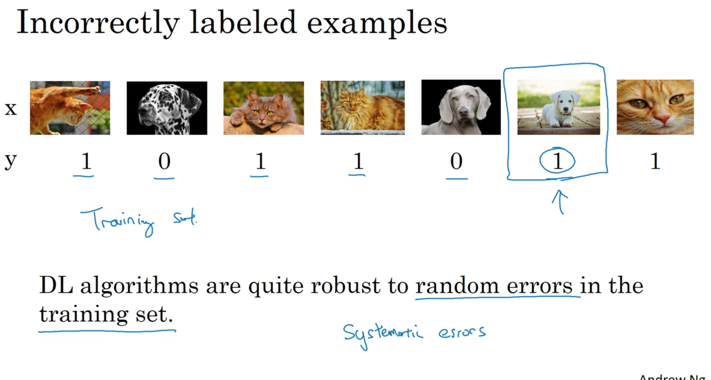

#### **1️⃣ Rule 1: Incorrect Labels in the Training Set**

Deep learning algorithms are surprisingly **robust to random errors** in the training set.

* **Random Errors:** As long as your dataset is large enough, if a labeler occasionally hit the wrong key, the algorithm will likely learn to ignore these few outliers. You can often leave these as-is.
* **Systematic Errors:** The algorithm is **not** robust to systematic errors. For example, if your labeler *always* labels white dogs as cats, your classifier will learn this incorrect bias. These you *must* fix.

#### **2️⃣ Rule 2: Incorrect Labels in the Dev/Test Set**

This is a more serious problem. Your dev set is your "measuring stick" to evaluate your model's performance. If your measuring stick is flawed, you can't trust your progress.

The recommended process is to **add an "Incorrectly Labeled" category** to your error analysis spreadsheet. As you review your model's mistakes, you'll check this box if you find the $y$ label was wrong.

#### **3️⃣ When to Fix Labels: A Tale of Two Scenarios**

The key question is: is it worth your team's time to manually fix these labels? The answer depends on how much this problem "drowns out" other errors.

To decide, you look at three key numbers:

| Metric | Scenario A (Don't Fix Yet) | Scenario B (Time to Fix) |
| :--- | :--- | :--- |
| **1. Overall Dev Set Error** | 10% | 2% |
| **2. Errors due to Incorrect Labels** | 0.6% (6% of your 10% error) | 0.6% (30% of your 2% error) |
| **3. Errors due to Other Causes** | 9.4% | 1.4% |

#### **Conclusion:**
* In **Scenario A**, the incorrect labels (0.6%) are a tiny fraction of your total problem (9.4%). It's not the best use of your time to fix them.
* In **Scenario B**, your model is much better. The incorrect labels (0.6%) are now a *huge* part of your remaining error (1.4%). They prevent you from knowing if a new model is *really* better. You should fix the labels now.

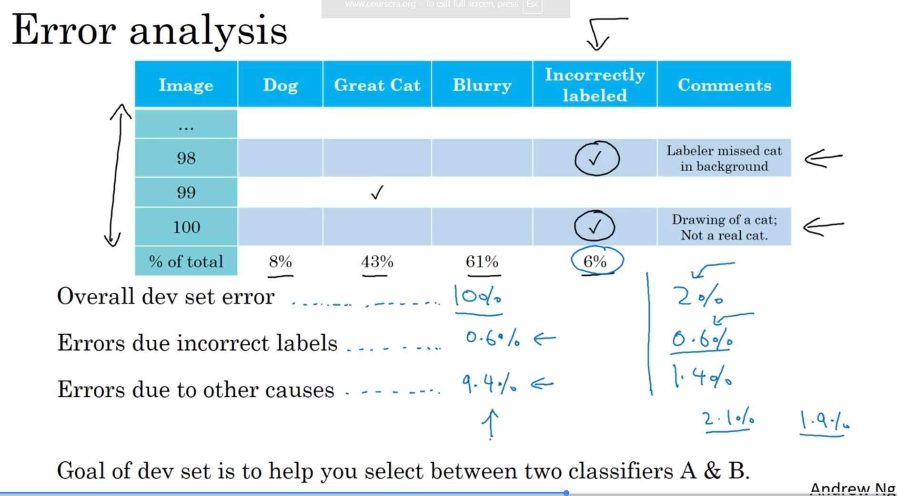

#### **4️⃣ Guidelines for Correcting Labels**

If you decide to fix your labels, follow these principles:

1.  **Apply corrections to both your dev and test sets.** You need to ensure they continue to come from the same distribution.
2.  **Consider examining examples your algorithm got *right* as well as wrong.** This is often skipped because it's time-consuming (e.g., checking 98% of data vs. 2%), but it prevents you from unfairly biasing your metric.
3.  **You don't necessarily need to fix the training set.** It's okay if your training set distribution is now slightly different from your dev/test sets. The algorithm is robust enough for this.

---

#### 🧠 **Deeper Dive: The Value of Manual Inspection**

> The course emphasizes a key point that many engineers resist: **manually looking at your data**. It might not seem like the most "interesting" work, but spending a few minutes or hours looking at 100-200 examples to categorize errors is one of the highest-value actions you can take. It can save you (or your team) months of wasted effort.

---
---

# 🚀 Build Your First System Quickly, Then Iterate

### **1️⃣ The Core Idea: Avoid Overthinking**

When starting a new ML project (like speech recognition), you'll have dozens of ideas for how to build a great system:
* Handle background noise (cafes, cars)
* Improve performance on accented speech
* Fix "far-field" problems (speaker is far from the mic)
* ...and many more.

The problem is, you don't know which of these directions is the most important. It's very common for teams to spend months over-engineering a complex "perfect" system, only to find it wasn't the right approach.

The better strategy is to build a simple, "quick and dirty" system first, and then let it *tell you* what to work on.

### **2️⃣ The 3-Step Guideline**

The recommended process is a simple iterative loop:

1.  **Set Up:** Quickly establish a dev/test set and a performance metric. This sets your "target."
2.  **Build:** Build an initial, simple system quickly. Don't overthink it. Train it on your training set.
3.  **Analyze & Iterate:** Use Bias/Variance analysis and Error analysis on your initial system's results. These analyses will point you to the *true* priorities.

For example, after building your simple speech system, your error analysis might show that 60% of all errors are due to "far-field" noise. Now you *know* that's the #1 priority to work on, instead of just guessing.

---

### 🧠 **Deeper Dive: The Pitfall of Premature Optimization**

> The course makes a key observation: "on average, I've seen a lot more teams overthink and build something too complicated. And I've seen [fewer] teams build something too simple." Building a simple first system is a safeguard against this very common and costly pitfall.

---
---

# 🔀 Training and Testing on Different Distributions

#### **1️⃣ The Core Problem: Data Mismatch**

In an ideal world, all your data comes from the same source. In reality, you often have a *small* amount of high-value data (what you *really* care about) and a *large* amount of "easier to get" data.

**Example: Cat App**
* **Goal:** Build an app that recognizes cat pictures from your users.
* **Data You Care About:** 10,000 blurry, poorly-framed pictures from your mobile app.
* **Data You Can Get:** 200,000 high-resolution, professional cat pictures from the web.

You don't want to just train on the 10,000 user photos (it's not enough data), but the 200,000 web photos don't look like your real problem. This is a **data mismatch**.

#### **2️⃣ The Wrong Strategy: "Shuffle-and-Split"**

The common temptation is to combine all the data (210,000 images), shuffle it, and then split it into Training/Dev/Test sets.

* **Why it's wrong:** Your dev set is your "target." In this scenario, your dev set would be ~95% web images! You'd be building a model that's excellent at recognizing professional web photos, which is *not* your goal. You're aiming at the wrong target.

#### **3️⃣ The Right Strategy: Aim the Target Correctly**

The best practice is to set up your dev and test sets to reflect what you *actually care about*.

1.  **Dev/Test Sets:** Put *all* your high-value, real-world data here. For example, take your 10,000 mobile photos and split them into 5,000 for a dev set and 5,000 for a test set.
2.  **Training Set:** Use everything else here. Your training set would be the 200,000 web images (and you could also add the remaining 5,000 mobile photos, making it 205,000).

#### **4️⃣ The New Trade-off**

This strategy has a clear advantage and a new, tricky disadvantage:

* ✅ **Advantage:** Your target is now aimed correctly. The dev set 100% reflects the data you want your app to do well on.
* ❌ **Disadvantage:** Your training data (mostly web images) now looks very different from your dev data (all mobile images).

This mismatch means our old methods for analyzing bias and variance are broken. If your training error is 1% and your dev error is 10%, is that a variance problem or just a data mismatch problem?

This leads directly to the next topic: how to analyze bias and variance when your data distributions are mismatched. Would you like to cover that?

----
# 🔍 **Bias and Variance with Mismatched Data**

 When your training and dev sets are mismatched, your standard analysis of bias and variance breaks down.

Let's say your (easy) training set error is 1%, but your (harder) dev set error is 10%. You can no longer tell if that 9% gap is a **variance problem** (model isn't generalizing) or a **data mismatch problem** (the dev set is just harder).

---

### **1️⃣ The Problem: Two Changes at Once**

When you compare training error to dev error, you've changed two things simultaneously:
1.  **Algorithm:** The model has *seen* the training data but *not* the dev data.
2.  **Data Distribution:** The training data is from a different distribution than the dev data.

This makes the gap between them impossible to interpret.

### **2️⃣ The Solution: The "Training-Dev" Set**

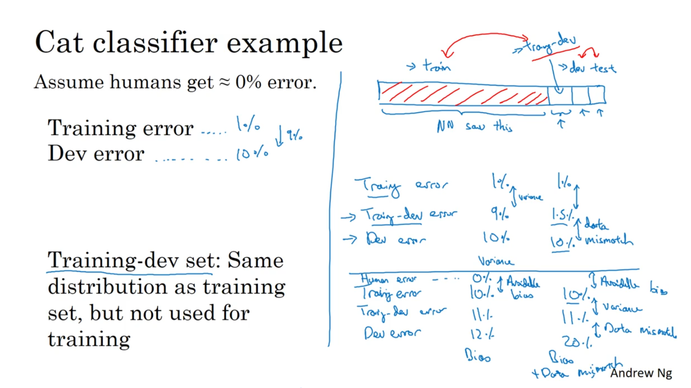

To fix this, we introduce a new dataset called the **Training-Dev set**.

* **What it is:** You take your *original training set* (e.g., the 205,000 cat images) and "carve out" a piece of it.
* **How to use it:** You do **not** train your model on this data.
* **The Key Idea:** The Training-Dev set has the *same distribution as your training set*, but the model hasn't seen it. This lets you isolate the impact of *variance* from the impact of *data mismatch*.

### **3️⃣ The New Analysis: Isolating the Problem**

You now have four key error metrics to analyze. The gaps between them tell you what to fix:

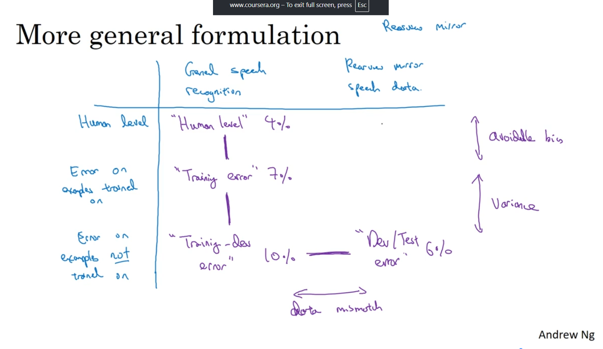

1.  **(Human Level) vs. (Training Error)**
    * **What it is:** **Avoidable Bias**.
    * **Action:** Train a bigger network, try new architectures, run gradient descent longer.

2.  **(Training Error) vs. (Training-Dev Error)**
    * **What it is:** **Variance**.
    * **Action:** Get more *training data* (of the same type), use regularization (L2, dropout).

3.  **(Training-Dev Error) vs. (Dev Error)**
    * **What it is:** **Data Mismatch**.
    * **Action:** Make your training data more like your dev data (see next lecture).

4.  **(Dev Error) vs. (Test Error)**
    * **What it is:** **Overfitting to the Dev Set**.
    * **Action:** Get a bigger *dev set*.

### **4️⃣ Scenarios (from the lectures)**

This table shows how to use this analysis to diagnose problems:

| Error Metric | Scenario A (High Variance) | Scenario B (Data Mismatch) | Scenario C (High Bias) | Scenario D (Bias + Mismatch) |
| :--- | :--- | :--- | :--- | :--- |
| Human Level | ~0% | ~0% | ~0% | ~0% |
| **Training Error** | 1% | 1% | **10%** | **10%** |
| **Training-Dev Error** | **9%** | 1.5% | 11% | 11% |
| **Dev Error** | 10% | **10%** | 12% | **20%** |
| **Conclusion** | Huge **Variance** problem (1% vs 9% gap). | Huge **Data Mismatch** problem (1.5% vs 10% gap). | Huge **Avoidable Bias** problem (10% training error). | High **Bias** (10%) AND **Data Mismatch** (11% vs 20%). |

---
# 🔧 **Addressing Data Mismatch**

 Once your analysis shows a **Data Mismatch** problem (a big gap between your Training-Dev error and your Dev error), here are the strategies the course outlines for fixing it.

---

Unlike high bias (train a bigger net) or high variance (get more data), there isn't one simple, systematic solution for data mismatch. However, there is a general guideline to follow.

#### **1️⃣ 1. Manual Error Analysis (To Understand the Mismatch)**

First, you must understand *how* your training and dev sets are different.

* **The Process:** Manually look at examples from *both* your training set and your dev set.
* **The Goal:** Find the key differences. For example, in the speech recognition app, you might listen to dev set audio and discover: "Ah, almost all my dev set examples have loud **car noise** in the background, but my training set is mostly clean, quiet audio."

#### **2️⃣ 2. Make the Training Data More Similar**

Once you know the difference, you have two main options:
* Collect more data that looks like your dev set. (This is expensive and slow).
* Make your existing training data look more like your dev set. (This is often faster).

The main technique for this is **Artificial Data Synthesis**.

## 🎶 **Artificial Data Synthesis**

This is the process of programmatically creating new training data that mimics the properties of your dev set.

**Example: Speech Recognition (Audio)**

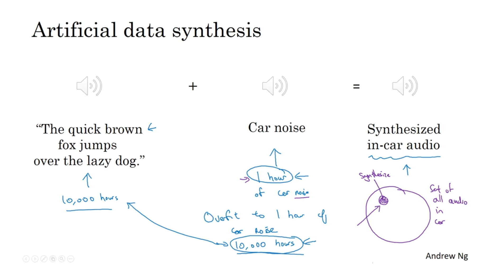

* **Problem:** Your dev set has car noise.
* **Solution:**
    1.  Start with your clean training audio ("The quick brown fox...").
    2.  Find a separate audio file of *just* car noise.
    3.  "Add" these two audio clips together.
* **Result:** You now have a new training sample that sounds exactly like your dev set (someone speaking in a noisy car). You can repeat this to make your entire training set "noisy."

**Example: Computer Vision (Images)**

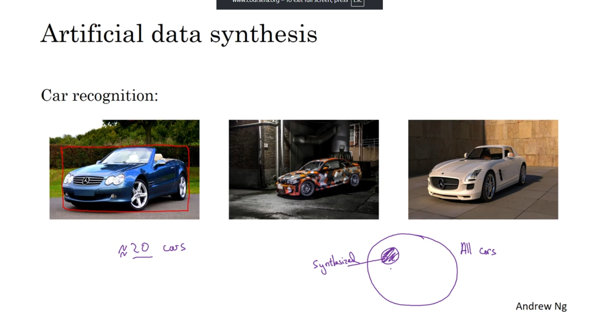

* **Problem:** You need more pictures of cars for a self-driving-car algorithm.
* **Solution:** Use computer graphics to render 3D models of cars and place them into new, synthetic images.

### ⚠️ The Big Caveat: Synthesis Overfitting

Artificial data synthesis is powerful, but it has a major risk: **overfitting to the synthetic data.**

The problem happens when you only simulate a *tiny subset* of the real world's possibilities.

* **Audio Example:** Imagine you have 10,000 hours of clean audio, but only **1 hour** of car noise. If you just repeat that *same* 1-hour noise clip 10,000 times, your model won't learn to ignore "car noise"; it will learn to ignore *that specific 1-hour recording*.
* **Vision Example:** You might use a video game to create car images. But what if that game only has 20 unique car models? Your algorithm will get great at recognizing those 20 cars, but it will fail in the real world when it sees a car model that wasn't in the game.

Your goal is to synthesize data from a rich, representative sample of the "noise," not just one or two examples.

---
---

# ♻️ **Transfer Learning**

#### **1️⃣ The Core Idea: Don't Start from Scratch**

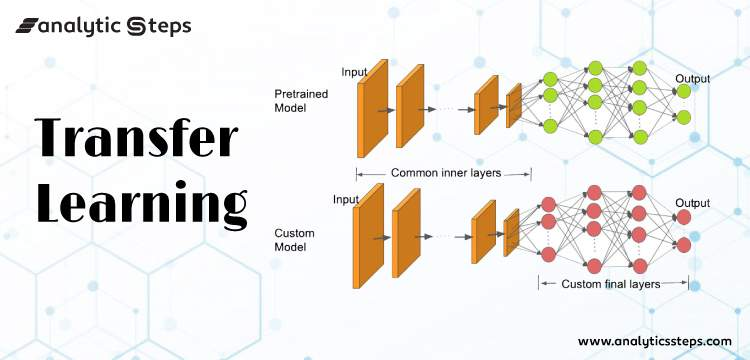

Imagine you need to learn a new, very specific task (e.g., identifying tumors in X-rays), but you have very little data (e.g., only 100 X-ray scans). It's incredibly difficult to train a deep neural network on just 100 examples.

**Transfer Learning** is the process of taking a neural network that has *already* been trained on a different, massive task (e.g., classifying 1 million images from ImageNet) and adapting it to your new, specific task.

You're *transferring* the "knowledge" of what images look like (edges, shapes, textures, etc.) from the general task to your specific one.

#### **2️⃣ The Process: Pre-training and Fine-tuning**

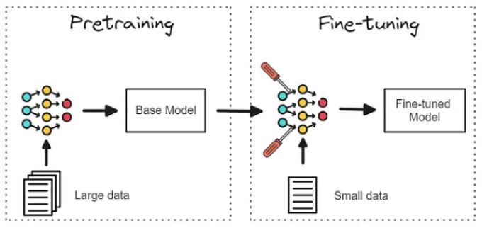

The process involves two main stages, using the radiology example:

1.  **Pre-training (Task A):**
    * First, you (or, more likely, someone else) train a very large neural network on a massive dataset, like ImageNet (1 million+ images of cats, dogs, cars, etc.).
    * This network learns to detect general low-level features—edges, curves, patterns, etc.. This is called the **pre-trained** model.

2.  **Fine-tuning (Task B):**
    * You take this pre-trained network and **delete its final output layer** (which was trained to predict "cat," "dog," etc.).
    * You **add a new, randomly initialized final layer** that matches your new task's output (e.g., a single sigmoid unit for "Tumor" / "No Tumor").
    * You then **re-train** this modified network on your small Task B dataset (the 100 radiology scans).

**How much to re-train?** You have two main options during fine-tuning:
* **Small Dataset:** If you have very little data (like the 100 scans), you often "freeze" all the previous layers and **only train the new final layer**.
* **Larger Dataset:** If you have more data (e.g., 10,000 scans), you can **re-train all the parameters** in the entire network, allowing them to "fine-tune" themselves to the new task.

#### **3️⃣ When Does Transfer Learning Make Sense?**

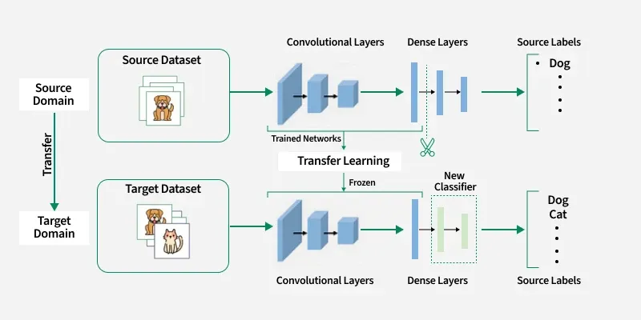

Transfer learning (from Task A to Task B) is most effective under three conditions:

| Condition | Description | Example |
| :--- | :--- | :--- |
| **1. Same Input Type** | Task A and Task B must share the same input $x$. | Both tasks use images, or both tasks use audio. |
| **2. More Data for Task A** | You must have *significantly* more data for Task A than for Task B. | Task A (ImageNet) has 1M+ images. Task B (Radiology) has 100 images. |
| **3. Helpful Low-Level Features** | The early features learned in Task A must be helpful for Task B. | Learning about edges and shapes from ImageNet is useful for finding structures in X-rays. |

---

Transfer learning is a *sequential* process: you learn A, *then* you transfer to B. The next topic, **Multi-task Learning**, is a related idea where you learn multiple tasks *simultaneously*.

----
---

# 🎯 **Multi-Task Learning**

#### **1️⃣ The Core Idea: Learn Simultaneously**

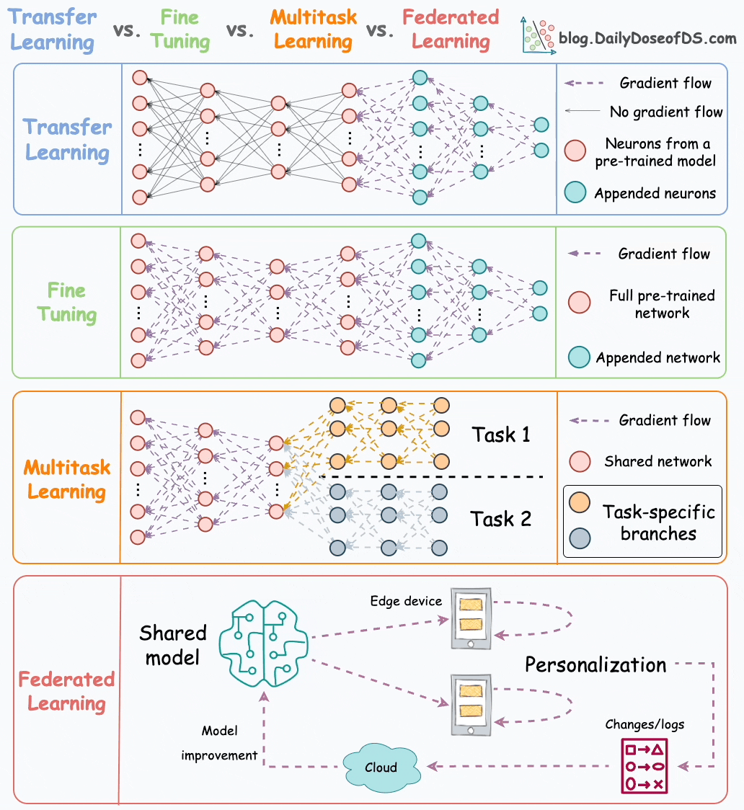

At its simplest, Multi-Task Learning is the practice of training **one single neural network to perform several tasks at the same time**.

This is the opposite of the common approach where you would train one *separate, specialist* neural network for each individual task.

* **Sequential vs. Simultaneous:** Don't confuse this with Transfer Learning.
    * **Transfer Learning** is *sequential*: You train on Task A, stop, and then use that network to help you learn Task B.
    * **Multi-Task Learning** is *simultaneous*: You train one network to learn Task A, Task B, and Task C all at once.

The fundamental bet is that by learning all the tasks together, the network can learn **shared lower-level features** that are beneficial for *all* the tasks, leading to better performance than if each task were learned in isolation.

#### **2️⃣ The Classic Example: Autonomous Driving**

The clearest example is a self-driving car's perception system.

When the car sees an image $x$, it needs to answer several questions at once:
1.  Is there a **pedestrian**?
2.  Is there a **car**?
3.  Is there a **stop sign**?
4.  Is there a **traffic light**?
(And in a real system, many more: cyclists, lane lines, etc.)

Instead of training 4 separate models, you can build one network to solve all 4 problems simultaneously.

#### **3️⃣ The Architecture and Loss Function**

This approach requires two key changes: one to your data (the labels, $y$) and one to your network (the output layer, $\hat{y}$).

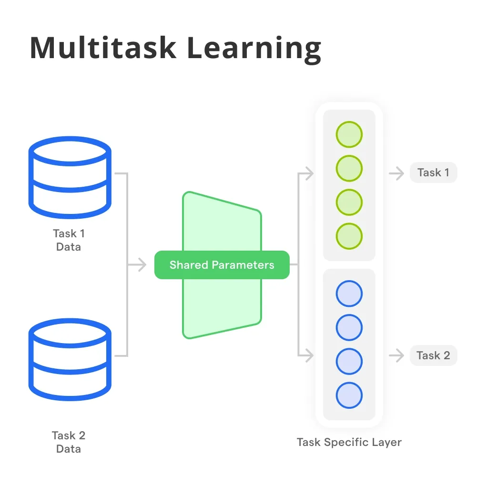

**A. The Label Vector ($y$)**
Since each image can have multiple objects, the label $y^{(i)}$ is no longer a single number (like 0 or 1). It's a **vector**, where each element corresponds to one task.

For our 4-task example, the label $y^{(i)}$ would be a 4x1 vector.
* If an image $x^{(i)}$ has **no objects**, $y^{(i)} = \begin{bmatrix} 0 \\ 0 \\ 0 \\ 0 \end{bmatrix}$
* 
* If $x^{(i)}$ has a **car and a stop sign**, $y^{(i)} = \begin{bmatrix} 0 \\ 1 \\ 1 \\ 0 \end{bmatrix}$                                       
  (for [pedestrian, car, stop sign, traffic light])

Your entire set of labels for the dataset, $Y$, would then be a $(4, m)$ matrix, instead of the usual $(1, m)$ matrix.

**B. The Network Architecture ($\hat{y}$)**

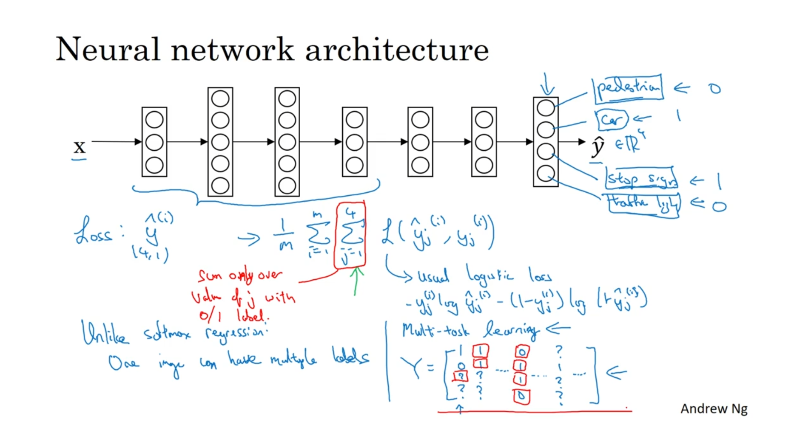

The input and hidden layers can be any standard architecture (e.g., a CNN). The key change is the **output layer**.

* You would have 4 output nodes.
* **Crucially, this is NOT a softmax layer.** A softmax layer is used when you must choose *one* class from a list (e.g., "is this image a 0, 1, 2, ... or 9?").
* Here, an image can have *multiple* labels (a car *and* a stop sign). Therefore, each of the 4 output nodes is its own **independent logistic (sigmoid) unit** that predicts 0 or 1 for its specific task.

**C. The Loss Function($L$)**
 The loss for the network is simply the average of the standard logistic losses for *each task*. You just sum up the individual losses for the pedestrian output, the car output, the stop sign output, and so on.
    $$
    L(\hat{y}, y) = -\frac{1}{m} \sum_{i=1}^{m} \sum_{j=1}^{4} \left( y_j^{(i)} \log(\hat{y}_j^{(i)}) + (1-y_j^{(i)}) \log(1-\hat{y}_j^{(i)}) \right)
    $$

The loss for the whole network is just the **sum of the standard logistic losses for each individual task**.

$$
\text{Total Loss} = \frac{1}{m} \sum_{i=1}^{m} \underbrace{ \sum_{j=1}^{4} L(\hat{y}_j^{(i)}, y_j^{(i)}) }_{\text{Sum of losses for all 4 tasks for one example}}
$$

#### 🧠 **Deeper Dive: Handling Partial Labels**
>**4️ A Practical Trick: Handling Partial Labels**
>What if your dataset is incomplete? This is a very common problem.
>* Image 1 is labeled for pedestrians and cars.
>* Image 2 is *only* labeled for stop signs.
>Your label matrix $Y$ might look like this, where `?` means the label is missing:
$$
Y = \begin{bmatrix}
1 & 0 & ? & \dots \\
0 & 1 & ? & \dots \\
? & ? & 1 & \dots \\
? & ? & 0 & \dots
\end{bmatrix}
$$
**You can still train with this data.** The solution is to modify the loss function: when you are summing up the losses $\sum_{j=1}^{4}$, you **only include the terms for which the label $y_j^{(i)}$ is 0 or 1**. You simply *skip* or *omit* the loss calculation for any `?` labels.

#### **4️⃣ When to Use Multi-Task Learning**

This approach works best under a few key conditions:

| Condition | Description |
| :--- | :--- |
| **Shared Features** | The set of tasks can all benefit from sharing the same low-level features (e.g., they are all computer vision tasks on the same kinds of images). |
| **Similar Data Size** | The amount of data you have for *each task* is "quite similar". This is the main difference from transfer learning, which excels with asymmetric data (e.g., 1M images for Task A, 1k for Task B). |
| **Large Enough Network** | You can train a neural network that is *big enough* to do well on all the tasks at once. The course notes that if the network is too small, performance can *decrease* compared to training separate models. |

In practice, **Transfer Learning is used much more often** than Multi-Task Learning. But for specific problems, like autonomous driving object detection, Multi-Task Learning is a very powerful technique.

---

This is the final, and one of the most exciting, topics of the week: **End-to-End Deep Learning**.

This idea represents a major philosophical shift in how to design learning systems. Here are the detailed notes.

-----

# **Question:-** 
**why we use sigmoide function in the output layer of multitask learning instead of softmax?**

## **Anwser:**

The fundamental reason for using **Sigmoid** instead of **Softmax** in the output layer of standard multi-task learning is the need for **independent predictions**.

### ⚙️ **Sigmoid vs. Softmax in Multi-Task Learning**

### 1️⃣ The Core Idea: Independence vs. Mutual Exclusivity

Think of the output layer as having multiple "classification decisions" to make.

* **Sigmoid (Independent Decisions):** Using a Sigmoid for each output neuron is like having a row of **independent binary classifiers**. Each classifier decides if its assigned label is present (e.g., a car is present, a stop sign is present). The output probability of one task does not influence the output probability of any other task.
* **Softmax (Mutually Exclusive Decisions):** The Softmax function is designed for **mutually exclusive** multi-class classification. It forces the output probabilities to sum up to $1$. If the probability of one class increases, the probability of all other classes *must* decrease proportionally.

**Formal Definition: The Softmax Constraint**

Softmax, given a vector of unnormalized scores $z$, computes a probability distribution $a$ such that:

$$
a_i = \frac{e^{z_i}}{\sum_{j=1}^{K} e^{z_j}}
$$

The key constraints are: $\sum_{i=1}^{K} a_i = 1$ and $0 \le a_i \le 1$.

In multi-task learning (like classifying multiple objects in an image), the output labels are *not* mutually exclusive (you can have a car, a pedestrian, and a stop sign all in the same image). Therefore, the Softmax constraint is inappropriate.

### 2️⃣ Multi-Task Output Layer Design

In a multi-task classification network with $K$ output tasks (or classes), the network output $\hat{y}$ is a vector of size $K$: $\hat{y} = [\hat{y}_1, \hat{y}_2, \dots, \hat{y}_K]^T$.

* Each $\hat{y}_i$ is the predicted probability for the $i$-th task.
* Since the tasks are independent binary classifications, we apply the **Sigmoid function** to each of the linear outputs ($z_i$) separately.

**The Sigmoid Function (Applied to each output neuron $i$):**

$$
\hat{y}_i = \sigma(z_i) = \frac{1}{1 + e^{-z_i}}
$$

Each output $\hat{y}_i$ is a value between $0$ and $1$, representing the probability that the $i$-th label is present, independent of all other outputs.

### 3️⃣ Comparison and Use Case Summary

The choice of activation function is determined by the **nature of the output tasks**.

| Feature | Sigmoid (Per Output Neuron) | Softmax (Applied to all outputs) |
| :--- | :--- | :--- |
| **Output Type** | Independent Binary Probabilities | Mutually Exclusive Class Probabilities |
| **Output Sum** | Outputs do not sum to 1. | Outputs must sum to 1. |
| **Suitable For** | **Multi-Task Classification** (e.g., object detection, where multiple labels can be simultaneously "on") | **Multi-Class Classification** (e.g., classifying a single image as *either* a cat *or* a dog *or* a fish) |
| **Loss Function** | Binary Cross-Entropy (Applied per output unit) | Categorical Cross-Entropy (Applied across all output units) |

### 🧠 **Deeper Dive: When Multitask Uses Softmax**

> The one exception is if the multiple tasks are defined hierarchically or are, in fact, different *aspects* of a single mutually exclusive problem. For example, if one of your "tasks" was to classify the main object as *one* of $C$ categories (e.g., just identifying the primary vehicle type: car, truck, or bus), *that specific sub-task* would use a Softmax layer *within* the multi-task network architecture, while other, independent binary tasks would use Sigmoid. However, the most common structure for multi-task problems is the independent binary approach using Sigmoid.

----

# ⛓️ **End-to-End Deep Learning**

#### **1️⃣ The Core Idea: Replacing the Pipeline**

Many data-processing systems are built as a **multi-stage pipeline**. You manually design a series of components, each feeding its output to the next one.

**End-to-end deep learning** is a radically different approach. The goal is to replace this entire, complex pipeline with **one single neural network**. You give the network the "raw" input from the beginning of the pipeline ($x$) and have it directly predict the "final" output from the end of the pipeline ($y$), letting the network learn all the intermediate steps by itself.

#### **2️⃣ The Classic Example: Speech Recognition**

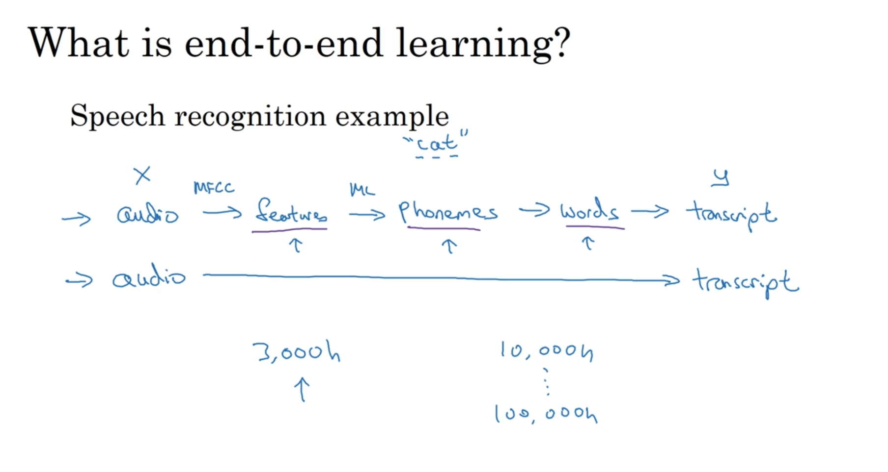

This is the clearest way to understand the concept:

**A. The Traditional Pipeline**
For decades, a speech recognition system was a complex, multi-stage pipeline that required deep expertise in linguistics:

1.  **Input Audio ($x$)**
2.  **Feature Extraction:** Convert audio waves into features (e.g., MFCCs).
3.  **Phoneme Detection:** A machine learning model to identify basic units of sound (like "cuh," "aah," "tuh").
4.  **Word Assembly:** A system to combine phonemes into words ("cuh-aah-tuh" -\> "cat").
5.  **Transcript ($y$):** Assemble words into a final sentence.

**B. The End-to-End Approach**
An end-to-end system scraps all of this. You train **one, massive neural network** that takes the **raw audio clip ($x$)** as input and directly outputs the **final transcript ($y$)**.

The network is forced to learn everything—feature extraction, sound combinations, and language rules—on its own, just by looking at a huge amount of (audio, transcript) data.

#### **3️⃣ Pros and Cons of End-to-End Learning**

This is not a magic bullet. It's a design choice with serious trade-offs.

| Pros (Advantages) | Cons (Disadvantages) |
| :--- | :--- |
| **1. "Let the data speak"**   The network isn't forced to use human-designed ideas (like "phonemes"). It's free to discover its own, potentially better, representations from the data. | **1. Needs *massive* amounts of data**   To learn a complex function from $x \to y$ requires a *huge* $X,Y$ dataset. The speech pipeline might work better with 3,000 hours of data, while end-to-end shines only with 10,000-100,000 hours. |
| **2. Less hand-designing**   You don't need to be an expert in linguistics or feature engineering. This simplifies the design workflow. | **2. Excludes useful hand-designed components**   Those hand-designed pipelines represent decades of human knowledge. If data is *scarce*, that human knowledge (the "hand-designed component") is a *good* thing that helps the algorithm learn. End-to-end throws that knowledge away. |

**4️⃣ When *Not* to Use End-to-End: The Two-Step Approach**

End-to-end learning often fails when the task is too complex or data is too scarce. In these cases, a "two-step" approach is better.

**Example 1: Face Recognition**

  * **End-to-End (Fails):** Input a wide-angle camera shot ($x$) $\to$ Output the person's identity ($y$). This is too hard.
  * **Two-Step (Works):**
    1.  **Detect Face:** A simple component finds and crops the face from the image.
    2.  **Recognize Face:** A second, powerful network takes the *cropped face* ($x'$) and identifies it ($y$).
  * **Why it's better:** You have *tons* of data for both simple sub-tasks (face detection and cropped-face recognition), but very little data for the complex end-to-end task.

**Example 2: Child Age from X-Ray**

  * **End-to-End (Hard):** Input a hand X-ray ($x$) $\to$ Output the child's age ($y$).
  * **Two-Step (Easier):**
    1.  **Bone Detection:** A component measures the lengths of key bones in the X-ray.
    2.  **Age Estimation:** A simple model or lookup table estimates age based on those bone lengths.
  * **Why it's better:** The two-step-pipeline *injects human knowledge* (that bone length is the key feature), making the problem much easier to solve with limited data.

**5️⃣ The Key Question: Do You Have the Data?**

The single most important question to ask when deciding whether to use an end-to-end system is:

> **"Do I have sufficient data to learn a function of the complexity needed to map $x$ to $y$?"**

  * **Speech ($x$) $\to$ Transcript ($y$):** Very complex. Needs 10,000+ hours.
  * **Image ($x$) $\to$ Bounding Box ($y$):** Less complex. Works well.
  * **Image ($x$) $\to$ Steering Angle ($y$):** (For self-driving). Extremely complex. This pure end-to-end approach is *not* what successful teams use. They use pipelines (like in the multi-task example) because the end-to-end task is just too hard given available data.

-----

🧠 **Deeper Dive: Formal Definition**

> The course explains this intuitively through pipelines. Formally, **end-to-end learning** is a deep learning approach where a model learns to perform a task directly from the **raw input data** ($x$) to the **final desired output** ($y$) without any manually-engineered intermediate steps or feature extraction. The entire system is trained as a single, unified model (usually by gradient descent) where all parameters are adjusted simultaneously to minimize the final objective function.

-----
-----
